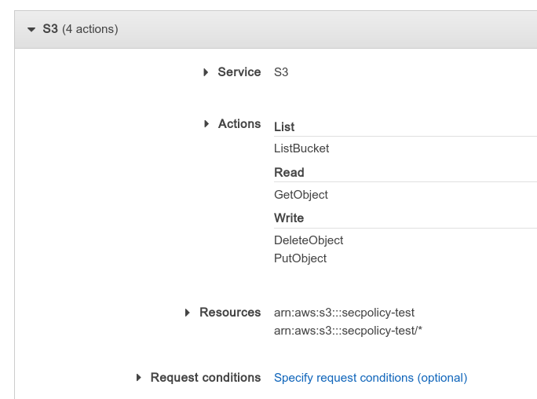
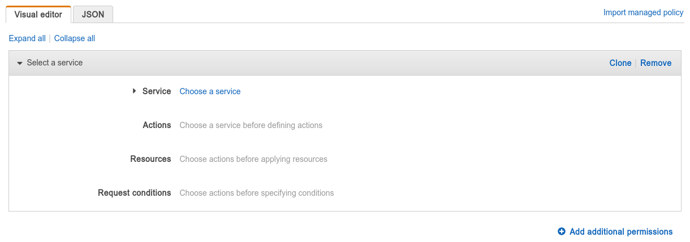
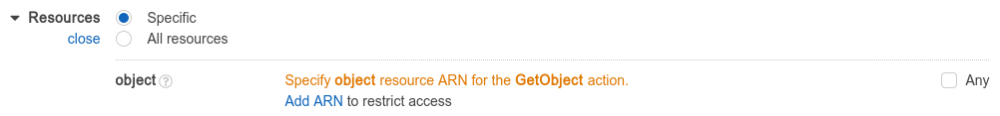

Some days ago I was (again) trying to fiddle with AWS security policies trying to create a user with only the rights to upload to a specific S3 "folder"<footnote>S3 doesn't really have "folders" because it is really a key-value store. For conciseness, in this article I will use "folder `x`" to mean "any files with a name beginning in `x`/.</footnote>. I have already attempted this earlier before but with no success, in part because there is just so little documentation about how AWS policies work and also in part because of my failure to realize that the tool I use to access S3 - [rclone](https://rclone.org/) also requires some permissions other than `PutObject` &mdash; namely `ListBucket` and `GetObject`. In this article, I will go over how to understand and make use of AWS (specifically S3) security policies.

## AWS permission model

In the AWS world, clients use an *access key* to call various AWS APIs, and access keys belong to *users*. You can create users (and generate an initial access key) on the [Users page](https://console.aws.amazon.com/iam/home#/users) of the IAM console.

A user's permission is controlled by the *policies* attached to them (or any of the groups that they belong to). There are a lot of pre-existing policies for simple cases, such as granting a user full control of a service, etc. For example, on the &ldquo;add user&rdquo; page, when you get to &ldquo;Set permissions&rdquo;, you can see a list of AWS pre-defined policies, and in it you can find `AmazonS3FullAccess` and `AmazonS3ReadOnlyAccess`, which is exactly what they sound like: allowing full read or read/write access to **every** bucket.


## Creating policies

Usually, if you want something more fine-tuned, such as specifying which buckets are allowed to be accessed, you have to create your own policy. This can be done with the "Create policy" button here, or you can also go to the [dedicated policies page](https://console.aws.amazon.com/iam/home#/policies) to manage all your policies. The visual policy editor is probably good enough that you don't need to write a JSON policy yourself.



In your policy, you can have one or more permissions (known as "statements" in the JSON), each one can either grant some access or be an *explicit deny*, which explicitly declares that some operations should not be allowed. AWS first evaluates all explicit deny statements, and if any matches, the operation is denied whether or not some other statements allow the action. You can use the "add additional permissions" button to add more permissions (statements) to your policy.

Each permission targets a set of actions, which themselves correspond to various API calls. For example, if you choose "S3" as the "Service" and in "Actions" choose `GetObject`, this makes the permission allow (or deny) reading S3 files. If you choose the `GetObject` action, you need to then specify which files to allow/deny the user to read in the "Resources" section.



ARN is, as far as I understand, a fancy name for &ldquo;the absolute path of a thing&rdquo;. You can use ARN to refer to various things (such as S3 buckets, S3 files (aka objects), etc.) in AWS, and in this case, we need to provide an ARN for an S3 object, which has the form:

<pre>
arn:aws:s3:::<b><i>bucket_name</i></b>/<b><i>file_path</i></b>
</pre>

So, for example, if you have a file named `data/data.txt` in the `myfiles` bucket, its ARN would be `arn:aws:s3:::myfiles/data/data.txt`.

You can add multiple ARNs, and the permission is applied if any of them match. You can also use asterisks (`*`) in the ARN to denote "any string." Therefore, if you want to allow read access to everything under the `data` "folder" (and its subfolders), you would enter the ARN `arn:aws:s3:::myfiles/data/*`.

All of your ARNs will apply to all of the actions that you specified in the same permission. So, if you have a permission that grants `PutObject` and `GetObject`, and with an ARN of `arn:aws:s3:::myfiles/data/data.txt`, users with this permission would be able to read, write to, and create the file named `data/data.txt`. To allow/deny different ARNs for different actions, you can create multiple permission statements.

You can also add request conditions, which allow you to limit what the parameters for the API calls can be. For example, if you have a permission that grants `ListBucket`, having a request condition of `s3:prefix` StringLike `data/*` will limit the user to only being able to list the contents of the `data` "folder" (and its subfolders). You can see a list of request conditions (and resource types) for each action by clicking on the
<svg style="vertical-align: center; transform: translateY(2px);" width="1em" height="1em" viewBox="0 0 1792 1792" xmlns="http://www.w3.org/2000/svg">
    <path d="M1024 1376v-192q0-14-9-23t-23-9h-192q-14 0-23 9t-9 23v192q0 14 9 23t23 9h192q14 0 23-9t9-23zm256-672q0-88-55.5-163t-138.5-116-170-41q-243 0-371 213-15 24 8 42l132 100q7 6 19 6 16 0 25-12 53-68 86-92 34-24 86-24 48 0 85.5 26t37.5 59q0 38-20 61t-68 45q-63 28-115.5 86.5t-52.5 125.5v36q0 14 9 23t23 9h192q14 0 23-9t9-23q0-19 21.5-49.5t54.5-49.5q32-18 49-28.5t46-35 44.5-48 28-60.5 12.5-81zm384 192q0 209-103 385.5t-279.5 279.5-385.5 103-385.5-103-279.5-279.5-103-385.5 103-385.5 279.5-279.5 385.5-103 385.5 103 279.5 279.5 103 385.5z" style="fill: currentColor; stroke: none;"></path>
</svg>
icon next to the actions checkbox. Some other interesting conditions include `aws:CurrentTime` and `aws:SourceIp`.

## Example policies for S3

<p class="warn">You should always test out these policies before using them in production!</p>

You can import these policies by copying the JSON and pasting them into the JSON editor. After doing that, you may go back to the visual editor to change the statements.

### Allow read/write to any objects that are not in the `denied` folder:

```json
{
    "Version": "2012-10-17",
    "Statement": [
        {
            "Sid": "AllowAll",
            "Effect": "Allow",
            "Action": [
                "s3:PutObject",
                "s3:GetObject",
                "s3:DeleteObject"
            ],
            "Resource": [
                "arn:aws:s3:::secpolicy-test/*"
            ]
        },
        {
            "Sid": "ExecptDenied",
            "Effect": "Deny",
            "Action": [
                "s3:PutObject",
                "s3:GetObject",
                "s3:DeleteObject"
            ],
            "Resource": "arn:aws:s3:::secpolicy-test/denied/*"
        }
    ]
}
```

The first statement allows read, write and overwriting any files, but the second statement denies these operations for anything with a name starting `denied/`. Since there is no actual concept of "folders" in S3, you don't have to worry about the user being allowed to delete the `denied` folder. They can, however, create another regular file named `denied` and write/delete that file.

For some clients (such as rclone), you also need to grant the user `s3:ListBucket` and `s3:ListAllMyBuckets` for them to successfully upload. Hence for those clients the policy should look like this:

<p class="info">
    Update: In newer versions of rclone you need to pass <code>--s3-no-check-bucket</code> when uploading, otherwise it will attempt to call the bucket creation endpoint, and if that fails with a permission error rclone will fail.
</p>

```json
{
    "Version": "2012-10-17",
    "Statement": [
        {
            "Sid": "AllowAll",
            "Effect": "Allow",
            "Action": [
                "s3:ListBucket",
                "s3:PutObject",
                "s3:GetObject",
                "s3:DeleteObject"
            ],
            "Resource": [
                "arn:aws:s3:::secpolicy-test",
                "arn:aws:s3:::secpolicy-test/*"
            ]
        },
        {
            "Sid": "AllowListAllMyBuckets",
            "Effect": "Allow",
            "Action": "s3:ListAllMyBuckets",
            "Resource": "*"
        },
        // Other statements e.g. deny certain subdirectories
    ]
}
```

Note that there are two resources specified in the `AllowAll` statement: the bucket `secpolicy-test` and the S3 objects `*` in `secpolicy-test`. Since `{Put,Get,Delete}Object` only takes an object resource, they will ignore the first specified resource. Similarly, `ListBucket` only takes a bucket resource, so it will ignore the second resource specified.

### Allow user all access to everything under the `user` folder:

```json
{
    "Version": "2012-10-17",
    "Statement": [
        {
            "Sid": "list",
            "Effect": "Allow",
            "Action": "s3:ListBucket",
            "Resource": "arn:aws:s3:::secpolicy-test",
            "Condition": {
                "ForAllValues:StringLike": {
                    "s3:prefix": "user/*"
                }
            }
        },
        {
            "Sid": "objectOps",
            "Effect": "Allow",
            "Action": [
                "s3:GetObject*",
                "s3:PutObject*",
                "s3:DeleteObject*"
            ],
            "Resource": "arn:aws:s3:::secpolicy-test/user/*"
        }
    ]
}
```

### rclone specific: Allow `rclone copy` into `/uploads`

```json
{
    "Version": "2012-10-17",
    "Statement": [
        {
            "Sid": "stat",
            "Effect": "Allow",
            "Action": [
                "s3:ListBucket",
                "s3:PutObject",
                "s3:GetObject"
            ],
            "Resource": [
                "arn:aws:s3:::secpolicy-test",
                "arn:aws:s3:::secpolicy-test/uploads/*"
            ]
        }
    ]
}
```

Due to the use of the `HEAD` request to determine existence, rclone needs `{Put, Get}Object` and `ListBucket` for uploads. When debugging, you can use `-vv --dump headers` to see what requests rclone is making.
