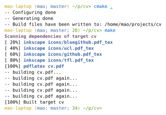

<i>Note: this article is really a "learn CMake the hard way". If you just want a very quick tutorial on writing CMake scripts to build your simple C project, there are many. Here is a 2-line version:

```cmake
project(awesome_project)
add_executable(awesome_binary source1.c source2.c header1.h header2.h main.c)
```
</i>

----

## Introduction

If you have been compiling open-source programs for some time, you almost certainly have used CMake. It's a very popular `Makefile` generator for C/C++ projects. The workflow for compiling a CMake project typically goes like this:

```
cmake .
make
```

Recently I have been trying to use CMake for non-C projects, and I find it worked well &mdash; CMake build scripts might not be so easy to write at first, but they are very flexible and can certainly be helpful if you want a custom build system for your project, or even just want a `Makefile` generator for your C/C++ project. In this article, I will try to explain how CMake scripts work, and present some sample CMake scripts I've made.

All CMake projects have one or more `CMakeLists.txt` files. They contain the build script that CMake uses to generate the `Makefile` for us. Usually, at the root directory of a CMake project, there will be a main `CMakeLists.txt` that either contains the build instructions directly, or tells CMake to enter some subdirectory and build its `CMakeLists.txt`.

Let's first look at the simplest possible `CMakeLists.txt`: ([download project folder](./examples/helloworld))

```cmake
add_executable(helloworld hello.c)
```

If you run `cmake .` with this `CMakeLists.txt` and a `hello.c` in `.`, two things happen:

1. CMake complains that there is no `project()` command.

   In this case, the one-line `CMakeLists.txt` is the root `CMakeLists.txt`, and CMake expects it to be a self-contained, buildable project. However, CMake will still allow you to build it even without the `project()` command.

   Because it is best practice to include a `project()` command in `CMakeLists.txt` that is meant to be built on its own, all further `CMakeLists.txt` files here will contain the `project()` command.

2. CMake generates the build script (usually a `Makefile`) to build `hello.c` into `hello.o`, and finally `helloworld`.

To understand what's really happening, we need to introduce the concept of *build rules* and *targets*. In CMake, the build steps of a project consist of individual build rules (usually one for each compilation unit) and *targets* (usually one for each "final product").

## Build rules & build targets

Build rules describe how to generate one or more output file(s) from source file(s). A very simple build rule for `hello.o` might be something like `gcc -c hello.c -o hello.o`. For those who like `Makefile`s, this rule can be written as:

```Makefile
hello.o: hello.c
  gcc -c hello.c -o hello.o
```

Internally, `add_executable(helloworld hello.c)` creates at least two build rules: `hello.o` and `helloworld` (and others such as `hello.s`, just in case you want to look at the assembly). It also creates a target called `helloworld` and marks that as one of the default targets to be built.

In some sense, a target marks a stage of a build routine. In the above project, the `helloworld` target represents everything that we care about &mdash; the final binary. The `helloworld` target would depend on the `helloworld` build rule, so building the target effectively builds the binary. In more complex projects, where you build a library and an executable that uses the library, you might have a target that builds the library and a target that builds the binary, and the latter target would depend on the first target. There might also be a `test` target that depends on the library target and contains custom commands to run your tests.

Every `add_executable` command creates a target for the executable and marks that target as one of the default targets. This means that if you simply run `make`, that target would be built. You can see a list of targets CMake generated by doing `make help`.


## Now make our own!

Now that we know how CMake targets work, we can write our own! Let's ignore CMake's built-in `add_executable` for now and write our own compiling script for the `helloworld` project. We simply need to implement two build rules and one (final) target. In CMake, we can make custom build rules with [`add_custom_command`](https://cmake.org/cmake/help/latest/command/add_custom_command.html#command:add_custom_command) and make custom targets with [`add_custom_target`](https://cmake.org/cmake/help/latest/command/add_custom_target.html#command:add_custom_target). To put it very simply:

* `add_custom_command(OUTPUT x COMMAND y DEPENDS z)` creates the rule

  ```Makefile
  x: z
    y
  ```

* `add_custom_target(x DEPENDS y)` creates a target which builds `y`.
* <code>add_custom_target(x <b>ALL</b> DEPENDS y)</code> creates a target which builds `y`, and this target is one of the default targets that get built when you simply run `make`.

There is a catch though: for our `CMakeLists.txt` to behave exactly like before, we need to create a target that has the same name as the build rule `helloworld`, so that running either `make` or `make helloworld` will build our binary. `add_executable` does this for us, but because of a limitation in CMake, we can't have something like this:

```cmake
add_custom_command(OUTPUT helloworld ...)
add_custom_target(helloworld ALL DEPENDS helloworld)
```

This will create two `helloworld` rules in one of the generated `Makefile` files (those in `CMakeFiles`), and there will be something like `helloworld: helloworld`, which creates a cyclic dependency. Instead, we create a target that has a different name:

```cmake
add_custom_command(OUTPUT helloworld ...)
add_custom_target(bin ALL DEPENDS helloworld)
```

By doing this, running `make` or `make bin` will produce the `helloworld` binary, but running `make helloworld` won't work as `helloworld` is not a target and hence CMake did not include it in the top-level `Makefile`.

Here is the `CMakeLists.txt` for the same `helloworld` project above: ([download project folder](examples/helloworld_custom_target))

```cmake
project(helloworld)

add_custom_command(
  OUTPUT hello.o
  DEPENDS hello.c
  COMMAND gcc -c hello.c -o hello.o
)

add_custom_command(
  OUTPUT helloworld
  DEPENDS hello.o
  COMMAND gcc hello.o -o helloworld
)

add_custom_target(bin ALL DEPENDS helloworld)
```

Here is its output:

<pre><font color="#4E9A06">$ </font><font color="#005FD7">cmake</font> <font color="#00AFFF"><u style="text-decoration-style:single">.</u></font>
<font color="#4E9A06">$ </font><font color="#005FD7">make</font>
<font color="#75507B"><b>Scanning dependencies of target bin</b></font>
[ 50%] <font color="#3465A4"><b>Generating hello.o</b></font>
[100%] <font color="#3465A4"><b>Generating helloworld</b></font>
[100%] Built target bin
<font color="#4E9A06">$ </font><font color="#005FD7">./helloworld</font>
Hello world!
</pre>

## Scripting

CMake is actually a scripting language, much like Bash. This means that you can make functions that abstract some of the build steps away, use loops to iterate over files, etc. So if you want to use CMake to build, let's say, [Java](examples/java), [Haskell](examples/haskell) or [LaTeX](https://github.com/micromaomao/cv/blob/master/CMakeLists.txt), you can create functions that work similar to `add_executable`, except they compile Java, Haskell, or TeX files.

The good thing about using CMake (rather than writing your own `Makefile`) is that, not only do you get easy scripting, CMake also tracks build artifacts for you and generates the `clean` target in `Makefile`. Besides, CMake also generates a progress output, which just makes your `make` run look more satisfying.

If you are now convinced and feel ready to write your own CMake scripts, here are some CMake tips that might be helpful:

* CMake arrays are just strings with a `;` delimiter, and don't bother trying to make CMake work with files with `;` in their names: [it won't work](https://gitlab.kitware.com/cmake/cmake/issues/18796#note_503472). This also means that you can't have 2D arrays.

* CMake functions don't return values. They take in a variable name as their argument and set that variable with `set(${NAME} VALUE PARENT_SCOPE)` instead. Variables are scoped by function, so the `PARENT_SCOPE` keyword is needed.

* Use [`cmake_parse_arguments`](https://cmake.org/cmake/help/latest/command/cmake_parse_arguments.html) to parse complex argument formats in your own function.

## Rant

Let's face it, CMake is not the best scripting language. It works, but it&hellip;

* Is stringly typed.
* Can't handle array elements with `;` in them.
* Can't (easily) implement complex data structures (2D array, hashmap, etc).
* Can't have custom targets be the same name as a custom output.
* Has ugly syntax.

But it does have the advantage of being available nearly everywhere - you can expect people to have CMake installed on their Linux machine, and just tell them to `cmake . && make`.

Maybe someone could make yet another build system that is both easy to use and flexible? (I'm also waiting for a replacement for <tex>\TeX</tex> for typesetting documents).
