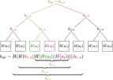
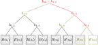
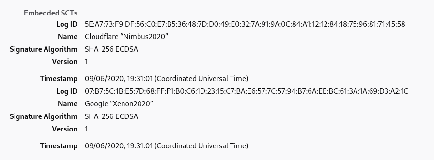

<p class="info">
This article assumes background knowledge of: digital signatures (<a href="https://en.wikipedia.org/w/index.php?title=Public-key_cryptography&oldid=958099718#Description">public key cryptography</a>), <a href="https://en.wikipedia.org/wiki/Hash_function">hash functions</a>.
</p>

The modern web *relies* on public-key cryptography. It allows us to somewhat secure our communication with a server that we have never talked to before, which is not possible with symmetric encryption alone. However, public-key crypto on its own doesn't defend us against *Man-in-the-Middle* (MitM) attacks, where an active attacker is able to modify our connection and replace, for example, the server's public key sent to us with their own public key. Because of that, we require that the public key of web servers be signed by a publicly trusted *Certificate Authority* (CA) in the form of a *certificate* bound to a domain name, and we trust that those CAs would only sign certificates after they have verified the server they are signing for controls the domain.<footnote>On a more meta level, our problem is that we want to be able to relate short, human-memorable names (domain names) with server identity. Because these domain names don't have any mathematical properties we can exploit (like a public key), this is generally not possible to do securely without either trusting a third party to establish the relation for us (e.g., DNS servers mapping domains to IP addresses, and CAs mapping domains to public key(s)), or using some kind of peer-to-peer network that relies on some consensus protocol that guards against rewrite attacks, such as a blockchain + proof of work. Check out the "*Ethereum Name Service*" for a real-life example of such an approach.</footnote>

Obviously, if a MitM attacker can compromise a CA, they can effectively "convince" browsers that their connection to the server is secure when it is actually not.<footnote>There are, however, other ways a browser may find out that something is wrong. Other than Certificate Transparency as discussed in this article, there is also [Public Key Pinning](https://wiki.mozilla.org/SecurityEngineering/Public_Key_Pinning) for popular websites (HPKP header is currently not supported by any browser) and [CAA DNS records](https://en.wikipedia.org/wiki/DNS_Certification_Authority_Authorization), although those measures don't work as well as Certificate Transparency, obviously.</footnote> This means that the integrity of CAs is really important. However, just like every entity in real life, [CAs have repeatedly shown themselves to not actually be that trustworthy](https://www.google.com/search?q=certificate+authority+incidents). Moreover, with [more than 140 publicly trusted CAs](https://ccadb-public.secure.force.com/mozilla/IncludedCACertificateReport), the problem becomes much worse because an attacker only has to compromise **one** of them.<footnote>And what's more, because root-CAs can delegate their signing ability to other parties by signing intermediate CAs, the number of entities with signing ability is, in reality, much higher than 140. In fact, governments of countless nations (including the US and China) and a number of big tech companies are also CAs.</footnote>

However, we do not need to completely rely on the assumed "don't be evil" property of CAs because we have a critical line of defense: once we find out about a certificate, we have strong proof that the CA that signs it actually signed the certificate. This means that, for example, if a rogue CA signed a certificate for `google.com` and by some means Google discovers the certificate, the CA is instantly exposed and would probably be publicly untrusted. That is (part of) the reason why you don't see NSA signing certs for `mail.google.com` and MitM-ing everyone, even though they can if they wanted.<footnote>Although to be fair, it's not like doing so is their only way to spy on users' gmail. It has already been shown that they have backdoors to Google's servers ¯\\\_(ツ)\_/¯</footnote>

The problem here is that there is no way for the public, or the site owner, to reliably know whenever a CA has signed a certificate for some domain. Using the NSA's example, they could sign a `facebook.com`<footnote>Google and Twitter have their public keys pinned in Chrome and Firefox. At the time of this writing, Facebook does not.</footnote> cert in secret and then only use it very sparingly, and there will be a high chance that the public, including Facebook itself, will never find out (how often do you view the certs you receive anyway?). If hypothetically, every time a CA signed a cert with the domain `facebook.com` Facebook would receive a notification and the signed cert, no publicly trusted CA would ever dare to do that. In other words, we would be much safer if every valid certificate were discoverable by the public.

Can we make that happen?

<div class="make-toc"></div>

## A log?

Let's imagine the simplest possible approach to this problem: we let (for example) Mozilla run a huge server accessible by everyone, and it stores a big list of certificates. The list is supposed to be append-only, meaning that certificates can only be added to the back of the list but not taken out or modified. We then ask every CA to submit the certificate whenever they sign a new one. Site owners can iterate through and monitor the list for certificates with their domain, and whenever a browser receives a public-CA-signed certificate, it could either ask the log whether the certificate is in there, or keep a local, up-to-date copy of the entire log and check whether the certificate is in the log directly, and reject (or report) if it isn't.

Now, aside from the obvious reliability issue with counting on a single, centralized server, there are 3 other massive problems with this approach:

1. Nothing is preventing the log from cheating when asked whether a certificate is in the log.

	For example, the log could be backdoored to `return true` whenever someone asks whether the NSA-signed `facebook.com` certificate is in the log, but yet never show the certificate when a list of certificates is requested. This effectively makes the certificate not discoverable yet convinces browsers that it is.

2. The append-only property can't be verified.

	For example, the log could include the NSA-signed `facebook.com` as normal, but quickly, after NSA has finished the attack, remove the certificate from the list and forget about it, before Facebook has a chance to catch up with the log.

3. The log server can fork the log and selectively present one version or another to different clients (i.e., "hiding" a certificate from some group of clients).

	For example, NSA can sign `facebook.com` and ask the log to act as if this certificate is not in the log to most people, but act as if it exists in the log to some minority being attacked.

One could argue that the public might find out if the log is involved in such misbehavior, but remember: the attacks don't need to be "to everyone". The log can limit the misbehavior to only target a tiny number of users, and we have the same discoverability issue we had before with CAs. Moreover, if the log is involved in shady practices described above, there is no quick way to find out and hold the log accountable, unlike a rogue CA signing fraudulent certificates.

### Hashing

Commonly, *hash functions* are used to make sure two pieces of data are the same by computing a short "digest" representing the data. To create such a "digest", log clients could hash all the certificates in the list together in order, and all the clients can share this short hash between them, broadcast it publicly to let anyone use it to verify, etc. This also gives us a way to establish accountability of the log: if we require the log to always sign this hash, whenever we found something wrong, we would basically have two signatures from the log corresponding to two conflicting lists, which we can show to the world along with the full data of the two lists for everyone to verify.

<div class="info">
<b>Notation</b>: from now on, <tex>a||b</tex> represents "concatenate <tex>a</tex> and <tex>b</tex>". Our hash function is denoted by <tex>H</tex>.
</div>


However, simply hashing everything together isn't really an efficient strategy. First of all, doing this over the entire log is a lot of computational work that potentially has to be done every time the log updates. Secondly, this requires everyone to always have a full copy of the log in order to verify anything. For example, if you currently have the list <tex>a_1, a_2, a_3</tex> which hashes to <tex>h_{..3} = H(a_1 || a_2 || a_3)</tex>, and the server tells you another certificate <tex>a_4</tex> has been added, you can calculate the new hash <tex>h_{..4} = H(a_1 || a_2 || a_3 || a_4)</tex> and verify this with others, but this is only possible if you actually still know the data of <tex>a_1</tex>, <tex>a_2</tex> and <tex>a_3</tex> at the time of this verification&mdash;you can't just "forget" about them and hope to derive <tex>h_{..4}</tex> with only <tex>h_{..3}</tex> and <tex>a_4</tex>. Similarly, you won't be able to confirm that a certificate you just received somewhere is in this list, if you just know the hash, without downloading all the other certificates and calculating the hash to confirm.

What if there is actually a way to hash all the certificates together such that, just by knowing the hash, you can quickly confirm that some certificate is included in the log, and also, whenever the log updates, one can quickly calculate a new hash for the list with more certificates appended to it, based on the old hash? If we can do that, then browsers don't even need to download anything in the log other than the hash to verify that the log is behaving correctly and to verify the existence of a particular certificate in the log.

### Merkle tree \& *inclusion proof*

Let's focus on the first part of the problem&mdash;can we construct a special "hash" such that it is easy for a client to check that some certificate is in the list corresponding to the hash?

Say for example that we have the following log, where each <tex>a_i</tex> is a certificate:

<style>
.an-list-contain {
	display: flex;
	align-items: baseline;
	max-width: 100%;
	overflow-x: auto;
}
.an-list-contain > :first-child {
	margin-left: auto;
}
.an-list-contain > :last-child {
	margin-right: auto;
}
.an-list-block {
	margin: 0 8px;
	border: solid 1px #000;
	padding: 8px 8px 12px 8px;
	width: 2.5rem;
	height: 2.5rem;
	display: flex;
	flex-direction: row;
	justify-content: center;
	align-items: center;
}
.an-list-wrap {
	margin: 0 4px;
	background-color: rgba(0,0,0,0.04);
	border: dashed 1px #777;
	padding: 4px 2px;
	display: grid;
	grid-template-rows: auto auto;
	grid-template-columns: auto auto;
	grid-template-areas:
		"d d"
		"a b";
}
.an-list-wdesc {
	grid-area: d;
	padding: 0 0 2px 0;
}
.an-list-wdesc.wdesc-small, .an-list-wdesc.wdesc-small .tex {
	font-size: 0.85rem;
}
</style>
<div class="an-list-contain">
	<div class="an-list-block"><tex>a_1</tex></div>
	<div class="an-list-block"><tex>a_2</tex></div>
	<div class="an-list-block"><tex>a_3</tex></div>
	<div class="an-list-block"><tex>a_4</tex></div>
	<div class="an-list-block"><tex>a_5</tex></div>
	<div class="an-list-block"><tex>a_6</tex></div>
	<div class="an-list-block"><tex>a_7</tex></div>
	<div class="an-list-block"><tex>a_8</tex></div>
</div>

And let's say that we currently know the log hash, and we have a certificate for which we want to verify that it exists in the list corresponding to the hash we know. We ask the server, which tells us that the certificate is the third certificate in the list (<tex>a_3</tex>). If the hash is a simple concatenation of <tex>a_1\ldots{}a_8</tex>, then you would need to get every <tex>a_n</tex> other than <tex>a_3</tex>, compute the hash of the list, and compare it with the hash you had earlier, even though you do not care about any other certificates in the list. But, what if instead of concatenating every <tex>a_n</tex> together to get the hash, we split the list into two, hash the first half and second half separately, then "combine" the hashes by hashing the concatenation of the two "sub-hashes" (<tex>p_1</tex> and <tex>p_2</tex>)?

<style>
.max-width-100 {
	width: 100%;
	overflow-x: auto;
	overflow-y: hidden;
	margin: 0;
	padding: 0;
}
.half-split-hash-demo {
	display: grid;
	width: auto;
	margin: 0 auto;
	grid-template-rows: auto auto;
	grid-template-columns: auto auto auto auto auto;
	justify-content: stretch;
	justify-items: center;
	min-width: 450px;
	max-width: 550px;
}
.bdown {
	border-bottom: solid 1px #888;
}
.desc-row {
	font-size: 80%;
	line-height: 1.2;
}
.desc-row .tex {
	font-size: 110%;
}
</style>
<div class="max-width-100">
	<div class="half-split-hash-demo">
		<div><tex>h_\text{all} = H(</tex></div>
		<div class="bdown"><tex>H(a_1 || a_2 || a_3 || a_4)</tex></div>
		<div><tex>||</tex></div>
		<div class="bdown"><tex>H(a_5 || a_6 || a_7 || a_8)</tex></div>
		<div><tex>)</tex></div>
		<div class="desc-row">&nbsp;</div>
		<div class="desc-row"><tex>p_1</tex>: Hash of first half</div>
		<div class="desc-row">&nbsp;</div>
		<div class="desc-row"><tex>p_2</tex>: Hash of second half</div>
		<div class="desc-row">&nbsp;</div>
	</div>
</div>

If we then want to confirm the existence of <tex>a_3</tex> in the list, we just need to get <tex>a_1</tex>, <tex>a_2</tex> and <tex>a_4</tex>, hash with the <tex>a_3</tex> we know to get our value of <tex>p_1</tex>, then combine the hash with <tex>p_2</tex> (which we can ask the server to give us) to get <tex>h_\text{all}</tex>, and check that the hash is as expected. We can then conclude that <tex>h_\text{all}</tex> "includes" <tex>a_3</tex> since it depends on <tex>a_3</tex>, which is the certificate we want to confirm, in our calculation.

Note that by splitting the tree in half, we don't need to know anything about the "irrelevant" half, other than a short hash of it, anymore. Intuitively, we can continue this "splitting" pattern to make a binary tree, with the hashes of individual certificates alone being the leaves, and every node is a "combined" hash of its two children:

<div class="an-list-contain">
	<div class="an-list-wrap">
		<div class="an-list-wdesc"><tex>h_\text{all} = h_{1..8} = H(h_{1..4} || h_{5..8})</tex></div>
		<div class="an-list-wrap">
			<div class="an-list-wdesc"><tex>h_{1..4} = H(h_{1..2} || h_{3..4})</tex></div>
			<div class="an-list-wrap">
				<div class="an-list-wdesc wdesc-small"><tex>h_{1..2} = H(H(a_1) || H(a_2))</tex></div>
				<div class="an-list-block"><tex>H(a_1)</tex></div>
				<div class="an-list-block"><tex>H(a_2)</tex></div>
			</div>
			<div class="an-list-wrap">
				<div class="an-list-wdesc wdesc-small"><tex>h_{3..4} = H(H(a_3) || H(a_4))</tex></div>
				<div class="an-list-block"><tex>H(a_3)</tex></div>
				<div class="an-list-block"><tex>H(a_4)</tex></div>
			</div>
		</div>
		<div class="an-list-wrap">
			<div class="an-list-wdesc"><tex>h_{5..8} = H(h_{5..6} || h_{7..8})</tex></div>
			<div class="an-list-wrap">
				<div class="an-list-wdesc wdesc-small"><tex>h_{5..6} = H(H(a_5) || H(a_6))</tex></div>
				<div class="an-list-block"><tex>H(a_5)</tex></div>
				<div class="an-list-block"><tex>H(a_6)</tex></div>
			</div>
			<div class="an-list-wrap">
				<div class="an-list-wdesc wdesc-small"><tex>h_{7..8} = H(H(a_7) || H(a_8))</tex></div>
				<div class="an-list-block"><tex>H(a_7)</tex></div>
				<div class="an-list-block"><tex>H(a_8)</tex></div>
			</div>
		</div>
	</div>
</div>

Now, if we want to confirm that <tex>a_3</tex> is in the list corresponding to <tex>h_\text{all}</tex>, we only need to:

1. Get <tex>H(a_4)</tex>, <tex>h_{1..2}</tex>, and <tex>h_{5..8}</tex> from the server.
2. Calculate <tex>H(a_3)</tex> from the certificate data we have.
3. Confirm that <tex>h_\text{all} = H(\color{purple}{H(h_{1..2}||\color{blue}{H(\color{red}{H(a_3)}||H(a_4))})}||h_{5..8})</tex>.

We don't even need to know any other <tex>a_n</tex>&mdash;we just need the hash of <tex>a_4</tex> and two other "intermediate" hashes, which we can simply ask the server since we don't really care what the other certificates are. Once we get all the necessary intermediate hashes from the server, we can sort of "bubble up" the binary tree to arrive at our final <tex>h_\text{all}</tex>, and because we used the hash of the certificate we want to confirm&mdash;<tex>a_3</tex>&mdash;to finally derive <tex>h_\text{all}</tex>, the list corresponding to <tex>h_\text{all}</tex> must contain <tex>a_3</tex>. It is not hard to see that, to confirm the existence of one certificate in a log of size <tex>n</tex>, we only need <tex>O(\log n)</tex> hashes if we do it this way.

In the above scenario, we asked the server to help us derive the <tex>h_\text{all}</tex> we already have, based on the certificate data <tex>a_3</tex>. This is enough to convince us that <tex>a_3</tex> is in the log with hash <tex>h_\text{all}</tex>, which we can then exchange with other people to make sure that they are also seeing the version of the log we are seeing. The information that the server gave us&mdash;<tex>(3, H(a_4), h_{1..2}, h_{5..8})</tex>&mdash;to help us complete this process is called an <b>*inclusion proof*</b><footnote>Also known as "audit proof", although IMO that's a less descriptive name.</footnote> of <tex>a_3</tex>, because it "proves" to us that <tex>a_3</tex> is "included" in <tex>h_\text{all}</tex>.

This "binary tree" pattern and the construction of inclusion proofs work equally well for lists that aren't power-of-2-sized. Play with the following demo to see for yourself:

<noscript id="demo-inclusion">
	You need to enable javascript for this demo.
</noscript>

This kind of binary-tree arrangement has a name: **(almost) complete binary tree**. It's called this way because there are no "gaps", i.e. all nodes have 2 children except the leaves at the bottommost level or on the very right side of the tree. Such a tree can be uniquely constructed for any given length, which means that the log server doesn't actually need to send any "trees" to the client. The concept of attaching "intermediate" hashes to the nodes, along with the construction of inclusion proofs and, as we shall see later, consistency proofs, is known as <b>*Merkle Trees*</b>, and the "final" hash&mdash;<tex>h_\text{all}</tex>&mdash;is called the <b>*tree hash*</b> (sometimes also known as "root hash").

### Consistency proof



Up until now, we have not discussed what happens when more certificates are appended to the log. Obviously, the tree hash <tex>h_\text{all}</tex> will change. Let's use the above diagram to illustrate: the original tree contains the first 7 certificates (<span style="background-color: rgba(100,100,100,0.1)">shaded gray</span>), and <tex>a_8</tex> is a newly appended certificate.

It should be quite easy for the server to calculate the new hash&mdash;they just have to calculate new intermediate hashes for all the nodes on the path from <tex>a_8</tex> to the root (colored in <span style="color: red">red</span>), and finally calculate a new <tex>h_\text{all}</tex>. But after that, how does the client know that the new hash received from the server is really an "extension" from <tex>a_1\ldots{}a_7</tex>, and that the server hasn't, for example, changed some of <tex>a_1\ldots{}a_7</tex> and then given the client the hash derived from the modified tree?

We can use the thinking we used in constructing inclusion proofs again: the server can "help" the client construct the new <tex>h_\text{all}</tex> itself, which would convince it that the new <tex>h_\text{all}</tex> really represents an "append-only" tree from the old one. To do that, the client needs to know the old tree size (which it should already know) and the new tree size (given by the server, along with the new <tex>h_\text{all}</tex>) in order to know the structure of the tree. In this case, they are 7 and 8 respectively. Then, the server gives the client <tex>\color{rgb(127,127,0)}{H(a_7)}</tex>, <tex>\color{rgb(127,127,0)}{H(a_8)}</tex>, <tex>\color{rgb(127,127,0)}{h_{5..6}}</tex> and <tex>\color{rgb(127,127,0)}{h_{1..4}}</tex>. The client can then piece together the final hash as <tex>H(h_{1..4} || \color{rgb(127,0,127)}{H(h_{5..6} || \color{blue}{H(H(a_7) || \color{red}{H(a_8)})})})</tex>.

Note that in this process, the server has given the client enough information about the old tree to allow it to reconstruct the old <tex>h_\text{all} = H(h_{1..4} || \color{rgb(127,0,127)}{H(h_{5..6} || \color{blue}{H(a_7)})})</tex>. What this means is that the client can be certain that the new <tex>h_\text{all}</tex> (which they just calculated) "includes" every certificate in the old tree, and also in the correct position, since the server can't "insert" new certificates before <tex>a_8</tex> otherwise the client wouldn't get the correct old <tex>h_\text{all}</tex>, and also, because <tex>H(a || b) \ne H(b || a)</tex>, the server can't swap anything.

Therefore, the server has just proved to the client that the new tree is an append-only extension of the old tree. This is called a <b>*consistency proof*</b>, because it proves that two trees are "consistent"&mdash;one is an append-only extension of the other. If the server publishes a new tree hash for which it can't provide a valid consistency proof from some older tree hash, then the server must have changed something illegally.

Although it might not feel like it, this procedure can be done for all old and new sizes. Play with the following demo to see for yourself:

<noscript id="demo-consistency">
	You need to enable javascript for this demo.
</noscript>

### Gossiping & *Signed Tree Head* (STH)

Now that we have discussed tree hash, inclusion and consistency proofs, we can come up with the simplest model how a browser (or a monitor such as [crt.sh](https://crt.sh/)) might interact with a CT log:

1. Client always keeps track of the current tree hash (and size), and regularly ask the log for updates.
2. If a new tree hash with larger tree size is received, ask for consistency proof and check it. If the checks are OK, update the stored tree hash and size.
3. To verify some certificate, ask for an inclusion proof of it against the current known tree hash.

This is **not** what happens in practice, as we shall see later, but let's presume for now that it is.

In order to hold log servers more accountable, we also need it to sign the tree hash they gave clients with a public key that everyone knows belongs to the log. Therefore, if a log ever attempts to send inconsistent hashes, or fork the tree between clients, once this is discovered there is a way to prove that the log really did that. This also allows clients to "*gossip*" between each other in a trustworthy manner&mdash;clients could simply send each other the latest hash and signature that they received, and the receiver, once verified the signature, can ask for a consistency proof between the hash they got and the hash they have, so that if the log ever tries to present different forks of the tree to different clients, there is a high chance that it will be caught.

In the protocol, the data structure that the CT server signs and gives to the client each time they update the tree is called a *Signed Tree Hash*, and it includes the following information: the tree hash itself, the corresponding tree size, and a timestamp that is no earlier than the time the last certificate is added to this tree.<footnote>&hellip;along with a `version` and a `signature_type`, which we won't care about.</footnote> As an example, here is the latest STH from Google's "argon2023" log:

<noscript id="sth-fetch">If you enable JavaScript you can see the latest STH of argon2023 here.</noscript>

<p class="info">
Note that CT logs are regularly retired, and so for readers in the future, the above demo might have been broken due to the log no longer existing. (It used to point to the pilot log here, but that has retired, so I updated it.)
</p>

In order for effective gossiping to happen, there also has to be a common protocol. Currently (as of July 2020) there is no official standard on this, but there are draft proposals that have been there for quite some time now. We won't go into too much detail here, but basically clients share STHs with each other, as we expected<footnote>&hellip;and in some cases, SCTs, as discussed below</footnote>.

In a simple world, this article would end here. However, there are some practical factors we need to consider, which means that there is actually more to it.

## *Signed Certificate Timestamps* \& *Maximum Merge Delay*

In reality, there are multiple CT logs, mostly run by companies like Google and some large CAs. This means that once the browser gets a certificate, it needs to know which log to fetch the proof from, because the certificate might have only been submitted to some but not all logs. This already makes it necessary to create a way to pass additional information to the browser, along with the certificate itself.

More concerns include privacy and scalability. If all the browsers in the world query one particular CT log every time they get a new certificate, and also at regular intervals to update their latest tree hash, that server might not be able to handle the load. Plus, if browsers use the simplistic approach outlined earlier and ask for an inclusion proof every time, it reveals what site the user is visiting to the log server.

One solution is to bundle the proof, along with an STH which the proof is based on, with the certificate and send both to browsers when they access a web server, so that browsers can check the proof locally and only have to talk to the CT server to get consistency proofs, perhaps at a later time and in batch. However, this would still reveal, to a certain extent, the websites that the user visited, since the browser would need to ask the server for consistency proof between the latest hash and the hash given to the client along with the certificate.

The above solution, as well as not doing anything special at all, would also require that the log be able to immediately add the certificate to the tree once it is submitted by the CA (otherwise the browser will reject the certificate until the log actually adds it), which is not always economical or possible. If, for example, thousands of certificates are being submitted per second, it would take less work to add them in batch and recalculate the various tree hashes once instead of thousands of times.<footnote>This gets worse as the speed of certificates arriving increases, and CT log operators can't easily "add more servers" to help with the stress of growing the tree in real-time, since the entire log needs to be always consistent, and certificates must be appended one after another without gaps.</footnote><footnote>1 sample experiment shows that Google's log takes 5 minutes for a newly issued Let's Encrypt cert to be included.</footnote> Therefore, the protocol is actually more sophisticated than that.

What really happens is that, whenever a CA submits a certificate, the log issues a *Signed Certificate Timestamp* (SCT), which is a data structure signed with the log's public key, containing the certificate itself and a timestamp of when the certificate was received by the log. Each log also has a public constant called *maximum merge delay*, and the certificate in all SCTs issued by the log must be included in the tree no later than the signed timestamp plus the maximum merge delay. For most logs, this constant is 24 hours, which means that the log has 24 hours to add any certificate submitted to it into its tree. If the public found out that a log produced an SCT but can't produce an inclusion proof for the certificate based on any STH with a timestamp that is before the deadline, it is treated as a log misbehavior.

Thus, an SCT is basically a very binding "promise" that the log will include the certificate in the near future. If the browser wants to do any verification itself at all, it might need to wait some amount of time before it can directly ask the log for an inclusion proof to defend the SCT received. On the other hand, because of the existence of this "promise", the browser at least has some confidence that the certificate will be included by the log, just like if it had received an inclusion proof based on an unknown STH. [It was proposed that](https://tools.ietf.org/html/draft-ietf-trans-gossip-05#section-8.3) the browser may alternatively trust one or more third parties (or the web server being accessed itself, at some delayed time) to do the actual proof checking by sending the SCT to them after verifying the validity of the SCT, and the third party would hopefully raise awareness if the log can't defend any of the SCTs.<footnote>IMO this is basically just applying the logic of gossiping, which is inherently opportunistic and not 100%, to inclusion proofs, instead of only gossiping the STH. I might not have understood the draft correctly though.</footnote>

## Precertificate



If you go to a random website today and inspect their certificate with Firefox<footnote>As of 11 Jul 2020, Chromium doesn't show the SCT list.</footnote>, chances are that you will see a section named "embedded SCTs". This is exactly what it sounds like&mdash;some SCTs from well-known logs that promise inclusion of this certificate&mdash;embedded within the certificate itself, along with the names of the logs.

If a web server presents certificates with embedded SCTs, the browser can verify the CT status of the certificate in whichever way it wants, without needing the web server to give it any additional info. This makes it possible for a website to conform with CT requirements without any special server configuration.

However, if CT logs need to have the certificate first before being able to include it into its tree and issue an SCT, how is this possible? The answer is *precertificates*.

When the CA wants to embed SCTs into its certificate, it actually needs to produce two certificates&mdash;a "precertificate" to prove to logs that the CA is actually capable of and intends to sign the certificate, and the final certificate, after it receives the SCTs it needs. The two certificates must be exactly the same except in the following ways:

1. The precertificate would not have the embedded SCTs, obviously.
2. The precertificate would have an additional x509 extension&mdash;the precertificate poison&mdash;which prevents the precertificate from being used for anything other than proving to the log that the CA would sign the final certificate. Browsers won't accept any certificates with this poison.
3. The precertificate may be signed by a delegate CA one level down the PKI tree, which means that it may have a different issuer name and "Authority Key Identifier".

[Here is an example of a precertificate](precert-sample.pem) and [here is the corresponding "real" certificate](precert-sample-real.pem). If you print it with openssl:

```
openssl x509 -in precert-sample.pem -noout -text
```

you should see that there is a section named `CT Precertificate Poison: critical` and that there is no SCT list, but is otherwise exactly the same as the real certificate.

Although the precertificate can't be normally used, a CA signing it should be treated the same as signing the corresponding final certificate, which means that CT logs can accept submissions in precertificates and will add them to the log, and any monitor should treat the presence of the precertificate as if the real thing is being signed by the CA.

But there is one more thing&mdash;the CT log can't actually use the hash of the precertificate as the leaf hash and call it a day, because otherwise browsers wanting to verify the inclusion of some certificates that have been included this way must have a copy of the precertificate that was submitted to the CT, in order to come up with the correct hash, but this is not the case since the precertificate is not used anymore after submission and is never given to browsers directly. Therefore, CT logs, after receiving a precertificate submission, actually remove the signature and the precertificate poison, modify the issuer name to that of the real CA (if it was signed with a delegate), and then hash this unsigned blob<footnote>This blob is called a TBS (to be signed) certificate.</footnote>. Therefore, any browsers wanting an inclusion proof could do similar things to the real certificate&mdash;remove the signature, remove the SCT list&mdash;and come up with the correct leaf hash (and hence be able to request and verify inclusion proof).

The CT server would keep a copy of the signed precertificate in case anyone notices any certificates that are suspicious, and failure to provide this precertificate is actually log misbehavior. Therefore, there is no incentive for the log to create a fake leaf (to falsely incriminate an innocent CA, for example). The CT log can't take advantage of this setup to "hide" certificates either: in order to produce an inclusion proof of the "hidden" certificate, it has to include the "essence" of the certificate, which it intends to hide, in the tree.

## Some minor details

This brings us to the end of this article, but for the sake of completeness, I will now address some details of the certificate transparency standard which differs slightly from what we have ended up with in this article.

First, the existence of precertificates and leaves containing certificates without the signature part means that there are two different kinds of leaves that need to be interpreted differently. Hence, the CT standard actually uses a common data structure for all leaves, and that structure contains an enum which is either a "normal entry" or a "precertificate entry". The leaf hash is therefore the hash of the whole data structure, and it is designed in a way that browsers could reconstruct the data structure based on the certificate and the SCT, and therefore still come up with the correct leaf hash.

Second, in order to mitigate against a hash in the tree being used as a leaf hash and as a "combining" hash simultaneously in some sort of attack, the leaf hash is actually calculated as the hash of a zero byte plus the structure mentioned above, rather than hashing the structure directly, and any other "combining" hash is calculated as the hash of a `0x01` byte, plus the two hashes. For example, in a tree of size 2:

<center>
<tex>h_{1..2} = H(\text{0x01}\ ||\ h_1\ ||\ h_2)</tex>,<br>
<tex>h_1 = H(\text{0x00}\ ||\ a_1)</tex> where <tex>a_1</tex> is leaf data,<br>
and similar for <tex>h_2</tex>.
</center>

There is also one more issue: up until now we have implicitly assumed that the browser knows the public keys of all the CT logs. In reality, each browser will have a [hard-coded list of CT logs to trust](https://www.gstatic.com/ct/log_list/v2/log_list.json), and that list will link log IDs with public keys and the endpoint URL. Google also maintains a [larger list of all CT logs](https://www.gstatic.com/ct/log_list/v2/all_logs_list.json) that have ever been widely announced.

## My new Rust library

Shameless plug, but before writing this article I actually made a Rust library handling core CT tasks named [ctclient](https://github.com/micromaomao/ctclient). There are example programs and many APIs you can play with, and the source code contains a fair amount of comments. There is a template for a simple CT monitor.

I'm planning to make a complete CT monitoring solution in the near future, which would hook up this library with a web interface and some sort of notification.

## Current adoption

Firefox and Chrome have some support for SCT verification, but as of July 2020 they would not complain even if no SCT is supplied [(test)](https://no-sct.badssl.com/). Websites can use an [`Expect-CT` header](https://developer.mozilla.org/en-US/docs/Web/HTTP/Headers/Expect-CT) to tell browsers that their certificate will always come with a valid CT, and to report any violations to some URL. Thanks to Let's Encrypt and other CAs embedding SCTs into their certificates, the vast majority of websites would not be affected if browsers started enforcing SCT verification today.
