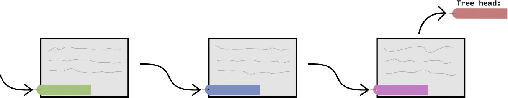

To understand this article, you need to have some understanding of how public key cryptography is used to encrypt data and produce digital signatures.

The "Description" section of [this Wikipedia article](https://en.wikipedia.org/w/index.php?title=Public-key_cryptography&oldid=958099718#Description) might be a good place to start

The morden web *relies* on public-key cryptography. It allows us to somewhat secure our communication with a server that we had never talked to before, which is not possible with symmetric encryption alone. However, public-key crypto on its own doesn't defend us against *Man-in-the-Middle* (MitM) attacks, where an active attacker is able to modify our connection and replace, for example, the server's public key sent to us with their own public key. If we are tricked into thinking that the public key we received (from them) is the server's public key, the attacker will be able to decrypt messages (symmetric keys) we sent to the server without us noticing.

And as it turns out, this is a really difficult problem. To rephrase, we want to be sure that whoever controls the domain entered by the user owns the public key that we received.<footnote>On a more meta level, our problem is that we want be able to relate short, human-memorable names (domain names) with server identity. Because these domain names doesn't have any mathematical property we can expolit (like a public key), this is generally not possible to do securely without either trusting a third-party to establish the relation for us (e.g. DNS servers mapping domains to IP addresses, and CAs mapping domains to public key(s)), or using some kind of peer-to-peer network that relies on some consensus protocol that guards against rewrite attack, such as a blockchain + proof of work. Check out the "*Ethereum Name Service*" for a real-life example of such approach.</footnote> We seems to have settled on a solution where a third-party *Certificate Authority* (CA) verifies the identity of the server for us beforehand (hopefully without their connection being tempered with) by signing a certificate for the server containing its public key, and everyone would simply know beforehand the public keys of the CAs to be able to verify the signatures. This is one of the core ideas of the *Public key infrastructure* (PKI), which is a broad name for the system and protocols to do with certificates.

As you can probably see already, the integrety of CAs are really *really* important in such a system. If a MitM attacker can get a CA to sign their fraudulent certificate, they can effectively "convince" browsers that their connection to the server is secure when it is actually not.<footnote>There are, however, other ways a browser may find out that something is wrong. Other then Certificate Transparency as discussed in this article, there is also [Public Key Pinning](https://wiki.mozilla.org/SecurityEngineering/Public_Key_Pinning) for popular websites (HPKP header is currently not supported by any browser) and [CAA DNS records](https://en.wikipedia.org/wiki/DNS_Certification_Authority_Authorization), although those measures don't work as well as Certificate Transparency, obviously.</footnote> This means that if merely **one** of the [~140 CAs](https://ccadb-public.secure.force.com/mozilla/IncludedCACertificateReport) Firefox or Chrome directly trust for identifying web servers gets compromised or otherwise mishebave, the security of the web can be significant challenged.<footnote>In reality, because root-CAs can delegate their signing ability to other parties by signing intermediate CAs, the number of entities with signing ability is much higher then 140. In fact, government of countless nations (including the US and China) and a number of big tech companies are also CAs. And the risk is not just on paper: [countless incidents](https://www.google.com/search?client=firefox-b-d&q=certificate+authority+incidents) have happened on CAs which have at some point been trusted by browsers, and this had led to real attacks against users of websites including Google.</footnote>

## The problem

However, we do not need to completely rely on the assumed "don't be evil" property of CAs because we have a critical line of defense: once we found out about a certificate, we have strong proof that the CA that signs it actually signed the certificate. This means that, for example, if a rough CA signed a certificate for `google.com` and by some means Google discovers the certificate, the CA is instantly exposed and would probably be publicly untrusted. That is (part of) the reason why you don't see NSA signing certs for `mail.google.com` and MitM-ing everyone.<footnote>Although to be fair, it's not like doing so is their only way to spy on user's gmail. It has already been shown that they have backdoors to Google's servers ¯\\\_(ツ)\_/¯</footnote>

The problem here is that there is no way for the public, or the site owner, to know when a CA has signed a certificate for some domain. Using the NSA's example, they could sign a `facebook.com` cert<footnote>Google and Twitter have their public keys pinned in Chrome and Firefox. At the time of this writing, Facebook does not.</footnote>, and then only use it very sparingly, and there is a chance that the public, including Facebook itself, will never find out (how often do you view the certs you received anyway?). If hypothetically, every time a CA signed a cert with the domain `facebook.com` Facebook would receive a notification and the signed cert, no publicly trusted CA would ever dare to allow that. In other words, we would be much safer if every valid certificate is discoverable by the public.

Can we make that happen?

## A log?

Let's imagine the simplest possible approach to this problem: we let (for example) Mozilla run a huge server accessible by everyone, and it stores a big list of certificates. The list is supposed to be append-only, meaning that certificates can only be added to the back of the list but not taken out or modified. We then ask every CA to submit the certificate whenever they signs a new one. Site owners can iterate through and monitor the list for certificates with their domain, and browsers would ask the list whether a certificate is in there everytime it receives a certificate signed by a publicly-trusted CA, and reject (or report) if it isn't.

Now, aside from the obvious reliability issue with counting on a single, centeralised server, there are 3 other massive problems with this approach:

1. Nothing is preventing the log from cheating when asked whether a certificate is in the log.

	For example, the log could be backdoored to `return true` whenever someone asks whether the NSA-signed `facebook.com` certificate is in the log, but yet never show the certificate when a list of certificates is asked. This effectively makes the certificate not discoverable but yet convince browsers that it is.

2. The append-only property can't be verified.

	For example, the log could include the NSA-signed `facebook.com` as normal, but quickly after NSA has finished the attack, remove the certificate from the list and forget about it, before Facebook has a chance to catch up with the log.

And if we alternatively let the browser always download all new certificates as they appear in the log, and thus basically keep a local version of the entire log, forgetting that users don't have infinite disk space,  this still wouldn't solve every problem because:

3. The log server can fork the log and selectively present one or the other versions to different clients.

	For example, NSA can sign `facebook.com` and ask the log to act as if this certificate is not in the log when Facebook requests the log content, but act as if it exists in the log to everyone else. This makes the browsers happy but still would fail to make Facebook aware that their users are being attacked.

One could argue that the public might find out if the log is involved in such misbehavior, but remember: the attacks don't need to be "to everyone". The log can limit the misbehavior to only target a tiny amount of users, and we have the same discoverability issue we had before with CAs. Moreover, there is no quick way to find out that the log is misbehaving. If the log only changes one certificate somewhere in the huge log, two persons would need to exchange their entire store of downloaded log data to be able to compare whether the log behavies the same to both of them. In other words, there is no easy and quick way for Facebook to realize that they are being treated specially by the log unless they confirm with a third party all certificates of `facebook.com` that has appeared in the log.

Unless of course, if they exchanged a hash&hellip;

### Cryptography 101: Hash functions

For those who aren't familiar with [hash functions](https://en.wikipedia.org/wiki/Hash_function), a *hash function*, like MD5 or SHA\*, is basically a function that takes any amount of data and produce a fixed-length output which depends on the data provided. For a secure hash function <tex>H</tex>, the probability that two random, different string of data <tex>x_1</tex> and <tex>x_2</tex> hashing to the same output (i.e. <tex>H(x_1) = H(x_2)</tex>) should be really low, and it should be really hard to find such pairs.<footnote>
Obviously it is not possible to have a function that takes a long input and produces a short output that is completely collision-free because of the pigeonhole principle. I'm just saying that given the output of the function is big enough (e.g. 32 bytes), encountering two different inputs which produce the same output should be really unlikely (like [<tex>2^{-256}</tex>](https://www.youtube.com/watch?v=S9JGmA5_unY).)
This property is called *collision resistance*. A secure hash function <tex>H</tex> has more properties: for example, <tex>H</tex> is hard to invert, i.e. for a given output <tex>y</tex>, it should be really hard to find <tex>x</tex> such that <tex>y = H(x)</tex>. Note that this property, which is called *first preimage resistance*, is implied by collision resistance, otherwise we would have a way to prefectly compress arbitrarily long data into a fixed-size byte string and have a high probability of decompressing correctly.</footnote>
The setup would be: for any string <tex>x</tex>, <tex>\text{compress}(x) = H(x)</tex>, and for all <tex>h</tex> which is a string of compressed data, find any string <tex>x'</tex> that satisfies <tex>H(x') = h</tex>, and define <tex>\text{decompress}(h)</tex> to be such <tex>x'</tex>. Now let's say we want to compress some data <tex>x</tex>, and we get <tex>c = H(x)</tex> after compression. Since <tex>H</tex> is collision resistant but we can find <tex>x'</tex> such that <tex>H(x') = c</tex> easily, it must be that, in the majority of cases, <tex>x' = x</tex>, otherwise we have just found a collision easily. This means that the compression algorithm we proposed will work in the vast majority of cases. Because such an algorithm is not possible, collision resistant implies first preimage resistance.</footnote></footnote>

Because of this property, hash functions are useful when we want to make some short piece of data depend on some larger piece of data in a way that is not rig-able. Let's say that I have some piece of data <tex>x</tex> that you don't currently have, and I previously told you <tex>h</tex> such that <tex>h = H(x)</tex>. If I now tell you that the data I previously had is <tex>x'</tex>, you can verify if I secretly changed the data or not. If <tex>H(x') \ne h</tex>, then I'm obviously lying, and if <tex>H(x') = h</tex>, then it is highly likely that I haven't changed my data. Also, if somebody tells you that the hash they received from me is <tex>h'</tex> and you realize that <tex>h \ne h'</tex>, then either I'm telling you and them different pieces of data, or they are lying.

This means that there is an easy way to confirm that two people have the same data: exchange their hash. Facebook and other parties could hash every certificate they ever received from the log in a determined way and exchange their hash to confirm that they are being told exactly the same thing by the log, but doing that over the entire log data whenever the log updates is really slow. Before getting into how this problem is really solved in the Certificate Transparency (CT) system, let's first talk about a classical way of solving this problem that you probably had heard of:

### Almost works: blockchain

The basic idea of a "blockchain" is to use a hash function to make every block depend on the blocks before it. When applied to this scenario, it will be like:

1. The entire log would be made out of <em>"blocks" </em> containing certificate data.
2. There is a way to obtain a *hash* of each block based on the data it contains.
3. In addition to the certificate data, each block (other than the first) also contains the hash of the previous block in its data.

So, for example, if our hash function is <tex>H</tex>, and we have 3 blocks with certificate <tex>a_1</tex>, <tex>a_2</tex> and <tex>a_3</tex>, by using <tex>a || b</tex> to denote "<tex>a</tex> then followed by <tex>b</tex>"<footnote>I did not choose this convention, cryptography people and mathematician did.</footnote>, our block hashes would be:

* <tex>h_1 = H(a_1 || 0)</tex><footnote>
	<ol><li>I actually meant <tex>H(a_1 || 0^n)</tex>, where <tex>n</tex> is the length of the hash output.</li>
	<li>It's generally a good idea to have a simple, "canonical" representation when designing data structures that needs to be hashed/signed to avoid introducing security problems due to ambiguity. For example, if we instead say that <tex>h_1 = H(a_1)</tex> rather then <tex>h_1 = H(a_1 || 0^{n})</tex>, then <tex>h_1</tex> is both the hash of the first block containing <tex>a_1</tex>, and also the hash of a block containing certificate <tex>a_1[:-n]</tex> and "previous block hash" <tex>a_1[-n:]</tex>, where <tex>a_1[-n:]</tex> is the last <tex>n</tex> bytes of <tex>a_1</tex> and <tex>a_1[:-n]</tex> is the rest.</li></ol>
	</footnote>
* <tex>h_2 = H(a_2 || h_1) = H(a_2 || H(a_1 || 0))</tex>
* <tex>h_3 = H(a_3 || h_2) = H(a_3 || H(a_2 || H(a_1 || 0)))</tex>

What this means is that, in some sense, the hash of the last block <tex>h_3</tex> "captures" the state of the entire log (<tex>a_1\ldots a_3</tex>). Therefore, if everyone correctly knows this short hash, everyone traversing the log will be able to verify that the log is not presenting different data to them vs everyone else.<footnote>And they can do so as they are in the process of traversing from the last block backward, by verifying that, for every block they received with index <tex>i</tex>, <tex>h_i</tex> appears in the "hash of last block" section of the <tex>(i + 1)</tex>th block, and that <tex>h_i = H(a_i || h_{i - 1})</tex>.</footnote> And if the log then releases a new block containing certificate <tex>a_4</tex>, everyone can immediately calculate out the new hash of the latest block <tex>h_4 = H(a_4 || h_3)</tex>, and confirm among themselves that the log is not doing shady stuff.

There's just one problem: this blockchain only works for clients who want to keep following the log and always keep their database of certificates (or at least, block hashes) up-to-date. Imagine yourself a browser: you're probably not going to allocate a 10 GB database to store all the block hashes you have seen, but what you can do is store only the hash of the last block. After-all, this value "captures" the state of the entire log, and you can verify this value with other clients, so it seems important. But how do you verify that some certificate you encounter in the wild is included in the log? In other words, how do you verify that the only hash you have&mdash;the latest block hash&mdash;"captures" some data?

### Merkle tree!

I must admit that I had wasted a bit of your time talking about blockchain, because it's not at all how things really work in CT. However, the fundamental idea is the same: use a small hash to represent the state of the entire log that is easy to share and store. The idea that you can use a hash of hashes of hashes of&hellip; to "caputre" a lot of data is also relevant.

Let's say that currently you and I both know that the blockchain has length <tex>k</tex> and the latest block hash is <tex>h_k</tex>. To demostrate that the certificate <tex>a_k</tex> is contained within the last block (and hence contained within the blockchain), I just need to tell you the value of <tex>h_{k-1}</tex> and let you verify that <tex>H(a_k || h_{k - 1}) = h_k</tex>. Note that, if you don't care about anything else that comes before, you don't have to do any verification of <tex>h_{k-1}</tex>, so this proof that <tex>h_k</tex> "captures" <tex>a_k</tex> is quick to verify. However, what if you want to do the same thing, but with a certificate that's somewhat buried within the chain? To verify that, for some <tex>p</tex> within <tex>0\ldots k-1</tex>, <tex>a_{k-p}</tex> is a part of the blockchain with last block hash <tex>h_k</tex>, I would have to tell you <tex>a_{k-p+1}\ldots a_k</tex> and <tex>h_{k-p-1}</tex> so that you could verify that <tex>h_i = H(a_i || h_{i - 1})</tex> for <tex>k-p \le i \le k</tex> and eventually "derive" the <tex>h_k</tex>, which you trust before. This requires downloading <tex>p</tex> block data and <tex>p</tex> hashes, which is just not practical for a browser, especially considering that we currently produces hundreds of new certificates each second.<footnote>See it yourself by running my [`ctclient` example](https://github.com/micromaomao/ctclient#examples--demos).</footnote>

Since we, as the browser, don't really care about the content of the blocks <tex>k-p+1</tex> to <tex>k</tex>, it would be nice if we can, somehow, let the server do most of the hashing and give us some hashes

// Introduce the concept of merkle tree \
// Certificate hash as leaf hash \
// Introduce inclusion proof

// System recap: when client receive a certificate, hash it and ask a log for inclusion proof. They can verify that the proof is valid for the tree hash they currently have, which they trust.

// But they must have some way to update the tree hash to allow new certs into the tree? \
// Critical requirement: must be tree extend only

### Consistency proof

&hellip;

// But there's still one more problem: we need to ensure everybody sees the same "everything". \
// => Gossiping tree hashes

### Signed Tree Head (STH) and gossiping protocols

// We can gossip the hashes \
// To verify the hashes are not made up, we need logs to sign the hash. \
// Receiving a valid STH means that we can either be sure that some older part of our subtree is "shared" properly across the network (by requesting a consistency proof), or update our tree hash to a newer version (and checking consistency proof).

// Ok, but there's still one more problem though: we don't want to rely on one single log.

## Signed Certificate Timestamps

// &hellip;which means that as a receiver of a certificate we need to be told in which log to find it. \
// CA can include the log name in the certificate itself before submiting it.

// But this is not actually how things are done because&hellip;

### Maximum merge delays - all about scalability.

// The log gives a SCT which act as a "promise" that it will include the certificate in the near future. \
// Client can trust the certificate even if they can't find it in the log if the MMD hasn't passed. \
// Once it has passed, check the log to see if the promise is valid. If not, make a news.

// This also means that client can even forgo checking the log altogether and still remain relatively safe - if network resource is limited for example.

// But how could a CA include a SCT inside a certificate, given that they have to submit the signed cert first?

## Precertificate

// CA sign a "fake" certificate to prove that they're indeed the CA about to sign the cert.

### Pratical complications

// The precertificate can be signed by a delegate CA. \
// This means that the precertificates are allowed to have different *issuer name*.
// Mentions how it's done in practice. \
// "The log only need to hash the TBS because the public only need to be "aware" of the certificate from inspecting the log. The public can ask the log for proof (the actual thing signed by the CA).

## My new Rust library

// Some screenshot/video demo to see the system working in practise \
// Incldes me issuing a cert for [merkleforest.xyz](https://merkleforest.xyz) and seeing it appear in my terminal.

// Can be used to monitor, inspection, SCT verification, etc. \
// Contains lots of comment

## Current adoption

// Summary of current adoption and call to action \
// 1. Ask browser to implement CT checking and \
// 2. &hellip;make `Expect-CT` the default. \
// 3. Run your own gossiping servers. \
// https://no-sct.badssl.com/

## Sidenote: if we have CT why do we need CA anymore?

// CT has time delay. \
// CAs can be held accountable when they mis-issue certs, a random person on the Internet can't, and the mis-issued certificate can't be blacklisted.
