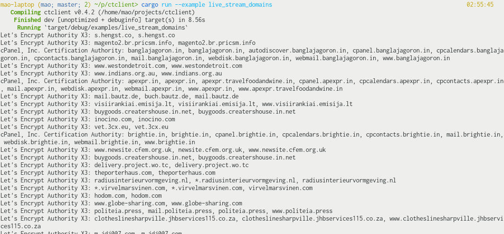

The morden web *relies* on public-key cryptography. It allows us to somewhat secure our communication with a server that we had never talked to before, which is not possible with symmetric encryption alone. However, public-key crypto on its own doesn't defend us against *Man-in-the-Middle* (MitM) attacks, where an active attacker is able to modify our connection and replace, for example, the server's public key sent to us with their own public key. If we are tricked into thinking that the public key we received (from them) is the server's public key, the attacker will be able to decrypt messages (symmetric keys) we sent to the server without us noticing.

And as it turns out, this is a really difficult problem. To rephrase, we want to be sure that whoever controls the domain entered by the user owns the public key that we received.<footnote>On a more meta level, our problem is that we want be able to relate short, human-memorable names (domain names) with server identity. Because these domain names doesn't have any mathematical property we can expolit (like a public key), this is generally not possible to do securely without either trusting a third-party to establish the relation for us (e.g. DNS servers mapping domains to IP addresses, and CAs mapping domains to public key(s)), or using some kind of peer-to-peer network that relies on some consensus protocol that guards against rewrite attack, such as a blockchain + proof of work. Check out the "*Ethereum Name Service*" for a real-life example of such approach.</footnote> We seems to have settled on a solution where a third-party *Certificate Authority* (CA) verifies the identity of the server for us beforehand by signing a certificate for the server containing its public key, and everyone would simply know beforehand the public keys of the CAs to be able to verify the signatures. This is one of the core ideas of the *Public key infrastructure* (PKI), which is a broad name for the system and protocols to do with certificates.

As you can probably see already, the integrety of CAs are really *really* important in such a system. If a MitM attacker can get a CA to sign their fraudulent certificate, they can effectively "convince" browsers that their connection to the server is secure when it is actually not.<footnote>There are, however, other ways a browser may find out that something is wrong. Other then Certificate Transparency as discussed in this article, there is also [Public Key Pinning](https://wiki.mozilla.org/SecurityEngineering/Public_Key_Pinning) for popular websites (HPKP header is currently not supported by any browser) and [CAA DNS records](https://en.wikipedia.org/wiki/DNS_Certification_Authority_Authorization), although those measures don't work as well as Certificate Transparency, obviously.</footnote> This means that if merely **one** of the [~140 CAs Firefox directly trust](https://ccadb-public.secure.force.com/mozilla/IncludedCACertificateReport) for identifying web servers gets compromised or otherwise mishebave, the security of the web can be significant challenged (same goes for the CAs in Chrome's store).<footnote>In reality, because root-CAs can delegate their signing ability to other parties by signing intermediate CAs, the number of entities with signing ability is much higher then 140. In fact, government of countless nations (including the US and China) and a number of big tech companies are also CAs. And the risk is not just on paper: [countless incidents](https://www.google.com/search?client=firefox-b-d&q=certificate+authority+incidents) have happened on CAs which have at some point been trusted by browsers, and this had led to real attacks against users of websites including Google.</footnote>

## The problem

However, we do not need to completely rely on the assumed "don't be evil" property of CAs because we have a critical line of defense: once we found out about a certificate, we have strong proof that the CA that signs it actually signed the certificate. This means that, for example, if a rough CA signed a certificate for `google.com` and by some means Google discovers the certificate, the CA is instantly exposed and would probably be publicly untrusted. That is (part of) the reason why you don't see NSA signing certs for `mail.google.com` and MitM-ing everyone.<footnote>Although to be fair, it's not like doing so is their only way to spy on user's gmail. It has already been shown that they have backdoors to Google's servers ¯\\\_(ツ)\_/¯</footnote>

The problem here is that there is no way for the public, or the site owner, to know when a CA has signed a certificate for some domain. Using the NSA's example, they could sign a `facebook.com` cert<footnote>Google and Twitter have their public keys pinned in Chrome and Firefox</footnote>, and then only use it very sparingly, and there is a chance that the public, including Facebook itself, will never find out (how often do you view the certs you received anyway?). If hypothetically, every time a CA signed a cert with the domain `facebook.com` Facebook would receive a notification and the signed cert, no publicly trusted CA would ever dare to do that. In other words, every valid certificate is discoverable by the public.

Can we make that happen?

## A log?

// CA/clients submit certificates they have signed/seen to a public log. \
// Naive solution requires trusting another party (the log), which is just shifting the problem.

### Blockchain!!!

// The hash of the last block "captures" the state of the entire log, so if client can trust that, they can verify other states with the hash. \
// Still no easy way to determine if a cert is in the blockchain. \
// Example to demostrate why inclusion proof in blockchain is <tex>O(n)</tex> where <tex>n</tex> is the amount of blocks from the tail to that.

// So what about a block*tree*?

### Merkle tree

// Introduce the concept of merkle tree \
// Certificate hash as leaf hash \
// Introduce inclusion proof

// System recap: when client receive a certificate, hash it and ask a log for inclusion proof. They can verify that the proof is valid for the tree hash they currently have, which they trust.

// But they must have some way to update the tree hash to allow new certs into the tree? \
// Critical requirement: must be tree extend only

### Consistency proof

&hellip;

// But there's still one more problem: we need to ensure everybody sees the same "everything". \
// => Gossiping tree hashes

### Signed Tree Head (STH) and gossiping protocols

// We can gossip the hashes \
// To verify the hashes are not made up, we need logs to sign the hash. \
// Receiving a valid STH means that we can either be sure that some older part of our subtree is "shared" properly across the network (by requesting a consistency proof), or update our tree hash to a newer version (and checking consistency proof).

// Ok, but there's still one more problem though: we don't want to rely on one single log.

## Signed Certificate Timestamps

// &hellip;which means that as a receiver of a certificate we need to be told in which log to find it. \
// CA can include the log name in the certificate itself before submiting it.

// But this is not actually how things are done because&hellip;

### Maximum merge delays - all about scalability.

// The log gives a SCT which act as a "promise" that it will include the certificate in the near future. \
// Client can trust the certificate even if they can't find it in the log if the MMD hasn't passed. \
// Once it has passed, check the log to see if the promise is valid. If not, make a news.

// This also means that client can even forgo checking the log altogether and still remain relatively safe - if network resource is limited for example.

// But how could a CA include a SCT inside a certificate, given that they have to submit the signed cert first?

## Precertificate

// CA sign a "fake" certificate to prove that they're indeed the CA about to sign the cert.

### Pratical complications

// The precertificate can be signed by a delegate CA. \
// This means that the precertificates are allowed to have different *issuer name*.
// Mentions how it's done in practice. \
// "The log only need to hash the TBS because the public only need to be "aware" of the certificate from inspecting the log. The public can ask the log for proof (the actual thing signed by the CA).

## My new Rust library

// Some screenshot/video demo to see the system working in practise \
// Incldes me issuing a cert for [merkleforest.xyz](https://merkleforest.xyz) and seeing it appear in my terminal.

// Can be used to monitor, inspection, SCT verification, etc. \
// Contains lots of comment

## Current adoption

// Summary of current adoption and call to action \
// 1. Ask browser to implement CT checking and \
// 2. &hellip;make `Expect-CT` the default. \
// 3. Run your own gossiping servers. \
// https://no-sct.badssl.com/

## Sidenote: if we have CT why do we need CA anymore?

// CT has time delay. \
// CAs can be held accountable when they mis-issue certs, a random person on the Internet can't, and the mis-issued certificate can't be blacklisted.
