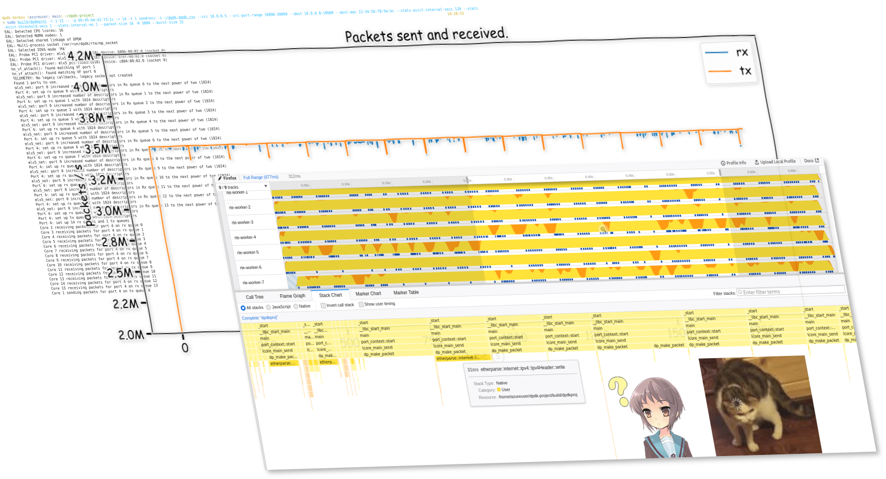
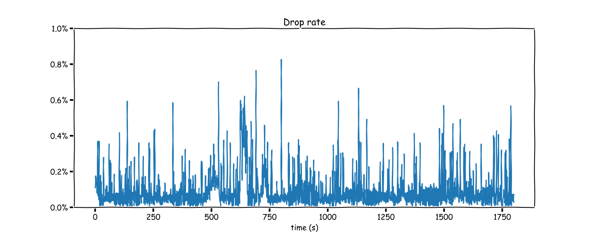

<script async defer src="https://buttons.github.io/buttons.js"></script>

Recently at work I have been learning about this fancy framework we are using in a product with high-performance networking requirement&mdash;[*Data Plane Development Kit*](https://www.dpdk.org/) (DPDK). It is a set of user-space NIC drivers and related utility libraries (like fast buffer pools or queues) that enables an application to bypass the Linux kernel's networking stack, and directly send and receive packets from the hardware (plus potentially interact with more advanced hardware offloading features or other configurations) when using supported NICs, which are usually server-grade products (and not your average consumer NIC). Instead of relying on inturrupts (like the kernel does), DPDK applications use &ldquo;poll-mode drivers&rdquo; (PMDs) to process packets in a loop, and is able to get them, often in bursts, directly from the hardware's receive queues via user-space IO or other driver-specific magic.

As it turns out, the Linux kernel, while performing well enough for the majority of networking use cases, is not perfect at processing high-throughput UDP packets. A basic application which simply send packets in a loop can use the [`sendmmsg`](https://man7.org/linux/man-pages/man2/sendmmsg.2.html) syscall to queue a large number of packets to the kernel, and calling [`recv`](https://man7.org/linux/man-pages/man2/recv.2.html) in a loop is able to roughly handle the packet echoed back. In my test environment, I was able to achieve around 1M small packets per second (varies from time to time, likely due to cloud environment changes).<footnote>In this test, there are 2 machines&mdash;one running a "send/receive" program implemented with Linux syscall, and the other running a "reflect" program, but using DPDK. This effectively means that we are only counting in the Linux overhead once. If both end uses the kernel networking stack, this number is around 300-600k.</footnote>
Such a number is likely more than enough for the majority of applications, but when working with this level of packet rate, things are very unstable&mdash;around 10-20% of the packets are not received (happens at somewhat lower load as well), and you get [some real spikey graphs](https://github.com/micromaomao/dpdk-project/blob/58db791568a3098ac6a8fafefb7b46a1ffb16090/data/a.ipynb) if you plot the packet rate over time, even at the sending end.

As you might have seen from the cover graph of this article, you can get much higher and much more stable performance with DPDK. Official documentation from DPDK claims that it is able to achieve the theoretical maximum packet rate under hardware bandwidth limitation.<footnote>See <a target="_blank" href="https://www.dpdk.org/wp-content/uploads/sites/35/2014/09/DPDK-SFSummit2014-HighPerformanceNetworkingLeveragingCommunity.pdf">&ldquo;SPEED MATTERS&rdquo; DPDK slide</a> page 3 for the claim, and <a target="_blank" href="https://fast.dpdk.org/doc/perf/DPDK_22_07_NVIDIA_Mellanox_NIC_performance_report.pdf">this recent test report</a>.</footnote>
For a 10 Gbps NIC, this means upwards of 30M (small) packets per second. Of course, due to both my inexperience in writing and testing high performance code, and the lack of a proper test environment (I do not have physical hardware to run these tests, and testing in the cloud can be susceptible to a wide range of environmental factors), I was not able to get anywhere near that. However, I was able to see significant improvement over the best result I can get with using the standard Linux API&mdash;in most cases I was able to achieve 3M packets/s without more than 1% packet loss, and my best result so far has been 3.5 Mpkt/s with (average) 0.1% loss, significantly outperforming the best Linux numbers I got of 1 Mpkt/s at 10% loss.

I do not, however, plan to focus on performance too much in the remainder of this article, because this is not really (yet) my area of expertise, and I have very likely not used the most optimized approach. Instead, I will walk through how I implemented my own DPDK application, what I have learned, the challenges involved, and some potential future work.

The source code for my DPDK application is on GitHub: <a target="_blank" href="https://github.com/micromaomao/dpdk-project">micromaomao/dpdk-project</a>
<span style="display: inline-block; vertical-align: top;">
<a class="github-button" href="https://github.com/micromaomao/dpdk-project" data-icon="octicon-star" data-size="large" data-show-count="true" aria-label="Star micromaomao/dpdk-project on GitHub">Star</a>
</span>

## Setup

For this project, all testing are done on Microsoft Azure, with a pair of Standard D16s v5 VMs. “Accelerated Networking” is enabled on all NICs to enable using DPDK.

<div class="info">

Disclaimer:

1. I receives free Azure credits as a Microsoft employee, which I used for this project.
2. Azure was chosen also because I already knew that it will work with DPDK and I have worked with it in my work.
3. This article is not otherwise an endorsement of Azure &mdash; I have not made any comparison with other platforms.

</div>

All VMs will have 2 NICs - one for management, which will have a public IP I can use to SSH onto, and one for testing, which is connected to a private vnet. This separates other traffic from competing with testing traffic, but more crucially, this way we can bind the testing NIC to DPDK and experiment with it, without impacting SSH and other connectivity.

The [DPDK Getting Started guide](https://doc.dpdk.org/guides/linux_gsg/linux_drivers.html) detailed the standard steps required to setup a NIC for DPDK, which involved calling `dpdk-devbind.py`. However, it turns out that due to using VMBus instead of PCI addresses, a different command&mdash;`driverctl`&mdash;is required on Hyper-V VMs and in terms Azure, as noted in [the docs for the Netvsc poll mode driver (PMD)](https://doc.dpdk.org/guides/nics/netvsc.html). Moreover, in Azure, there are actually two drivers (in fact, two devices, as I will explain later) involved for each &ldquo;NIC&rdquo; &mdash; the Netvsc PMD, and [NVIDIA MLX5](https://doc.dpdk.org/guides/platform/mlx5.html). The latter requires an additional system library `libibverbs` to be installed in order for DPDK to compile and link to its MLX5 driver, otherwise the Netvsc PMD will not set up the device and nothing will work, which costed me hours of wondering what went wrong.

In short, here is everything I did to compile DPDK (with MLX5), written out as a copy-pastable script on Debian 11:

```bash
set -e
cd ~
sudo apt install pkg-config meson ninja-build python3 python3-pyelftools libnuma-dev clang make libibverbs-dev driverctl
git clone https://dpdk.org/git/dpdk-stable -b v22.11.1
# -b specify a tag to checkout - you should use the latest version. You should not omit it - using the default branch won't work.
cd dpdk-stable
meson setup -Dbuildtype=release -Dplatform=native -Doptimization=3 build
# or -Dbuildtype=debug -Doptimization=g
cd build
ninja
sudo ninja install
sudo ldconfig
cd ~
```

To set up the devices for DPDK (assuming you're running on Azure), use `ip a` to find out which device you would like to bind to DPDK (by looking at its IP address). You will probably see some devices with no IP address&mdash;ignore them for now.

<p class="warn">
Note that the <code>eth</code> device number assigned by Linux may not necessarily correspond with the order you see in the Azure portal. If you bind the wrong device, you may lose connectivity to the VM.
</p>

After you identified the device, use

```bash
basename $(readlink /sys/class/net/ethX/device)
```

to find out its VMBus address, which should be in a UUID format, then run the following, which will &ldquo;unattach&rdquo; it from Linux and allow DPDK to take over later:

```bash
sudo driverctl -b vmbus set-override xxxxxxxx-xxxx-xxxx-xxxx-xxxxxxxxxxxx uio_hv_generic
```

In addition to binding the devices, DPDK also requires you to pre-allocate some hugepages. You can do that with:

```bash
sudo dpdk-hugepages.py -r 10G
```

(Replace `10G` with a sensible value depending on your available RAM.)

You will need to run the above 2 commands (`driverctl` and `dpdk-hugepages.py`) after every reboot, so save them to a script you can easily run again later.

### _Actually, why are there two devices for one NIC?_

It is not terribly relevant to us right now if we just want to get things set up, but if you're interested in why there are two &ldquo;devices&rdquo; involved (or if you're getting `hn_vf_attach(): Couldn't find port for VF` errors and wondering what it means), it is because Azure uses _[SR-IOV](https://learn.microsoft.com/en-us/windows-hardware/drivers/network/overview-of-single-root-i-o-virtualization--sr-iov-)_ to pass-through part of the NIC to the VM. In this set up, the physical NIC presents itself as multiple PCIe devices &mdash; one _Physical Function_ (PF) device, which is always controlled by the VM host, and one or more _Virtual Functions_ (VFs), which are passed through to the VM. The hypervisor, in addition to passing through the VF, also creates a virtual NIC for the VM (which is the hv_netvsc device we see). In a non-SR-IOV situation this would have been the only device presented to the VM for each NIC, and traffic is forwarded by the hypervisor to or from the VM via this virtual NIC. When SR-IOV is used, this virtual NIC exists as a control and fallback (during live migration) mechanism, but actual traffic will flow directly from the physical NIC to the VM via the VF, bypassing the hypervisor. Thus, the VM sees two devices for each NIC &mdash; the hv_netvsc one (also referred to as the &ldquo;synthetic&rdquo; device), and the actual MLX5 VF. When DPDK starts, it will take over both devices, the Netvsc driver will match them up (just by comparing MAC addresses, actually), and link them together so that the rest of the DPDK application sees a single port.

## How the application works

[The application](https://github.com/micromaomao/dpdk-project) I made for this project is basically an improved version of the [DPDK Basic Forwarding Sample Application](https://doc.dpdk.org/guides/sample_app_ug/skeleton.html). The sample application simply forwarded raw ethernet packets in a recv/send loop, without any other processing like IP / UDP. I added, on top of this:

* Ability to construct and parse Ethernet, IP and UDP packets, in order to properly forward, as well as send UDP packets. (Shout out to the [`etherparse` Rust crate](https://docs.rs/etherparse/latest/etherparse/) which I've used here.)
* Stats logging: number of transmitted and received packets, latency and packet loss tracking (via including a timestamp in the packets).
* Multi-threading, and handling multiple receive (rx) and transmit (tx) queues.
* Rate limiting (for proper packet loss results).
* Configuration options via the command line, like ports to bind to, IP/MAC addresses, number of queues, packet size, etc.

The application has two &ldquo;modes&rdquo;, intended to be used on separate VMs. In &ldquo;sendrecv&rdquo; mode, the application generates UDP packets with an index and timestamp, and fill the rest of the space with pseudorandom data. It also, on separate threads, receives packets coming in, verifies that it is valid and intact, then increment the statistics. In &ldquo;reflect&rdquo; mode, the application simply sends back the packets it receives, without any modification other than swapping source MAC, IP and port with destination MAC, IP and port (and possibly recomputing checksums, depending on whether this is offloaded).

The application is a combined C++ and Rust codebase, and can be built if that you have a C++ compiler, Rust toolchain, and CMake installed (as well as the DPDK library, installed earlier via running `ninja install` in the DPDK build directory). To build it, clone the [git repo](https://github.com/micromaomao/dpdk-project) locally, then run:

```bash
cmake . -Bbuild -DCMAKE_BUILD_TYPE=Release -GNinja
cd build; ninja
```

Once build, it can be ran after setting up a DPDK environment (as outlined [earlier](#setup)). To avoid random permission issues, start it as root. Here are the arguments I used for testing &mdash; replace the NIC MAC (`-p`) and IP addresses with values for your VMs:

```bash
# On VM 1: sendrecv
sudo build/dpdkproj -l 0-15 -- sendrecv -p xx:xx:xx:xx:xx:xx -r 15 -t 1 -s /dev/stdout --src x.x.x.x --src-port-range 10000-30000 --dest y.y.y.y:10000 --dest-mac 12:34:56:78:9a:bc --stats-evict-interval-secs 120 --stats-evict-threshold-secs 1 --stats-interval-ms 1 --packet-size 16 -R 3500 --burst-size 32

# On VM 2: reflect
sudo build/dpdkproj -l 0-15 -- reflect -p xx:xx:xx:xx:xx:xx -r 16 -t 16 -s /dev/stdout --stats-evict-interval-secs 5 --stats-evict-threshold-secs 1 --stats-interval-ms 1000 --burst-size 128
```

<p class="info">
On Azure, MAC addresses are not used to direct packets, and Azure responds to all ARP requests with a fixed MAC address <code>12:34:56:78:9a:bc</code>, hence the weird <code>--dest-mac</code> argument. You may also need to change that address if running in other environment. Find out with <code>arp</code> or <code>ip neigh</code>. This argument is required because I did not implement ARP.
</p>

`-l` is an [EAL argument](https://doc.dpdk.org/guides/linux_gsg/linux_eal_parameters.html) which will be parsed by the DPDK library. In this case it specifies the cores to run on. Anything following `--` is passed to our application.

The `-R` argument specifies the rate limit, and in this case it is set to 3500 per stats interval, which we set to 1ms, giving us a rate of 3.5 Mpkt/s. 1ms is a very small stats interval, and using a larger one is more performant (less stats output and more localized atomic access), but due to the current implementation coupling rate-limit &ldquo;resolution&rdquo; to stats intervals, using a larger interval will cause packets to be sent out in brusts, rather than spreaded out at a steady rate, causing lots of packet loss.

`-r` and `-t` specifies the number of RX and TX queues (and thus threads). As it turns out, one tx thread is already maxing out the throughput I can get, and adding more tx threads causes both the rx and tx numbers to plummet, for some reason (maybe unprocessed rx descriptors makes sending slower in some way&hellip;?).

`--burst-size` specifies the maximum number of packets to send/receive in one go:

* For reflect mode this is not too interesting &mdash; if multiple packets arrived and are queued, we want to process them as fast as possible, and a larger burst size (as long as the queue size is a lot larger) will usually be better for speed.
* For sendrecv mode, however, a burst size that is too large can cause unsteady packet sending speed (effectively like having a less fine rate-limit resolution), and can lead to large packet loss.

You can run `sudo build/dpdkproj -- --help` to see a list of application-specific arguments, or without the `--` to see a list of EAL arguments.

## Results

The application outputs stats to the file specified by `-s` in CSV format. Each row represent one &ldquo;stats interval&rdquo;, and contains the timestamp, number of packets sent and received, packet loss, and latency. The latter two stats are computed by reading the timestamp data from the received packets.


<a id="drop-rate-graph"></a>



The result I'm able to achieve varies with time, likely due to hardware or other environment changes (just a fact of testing in the cloud, I guess&hellip;). However, I have been able to confirm the above result on two separate weekends. The sending is rate-limited at 3.5M packets/s (pushing it higher results in higher packet loss), and the overall packet loss is around 0.1%. You can find the raw data and the Python notebook which generated these graphs in [the /data folder in the project repo](https://github.com/micromaomao/dpdk-project/tree/470744d14e3770755369dbfb75fa3df997e90b92/data).

As mentioned in the introduction, this is significantly better than the equivalent application using Linux sockets API, which was able to do arounnd 1 Mpkt/s with a 10% loss. However, this is nowhere near line rate performance (12500 Mbps in this case, which is around 18M 84-byte frames per second) which DPDK is expected to get, and there are several issues with my implementation that I already know of, but have not had the time or skill to fix.

My application also tracked latency, and I can confirm that the vast majority of packets have round-trip latency of less than 1ms. However, due to a poor choice of time unit (using ms instead of say, μs or even ns), I do not currently know exactly how long the average latency is &mdash; many packets simply arrive within the same millisecond.

## Evaluation

There are numerous issues with my DPDK-based implementation, such as poor handling of stats and rate-limiting, which prevented it from achieving the theoretical maximum throughput and stability, as we will address later. There is also likely more investigative work that can be done on its performance, such as making sure packets are actually distributed evenly across the cores, or qualifying the impact of all the atomic operations I'm doing. With some more clever programming it is entirely possible for the numbers that I managed to achieve here to be 10x higher.

However, even with the above shortfalls, the DPDK implementation of sendrecv and reflect is still significantly more capable than the one using Linux sockets API in terms of packet throughput and loss rate.

Using DPDK does come with some very significant drawbacks. It requires specific environment setup and hardware/platform support, whereas the Linux networking stack will basically work universally. More importantly, it is a very complex and low-level tool, and you need a lot more code to do even basic stuff like ARP, IP routing, TCP/UDP flows, etc, all of which the Linux kernel handles &ldquo;out-of-the-box&rdquo;. It also does not work well with common Linux tools like `tcpdump`, making debugging potentially more difficult.

There is also no reason why Linux cannot be made to perform better, even if not completely matching the performance of the DPDK poll-mode driver. For example, there are more complex kernel APIs like [Express Data Path](https://en.wikipedia.org/wiki/Express_Data_Path), which allows some (albeit basic) custom packet processing while bypassing essentially all of the kernel networking stack. The Linux kernel could also, in theory, use a similar poll-mode driver in high-throughput scenarios, and if combined with stuff like [io_uring](https://unixism.net/loti/what_is_io_uring.html) to eliminate syscall overhead and do [zero-copy buffer passing](https://lwn.net/Articles/879724/), it could _potentially_ achieve similar performance to DPDK.

## Learning &amp; challenges

This project was a fun and challenging learning opportunity for me. It was a chance for me to use a bunch of low-level networking knowledge, learn more about, on a high level, how high-throughput network hardware work, concepts like offloading, and gain more performance analysis skills.

Like many other engineers, I learn through building. Writing a DPDK program from ground up was also a great way for me to be introduced to this admittedly quite complicated framework. This aspect of DPDK was also part of the challenge of this project &mdash; there are so many new concepts, things might not work out of the box, and it is nowhere near as simple as just `connect`ing a socket and using `send`/`recv`. I don't want to make this out as an overly negative thing though &mdash; I think it's still within a reasonable &ldquo;weekend-project-able&rdquo; level (of course depending on experience with networking and stuff), and it forced me to learn or think about many things that are useful to know in other context as well when it comes to high performance computing, but as mentioned in the previous evaluation section, this aspect of DPDK is, in my opinion, one of its most significant drawbacks.

### `perf`

Another aspect of my project which proved to be quite challenging was getting sensible, useful and consistent perf results. Testing in the cloud always tends to be a bit hit-or-miss, and that's understandable given that I might be sharing the same CPU and NIC with other people who are also running significant workload. Results can vary from (given the same sustained packet loss) 2.5 Mpkt/s to 5 Mpkt/s on different days, or even just across VM restarts. This could even be explained by my two VMs being allocated to far-away hosts versus close-by ones on different attempts, or even just on the same host altogether &mdash; thinking back, I've made no effort to mitigate this even though I should, at least by using e.g. different availability zones or mess around with affinity settings.

I was aware of tools like `perf` which are commonly used to profile performance of a native application. In particular, `perf` works by regularly sampling the state of the running thread, tracing its stack, etc. While `perf` does work well with many common workloads, I was not able to get sensible results out of it. <a target="_blank" href="https://share.firefox.dev/40Son5A">The result</a> I got often looks suspiciously like it's being way under-sampled, even when using `-F max`:


I'm using [Firefox Profiler](https://profiler.firefox.com/) here to view the results from `perf`, as it has a great UI. Even though this project has nothing to do with Firefox, the Firefox Profiler is able to read arbitrary `perf` output, and hence can be used here. This weird stack chart is not a problem with Firefox Profiler because I can see the same large gaps by manually inspecting the output of `perf script`. Also, it looks like `perf` is sampling at a rate of 100 kHz, which is obviously too low if we're sending 3.5 Mpkt/s.

As such, I was not able to get any useful, trustworthy information from `perf` that can answer the question &ldquo;how much more can I push the result if I optimized my code more&rdquo;. I have not explored alternative tools or attempted to increase the `perf` sampling rate beyond the default (kernel) limit &mdash; I suspect increasing it to a high enough level to match packet rate would simply bog down the application so much that the result would no longer be meaningful.

## Potential improvements

The goal of this project was not to make something that would compete with existing packet benchmarking tools and e.g. achieve perfect performance or ultra high stability, but rather to learn about DPDK and high-performance networking in general. However, I can think of several possible improvements (or route to more investigation) that could be made to the application that would bring it closer to that.

### Stats handling

Currently, statistics are collected for every &ldquo;interval&rdquo;, and a backlog of these interval stats are kept in a double-ended queue. When the queue is full, an &ldquo;eviction&rdquo; is triggered, which writes the data for all intervals older than a certain threshold to a csv file, then rotates the queue. This design is so that stats can be back-applied, for example when we receive a packet with a timestamp in an older interval.

The issue here is that thread safety is achieved both by using atomics for all values, and by putting the whole queue behind a read-write lock to support evictions. This means that each stat update needs to take a read lock. While the Rust RwLock seems to be implemented efficiently (i.e. it just spins when uncontended, which in our case is almost always the case), this is still not an ideal solution. Also, a write lock need to be held for eviction, which blocks all threads writing stats. This is likely why there are regular, periodic downward spikes in the Tx rate graph.

A first step to investigating the extent of this problem would be to remove all stats-related code altogether from the sendrecv end (and just seeing whether the number at the reflector side improves significantly). Also, using `try_read` instead of blocking on the RwLock, and when failing keeping a thread-local backlog of stat updates, is likely to remove the downward spikes.

Due to how the code is currently structured, each packet received currently results in taking the RwLock separately, and also doing (separate) atomic increments. This is also likely to be contributing to the problem.

Alternative designs might eliminate the RwLock altogether by using a lock-free approach based on swapping atomic pointers.

### Rate limiting

The above problem is made significantly worse by using a very fine stat interval (1ms). Because rate limiting is currently coupled to stats interval, such a small interval is needed to achieve uniform packet rate. Having an entry for every millisecond is also likely very bad for cache locality, and also causes more writes to the csv file.

### Addressing packet loss

I managed to achieve an overall packet loss of 0.1%, however, as you can tell from the [graph](#drop-rate-graph), there are frequent high spikes which can go up to 0.8%. This is actually completely unacceptable for a real-world production system which relies on reliable, high network throughput, such as phone/video calls, and is especially indicative of a problem when you realize that this is just traffic in the same datacenter.

I'm not able to confidently say what is causing this / how to improve it, but I suspect it might be related to the following:

* The stats issue mentioned earlier &mdash; using less locks / atomics / memory might help reduce variance in the time taken for each packet, thus making it more stable (i.e. less drop) at the same load.

* Non-optimal burst size, non-uniform / spiky sending rate, etc. may result in traffic pattern which doesn't work well with the middle boxes between our VMs. Currently brust size is configurable but not separately for send and recv, and it is quite likely the send and recv have different optimal values.

* Core isolation &mdash; Linux might be scheduling other random stuff from time to time on our packet-processing cores, causing us to lose packets. I haven't investigated this but there is likely some very low-hanging fruits here, and it would also be helpful to gather stats like max number of (unprocessed) entries in the rx queue, if DPDK supports that. For 3.5 Mpkt/s evenly distributed to 16 cores, it takes only 4.7ms to fill up a single core's 1024 entry queue.

It is also worth investigating whether the bottleneck is on the sendrecv end or the reflect end, although I suspect it is the former as it is doing more work and is the only end suffering from the stats issue.

### Rx queue distribution

Speaking of even distribution, I do not have any metrics yet to show whether the packets are being handled evenly by all cores. NICs usually rely on hashing a combination of source and destination IP addresses and ports to determine which queue to send the packet to, but this is not guaranteed to be uniform, especially if there are subtle problems in my packet generation.

### General optimization

There are also some general optimization techniques that applies to all applications but which I haven't tried yet, like:

* Setting up proper link-time optimization (LTO) between C++ and Rust, especially since we are crossing this boundary a lot.
* Trying profile-guided optimization (PGO), or manually marking likelihood of branches (stuff like `if(likely(...))`), which a lot of DPDK code likes to do.

### Feature improvements

Aside from perf, there are also other ways this application can be made more &ldquo;production-ready&rdquo;, whatever that means for a packet generator:

* On the receiving end, I'm not doing any duplicate checking, so if for some reason the packets are being repeated this will lead to inaccurate rx stats (although it seems unlikely this will happen in practice, and it is also hard to implement without causing perf issues or significantly worsening cache locality).
* More metrics in a more &ldquo;mainstream&rdquo; format, like Prometheus.
* More flexible packet generation &mdash; maybe even a DSL / graph-like structure for tracking flow states. Kinda leads itself to highly accurate packet loss / latency stats and duplicate prevention. This may also be a good opportunity to play around with JIT compilation, although this is probably heading down the over-engineering rabbit hole.

## Thanks

This project originated from a &ldquo;Day-of-Learning&rdquo; idea I had, and I spent my last DoL on the initial parts of this project. DoL is a thing we have at work in [Azure for Operators](https://azure.microsoft.com/en-us/solutions/industries/telecommunications/#overview) (Microsoft), which allows us to spend a day doing &ldquo;learning&rdquo; stuff. I also want to thank one of my colleagues who helped me with some initial DPDK setup and understanding.

## Appendix: Baseline (Linux kernel sending/recving + DPDK echo) setup &amp; measurements

This is done partially with an [earlier learning project](https://github.com/micromaomao/neuring) I made (at the time I wanted to investigate whether io_uring improves anything in the context of high-speed packet processing, and could not get any significantly different result). [syscall_sendrecv.rs](https://github.com/micromaomao/neuring/blob/d37c0b735689117d854992460946e36bbe9f9e58/src/io_impl/syscall_sendrecv.rs) contains the source code for the syscall-based send/recv program.

Since I actually ported the stats and packat-generation related code from this earlier project when building the DPDK one, there should not be too much difference between this and my DPDK test, aside from using DPDK vs Linux sockets.

I did not do a very detailed comparison / analysis on the how the result compares, because I ran out of time, and also the results are significantly different enough that I was satisfied with what I'm seeing.

Link to graphs: [Result for DPDK forwarding, Linux syscall sending / receiving](https://github.com/micromaomao/dpdk-project/blob/58db791568a3098ac6a8fafefb7b46a1ffb16090/data/a.ipynb) ([source data](https://github.com/micromaomao/dpdk-project/blob/58db791568a3098ac6a8fafefb7b46a1ffb16090/data/syscall-dpdk.csv)).

You can build and run the application on Linux with `cargo build --release` after [installing Rust](https://www.rust-lang.org/learn/get-started), then running `target/release/neuring` (no prior setup needed as it's just using normal Linux API). Use `--help` to see a list of available arguments. Ignore all the io_uring modes &mdash; they don't really work well, at least for my implementation.
