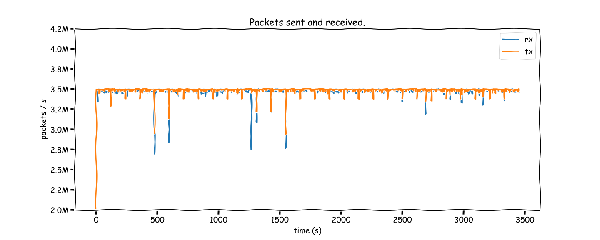

Sorry for the meme in the title, that was cringe.

Anyway, recently at work I have been learning about this fancy framework we are using in a product with high-performance networking requirement&mdash;[*Data Plane Development Kit*](https://www.dpdk.org/) (DPDK). It is a set of user-space NIC drivers and related utility libraries that enables an application to bypass the Linux kernel's networking stack, and directly send and receive packets from the hardware (plus interact with more advanced hardware offloading features) when using supported NICs (which are usually server-grade products, not your average consumer NIC).

As it turns out, the Linux kernel is not very good at dealing with high-throughput UDP use cases. A basic application which simply send packets in a loop can use the [`sendmmsg`](https://man7.org/linux/man-pages/man2/sendmmsg.2.html) syscall to queue a large number of packets to the kernel, and calling [`recv`](https://man7.org/linux/man-pages/man2/recv.2.html) in a loop seems to be good enough to keep up with this. In my test environment, I was able to achieve around 1M small packets per second (varies from time to time, likely due to cloud environment changes).<footnote>In this test, there are 2 machines&mdash;one running a "send/receive" program implemented with Linux syscall, and the other running a "reflect" program, but using DPDK. This effectively means that we are only counting in the Linux overhead once. If both end uses the kernel networking stack, this number is around 300-600k.</footnote>
Such a number is likely more than enough for the majority of applications, but when working with this level of packet rate, things are very unstable&mdash;around 10-20% of the packets are not received (happens at somewhat lower load as well), and you get [some real spikey graphs](https://github.com/micromaomao/dpdk-project/blob/58db791568a3098ac6a8fafefb7b46a1ffb16090/data/a.ipynb) if you plot the packet rate over time, even at the sending end.

As you might have seen from the cover graph of this article, you can get much higher and much more stable performance with DPDK. Official documentation from DPDK claims that it is able to achieve the theoretical maximum packet rate under hardware bandwidth limitation. Often this means upward of 10M packets per second. Of course, due to both my inexperience in writing and testing high performance code, and the lack of a proper test environment (I do not have physical hardware to run these tests, and testing in the cloud can be susceptible to a wide range of environmental factors), I was not able to get anywhere near that. However, I was able to see significant improvement over the best result I can get with using the standard Linux API&mdash;in most cases I was able to achieve 3M packets/s without more than 1% packet loss, and my best result so far has been 3.5 Mpkt/s with 0.1% loss, vastly outperforming the best Linux numbers I got of 1 Mpkts/s at 10% loss.

I do not, however, plan to focus on performance too much in the remainder of this article, because this is not really (yet) my area of expertise. Instead, I will walk through how I implemented my own DPDK application, what I have learned, the challenges involved, and some potential future work.
