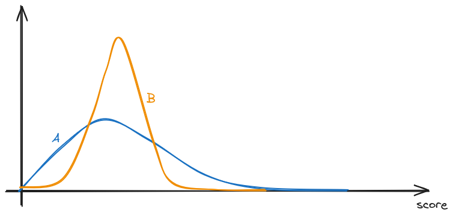

I was asked the following question by a friend today (he got the question from a financial analysis test):

> Flip a fair coin 100 times &mdash; it gives a sequence of heads (_H_) and tails (_T_). For each _HH_ in the sequence of flips, Alice gets a point; for each _HT_, Bob does, so e.g. for the sequence _THHHT_ Alice gets 2 points and Bob gets 1 point. Who is most likely to win?

My immediate reaction was of course both would be equally likely to win. After all, in a random sequence of Hs and Ts, I _expect_ HH and HT to appear the same number of times. Let's write some code to verify this:

<noscript>
Enable javascript to edit code and re-run.
</noscript>

```javascript
const seq_len = 1000000;

let sequence = Array.from({ length: seq_len }, () => Math.random() > 0.5 ? 'H' : 'T');
let a_score = sequence.filter((_, i) => i < seq_len - 1 && sequence[i] === 'H' && sequence[i + 1] === 'H').length;
let b_score = sequence.filter((_, i) => i < seq_len - 1 && sequence[i] === 'H' && sequence[i + 1] === 'T').length;

console.log(`Alice: ${a_score}, Bob: ${b_score}, ratio = ${a_score / b_score}`);
```

<pre class="output-for-code-above">Alice: 249865, Bob: 249721, ratio = 1.000576643534184</pre>

At this point I was pretty comfortable to declare that both players are equally likely to win. However, that would obviously be too easy, and my friend quickly told me I was wrong. He also told me the correct answer, albeit without what I consider a good explanation. Let's explore this a bit more.

In the above code, I have increased the sequence length because I didn't think the particular case of 100 mattered, and I just wanted more "samples". **This was my first mistake** &mdash; the question explicitly said 100, so there is no reason for me to arbitrarily increase the sequence. In the limit of an infinite sequence length (like we simulated above), Alice and Bob would score the same number of points, but perhaps things are more complicated with a finite sequence length? Let's actually do the simulation properly:

```javascript
const seq_len = 100;
const n_runs = 100000;

let a_score_sum = 0;
let b_score_sum = 0;

function run() {
  let sequence = Array.from({ length: seq_len }, () => Math.random() > 0.5 ? 'H' : 'T');
  let a_score = sequence.filter((_, i) => i < seq_len - 1 && sequence[i] === 'H' && sequence[i + 1] === 'H').length;
  let b_score = sequence.filter((_, i) => i < seq_len - 1 && sequence[i] === 'H' && sequence[i + 1] === 'T').length;

  a_score_sum += a_score;
  b_score_sum += b_score;
}

for (let i = 0; i < n_runs; i++) {
  run();
}
console.log(`Average Alice: ${a_score_sum / n_runs}, Bob: ${b_score_sum / n_runs}, Ratio: ${a_score_sum / b_score_sum}`);
```

<pre class="output-for-code-above">
Average Alice: 24.76017, Bob: 24.75328, Ratio: 1.000278346950384
</pre>

Interesting. The difference is quite small, although it's not obviously equal. Running it with a vastly larger iteration count, with statistical analysis, results in the following ([source code](./simulation-avg.js)):

```text
Average Alice: 24.749331868750865 +- 0.011238525490417558, Bob: 24.749518982975573 +- 0.0023019322652421182
No significant difference with p = 0.01
```

It seems reasonable to assume for now that the expectation are equal (we will prove this formally later) &mdash; wouldn't this mean that the game is fair? Let's do it slightly differently:

```javascript
const seq_len = 100;
const n_runs = 10000;

let a_wins = 0;
let b_wins = 0;

function run() {
  let sequence = Array.from({ length: seq_len }, () => Math.random() > 0.5 ? 'H' : 'T');
  let a_score = sequence.filter((_, i) => i < seq_len - 1 && sequence[i] === 'H' && sequence[i + 1] === 'H').length;
  let b_score = sequence.filter((_, i) => i < seq_len - 1 && sequence[i] === 'H' && sequence[i + 1] === 'T').length;

  if (a_score > b_score) {
    a_wins++;
  } else if (b_score > a_score) {
    b_wins++;
  }
}

for (let i = 0; i < n_runs; i++) {
  run();
}
console.log(`Alice wins: ${a_wins}, Bob wins: ${b_wins}`);
console.log(`Alice wins ${a_wins / n_runs * 100}% of the time`);
console.log(`Bob wins ${b_wins / n_runs * 100}% of the time`);
```

<pre class="output-for-code-above">
Alice wins: 4540, Bob wins: 4910
Alice wins 45.4% of the time
Bob wins 49.1% of the time
</pre>

Running the simulation more times shows that Bob wins approximately 2.7% more often than Alice.


Ok, at this point I have to admit that **I had actually made a second mistake** in my original reasoning for concluding that the game is fair to both &mdash; assuming that simply comparing the _expectation_ of the score will answer the question. However, note what the question is asking:

> Who is most likely to win?

It is _not_ asking who's score is higher on average. By the simulation above, we can conclude that Bob wins more often than Alice, question solved.

An important lesson here is to use accurate simulations &mdash; simulate the thing you're actually interested in (who wins), not something else (like average score).

----

But wait&hellip;

## Why?

A fundamental realisation from this is that when faced with a question like &ldquo;who is most likely to win&rdquo;, it is very tempting to simply jump to conclusion based on the observation that the expectations are equal. For example, if we set the score for Alice to simply be the number of heads, and for Bob to be the number of tails, it seems logical to conclude that, because we expect to get the same number of heads and tails, the game is fair.

As we just showed, this is not always the case. An intuitive explanation for this is that, even when two distributions have the same mean, they might have different _skew_, which means that the probability of one being greater than the other is not necessarily 50%. In the question above, the theoretical maximum score Alice can earn is 99, with the sequence _HHHHH_&hellip;_HHHHH_, whereas for Bob, it is 50 (_HTHT_&hellip;_HTHT_). This means that the probability distribution of Alice's score has a longer tail to the right, perhaps something like (not to scale):



And therefore, even if the two score distributions have the same mean, it might be that Alice actually more often gets a lower score, but has the _potential_ to earn vastly higher scores _occasionally_. And when the only thing that matters is who wins, earning higher scores doesn't matter once you've won.

There is actually another erroneous assumption here that is more subtle &mdash; note that in the question setup, the scores for Alice and Bob are derived from the same sequence of coin flips. This means that the scores are not independent, and we can't treat the two scores as two separate, independent distribution. So even if we managed to find the distribution for Alice's score and Bob's score, the answer we get may not be correct if we treat them separately.

## So what is the actual score distribution?

Let's try and deduce the full score distribution algorithmically. A sensible approach might be to find some way of expressing some distribution function <tex>Q</tex> in terms of smaller versions of the problem. This pattern is commonly known as &ldquo;dynamic programming&rdquo;.

We define the distribution function <tex>Q(n, s_A, s_B)</tex> to be the _number of_ distinct <tex>n</tex>-length coin-flip sequences such that Alice scores <tex>s_A</tex> and Bob scores <tex>s_B</tex>. In other word, the sequence contains <tex>s_A</tex> _HH_ and <tex>s_B</tex> _HT_. Defining it this way allow us to avoid having to think about actual probability, which is simply <tex>\frac{1}{2^n} Q(n, s_A, s_B)</tex>. Later on, it will be easiest for us to not have to re-scale <tex>Q</tex> for different <tex>n</tex> and just work with the raw count instead.

Assuming we have <tex>Q(n, s_A, s_B)</tex> for <tex>n = 100</tex>, we will then be able to answer the original question by computing the probability of each person winning. This can be done by counting how many sequences result in winning condition for each person:

<center>
<p>
<tex>
\displaystyle
P(s_A > s_B) = \frac{1}{2^{100}}\sum_{s_A = 1}^{99} \sum_{s_B = 0}^{s_A - 1} Q(100, s_A, s_B)
</tex>
</p>
<p>and similarly</p>
<p>
<tex>
\displaystyle
P(s_B > s_A) = \frac{1}{2^{100}}\sum_{s_B = 1}^{50} \sum_{s_A = 0}^{s_B - 1} Q(100, s_A, s_B)
</tex>
</p>
</center>

Ok, that is all fine and dandy, but how do we actually compute <tex>Q</tex>?

It is not obvious at first how we can possibly write <tex>Q(n, \ldots)</tex> in terms of <tex>Q(n - 1, \ldots)</tex> or smaller <tex>n</tex>. Let's imagine we're currently at some particular <tex>n</tex>-length sequence:

<center><tex>\underbrace{\ldots \ldots \ldots}_{n - 1\text{ coins}}\ \textit{H}</tex></center>

Does Alice gain a point here? What if we have:

<center><tex>\underbrace{\ldots \ldots \ldots}_{n - 1\text{ coins}}\ \textit{T}</tex></center>

Does Bob gain a point here? It seems like we will be forced to &lsquo;inspect&rsquo; the last coin in the preceding sequence to determine what we should do, which renders our approach unusable, because we have already rolled the previous state into just a count <tex>Q</tex>.

However, all hope is not lost for dynamic programming. What if we simply force ourselves to always end the sequence with a _T_? In other words, we can define a slightly different function <tex>\tilde{Q}</tex>, such that <tex>\tilde{Q}(n, s_A, s_B)</tex> is the number of distinct <tex>n</tex>-length coin-flip sequences **which ends in a tail**, and such that Alice scores <tex>s_A</tex> and Bob scores <tex>s_B</tex>.

The choice of which letter to ends the sequence with is somewhat arbitrary, but choosing <tex>\tilde{Q}</tex> to only count _\*T_ sequences is slightly easier to reason about, as _T_ makes a nice &lsquo;stopping point&rsquo; &mdash; what happens after that _T_ is completely separate from it or what comes before it.
