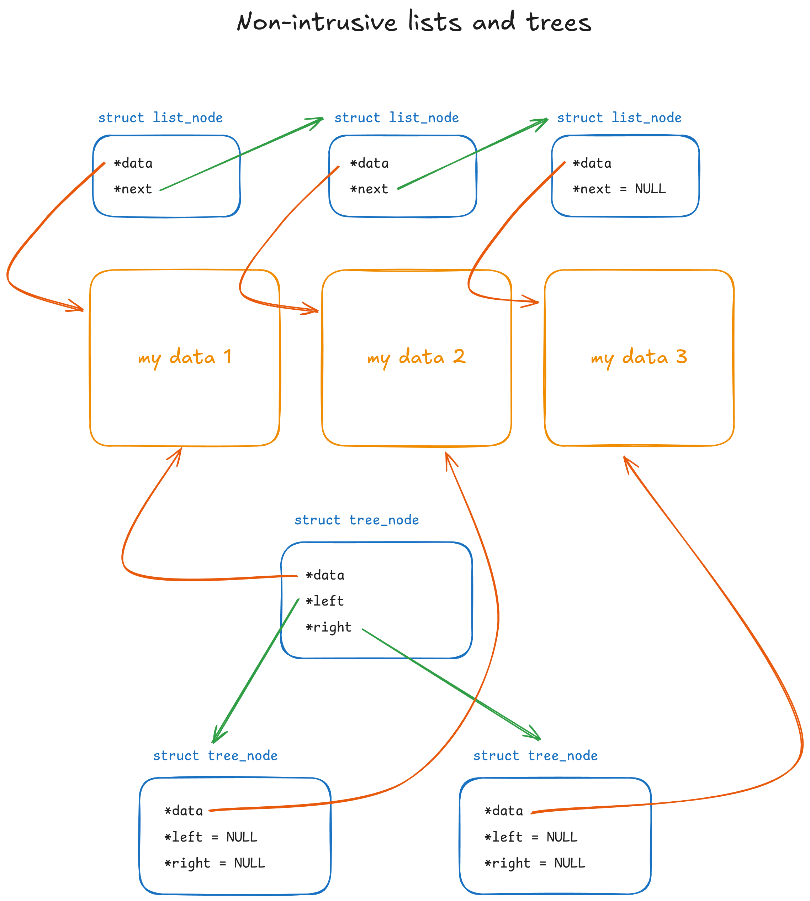
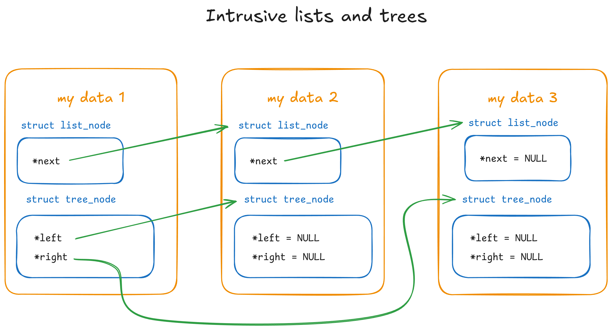

Truth be told, I've never been really good at CTFs, but I do enjoy solving challenges at my own pace, and exploring perhaps less conventional methods, learning more about programming in the process. A few weeks ago I found a reverse engineering problem which basically boiled down to running a Linux binary and entering the correct number to get it to print a flag. The program was heavily obfuscated, has anti-debugging techniques, and potentially utilized self-modifying code, but `strace` shows that, aside from those, it did not try to do anything fancy with system calls, attempt to save files, or communicate via network.

Fortunately, the _interesting_ bits of the program ran quite fast &ndash; after reading the input, it spends around 5us (0.005ms) before printing out whether the guess was correct or not. The input space was also very managable &ndash; between 0 to 3,000,000. This means that even a brute-force search of the possible inputs could finish in a reasonable time, and there is no need to expend much effort on actual reverse engineering if we don't have to. The only tricky part is, how do we convince it to try different inputs as fast as this?

After considering some alternatives, my approach for solving this eventually ended up being a self-taught lesson in kernel hacking.

<div class="make-toc"></div>

## Environment

Before we get into more investigation, let's quickly explain what my test environment for this looks like. Since I'm not a fan of running random binaries from the Internet on my host system, we will only ever run the target binary in a VM. In fact, since there will be a good amount of kernel hacking today, we need a VM for which which we can easily boot our hacked kernel in. Previously I made some shell scripts which comes in handy. It:

- Allows me to easily run a QEMU VM with any kernel changes I want by directly booting from a compiled vmlinux.
- Hooks up a serial console and 9pfs root (mapped to a separate file system on the host) for convenience.
- Uses a relatively minimal kernel configuration and lightweight startup script &mdash; VM boots up in 2 seconds.
- Builds the rootfs with Docker, pre-installing things like `strace`, `gdb`, `trace-cmd`, etc.

Once you've checked that you have Docker and QEMU installed, you can get started with the same environment by cloning [micromaomao/linux-dev](https://github.com/micromaomao/linux-dev), running `make -j$(nproc)` to compile the kernel, then `.dev/startvm.sh` to build the rootfs (if not already present) and start the VM (your user account might need to be in the `kvm` group). If you are on ARM, remove the `-enable-kvm` and `-cpu host` flag in startvm.sh to use emulation instead.


## Initial investigation

A straightforward, first approach would be to just run it repeatedly. However, with such a short runtime between getting the input and printing the result, any significant overhead in either the initialization of the executable itself, or the time spent in the script used to repeatedly run it quickly starts to dominate. A quick test would be to run it under `strace` and see how long it takes from the initial `execve` to the first `read`. That would be a good starting point to understand more about the program and catch any potentially surprising behavior, so let's do that first.

<p class="warn">
  Quick reminder again that you should not run or even interact with untrusted stuff directly on your host system. This include running them under <code>strace</code>, <code>gdb</code>, or even using <code>ldd</code> on them.
</p>

<style>
  .irrelevant {
    color: #aaa;
  }
  .comment {
    color: rgb(58, 113, 231);
    font-weight: bold;
  }
  .green {
    color: rgb(33, 138, 24);
  }
  .placeholder {
    color: rgb(33, 138, 24);
    font-style: italic;
  }
  .highlight {
    background-color: rgb(189, 253, 183);
    font-weight: bold;
  }
  .red-highlight {
    color: #dd0000;
    font-weight: bold;
  }
</style>

<pre>
<span class="irrelevant">$ strace -o strace.log --timestamps=ns ./hackme
...
$ cat strace.log</span>
21:00:00.076244725 execve("./hackme", ["./hackme"], 0x7ffc71a76088 /* 13 vars */) = 0
21:00:00.082059770 open("/proc/self/exe", O_RDONLY) = 3
21:00:00.085364610 mmap(NULL, 663446, PROT_READ|PROT_WRITE, MAP_PRIVATE|MAP_ANONYMOUS, -1, 0) = 0x7f7865402000
<span class="comment">// mapping itself as (non-persistent) read-write</span>
21:00:00.087883357 mmap(0x7f7865402000, 663048, PROT_READ|PROT_WRITE, MAP_PRIVATE|MAP_FIXED, 3, 0) = 0x7f7865402000
21:00:00.090062941 mprotect(0x7f78654a3000, 3990, PROT_READ|PROT_EXEC) = 0
21:00:00.092506797 readlink("/proc/self/exe", "/hackme", 4095) = 7
21:00:00.095318319 mmap(0x400000, 1855488, PROT_NONE, MAP_PRIVATE|MAP_FIXED|MAP_ANONYMOUS, -1, 0) = 0x400000
21:00:00.097642653 mmap(0x400000, 1536, PROT_READ|PROT_WRITE, MAP_PRIVATE|MAP_FIXED|MAP_ANONYMOUS, -1, 0) = 0x400000
21:00:00.099838908 mprotect(0x400000, 1536, PROT_READ) = 0
<span class="comment">// rwx... I later realized this executable has gone through a packer</span>
21:00:00.102363996 mmap(0x401000, 1420157, PROT_READ|PROT_WRITE|PROT_EXEC, MAP_PRIVATE|MAP_FIXED|MAP_ANONYMOUS, -1, 0x1000) = 0x401000
<span class="comment">// ... more stuff follows which aren't too interesting for now ...</span>
<span class="irrelevant">21:00:00.129039501 mprotect(0x401000, 1420157, PROT_READ|PROT_EXEC) = 0
21:00:00.132023341 mmap(0x55c000, 346488, PROT_READ|PROT_WRITE, MAP_PRIVATE|MAP_FIXED|MAP_ANONYMOUS, -1, 0x15c000) = 0x55c000
21:00:00.138600815 mprotect(0x55c000, 346488, PROT_READ) = 0
21:00:00.141142324 mmap(0x5b1000, 49832, PROT_READ|PROT_WRITE, MAP_PRIVATE|MAP_FIXED|MAP_ANONYMOUS, -1, 0x1b1000) = 0x5b1000
21:00:00.143710481 mprotect(0x5b1000, 49832, PROT_READ|PROT_WRITE) = 0
21:00:00.145928557 mmap(0x5be000, 27880, PROT_READ|PROT_WRITE, MAP_PRIVATE|MAP_FIXED|MAP_ANONYMOUS, -1, 0) = 0x5be000
21:00:00.148246519 mmap(NULL, 4096, PROT_READ, MAP_PRIVATE, 3, 0) = 0x7f7865401000
21:00:00.150516772 close(3)             = 0
21:00:00.153247606 munmap(0x7f7865402000, 663446) = 0
21:00:00.155881587 arch_prctl(0x3001 /* ARCH_??? */, 0x7ffce824f170) = -1 EINVAL (Invalid argument)
21:00:00.158451970 brk(NULL)            = 0x5c5000
21:00:00.160858466 brk(0x5c5d80)        = 0x5c5d80
21:00:00.163373055 arch_prctl(ARCH_SET_FS, 0x5c5400) = 0
21:00:00.165862687 set_tid_address(0x5c56d0) = 184
21:00:00.168069772 set_robust_list(0x5c56e0, 24) = 0
21:00:00.170348551 rseq(0x5c5d20, 0x20, 0, 0x53053053) = 0
21:00:00.172586062 prlimit64(0, RLIMIT_STACK, NULL, {rlim_cur=8192*1024, rlim_max=RLIM64_INFINITY}) = 0
21:00:00.174898664 readlinkat(AT_FDCWD, "/proc/self/exe", "/hackme", 4096) = 7
21:00:00.177229490 getrandom("\xb8\xaa\xbf\x47\x80\xa4\x0a\x0e", 8, GRND_NONBLOCK) = 8
21:00:00.179682734 brk(NULL)            = 0x5c5d80
21:00:00.181862768 brk(0x5e6d80)        = 0x5e6d80
21:00:00.183994583 brk(0x5e7000)        = 0x5e7000
21:00:00.186285765 mprotect(0x5b1000, 40960, PROT_READ) = 0
21:00:00.188569383 futex(0x5bd9dc, FUTEX_WAKE_PRIVATE, 2147483647) = 0</span>
<span class="comment">// Detecting debugger by looking for TracerPid?</span>
21:00:00.190868059 openat(AT_FDCWD, "/proc/self/status", O_RDONLY) = 3
21:00:00.193172756 read(3, "Name:\thackme\nUmask:\t0022\nState:\t"..., 8191) = 1076
<span class="comment">// ... more strace output ...</span>
</pre>

I suspect it is detecting debuggers and potentially changing its behavior. After writing this I later found out that actually it will pretend to run as normal even when it has detected a tracer, but actually will not print the flag even with the right input. For now, I found the code that puts that number in `/proc/self/status` by simply searching for &ldquo;TracerPid&rdquo;:

<a class="make-diff" href="./diffs/0001-hide-TracerPid.patch"></a>

With the linux-dev environment I mentioned earlier, we can simply make the change, then run `make -j16` (assuming your PC has 16 CPU threads) to produce a new kernel image, then kill the old VM (with Ctrl-D on the console or `.dev/stopvm.sh` if it's stuck) and run `startvm.sh` again.

<p class="info">
  You can apply the change above by copying the entire patch, then do <code>git apply</code>, paste it in, and hit Ctrl-D.
</p>

It then proceeded to do this, which I assume is a second layer of debugger detection:

```
ptrace(PTRACE_TRACEME) = -1 EPERM (Operation not permitted)
```

It is probably looking for whether this call returns a `-EPERM`, which would indicate that the process is (already) being traced. But since we're already making kernel changes, this is not difficult to work around either. We can find the relevant function by searching for `PTRACE_TRACEME`, which will quickly surface the function `ptrace_traceme`:

<a class="make-diff" href="./diffs/0002-ptrace_traceme-return-0.patch"></a>

<p class="info">
  Quick note: instead of making such changes to the kernel, there are alternative to <code>strace</code> which relies on seccomp-unotify instead of ptrace, which also gets around anti-debugging techniques that targets ptrace, and may be more convenient to use in other situations.
</p>

Now let's try `strace` it again:

<pre>
<span class="irrelevant">$ strace -o strace.log --timestamps=ns ./hackme
...
$ cat strace.log
21:01:00.368065520 execve("./hackme", ["./hackme"], 0x7ffe48cd5cb8 /* 6 vars */) = 0
...</span>
21:01:00.486692889 openat(AT_FDCWD, "/proc/self/status", O_RDONLY) = 3
21:01:00.489438989 read(3, "Name:\thackme\nUmask:\t0022\nState:\t"..., 8191) = 1066
21:01:00.491976961 close(3)             = 0
21:01:00.494425997 getrandom("\x75\x79\x93\x7f\x58\x99\xe3\x3e", 8, 0) = 8
21:01:00.496887787 getrandom("\x21\x5f\xfa\x83\x6c\x93\xef\x97", 8, 0) = 8
<span class="green">21:01:00.499471244 ptrace(PTRACE_TRACEME) = 0   <b>// yay</b></span>
21:01:00.501847234 getrandom("\x32\x5b\x46\xf2\x18\x84\xee\x3e", 8, 0) = 8
<span class="irrelevant">// ... more getrandom ...</span>
21:01:00.530190685 getrandom("\x25\x69\xff\xa5\x61\x13\x9d\x82", 8, 0) = 8
<span class="comment">// Detecting if stdin/stdout is a terminal before read/write...
// Could be using this to decide if it will buffer IO, or actual anti-scripting measure?</span>
21:01:00.532301961 newfstatat(1, "", {st_mode=S_IFCHR|0600, st_rdev=makedev(0x5, 0x1), ...}, AT_EMPTY_PATH) = 0
21:01:00.535515472 ioctl(1, TCGETS, {c_iflag=ICRNL|IXON, c_oflag=NL0|CR0|TAB0|BS0|VT0|FF0|OPOST|ONLCR, c_cflag=B115200|CS8|CREAD|HUPCL|CLOCAL, c_lflag=ISIG|ICANON|ECHO|ECHOE|ECHOK|IEXTEN|ECHOCTL|ECHOKE, ...}) = 0
21:01:00.539257429 write(1, <span class="irrelevant" style="font-style: italic;">startup output...</span>, 48) = 48
<span class="irrelevant">// ...</span>
21:01:00.544755153 newfstatat(0, "", {st_mode=S_IFCHR|0600, st_rdev=makedev(0x5, 0x1), ...}, AT_EMPTY_PATH) = 0
21:01:00.547057135 ioctl(0, TCGETS, {c_iflag=ICRNL|IXON, c_oflag=NL0|CR0|TAB0|BS0|VT0|FF0|OPOST|ONLCR, c_cflag=B115200|CS8|CREAD|HUPCL|CLOCAL, c_lflag=ISIG|ICANON|ECHO|ECHOE|ECHOK|IEXTEN|ECHOCTL|ECHOKE, ...}) = 0
21:01:00.549331495 read(0, "1\n", 4096) = 2
<span class="green"><b>// Note slight pause here due to input from serial terminal.</b></span>
21:01:00.551503575 write(1, "Nope"..., 43) = 43
21:01:00.554241515 exit_group(0)        = ?
21:01:00.556739011 +++ exited with 0 +++
</pre>

If we use the kernel tracing tool `trace-cmd` (which interacts with [ftrace](https://docs.kernel.org/6.12/trace/ftrace.html) and related APIs designed for both kernel debugging and performance tracing), we can find out how long the program spends computing the result after reading the input, not including time spent in the actual I/O, and also without any `strace` overhead (which was actually quite significant when you're looking at sub-ms level).

To do this, we can trace the `syscalls` family of events. We're specifically interested in `read` and `write`, and each syscall has two events we can trace: `sys_enter_...` and `sys_exit_...`. We specify these events with `-e`, and `-F -c` to only trace events from children processes.

```sh
trace-cmd record -e 'syscalls/sys_*_read'  -e 'syscalls/sys_*_write' -F -c ./hackme
trace-cmd report
```

<pre>
<span class="irrelevant">cpus=2
          hackme-82    [000] .....     4.364735: sys_exit_write:       0x1
          hackme-82    [000] .....     4.431209: sys_enter_read:       fd: 0x00000003, buf: 0x005c6920, count: 0x00001fff
          hackme-82    [000] .....     4.431220: sys_exit_read:        0x42c
          hackme-82    [000] .....     4.431236: sys_enter_write:      fd: 0x00000001, buf: 0x005c6920, count: 0x00000030
          hackme-82    [000] .....     4.431243: sys_exit_write:       0x30
          hackme-82    [000] .....     4.431244: sys_enter_write:      fd: 0x00000001, buf: 0x005c6920, count: 0x00000026
          hackme-82    [000] .....     4.431244: sys_exit_write:       0x26</span>
          hackme-82    [000] .....     4.431246: sys_enter_read:       fd: 0x00000000, buf: 0x005c8960, count: 0x00001000
          hackme-82    [001] .....     <span class="highlight">5.737281</span>: sys_exit_read:        0x2
          hackme-82    [001] .....     <span class="highlight">5.737292</span>: sys_enter_write:      fd: 0x00000001, buf: 0x005c6920, count: 0x0000002b
<span class="irrelevant">          hackme-82    [001] .....     5.738621: sys_exit_write:       0x2b</span>
</pre>

We can ignore everything that is not reading from stdin (fd = 0) or writing to stdout (fd = 1) after that. Subtracting the two green numbers, that's 11us from returning from `read` to attempting `write`! On the other hand, getting to the first `read` from the start of the program took almost 200ms, and so if we have to run the whole thing repeatedly (for example, in a bash loop), it will be 200ms <tex>\times</tex> 3,000,000 <tex>\approx</tex> 7 days! Now, you can of course use more CPU cores and run multiple instances of this loop at once, but that's not a very interesting solution. In this case the challenge is also time-sensitive and so we need something better.

<style>
  img.emoji {
    width: 1.2em;
    vertical-align: -5px;
  }
</style>

Notice that the program doesn't really try to do anything fancy (at least not externally visible) between `read` and `write` &ndash; all it does is spin some numbers around in its own memory, then spits out &lsquo;Correct&rsquo; plus the flag, or &lsquo;Nope&rsquo; if the guess was wrong. This means that, in theory, if we can perfectly restore the program's memory and register states<footnote>
Technically there's not all of the state a program could rely on or change, even without issuing any syscalls. For example, it can use the raw `rdtsc` assembly instruction to measure the current time, and deduce if it's being tricked. But in this case restoring registers and memory alone works well enough.
</footnote>, we can instantly start trying a different input, then another one in 10us (when I ran it fast enough often it finishes within 5), and so on until we find the right number. Without the overhead of even forking another process, this has the potential to be a lot faster &ndash; we're basically turning the whole input validation process into a `for` loop! It's just that the &lsquo;`for`&rsquo; in this case is outside the program. 

## What if we get the kernel to try numbers for us?

Recently I have also been getting very interested in Linux kernel development (from debugging weird kernel panics at work ), so I decided why not turn this into a kernel programming exercise, and try to get Linux to automatically try all the possible inputs for me, and restore the program state in between inputs, as suggested earlier?

The core idea is:

1. We can identify the process we're interested in from its name (&ldquo;`hackme`&rdquo;).
2. When a target process attempts to `read` from stdin, we: \
    a) Save off its register states; \
    b) Write-protect all its memory pages; \
    c) Inject the next input into the read buffer.
3. When a write protection fault happens on our target process, we: \
    a) check if it is one of the mapping we've previously write-protected; \
    b) if so, we save off an &lsquo;original&rsquo; copy of the page being written to, and allow the write to continue.
4. When the target process attempts a `write` to stdout, we: \
    a) Check if the output indicate a wrong guess (whether it contains the word &ldquo;Nope!&rdquo;); \
    b) If the output contains Nope, restore all modified memory pages to their original content, restore register states, and re-run the `read` syscall, which will cause the next input to be injected; \
    c) Otherwise, we just let the process continue. If it prints the flag out, we will see it in the console.

Now, this might seem like massive overkill, and it probably is, but hear me out:

- This is basically as fast as we can hope to get without non-trivial amount of careful reverse engineering.<footnote>
Insert _girl will literally invent new kernel feature instead of doing actual reverse engineering_ joke here</footnote>
Compared to alternative, user-space approach with ptrace (which I will explore at the end of this article), we avoid any overhead from ptrace-ing &ndash; there is no context switching or waiting between processes, and we can truly run the brute-force loop at the fastest possible speed.<footnote>
Ok, technically there is another way that can be basically as fast, and which doesn't involve kernel modifications. You can instead use `SECCOMP_RET_TRAP` with a seccomp bpf filter to have the kernel turn the syscall you're interested into a `SIGSYS`, and inject code into the program to handle this signal. This gives you the functionality of a ptrace-based syscall interceptor (your injected code can save/restore registers via the `ucontext` reference, and of course memory too) without the cost of ptrace. But this is arguably getting into wilder territory than some not-too-complex kernel modifications. There are real world projects which does this for a very good reason &ndash; sandboxing. See [gVisor Systrap](https://gvisor.dev/blog/2023/04/28/systrap-release/) for more detail.
</footnote> From my testing, when the input-checking code is ran in a tight loop this way, it is even faster and often takes aound 5us. 5us <tex>\times</tex> 3,000,000 is _15 seconds_.
- While correctly write-protecting the memory pages, saving them off on write fault, and restoring them might sound tricky, with the way Linux manages writable pages it is actually not bad. This is because even for a writable mapping, pages can start off write-protected, and the kernel can make them actually writable on the first write attempt (without coupling it with a copy). This is the case in, for example, the second process that gets scheduled after a fork, where its memory is still all in a write-protected state. This means that there are very natural places we can add our code to, and we don't even have to actually change any permissions, etc.
- Hacking the kernel is fun, at least to me , and I learn a lot this way. In the future if I have a similar problem but a lot larger input space, what we did here might prove to be useful again.

I will now walk through each step one by one, as laid out above. If you as the reader don't have a lot of kernel experience (I don't claim to have), hopefully by going like this, this will not be too difficult to follow:

### Identify and mark the target process

The first step (step 1) is to identity and mark the process we're interested in. In Linux, each thread is represented by a [`struct task_struct`](https://github.com/micromaomao/linux-dev/blob/ick/include/linux/sched.h#L778), which contains things like the PID, process name, memory mappings, and a thousand other things. We can of course add our own data to this struct &ndash; for example, we can have a `bool` to indicate whether a process<footnote>
Technically, anything stored in the `task_struct` is per-thread, but in this case our target only has one thread, and so saying &lsquo;process&rsquo; is correct here. Plus, even if it has multiple threads, our marking would be copied to the other threads when it tries to `clone`.
</footnote> is our hack target, and use it to decide if we should do special things in our modified `read`/`write` syscall handlers (we don't want to break unrelated processes like the shell, for example).

You probably know that when you run an executable, the shell forks a subprocess then run `exec` with the command arguments. If we assume our target binary is always named &ldquo;`hackme`&rdquo;, we can check for this in the handler for `exec`, and set the `bool` we added previously to `true`.

With some searching around and perhaps tracing function calls with `trace-cmd` (which juse uses [ftrace](https://docs.kernel.org/6.12/trace/ftrace.html)), we find that there is a common function for `execve` and `execveat` &ndash; [`do_execveat_common`](https://github.com/micromaomao/linux-dev/blob/ick/fs/exec.c#L1876), and so we can add our code there, and add the additional field to the `task_struct`:

<a class="make-diff" href="./diffs/0003-set-hack_target.patch"></a>

Note that `current` is just a macro for a pointer to the current thread's `task_struct`, and `pr_info` prints to the syslog which in our case appears on the console.

We also added the correct initialization of `.hack_target` for unrelated threads to `init_task`, which is what every other processes are forked from. When a process `fork`s or `clone`s, the entire task struct is first `memcpy`'d across (see [`arch_dup_task_struct` (arch/x86/kernel/process.c)](https://github.com/micromaomao/linux-dev/blob/ick/arch/x86/kernel/process.c#L93)), and so there's no other place we need to initialize this (except for in `execve` when we detected a hack target).

Let's test this out:

<pre>
<span class="irrelevant">&gt; make -j$(nproc)
...
&gt; ./.dev/startvm.sh
...
[    0.000000][    T0] Linux version 6.12.1-dev-00019-gc33353343963-dirty ...
...</span>
root@feef72fcd655:/# ./hackme
<span class="highlight">[    5.050260][   T79] execveat: ./hackme[79] to be hacked</span>
<span class="placeholder">(program prints startup message normally)</span>
root@feef72fcd655:/# cp hackme dont-hack-me
root@feef72fcd655:/# ./dont-hack-me
<span class="placeholder">(program prints startup message normally)</span>
root@feef72fcd655:/#
</pre>

Nice :)

### Some ground work for our new &lsquo;feature&rsquo;

Our next step (step 2) is to figure out a way to save off the state of the target process when it calls `read` &ndash; in some sense, &lsquo;checkpoint&rsquo; it, and then inject our number guess. I'm going to give my special kernel feature that does this a slick name: _ick_, which stands for Instant ChecKpoint. We will create some utility functions which we can call in our patched `read`/`write` to checkpoint and restore the process, as well as a way to clean up the saved state should the process exits unexpectedly. Let's start by creating our header and C file for this feature, adding a basic `struct ick_checked_process*` pointer in `task_struct` for us to hold various data (like the saved off memory pages) later, and declare our functions.

While this is not really necessary, let's also add a proper config option for our silly little feature &ndash; it's not difficult to do, and follows the rest of Linux. We will then gate all ick-related code within `#ifdef CONFIG_ICK` blocks.

<a class="make-diff" href="./diffs/0004-basic-files-for-ick.patch"></a>

<p class="info">
  In case you didn't know, the proper way to have a function without parameters in C is to use <code>void</code> in the parameter list, like <code>void myfunc(void)</code>.
</p>

### Patching `read`, inject our guess

Next, we can finish off the relatively easier part of step 2 &ndash; handling `read`, calling the checkpoint function, and injecting our next guess. Again, we can use `ftrace` to figure out the best function to change. There are more &lsquo;complicated&rsquo; variant of the `read` syscall that takes a `struct iovec`, but that's not what our target binary uses, so we won't worry about that.

<div id="read-calls-checkpoint"></div>

<a class="make-diff" href="./diffs/0005-read-calls-checkpoint-and-inject-guess.patch"></a>

While we can use `strace` to see whether we're sending back the right thing to the user-space, for ease of debugging we can write our own test binary which prints out the number received, and also, for now, loops back itself, so that we can see if the guess increments correctly: [my-hackme-looped.cpp](./my-hackme-looped.cpp)

<pre>
<span class="irrelevant">make; ./dev/startvm.sh</span>
root@feef72fcd655:/# ./my-hackme-looped | head
[   34.542186][   T83] execveat: ./my-hackme-looped[83] to be hacked
Enter number: Nope! 1 was a wrong guess. The correct number is 574165.
Enter number: Nope! 2 was a wrong guess. The correct number is 574165.
Enter number: Nope! 3 was a wrong guess. The correct number is 574165.
Enter number: Nope! 4 was a wrong guess. The correct number is 574165.
Enter number: Nope! 5 was a wrong guess. The correct number is 574165.
Enter number: Nope! 6 was a wrong guess. The correct number is 574165.
Enter number: Nope! 7 was a wrong guess. The correct number is 574165.
Enter number: Nope! 8 was a wrong guess. The correct number is 574165.
Enter number: Nope! 9 was a wrong guess. The correct number is 574165.
Enter number: Nope! 10 was a wrong guess. The correct number is 574165.
root@feef72fcd655:/# ./my-hackme-looped | tail
[   36.012463][   T85] execveat: ./my-hackme-looped[85] to be hacked
Enter number: Nope! 494491 was a wrong guess. The correct number is 494500.
Enter number: Nope! 494492 was a wrong guess. The correct number is 494500.
Enter number: Nope! 494493 was a wrong guess. The correct number is 494500.
Enter number: Nope! 494494 was a wrong guess. The correct number is 494500.
Enter number: Nope! 494495 was a wrong guess. The correct number is 494500.
Enter number: Nope! 494496 was a wrong guess. The correct number is 494500.
Enter number: Nope! 494497 was a wrong guess. The correct number is 494500.
Enter number: Nope! 494498 was a wrong guess. The correct number is 494500.
Enter number: Nope! 494499 was a wrong guess. The correct number is 494500.
Enter number: Correct!
<span class="irrelevant">root@feef72fcd655:/#</span>
</pre>

Great success! Note that at this point we haven't even touched `write` yet &ndash; this is only looping because our test program has a deliberate loop inside, but we will eventually not need that once we implement the checkpointing.

Also note that for very frequent output, I have used `trace_printk` which doesn't print to the console, but can be seen in the kernel trace. As opposed to `pr_info`/`printk`, this is just writing to a ringbuffer in memory, and so is also much faster and more appropriate to use in tight loops.

```txt
root@feef72fcd655:/# tail /sys/kernel/tracing/trace
 my-hackme-loope-90      [001] .....   447.571690: ksys_read: ick checkpoint on hacked process my-hackme-loope[90]
 my-hackme-loope-90      [001] .....   447.571690: ksys_read: Providing number 27 to hacked process my-hackme-loope[90]
 my-hackme-loope-90      [001] .....   447.571691: ksys_read: ick checkpoint on hacked process my-hackme-loope[90]
 my-hackme-loope-90      [001] .....   447.571691: ksys_read: Providing number 28 to hacked process my-hackme-loope[90]
 ...                     ...           ...         ...
```

### Patching `write` to call our revert function

Let's also do the same for `write` &ndash; we will get the print output from user-space, and depending on whether we see a &ldquo;`Nope`&rdquo; we will either restore checkpoint, or let the process continue (handling the `write` as normal).

<a class="make-diff" href="./diffs/0006-write-checks-result-and-revert-if-wrong.patch"></a>

Since we haven't implemented checkpoint restore yet, the overall behaviour currently will not change. However, since we're effectively &lsquo;consuming&rsquo; any output with &ldquo;`Nope!`&rdquo; (by not returning from `ksys_write` instead of letting it continue), we should not see them in the console, but we should still see our `trace_printk` printing them out:

<pre>
root@feef72fcd655:/# ./my-hackme-looped
[    7.461863][   T84] execveat: ./my-hackme-looped[84] to be hacked
[    7.487957][   T84] hack: 0 gave different output
Enter number: [    7.492040][   T84] hack: 1 gave different output
Enter number: [    7.493428][   T84] hack: 2 gave different output
Correct!
root@feef72fcd655:/# cat /sys/kernel/tracing/trace
<span class="irrelevant"># tracer: nop
 ...                     ...             ...       ...
 my-hackme-loope-84      [000] d....     7.461871: console: execveat: ./my-hackme-looped[84] to be hacked</span>
 my-hackme-loope-84      [000] .....     7.487955: ksys_write: hacked process attempted write with data Enter number:
 my-hackme-loope-84      [000] d....     7.487961: console: hack: 0 gave different output
 my-hackme-loope-84      [000] .....     7.490135: ksys_read: ick checkpoint on hacked process my-hackme-loope[84]
 my-hackme-loope-84      [000] .....     7.490136: ksys_read: Providing number 1 to hacked process my-hackme-loope[84]
 my-hackme-loope-84      [000] .....     7.492037: ksys_write: hacked process attempted write with data Nope! 1 was a wrong guess. The correct number is 2.

 my-hackme-loope-84      [000] .....     7.492039: ksys_write: hacked process attempted write with data Enter number:
 my-hackme-loope-84      [000] d....     7.492042: console: hack: 1 gave different output
 my-hackme-loope-84      [000] .....     7.493423: ksys_read: ick checkpoint on hacked process my-hackme-loope[84]
 my-hackme-loope-84      [000] .....     7.493424: ksys_read: Providing number 2 to hacked process my-hackme-loope[84]
 my-hackme-loope-84      [000] .....     7.493427: ksys_write: hacked process attempted write with data Correct!

 my-hackme-loope-84      [000] d....     7.493430: console: hack: 2 gave different output
</pre>

<p class="info">
  You do not need <code>trace-cmd</code> nor even enabling tracing in tracefs to see <code>trace_printk</code> outputs.
</p>

Note that the &ldquo;\_ gave different output&rdquo; prints are because the program was writing &ldquo;`Enter number: `&rdquo; every loop iteration, which doesn't contain &ldquo;`Nope!`&rdquo;. Once our checkpoint restore is working, the program should end up back to when it first issues the `read`, which means that any prompt to enter number would no longer be printed again.

### Save and restore registers

If you had a look at [`struct task_struct`](https://github.com/micromaomao/linux-dev/blob/ick/include/linux/sched.h#L778) and concluded that there is nothing in there that looks like it stores the thread's registers, you're correct. So, what are we supposed to save/restore?

In Linux, each thread has a _kernel_ stack which is used when it is executing kernel code (for example, when it is handling a syscall). This is separate from the user-space stack, and in fact lives in kernel memory not accessible from user-space. When a thread is running user-space code, it is empty. Whenever the thread enters the kernel, for example due to a syscall (or other reasons like interrupts), kernel entry code ([arch/x86/entry/entry_64.S](https://github.com/micromaomao/linux-dev/blob/ick/arch/x86/entry/entry_64.S)) pushes all the (general-purpose) registers from user-space onto this stack before calling into any C functions, which will start messing up the registers (especially the caller-saved ones, since the compiler isn't required to restore them at the end of a function):

<style>
  .code-comment { color: #888; }
</style>
<pre>
SYM_CODE_START(<b>entry_SYSCALL_64</b>)
    <span class="irrelevant">...</span>
    <b>PUSH_AND_CLEAR_REGS</b> rax=$-ENOSYS
    <span class="irrelevant">...</span>
    <b>call</b>    do_syscall_64        <span class="code-comment">/* returns with IRQs disabled */</span>
</pre>

<pre id="push_regs">
.macro <b>PUSH_REGS</b> rdx=%rdx rcx=%rcx rax=%rax save_ret=0 unwind_hint=1
    .if \save_ret
    <b>pushq</b>   %rsi            <span class="code-comment">/* pt_regs->si */</span>
    <b>movq</b>    8(%rsp), %rsi    <span class="code-comment">/* temporarily store the return address in %rsi */</span>
    <b>movq</b>    %rdi, 8(%rsp)    <span class="code-comment">/* pt_regs->di (overwriting original return address) */</span>
    .else
    <b>pushq</b>   %rdi        <span class="code-comment">/* pt_regs->di */</span>
    <b>pushq</b>   %rsi        <span class="code-comment">/* pt_regs->si */</span>
    .endif
    <b>pushq</b>   \rdx        <span class="code-comment">/* pt_regs->dx */</span>
    <b>pushq</b>   \rcx        <span class="code-comment">/* pt_regs->cx */</span>
    <b>pushq</b>   \rax        <span class="code-comment">/* pt_regs->ax */</span>
    <b>pushq</b>   %r8         <span class="code-comment">/* pt_regs->r8 */</span>
    <b>pushq</b>   %r9         <span class="code-comment">/* pt_regs->r9 */</span>
    <b>pushq</b>   %r10        <span class="code-comment">/* pt_regs->r10 */</span>
    <b>pushq</b>   %r11        <span class="code-comment">/* pt_regs->r11 */</span>
    <b>pushq</b>   %rbx        <span class="code-comment">/* pt_regs->rbx */</span>
    <b>pushq</b>   %rbp        <span class="code-comment">/* pt_regs->rbp */</span>
    <b>pushq</b>   %r12        <span class="code-comment">/* pt_regs->r12 */</span>
    <b>pushq</b>   %r13        <span class="code-comment">/* pt_regs->r13 */</span>
    <b>pushq</b>   %r14        <span class="code-comment">/* pt_regs->r14 */</span>
    <b>pushq</b>   %r15        <span class="code-comment">/* pt_regs->r15 */</span>

    .if \unwind_hint
    <b>UNWIND_HINT_REGS</b>
    .endif

    .if \save_ret
    <b>pushq</b>    %rsi        <span class="code-comment">/* return address on top of stack */</span>
    .endif
.endm

.macro <b>PUSH_AND_CLEAR_REGS</b> rdx=%rdx rcx=%rcx rax=%rax save_ret=0 clear_bp=1 unwind_hint=1
    <b>PUSH_REGS</b> rdx=\rdx, rcx=\rcx, rax=\rax, save_ret=\save_ret unwind_hint=\unwind_hint
    <b>CLEAR_REGS</b> clear_bp=\clear_bp
.endm
</pre>

The result of the register pushing code is that the top (i.e. &lsquo;outer-most&rsquo; frame) of the task stack effectively contains a [`struct pt_regs`](https://github.com/micromaomao/linux-dev/blob/ick/arch/x86/include/asm/ptrace.h#L103)<footnote>
I don't know why this is called `pt_regs` and defined in `ptrace.h` &ndash; most of its uses have nothing to do with ptrace at all.
</footnote> after this. On kernel exit, this is popped back into the actual registers before returning to user-space. Therefore, it's reasonable to think that if we save and restore this `struct pt_regs`, we can effectively save and restore the register states of the calling thread.

Assuming our hypothesis is correct, we can start implementing the register saving part of ick. Some searching around the kernel code would reveal that we can use the `current_pt_regs` macro to get a pointer to this struct for our current task. See for example [arch/x86/kernel/process.c:231](https://github.com/micromaomao/linux-dev/blob/ick/arch/x86/kernel/process.c#L231) (in `copy_thread`). This function is called when a thread calls `fork`, and it copies the `pt_regs` from the current task (the parent that called `fork`) to the new child task.

<a class="make-diff" href="./diffs/0007-save-and-restore-registers.patch"></a>

Let's try it out:

<pre>
root@c8c5a2904008:/# ./my-hackme-looped
[    4.294402][   T79] execveat: ./my-hackme-looped[79] to be hacked
[    4.323670][   T79] hack: 0 gave different output
Enter number: [    4.327423][   T79] my-hackme-loope[79]: segfault at 3a ip 000000000000003a sp 00007ffd0a4a49f0 error 14 likely on CPU 1 (core 1, socket 0)
[    4.329196][   T79] Code: Unable to access opcode bytes at 0x10.
</pre>

Hmm&hellip; The program crashed because it tried to jump to some nonsensical instruction address (0x0000003a). Now, remember that we haven't implemented memory restore yet, and &lsquo;memory&rsquo; includes the (user-space) stack as well. Consider what happens when you call a C function like `read`: the return address gets pushed to the stack, the function executes, and when it finishes the `ret` instruction pops that address from the stack and jumps to the caller. The caller may then call other functions, which will push and pop more data and return addresses from the stack, overwriting the previous one. Therefore, until we implements checkpoint/restore of memory, we will never be able to return to the original call side anyway, and it is perfectly possible that if the call stack for the `read` and `write` functions are at different depths, restoring the registers would result in the stack pointer pointing at garbage, rather than a valid return address.

We can confirm what's going on with `gdb`. First we tell it to stop on the first `read`, so that we can inspect the registers:

<pre>
root@c8c5a2904008:/# gdb my-hackme-looped
<span class="irrelevant">GNU gdb (Debian 13.1-3) 13.1
<i>...</i>
Reading symbols from my-hackme-looped...</span>
(gdb) <b>catch syscall read</b>
Catchpoint 1 (syscall &apos;read&apos; [0])
(gdb) <b>condition 1 $rdi == 0</b>
(gdb) <b>r</b>
Starting program: <font color="#4E9A06">/my-hackme-looped</font>
[   32.349018][   T94] execveat: /my-hackme-looped[94] to be hacked
[   32.393885][   T94] hack: 0 gave different output
Enter number:
Catchpoint 1 (call to syscall read), <font color="#3465A4">0x000000000053eed1</font> in <font color="#C4A000">read</font> ()
(gdb)
</pre>

The instruction `condition 1 $rdi == 0` makes the catchpoint only trigger on read from stdin ($rdi holds the first argument, and that is the file descriptor in the case of `read`/`write`). The catchpoint will trigger before the syscall is actually executed by the kernel (although because it uses ptrace to trap on syscalls, `$rip` will point to the instruction after the `syscall`, looking as-if the syscall has already executed).

<pre>(gdb) <b>disas $rip</b>
Dump of assembler code for function <font color="#C4A000">read</font>:
   <font color="#3465A4">0x000000000053eec0</font> &lt;+0&gt;:	<font color="#4E9A06">endbr64</font>
   <font color="#3465A4">0x000000000053eec4</font> &lt;+4&gt;:	<font color="#4E9A06">cmpb   </font><font color="#3465A4">$0x0</font>,<font color="#3465A4">0xa668d</font>(<font color="#CC0000">%rip</font>)<font color="#8D8F8A">        # 0x5e5558 &lt;__libc_single_threaded&gt;</font>
   <font color="#3465A4">0x000000000053eecb</font> &lt;+11&gt;:	<font color="#4E9A06">je     </font><font color="#3465A4">0x53eee0</font> &lt;<font color="#C4A000">read</font>+32&gt;
   <font color="#3465A4">0x000000000053eecd</font> &lt;+13&gt;:	<font color="#4E9A06">xor    </font><font color="#CC0000">%eax</font>,<font color="#CC0000">%eax</font>
   <font color="#3465A4">0x000000000053eecf</font> &lt;+15&gt;:	<font color="#4E9A06">syscall</font>
=&gt; <font color="#3465A4">0x000000000053eed1</font> &lt;+17&gt;:	<font color="#4E9A06">cmp    </font><font color="#3465A4">$0xfffffffffffff000</font>,<font color="#CC0000">%rax</font>
   <font color="#3465A4">0x000000000053eed7</font> &lt;+23&gt;:	<font color="#4E9A06">ja     </font><font color="#3465A4">0x53ef28</font> &lt;<font color="#C4A000">read</font>+104&gt;
   <font color="#3465A4">0x000000000053eed9</font> &lt;+25&gt;:	<font color="#4E9A06">ret</font>
   <font color="#3465A4">0x000000000053eeda</font> &lt;+26&gt;:	<font color="#4E9A06">nopw   </font><font color="#3465A4">0x0</font>(<font color="#CC0000">%rax</font>,<font color="#CC0000">%rax</font>,<font color="#3465A4">1</font>)
   <font color="#3465A4">0x000000000053eee0</font> &lt;+32&gt;:	<font color="#4E9A06">push   </font><font color="#CC0000">%rbp</font>
</pre>

Let's note down the registers:

<pre>(gdb) <b>info reg</b>
rax            0xffffffffffffffda  -38
rbx            0x5e4a00            6179328
rcx            0x53eed1            5500625
rdx            0x1000              4096
rsi            0x6038a0            6305952
rdi            0x0                 0
rbp            0x7fffffffd800      0x7fffffffd800
rsp            0x7fffffffd7c8      0x7fffffffd7c8
r8             0x0                 0
r9             0x4                 4
r10            0x405b0f            4217615
r11            0x246               582
r12            0x5e1e10            6168080
r13            0x5e1cc0            6167744
r14            0x5e4820            6178848
r15            0x5e1e10            6168080
rip            0x53eed1            0x53eed1 &lt;read+17&gt;
eflags         0x246               [ PF ZF IF ]
cs             0x33                51
ss             0x2b                43
ds             0x0                 0
es             0x0                 0
fs             0x0                 0
gs             0x0                 0
(gdb)
</pre>

Ok, let's allow the program to continue to `write`:

<pre>
(gdb) <b>catch syscall write</b>
Catchpoint 2 (syscall &apos;write&apos; [1])
(gdb) <b>c</b>
Continuing.

Catchpoint 1 (returned from syscall read), <font color="#3465A4">0x000000000053eed1</font> in <font color="#C4A000">read</font> ()
(gdb) <b>c</b>
Continuing.

Catchpoint 2 (call to syscall write), <font color="#3465A4">0x000000000053ef74</font> in <font color="#C4A000">write</font> ()
(gdb)
</pre>

Let's see the registers again, before we enter the syscall:

<pre>(gdb) <b>info reg</b>
rax            0xffffffffffffffda  -38
rbx            0x3a                58
rcx            0x53ef74            5500788
rdx            0x3a                58
rsi            0x602890            6301840
rdi            0x1                 1
rbp            0x7fffffffd7b0      0x7fffffffd7b0
rsp            0x7fffffffd788      0x7fffffffd788
r8             0xcccccccccccccccd  -3689348814741910323
r9             0x7fffffffd7a0      140737488344992
r10            0x1                 1
r11            0x202               514
r12            0x3a                58
r13            0x602890            6301840
r14            0x5e4820            6178848
r15            0x5e1cc0            6167744
rip            0x53ef74            0x53ef74 &lt;write+20&gt;
eflags         0x202               [ IF ]
cs             0x33                51
ss             0x2b                43
ds             0x0                 0
es             0x0                 0
fs             0x0                 0
gs             0x0                 0
(gdb)
</pre>

Looks quite different from before! Now we let it continue, then we shall see the registers reverting to the state before the `read`:

<pre>(gdb) <b>c</b>
Continuing.

Catchpoint 1 (returned from syscall read), <font color="#3465A4">0x000000000053eed1</font> in <font color="#C4A000">read</font> ()
(gdb) <b>info reg</b>
rax            0x3a                58
rbx            0x5e4a00            6179328
rcx            0x53eed1            5500625
rdx            0x1000              4096
rsi            0x6038a0            6305952
rdi            0x0                 0
rbp            0x7fffffffd800      0x7fffffffd800
rsp            0x7fffffffd7c8      0x7fffffffd7c8
r8             0x0                 0
r9             0x4                 4
r10            0x405b0f            4217615
r11            0x246               582
r12            0x5e1e10            6168080
r13            0x5e1cc0            6167744
r14            0x5e4820            6178848
r15            0x5e1e10            6168080
rip            0x53eed1            0x53eed1 &lt;read+17&gt;
eflags         0x246               [ PF ZF IF ]
cs             0x33                51
ss             0x2b                43
ds             0x0                 0
es             0x0                 0
fs             0x0                 0
gs             0x0                 0
(gdb)
</pre>

Seems pretty successful - we've even confused `gdb` (it says &ldquo;returned from syscall read&rdquo;). Note that `rax` is the syscall return value, and therefore it is reasonable for it to be different before and after the syscall. Careful readers might have noticed something unusual here, but let's save that for later :)

We know that if we let it continue it will just crash, but let's see what happens anyway, just for fun. `ni` basically lets it run one more instruction, then stop it again:

<pre>(gdb) <b>disas $rip</b>
Dump of assembler code for function <font color="#C4A000">read</font>:
   <font color="#3465A4">0x000000000053eec0</font> &lt;+0&gt;:	<font color="#4E9A06">endbr64</font>
   <font color="#3465A4">0x000000000053eec4</font> &lt;+4&gt;:	<font color="#4E9A06">cmpb   </font><font color="#3465A4">$0x0</font>,<font color="#3465A4">0xa668d</font>(<font color="#CC0000">%rip</font>)<font color="#8D8F8A">        # 0x5e5558 &lt;__libc_single_threaded&gt;</font>
   <font color="#3465A4">0x000000000053eecb</font> &lt;+11&gt;:	<font color="#4E9A06">je     </font><font color="#3465A4">0x53eee0</font> &lt;<font color="#C4A000">read</font>+32&gt;
   <font color="#3465A4">0x000000000053eecd</font> &lt;+13&gt;:	<font color="#4E9A06">xor    </font><font color="#CC0000">%eax</font>,<font color="#CC0000">%eax</font>
   <font color="#3465A4">0x000000000053eecf</font> &lt;+15&gt;:	<font color="#4E9A06">syscall</font>
=&gt; <font color="#3465A4">0x000000000053eed1</font> &lt;+17&gt;:	<font color="#4E9A06">cmp    </font><font color="#3465A4">$0xfffffffffffff000</font>,<font color="#CC0000">%rax</font>
   <font color="#3465A4">0x000000000053eed7</font> &lt;+23&gt;:	<font color="#4E9A06">ja     </font><font color="#3465A4">0x53ef28</font> &lt;<font color="#C4A000">read</font>+104&gt;
   <font color="#3465A4">0x000000000053eed9</font> &lt;+25&gt;:	<font color="#4E9A06">ret</font>
   <i class="irrelevant">...</i>

(gdb) <b>ni</b>
<font color="#3465A4">0x000000000053eed7</font> in <font color="#C4A000">read</font> ()
(gdb)
<font color="#3465A4">0x000000000053eed9</font> in <font color="#C4A000">read</font> ()
(gdb)
<font color="#3465A4">0x000000000000003a</font> in <font color="#C4A000">??</font> ()
(gdb)
</pre>

Ok, that didn't take very long to break.

#### What about the other ones?

Now, some of you might have noticed the lack of the more &lsquo;unusual&rsquo; registers in the `PUSH_REGS` code [above](#push_regs) (or in [`struct pt_regs`](https://github.com/micromaomao/linux-dev/blob/ick/arch/x86/include/asm/ptrace.h#L103)), and if you're questioning whether just saving the general-purpose registers in `pt_regs` is enough, you're right. We have not saved any of xmm0-xmm31 (or their y/z extensions) which are used for floating point operations and various generations of SIMD, or the FS and GS segment registers [which can be set by user-space](https://docs.kernel.org/6.12/arch/x86/x86_64/fsgs.html) (most notably, libc uses them to point to start of thread-local storage, which obviously shouldn't change in the lifetime of a thread, but really they can be used in whatever ways by an obfuscated program).

However, in a sensible program linking to a &lsquo;normal&rsquo; libc, neither of these ought to matter. This is because, as noted earlier, the segment registers shouldn't normally change inside a thread, and the SIMD registers are caller-saved<footnote>
H.J. Lu, et al. (2024) [_System V Application Binary Interface AMD64 Architecture Processor Supplement (With LP64 and ILP32 Programming Models) Version 1.0_](https://gitlab.com/x86-psABIs/x86-64-ABI/-/jobs/artifacts/master/raw/x86-64-ABI/abi.pdf?job=build) &sect; 3.2.1<br>
Also see https://godbolt.org/z/oj3ej3e5z
</footnote>, which means that the compiler isn't supposed to rely on them suriving across a call to libc's `read()` or `write()` wrappers (although technically `syscall` is supposed to perserve those).

For performance reasons the kernel does not save these registers to memory on every kernel entry, but only when it is about to context-switch to another task.<footnote>
Although because the kernel itself also uses GS for per-CPU data, it does a [`swapgs`](https://wiki.osdev.org/SWAPGS) to stash off the user-space GS to some hidden machine-specific register.
</footnote> After all, the ?mm registers, on a new-enough CPU with AVX-512, totals to 512 bits <tex>\times</tex> 32 = 2 KiB (not counting the vector mask registers, etc). This makes our life harder if we want to save/restore those (which is technically the correct thing to do for a fully working save/restore), but since they are unlikely to break a &lsquo;reasonable&rsquo; program, we will leave them untouched for now.

<p class="info">
  Do you want to learn more about how Linux manages processes, does context switches, and similar low-level topics, or just learn more about the kernel in general? Check out these highly informative lecture notes: <a href="https://linux-kernel-labs.github.io/refs/heads/master/so2/index.html" target="_blank">Operating Systems 2</a> (maybe after you're done with this article ).
</p>

### Save and restore memory

Ok. now finally the exciting part! This part is going to be a bit more difficult if you aren't familiar with how &lsquo;memory paging&rsquo; or page faults work. There are two videos which I found quite informative:

- [CS 134 OS—5.7 Paging on x86](https://www.youtube.com/watch?v=dn55T2q63RU&t=11s) covers the page table structure itself. Note that in this video, the lecturer is talking about how this is on 32 bit, hence only 2 levels of indirections. On x86_64, there are 4 levels of paging, but the fundamental idea is the same.
- [CS 134 OS—7 Paging HW: Copy-On-Write Fork](https://www.youtube.com/watch?v=ViUwLytKzTY) is especially useful for our purpose. It discusses how an OS can use write protected pages to implement _copy-on-write_ memory (used when forking a process).

However, don't be alarmed by this &ndash; understanding how page tables work helps, but we won't need to do any manual manipulation to these tables. Let's start by looking at how Linux manages a process's memory.

There are multiple ways we could go about this &ndash; one thing we can do is to follow what happens on a `fork`, and try to replicate that (but only the memory part). We can again use the [fork-test.c](fork-test.c) program for this.

#### What does `fork` do?

Starting with a simple `trace-cmd record`, it gives us a bunch of garbage, probably because it's recording the executable initialization as well:

<pre id="what-does-fork-do-pre">
root@f8b9ed144f52:/# trace-cmd record -p function_graph --max-graph-depth 4 -F -c ./fork-test
  plugin 'function_graph'
I am the parent. Fork took 222414 ns to return
I am the child. It took 1151499 ns to fork
CPU0 data recorded at offset=0xbc000
    54349 bytes in size (294912 uncompressed)
root@f8b9ed144f52:/# trace-cmd report > a.log
root@f8b9ed144f52:/# less a.log
       fork-test-92    [000]   153.874423: funcgraph_entry:        1.623 us   |  mutex_unlock();
       fork-test-92    [000]   153.874425: funcgraph_entry:                   |  __f_unlock_pos() {
       fork-test-92    [000]   153.874425: funcgraph_entry:        0.311 us   |    mutex_unlock();
       fork-test-92    [000]   153.874426: funcgraph_exit:         0.961 us   |  }
       fork-test-92    [000]   153.874426: funcgraph_entry:        0.391 us   |  fpregs_assert_state_consistent();
       fork-test-92    [000]   153.874429: funcgraph_entry:                   |  x64_sys_call() {
       fork-test-92    [000]   153.874430: funcgraph_entry:                   |    __x64_sys_execve() {
       fork-test-92    [000]   153.874430: funcgraph_entry:                   |      getname() {
       fork-test-92    [000]   153.874431: funcgraph_entry:        0.612 us   |        getname_flags();
       fork-test-92    [000]   153.874432: funcgraph_exit:         1.212 us   |      }
       fork-test-92    [000]   153.874432: funcgraph_entry:                   |      do_execveat_common.isra.0() {
       fork-test-92    [000]   153.874433: funcgraph_entry:                   |        alloc_bprm() {
<span class="irrelevant">          &lt;idle&gt;-0     [000]   153.874798: funcgraph_entry:        0.452 us   |  _raw_spin_lock_irqsave();
          &lt;idle&gt;-0     [000]   153.874798: funcgraph_entry:        0.100 us   |  _raw_spin_unlock_irqrestore();
          &lt;idle&gt;-0     [000]   153.874799: funcgraph_entry:        0.141 us   |  switch_mm_irqs_off();</span>
       ...             ...     ...         ...                     ...           ...
       fork-test-92    [000]   153.878550: funcgraph_entry:                   |  handle_mm_fault() {
       fork-test-92    [000]   153.878550: funcgraph_entry:                   |    __handle_mm_fault() {
       fork-test-92    [000]   153.878550: funcgraph_entry:                   |      pte_offset_map_nolock() {
       fork-test-92    [000]   153.878551: funcgraph_entry:        0.140 us   |        __pte_offset_map();
       fork-test-92    [000]   153.878551: funcgraph_exit:         0.351 us   |      }
       fork-test-92    [000]   153.878551: funcgraph_entry:        0.110 us   |      __rcu_read_unlock();
       fork-test-92    [000]   153.878551: funcgraph_entry:        0.100 us   |      __rcu_read_lock();
       fork-test-92    [000]   153.878551: funcgraph_entry:                   |      filemap_map_pages() {
       fork-test-92    [000]   153.878552: funcgraph_entry:        0.109 us   |        __rcu_read_lock();
       fork-test-92    [000]   153.878552: funcgraph_entry:        0.431 us   |        next_uptodate_folio();
       fork-test-92    [000]   153.878552: funcgraph_entry:        0.230 us   |        __pte_offset_map_lock();
...
</pre>

Thankfully, there is a useful flag for us for exactly this situation:

```
-g function-name
    This option is for the function_graph plugin. It will graph the given
    function. That is, it will only trace the function and all functions that it
    calls. You can have more than one -g on the command line.
```

You can search through the list of available functions by looking at `available_filter_functions` under tracefs:

<pre>
root@f8b9ed144f52:/# cat /sys/kernel/tracing/available_filter_functions | grep fork
ret_from_fork
<span class="highlight">__do_sys_fork</span>
__do_sys_vfork
tsk_fork_get_node
fork_usermode_driver
</pre>

Let's try `__do_sys_fork`:

```
root@f8b9ed144f52:/# trace-cmd record -p function_graph --max-graph-depth 4 -g __do_sys_fork -F -c ./fork-test
  plugin 'function_graph'
I am the parent. Fork took 174195 ns to return
I am the child. It took 1053852 ns to fork
CPU0 data recorded at offset=0xbc000
    1619 bytes in size (8192 uncompressed)
root@f8b9ed144f52:/# trace-cmd report
cpus=1
       fork-test-107   [000]   766.823819: funcgraph_entry:                   |  __do_sys_fork() {
       fork-test-107   [000]   766.823820: funcgraph_entry:                   |    kernel_clone() {
       fork-test-107   [000]   766.823820: funcgraph_entry:                   |      copy_process() {
       fork-test-107   [000]   766.823820: funcgraph_entry:        0.361 us   |        _raw_spin_lock_irq();
       fork-test-107   [000]   766.823821: funcgraph_entry:        0.181 us   |        recalc_sigpending();
       fork-test-107   [000]   766.823821: funcgraph_entry:        0.100 us   |        _raw_spin_unlock_irq();
       fork-test-107   [000]   766.823822: funcgraph_entry:        0.120 us   |        tsk_fork_get_node();
       ...             ...     ...         ...                     ...                 ...
       fork-test-107   [000]   766.823841: funcgraph_entry:        0.120 us   |        posix_cputimers_group_init();
       fork-test-107   [000]   766.823841: funcgraph_entry:        0.100 us   |        __mutex_init();
       fork-test-107   [000]   766.823842: funcgraph_entry:        0.101 us   |        __init_rwsem();
       fork-test-107   [000]   766.823842: funcgraph_entry:      + 44.784 us  |        copy_mm();
       fork-test-107   [000]   766.823887: funcgraph_entry:        0.211 us   |        copy_namespaces();
       fork-test-107   [000]   766.823887: funcgraph_entry:        0.751 us   |        copy_thread();
       fork-test-107   [000]   766.823888: funcgraph_entry:        1.172 us   |        alloc_pid();
       fork-test-107   [000]   766.823889: funcgraph_entry:        0.111 us   |        __mutex_init();
       fork-test-107   [000]   766.823890: funcgraph_entry:        0.130 us   |        user_disable_single_step();
       fork-test-107   [000]   766.823890: funcgraph_entry:        0.151 us   |        clear_posix_cputimers_work();
```

Hey, isn't this much nicer! Now, one of the function here looks quite interesting: [`copy_mm`](https://github.com/micromaomao/linux-dev/blob/ick/kernel/fork.c#L1720). There is a lot of stuff going on underneath that function, but if you follow the function calls, you will eventually find this bit in [`dup_mmap`](https://github.com/micromaomao/linux-dev/blob/ick/kernel/fork.c#L634):

<!--
Original source code:
```c
    for_each_vma(vmi, mpnt) {
        ...
        if (!(tmp->vm_flags & VM_WIPEONFORK))
            retval = copy_page_range(tmp, mpnt);
```
Syntax highlighting baked in to make part of it less opaque, to highlight the important bits.
-->
<pre>
<code class="language-c"><span style="opacity: 0.4;">    for_each_vma(vmi, mpnt) {
        ...</span>
        <span class="hljs-keyword">if</span> (!(tmp-&gt;vm_flags &amp; VM_WIPEONFORK))
            retval = copy_page_range(tmp, mpnt);</code>
</pre>

This is executed under a `for_each_vma`. VMA here means &lsquo;Virtual Memory Area&rsquo;, and it represents a memory mapping, which can be either a file, other exotic stuff like devices, or anonymous (i.e. &lsquo;normal&rsquo; RAM), which is what we care the most about.

From [`copy_page_range`](https://github.com/micromaomao/linux-dev/blob/ick/mm/memory.c#L1358), after descending through the `copy_p?d_range` (which we can guess is dealing with lower and lower page tables), ignoring code which handles huge pages, we end up in [`copy_present_ptes`](https://github.com/micromaomao/linux-dev/blob/v6.12.9/mm/memory.c#L980). In this and related memory management functions, we see the concept of a &lsquo;_folio_&rsquo;. They are basically consecutive pages that are to be allocated, copied, and freed together.<footnote>
See <a href="https://lwn.net/Articles/937239/"><i>Large folios for anonymous memory</i> - LWN.net</a>, or <a href="https://www.youtube.com/watch?v=nknQML80w3E"><i>Memory Folios</i> - Matthew Wilcox, Oracle</a> for an in-depth talk on folios.
</footnote>
For example, when you ask for a large chunk of anonymous memory via mmap, the kernel may allocate in 16 KiB chunks, instead of individual page-by-page.

[`copy_present_ptes`](https://github.com/micromaomao/linux-dev/blob/v6.12.9/mm/memory.c#L980) has branches for both the single-page case and batching copying for multiple consecutive pages, but in both case it does two crucial things which might not be obvious at first glance. First we have:

```c
folio_ref_add(folio, nr);
// or, in the single-page case:
folio_get(folio);
```

`xxx_get` is a common naming scheme in the kernel for functions that e.g. increases a reference count. Similarly `xxx_put` will usually decrement a reference count and free resources. While I don't completely get the naming (I guess you can get stuff and &lsquo;put&rsquo; stuff back??), this pattern is also _somewhat_ consistently used for e.g. files, tasks, namespaces and other resources that can have shared ownership.

Note that in this case, the reference count of this folio is used to determine how many processes<footnote>
With tasks that shares the same address space considered the same &lsquo;process&rsquo;.
</footnote> have this page mapped (potentially in a write-protected state) &ndash; we shall see where this is used later.

It then calls [`__copy_present_ptes`](https://github.com/micromaomao/linux-dev/blob/v6.12.9/mm/memory.c#L949), which contains this bit that should seem very interesting for what we're trying to do here:

<!--
Original source code:
```c
static __always_inline void __copy_present_ptes(struct vm_area_struct *dst_vma,
		struct vm_area_struct *src_vma, pte_t *dst_pte, pte_t *src_pte,
		pte_t pte, unsigned long addr, int nr)
{
	struct mm_struct *src_mm = src_vma->vm_mm;

	/* If it's a COW mapping, write protect it both processes. */
	if (is_cow_mapping(src_vma->vm_flags) && pte_write(pte)) {
		wrprotect_ptes(src_mm, addr, src_pte, nr);
		pte = pte_wrprotect(pte);
	}

	/* If it's a shared mapping, mark it clean in the child. */
```
-->
<pre><code class="language-c"><span style="opacity: 0.4;"><span class="hljs-type">static</span> __always_inline <span class="hljs-type">void</span> __copy_present_ptes(<span class="hljs-keyword">struct</span> vm_area_struct *dst_vma,
        <span class="hljs-keyword">struct</span> vm_area_struct *src_vma, <span class="hljs-type">pte_t</span> *dst_pte, <span class="hljs-type">pte_t</span> *src_pte,
        <span class="hljs-type">pte_t</span> pte, <span class="hljs-type">unsigned</span> <span class="hljs-type">long</span> addr, <span class="hljs-type">int</span> nr)
{
    <span class="hljs-class"><span class="hljs-keyword">struct</span> <span class="hljs-title">mm_struct</span> *<span class="hljs-title">src_mm</span> =</span> src_vma-&gt;vm_mm;
</span>
    <span class="hljs-comment">/* If it's a COW mapping, write protect it both processes. */</span>
    <span class="hljs-keyword">if</span> (is_cow_mapping(src_vma-&gt;vm_flags) &amp;&amp; pte_write(pte)) {
        wrprotect_ptes(src_mm, addr, src_pte, nr);
        pte = pte_wrprotect(pte);
    }
<span style="opacity: 0.4;">
    <span class="hljs-comment">/* If it's a shared mapping, mark it clean in the child. */</span></span>
</code></pre>

Hmm, ok. This seems to just be setting the page table entries (PTEs) to be read-only (write-protect) if this page is supposed to CoW. If you drill down into either [`wrprotect_ptes`](https://github.com/micromaomao/linux-dev/blob/ick/include/linux/pgtable.h#L851) or [`pte_wrprotect`](https://github.com/micromaomao/linux-dev/blob/ick/arch/x86/include/asm/pgtable.h#L440), none of those functions does anything fancy aside from just manipulating or setting the PTE flags.

Note that [`__copy_present_ptes`](https://github.com/micromaomao/linux-dev/blob/ick/mm/memory.c#L951) does 2 things at once &ndash; copy the PTEs to the child process's page table, and setting them as read-only in both the parent and the child if it is Copy-on-Write (CoW). This is slightly different from what we want to do, because we don't want to create a new page table &ndash; we just want to write-protect all the existing pages. How would we do that? We will find out in a bit &ndash; for now let's try to find out a bit more about memory management.

#### Kgdb fun

Have you ever wanted to run an actual kernel debugger? We can try breaking in the kernel when our test program makes the fork syscall. First we need a debug break just so that gdb can connect to the kernel and we can set our breakpoint:

<pre>
root@f8b9ed144f52:/# <b>echo g > /proc/sysrq-trigger</b>
[   21.811502][   T71] sysrq: DEBUG

Entering kdb (current=0xffff888003898e80, pid 71) on processor 0 due to NonMaskable Interrupt @ 0xffffffff8115fb08
[0]kdb>
</pre>

Now, in another terminal, open the linux-dev directory and do:

<pre>
<font color="#4E9A06">&gt; </font><font color="#3465A4">./.dev/kgdb.sh</font>
    <span class="irrelevant"># sometimes this would fail to connect. If you don't see a backtrace, do "q" then try again</span>
<font color="#75507B"><b>GNU gdb (GDB) 15.2</b></font>
<span class="irrelevant">...</span>
Reading symbols from <font color="#4E9A06">../vmlinux</font>...
Remote debugging using kgdb.sock
<font color="#C4A000">kgdb_breakpoint</font> () at <font color="#4E9A06">kernel/debug/debug_core.c</font>:1222
1222		<b>wmb</b><font color="#CC0000">();</font> <font color="#06989A">/* Sync point after breakpoint */</font>
#0  <font color="#C4A000">kgdb_breakpoint</font> () at <font color="#4E9A06">kernel/debug/debug_core.c</font>:1222
<span class="irrelevant">...</span>
(gdb) <b>b __do_sys_fork</b>
Breakpoint 1 at <font color="#3465A4">0xffffffff810836c0</font>: file <font color="#4E9A06">kernel/fork.c</font>, line 2888.
(gdb) <b>c</b>
Continuing.
</pre>

Now, in the VM terminal, run our test program:

<pre>
root@f8b9ed144f52:/# <b>exec ./fork-test</b> <span class="code-comment"># Use exec so that we don't break on the shell's fork</span><footnote>
Technically the shell (and libc in general) would probably use either <a href="https://man7.org/linux/man-pages/man2/clone.2.html"><code>clone</code></a>, or in some cases <a href="https://man7.org/linux/man-pages/man2/vfork.2.html"><code>vfork</code></a>, so it might not matter anyway
</footnote>
</pre>

And back to gdb:

<pre>
[Thread 8 exited]

Thread 41 hit Breakpoint 1, <font color="#C4A000">__do_sys_fork</font> (<font color="#06989A">__unused</font>=0xffffc9000014bf58) at <font color="#4E9A06">kernel/fork.c</font>:2888
2888	<font color="#CC0000">{</font>
(gdb) <b>bt</b>
#0  <font color="#C4A000">__do_sys_fork</font> (<font color="#06989A">__unused</font>=0xffffc9000014bf58) at <font color="#4E9A06">kernel/fork.c</font>:2888
#1  <font color="#3465A4">0xffffffff81002b79</font> in <font color="#C4A000">x64_sys_call</font> (<font color="#06989A">regs=regs@entry</font>=0xffffc9000014bf58, <font color="#06989A">nr</font>=&lt;optimized out&gt;) at <font color="#4E9A06">./arch/x86/include/generated/asm/syscalls_64.h</font>:58
#2  <font color="#3465A4">0xffffffff81869db0</font> in <font color="#C4A000">do_syscall_x64</font> (<font color="#06989A">regs</font>=0xffffc9000014bf58, <font color="#06989A">nr</font>=&lt;optimized out&gt;) at <font color="#4E9A06">arch/x86/entry/common.c</font>:52
#3  <font color="#C4A000">do_syscall_64</font> (<font color="#06989A">regs</font>=0xffffc9000014bf58, <font color="#06989A">nr</font>=&lt;optimized out&gt;) at <font color="#4E9A06">arch/x86/entry/common.c</font>:83
#4  <font color="#3465A4">0xffffffff81a000b0</font> in <font color="#C4A000">entry_SYSCALL_64</font> () at <font color="#4E9A06">arch/x86/entry/entry_64.S</font>:121
#5  <font color="#3465A4">0x00007fd58ea30020</font> in <font color="#C4A000">??</font> ()
#6  <font color="#3465A4">0x000055b95d166dd8</font> in <font color="#C4A000">??</font> ()
#7  <font color="#3465A4">0x00007ffd638ff2c8</font> in <font color="#C4A000">??</font> ()
#8  <font color="#3465A4">0x0000000000000000</font> in <font color="#C4A000">??</font> ()
(gdb)
</pre>

Maybe let's just break on that `__copy_present_ptes` function mentioned earlier and see how it's called:

<pre>
(gdb) <b>b __copy_present_ptes</b>
Breakpoint 2 at <font color="#3465A4">0xffffffff8129b0d8</font>: __copy_present_ptes. (2 locations)
(gdb) <b>c</b>
Continuing.

Thread 41 hit Breakpoint 2.1, <font color="#C4A000">__copy_present_ptes</font> (<font color="#06989A">dst_vma</font>=&lt;optimized out&gt;, <font color="#06989A">src_vma</font>=0xffff88800391c428, <font color="#06989A">dst_pte</font>=0xffff88800392bb30, <font color="#06989A">src_pte</font>=0xffff88800398fb30, <font color="#06989A">pte</font>=..., <font color="#06989A">addr</font>=94254619058176, <font color="#06989A">nr</font>=1) at <font color="#4E9A06">mm/memory.c</font>:956
956		<font color="#3465A4"><b>if</b></font> <font color="#CC0000">(</font><b>is_cow_mapping</b><font color="#CC0000">(</font>src_vma<font color="#CC0000">-&gt;</font>vm_flags<font color="#CC0000">)</font> <font color="#CC0000">&amp;&amp;</font> <b>pte_write</b><font color="#CC0000">(</font>pte<font color="#CC0000">))</font> <font color="#CC0000">{</font>
(gdb) <b>bt</b>
#0  <font color="#C4A000">__copy_present_ptes</font> (<font color="#06989A">dst_vma</font>=&lt;optimized out&gt;, <font color="#06989A">src_vma</font>=0xffff88800391c428, <font color="#06989A">dst_pte</font>=0xffff88800392bb30, <font color="#06989A">src_pte</font>=0xffff88800398fb30, <font color="#06989A">pte</font>=..., <font color="#06989A">addr</font>=94254619058176, <font color="#06989A">nr</font>=1) at <font color="#4E9A06">mm/memory.c</font>:956
#1  <font color="#C4A000">copy_present_ptes</font> (<font color="#06989A">dst_vma</font>=&lt;optimized out&gt;, <font color="#06989A">src_vma</font>=0xffff88800391c428, <font color="#06989A">dst_pte</font>=0xffff88800392bb30, <font color="#06989A">src_pte</font>=0xffff88800398fb30, <font color="#06989A">pte</font>=..., <font color="#06989A">addr</font>=94254619058176, <font color="#06989A">max_nr</font>=&lt;optimized out&gt;, <font color="#06989A">rss</font>=0xffffc9000014bc80,
    <font color="#06989A">prealloc</font>=&lt;synthetic pointer&gt;) at <font color="#4E9A06">mm/memory.c</font>:1052
#2  <font color="#C4A000">copy_pte_range</font> (<font color="#06989A">dst_vma</font>=&lt;optimized out&gt;, <font color="#06989A">src_vma</font>=0xffff88800391c428, <font color="#06989A">dst_pmd</font>=&lt;optimized out&gt;, <font color="#06989A">src_pmd</font>=&lt;optimized out&gt;, <font color="#06989A">addr</font>=94254619058176, <font color="#06989A">end</font>=&lt;optimized out&gt;) at <font color="#4E9A06">mm/memory.c</font>:1167
#3  <font color="#C4A000">copy_pmd_range</font> (<font color="#06989A">dst_vma</font>=&lt;optimized out&gt;, <font color="#06989A">src_vma</font>=0xffff88800391c428, <font color="#06989A">dst_pud</font>=&lt;optimized out&gt;, <font color="#06989A">src_pud</font>=&lt;optimized out&gt;, <font color="#06989A">addr</font>=&lt;optimized out&gt;, <font color="#06989A">end</font>=&lt;optimized out&gt;) at <font color="#4E9A06">mm/memory.c</font>:1255
#4  <font color="#C4A000">copy_pud_range</font> (<font color="#06989A">dst_vma</font>=&lt;optimized out&gt;, <font color="#06989A">src_vma</font>=0xffff88800391c428, <font color="#06989A">dst_p4d</font>=&lt;optimized out&gt;, <font color="#06989A">src_p4d</font>=&lt;optimized out&gt;, <font color="#06989A">addr</font>=&lt;optimized out&gt;, <font color="#06989A">end</font>=&lt;optimized out&gt;) at <font color="#4E9A06">mm/memory.c</font>:1292
#5  <font color="#C4A000">copy_p4d_range</font> (<font color="#06989A">dst_vma</font>=&lt;optimized out&gt;, <font color="#06989A">src_vma</font>=&lt;optimized out&gt;, <font color="#06989A">dst_pgd</font>=&lt;optimized out&gt;, <font color="#06989A">src_pgd</font>=&lt;optimized out&gt;, <font color="#06989A">addr</font>=&lt;optimized out&gt;, <font color="#06989A">end</font>=&lt;optimized out&gt;) at <font color="#4E9A06">mm/memory.c</font>:1316
#6  <font color="#C4A000">copy_page_range</font> (<font color="#06989A">dst_vma=dst_vma@entry</font>=0xffff8880039194c0, <font color="#06989A">src_vma=src_vma@entry</font>=0xffff88800391c428) at <font color="#4E9A06">mm/memory.c</font>:1414
#7  <font color="#3465A4">0xffffffff81080b27</font> in <font color="#C4A000">dup_mmap</font> (<font color="#06989A">mm</font>=0xffff88800284ca00, <font color="#06989A">oldmm</font>=0xffff88800284cf00) at <font color="#4E9A06">kernel/fork.c</font>:749
#8  <font color="#C4A000">dup_mm</font> (<font color="#06989A">tsk</font>=0xffff888003898000, <font color="#06989A">oldmm</font>=0xffff88800284cf00) at <font color="#4E9A06">kernel/fork.c</font>:1691
#9  <font color="#C4A000">copy_mm</font> (<font color="#06989A">clone_flags=clone_flags@entry</font>=0, <font color="#06989A">tsk=tsk@entry</font>=0xffff888003898000) at <font color="#4E9A06">kernel/fork.c</font>:1743
#10 <font color="#3465A4">0xffffffff8108260a</font> in <font color="#C4A000">copy_process</font> (<font color="#06989A">pid=pid@entry</font>=0x0 &lt;fixed_percpu_data&gt;, <font color="#06989A">trace=trace@entry</font>=0, <font color="#06989A">node=node@entry</font>=-1, <font color="#06989A">args=args@entry</font>=0xffffc9000014be98) at <font color="#4E9A06">kernel/fork.c</font>:2393
#11 <font color="#3465A4">0xffffffff810830a0</font> in <font color="#C4A000">kernel_clone</font> (<font color="#06989A">args=args@entry</font>=0xffffc9000014be98) at <font color="#4E9A06">kernel/fork.c</font>:2805
#12 <font color="#3465A4">0xffffffff81083705</font> in <font color="#C4A000">__do_sys_fork</font> (<font color="#06989A">__unused</font>=&lt;optimized out&gt;) at <font color="#4E9A06">kernel/fork.c</font>:2894
</pre>

The `copy_p?d_range` functions here are indeed just descending down the page table levels (p4d = level 4, pud = page &lsquo;upper&rsquo; directory aka. level 3, pmd = page &lsquo;middle&rsquo; directory aka. level 2, and `copy_pte_range` copies the first level table). In this case, given the backtrace above, the folio is just one page.

Ok, that's great, but later on if we get a write page fault, how does the kernel know this page is supposed to be CoW'd (rather than, say, treating that fault as an error)? What would happen if our own code manages to set the pages on a process to be write-protected, even when they're not in a CoW state?

#### How does the kernel know what to do with write faults?

Because our [fork-test.c](./fork-test.c) program (and really all the programs in general) uses a stack, we can expect that once `fork` returns it will immediately triggers a page fault due to trying to push new stuff onto the stack. Maybe looking at what happens then could answer our questions about how the kernel knows when to CoW a page? Let's continue to trace our program, after the fork:

<pre id="trace-after-fork">
root@9ba6f25d9dac:/# trace-cmd record -p function_graph --max-graph-depth 4 -F -c -e sys_exit_fork ./fork-test
<span class="irrelevant">  plugin 'function_graph'
I am the parent. Fork took 226508 ns to return
I am the child. It took 1146400 ns to fork
CPU0 data recorded at offset=0xa9000
    57232 bytes in size (307200 uncompressed)</span>
root@9ba6f25d9dac:/# trace-cmd report > a.log
root@9ba6f25d9dac:/# grep -A 20 'sys_exit_fork' a.log <span class="code-comment"># find the point where we return from fork</span>
       fork-test-73    [000]    51.507748: <span class="red-highlight">sys_exit_fork</span>:        0x4a
<span class="irrelevant">       fork-test-73    [000]    51.507749: funcgraph_exit:         0.702 us   |  }
       fork-test-73    [000]    51.507749: funcgraph_entry:        0.120 us   |  fpregs_assert_state_consistent();
       fork-test-73    [000]    51.507749: funcgraph_entry:                   |  lock_vma_under_rcu() {
       fork-test-73    [000]    51.507750: funcgraph_entry:        0.111 us   |    __rcu_read_lock();
       fork-test-73    [000]    51.507750: funcgraph_entry:        0.110 us   |    down_read_trylock();
       fork-test-73    [000]    51.507750: funcgraph_entry:        0.100 us   |    __rcu_read_unlock();
       fork-test-73    [000]    51.507750: funcgraph_exit:         0.811 us   |  }</span>
       fork-test-73    [000]    51.507750: funcgraph_entry:                   |  <span class="highlight">handle_mm_fault</span>() {
       fork-test-73    [000]    51.507750: funcgraph_entry:                   |    __handle_mm_fault() {
       fork-test-73    [000]    51.507751: funcgraph_entry:                   |      pte_offset_map_nolock() {
       fork-test-73    [000]    51.507751: funcgraph_entry:        0.140 us   |        __pte_offset_map();
       fork-test-73    [000]    51.507751: funcgraph_exit:         0.361 us   |      }
       fork-test-73    [000]    51.507751: funcgraph_entry:        0.120 us   |      _raw_spin_lock();
       fork-test-73    [000]    51.507751: funcgraph_entry:                   |      do_wp_page() {
       fork-test-73    [000]    51.507751: funcgraph_entry:        0.100 us   |        vm_normal_page();
       fork-test-73    [000]    51.507752: funcgraph_entry:        0.101 us   |        _raw_spin_unlock();
       fork-test-73    [000]    51.507752: funcgraph_entry:        0.100 us   |        __rcu_read_unlock();
       fork-test-73    [000]    51.507752: funcgraph_entry:        0.100 us   |        __vmf_anon_prepare();
       fork-test-73    [000]    51.507752: funcgraph_entry:        0.291 us   |        __folio_alloc_noprof();
       fork-test-73    [000]    51.507753: funcgraph_entry:        0.371 us   |        copy_mc_to_kernel();
--
<span class="irrelevant">       fork-test-74    [000]    51.507790: <span class="red-highlight">sys_exit_fork</span>:        0x0
       fork-test-74    [000]    51.507790: funcgraph_exit:         0.251 us   |    }
       fork-test-74    [000]    51.507790: funcgraph_entry:                   |    __rseq_handle_notify_resume() {
       fork-test-74    [000]    51.507791: funcgraph_entry:                   |      lock_mm_and_find_vma() {
       fork-test-74    [000]    51.507791: funcgraph_entry:        0.111 us   |        down_read_trylock();
       fork-test-74    [000]    51.507791: funcgraph_entry:        0.381 us   |        find_vma();
       fork-test-74    [000]    51.507791: funcgraph_exit:         0.811 us   |      }</span>
       fork-test-74    [000]    51.507791: funcgraph_entry:                   |      <span class="highlight">handle_mm_fault</span>() {
       fork-test-74    [000]    51.507792: funcgraph_entry:        1.713 us   |        __handle_mm_fault();
       fork-test-74    [000]    51.507793: funcgraph_exit:         1.924 us   |      }
       fork-test-74    [000]    51.507793: funcgraph_entry:        0.100 us   |      up_read();
       fork-test-74    [000]    51.507794: funcgraph_exit:         3.647 us   |    }
       fork-test-74    [000]    51.507794: funcgraph_entry:        0.110 us   |    fpregs_assert_state_consistent();
       fork-test-74    [000]    51.507794: funcgraph_entry:                   |    switch_fpu_return() {
       fork-test-74    [000]    51.507794: funcgraph_entry:                   |      restore_fpregs_from_fpstate() {
       fork-test-74    [000]    51.507794: funcgraph_entry:        0.110 us   |        xfd_validate_state();
       fork-test-74    [000]    51.507795: funcgraph_exit:         0.410 us   |      }
       fork-test-74    [000]    51.507795: funcgraph_exit:         0.641 us   |    }
       fork-test-74    [000]    51.507795: funcgraph_exit:         6.993 us   |  }
       fork-test-74    [000]    51.507795: funcgraph_entry:                   |  lock_vma_under_rcu() {
       fork-test-74    [000]    51.507795: funcgraph_entry:        0.111 us   |    __rcu_read_lock();
</pre>

Remember [earlier](#what-does-fork-do-pre) when we did the ftrace on our little fork program without filtering, there was a bunch of [`handle_mm_fault`](https://github.com/micromaomao/linux-dev/blob/v6.12.1/mm/memory.c#L6042)? (I've omitted many repeats of it in that trace dump)

Now we see this again, and we can reasonably guess that it is the entry point to page faults (well, for valid user space addresses that permits the access). In fact, if you look at its signature, it looks like by the time we get there, we've already got the [`struct vm_area_struct`](https://github.com/micromaomao/linux-dev/blob/5996393469d99560b7845d22c9eff00661de0724/include/linux/mm_types.h#L697) reference:

```c
/*
 * By the time we get here, we already hold the mm semaphore
 *
 * The mmap_lock may have been released depending on flags and our
 * return value.  See filemap_fault() and __folio_lock_or_retry().
 */
vm_fault_t handle_mm_fault(struct vm_area_struct *vma, unsigned long address,
               unsigned int flags, struct pt_regs *regs)
```

Let's try running it again, but this time after the `fork`, we will break on it. We will first use GDB to find out the process's memory map, for our reference later. In our VM:

<pre>
root@9ba6f25d9dac:/# gdb ./fork-test
<font color="#75507B"><b>GNU gdb (Debian 13.1-3) 13.1</b></font>
<span class="irrelevant">...</span>
Reading symbols from <font color="#4E9A06">./fork-test</font>...
(No debugging symbols found in <font color="#4E9A06">./fork-test</font>)
(gdb) <b>info proc mappings</b><footnote><a href="https://stackoverflow.com/a/5691536/4013790" target="_blank">stack overflow</a></footnote>
No current process: you must name one.
<span class="comment">Oops, let's try again after the program gets to right before the fork</span>
(gdb) <b>q</b>
<span class="comment">Re-build in the VM with source debugging ability - could also &lsquo;catch syscall fork&rsquo;
(although note that catch traps on syscall exit too)</span>
root@9ba6f25d9dac:/# gcc -o fork-test fork-test.c -Og -g
root@9ba6f25d9dac:/# gdb fork-test
<font color="#75507B"><b>GNU gdb (Debian 13.1-3) 13.1</b></font>
<span class="irrelevant">...</span>
Reading symbols from <font color="#4E9A06">fork-test</font>...
(gdb) <b>l 40</b>
35	<font color="#4E9A06">int</font> <b>main</b><font color="#CC0000">(</font><font color="#4E9A06">int</font> argc<font color="#CC0000">,</font> <font color="#4E9A06">char</font> <font color="#3465A4"><b>const</b></font> <font color="#CC0000">*</font>argv<font color="#CC0000">[])</font>
36	<font color="#CC0000">{</font>
37	  uint64_t start <font color="#CC0000">=</font> <b>monotonic_ns</b><font color="#CC0000">();</font>
38	  <font color="#06989A">// libc&apos;s fork() actually uses `clone`, but if we&apos;re writing a ptrace</font>
39	  <font color="#06989A">// supervisor we&apos;re probably using `fork` directly.</font>
40	  <font color="#4E9A06">int</font> ret <font color="#CC0000">=</font> <b>syscall</b><font color="#CC0000">(</font>SYS_fork<font color="#CC0000">);</font>
41	  <b>sched_yield</b><font color="#CC0000">();</font>
42	  uint64_t end <font color="#CC0000">=</font> <b>monotonic_ns</b><font color="#CC0000">();</font>
43	  uint64_t elapsed <font color="#CC0000">=</font> end <font color="#CC0000">-</font> start<font color="#CC0000">;</font>
44	  <font color="#3465A4"><b>if</b></font> <font color="#CC0000">(</font>ret <font color="#CC0000">==</font> <font color="#75507B">0</font><font color="#CC0000">)</font> <font color="#CC0000">{</font>
(gdb) <b>b fork-test.c:40</b>
Breakpoint 1 at <font color="#3465A4">0x119f</font>: file <font color="#4E9A06">fork-test.c</font>, line 40.
(gdb) <b>r</b>
Starting program: <font color="#4E9A06">/fork-test</font>
[Thread debugging using libthread_db enabled]
Using host libthread_db library &quot;<font color="#4E9A06">/lib/x86_64-linux-gnu/libthread_db.so.1</font>&quot;.

Breakpoint 1, <font color="#C4A000">main</font> (<font color="#06989A">argc</font>=&lt;optimized out&gt;, <font color="#06989A">argv</font>=&lt;optimized out&gt;) at <font color="#4E9A06">fork-test.c</font>:40
40	  <font color="#4E9A06">int</font> ret <font color="#CC0000">=</font> <b>syscall</b><font color="#CC0000">(</font>SYS_fork<font color="#CC0000">);</font>
(gdb) <b>info proc mappings</b>
process 79
Mapped address spaces:

          Start Addr           End Addr       Size     Offset  Perms  objfile
      0x555555554000     0x555555555000     0x1000        0x0  r--p   /fork-test
      0x555555555000     0x555555556000     0x1000     0x1000  r-xp   /fork-test
      0x555555556000     0x555555557000     0x1000     0x2000  r--p   /fork-test
      0x555555557000     0x555555558000     0x1000     0x2000  r--p   /fork-test
      0x555555558000     0x555555559000     0x1000     0x3000  rw-p   /fork-test
      0x7ffff7dd9000     0x7ffff7ddc000     0x3000        0x0  rw-p
      0x7ffff7ddc000     0x7ffff7e02000    0x26000        0x0  r--p   /usr/lib/x86_64-linux-gnu/libc.so.6
      0x7ffff7e02000     0x7ffff7f57000   0x155000    0x26000  r-xp   /usr/lib/x86_64-linux-gnu/libc.so.6
      0x7ffff7f57000     0x7ffff7faa000    0x53000   0x17b000  r--p   /usr/lib/x86_64-linux-gnu/libc.so.6
      0x7ffff7faa000     0x7ffff7fae000     0x4000   0x1ce000  r--p   /usr/lib/x86_64-linux-gnu/libc.so.6
      0x7ffff7fae000     0x7ffff7fb0000     0x2000   0x1d2000  rw-p   /usr/lib/x86_64-linux-gnu/libc.so.6
      0x7ffff7fb0000     0x7ffff7fbd000     0xd000        0x0  rw-p
      0x7ffff7fc3000     0x7ffff7fc5000     0x2000        0x0  rw-p
      0x7ffff7fc5000     0x7ffff7fc9000     0x4000        0x0  r--p   [vvar]
      0x7ffff7fc9000     0x7ffff7fcb000     0x2000        0x0  r-xp   [vdso]
      0x7ffff7fcb000     0x7ffff7fcc000     0x1000        0x0  r--p   /usr/lib/x86_64-linux-gnu/ld-linux-x86-64.so.2
      0x7ffff7fcc000     0x7ffff7ff1000    0x25000     0x1000  r-xp   /usr/lib/x86_64-linux-gnu/ld-linux-x86-64.so.2
      0x7ffff7ff1000     0x7ffff7ffb000     0xa000    0x26000  r--p   /usr/lib/x86_64-linux-gnu/ld-linux-x86-64.so.2
      0x7ffff7ffb000     0x7ffff7ffd000     0x2000    0x30000  r--p   /usr/lib/x86_64-linux-gnu/ld-linux-x86-64.so.2
      0x7ffff7ffd000     0x7ffff7fff000     0x2000    0x32000  rw-p   /usr/lib/x86_64-linux-gnu/ld-linux-x86-64.so.2
      0x7ffffffde000     0x7ffffffff000    0x21000        0x0  rw-p   [stack]
  0xffffffffff600000 0xffffffffff601000     0x1000        0x0  --xp   [vsyscall]
(gdb) <b>shell echo g &gt; /proc/sysrq-trigger</b>
[   27.650816][   T77] sysrq: DEBUG

Entering kdb (current=0xffff88800389c880, pid 77) on processor 0 due to NonMaskable Interrupt @ 0xffffffff8115f7c8
[0]kdb&gt;
</pre>

Now, again, in another terminal in the linux-dev directory:

<pre>
<font color="#4E9A06">&gt; </font><font color="#3465A4">./.dev/kgdb.sh</font>
<font color="#75507B"><b>GNU gdb (GDB) 15.2</b></font>
<span class="irrelevant">...</span>
<span class="comment">We first want to reach the point where the kernel gets the fork call from the program,
before actually breaking on handle_mm_fault, otherwise we will just be spammed when the
program loads</span>
(gdb) <b>b __do_sys_fork</b>
Breakpoint 1 at <font color="#3465A4">0xffffffff810833a0</font>: file <font color="#4E9A06">kernel/fork.c</font>, line 2888.
(gdb) <b>c</b>
Continuing.
</pre>

Now go back to the VM terminal and do a &lsquo;`c`&rsquo;, which will immediately break in the kernel gdb again as `syscall(SYS_fork)` is executed. We then go back to kgdb:

<pre>
[Thread 8 exited]
[Thread 77 exited]
[Switching to Thread 74]

Thread 43 hit Breakpoint 1, <font color="#C4A000">__do_sys_fork</font> (<font color="#06989A">__unused</font>=0xffffc90000163f58) at <font color="#4E9A06">kernel/fork.c</font>:2888
2888	<font color="#CC0000">{</font>
</pre>

Great, but are we sure this is the right fork we're looking for? Ignore the &ldquo;Thread 43&rdquo; &ndash; it is gdb confusingly numbering the threads in its own way. We can ask the kernel what task are we currently on:

<pre>
(gdb) <b>monitor ps</b>
36 sleeping system daemon (state [ims]) processes suppressed,
use 'ps A' to see all.
Task Addr               Pid   Parent [*] cpu State Thread             Command
<span class="highlight">0xffff88800389ab80       74       71  1    0   R  0xffff88800389b580 *fork-test</span>

0xffff888002b58000        1        0  0    0   S  0xffff888002b58a00  init.sh
0xffff888003898000       70        1  0    0   S  0xffff888003898a00  bash
0xffff888003898e80       71       70  0    0   S  0xffff888003899880  gdb
0xffff888003899d00       73       70  0    0   S  0xffff88800389a700  gdb worker
0xffff88800389ab80       74       71  1    0   R  0xffff88800389b580 *fork-test
</pre>

Nice, now we can break on handle_mm_fault, which could trigger in either the parent or the child.

<pre>
(gdb) <b>b handle_mm_fault</b>
Breakpoint 2 at <font color="#3465A4">0xffffffff81296e90</font>: file <font color="#4E9A06">mm/memory.c</font>, line 6044.
(gdb) <b>c</b>
Continuing.
[New Thread 78]
[Switching to Thread 71]

Thread 41 hit Breakpoint 2, <font color="#C4A000">handle_mm_fault</font> (<font color="#06989A">vma=vma@entry</font>=0xffff88800391ee40, <font color="#06989A">address=address@entry</font>=94342972527488, <font color="#06989A">flags=flags@entry</font>=4948, <font color="#06989A">regs=regs@entry</font>=0xffffc90000153f58) at <font color="#4E9A06">mm/memory.c</font>:6044
6044	<font color="#CC0000">{</font>
<span class="comment">Hmm... this doesn't look right. PID 71 is gdb...</span>
(gdb) <b>monitor ps</b>
36 sleeping system daemon (state [ims]) processes suppressed,
use &apos;ps A&apos; to see all.
Task Addr               Pid   Parent [*] cpu State Thread             Command
0xffff888003898e80       71       70  1    0   R  0xffff888003899880 *gdb
<span class="irrelevant">...</span>
</pre>

Oops, that's not what we want. Let's keep doing `c` until we get to [`handle_mm_fault`](https://github.com/micromaomao/linux-dev/blob/v6.12.1/mm/memory.c#L6042) in the fork-test process, either child or parent (the first one would copy memory). The confusing &lsquo;two numbering system&rsquo; for threads in kgdb definitely isn't helpful, but you can always do either a `monitor ps` or `info threads` to check. The breakpoint message uses the &lsquo;gdb numbering&rsquo;, which is the first column of `info threads`.

<pre>(gdb) <b>info threads</b>
  Id   Target Id                      Frame
<span class="irrelevant">  ...</span>
* 41   Thread 71 (gdb)                <font color="#C4A000">handle_mm_fault</font> (<font color="#06989A">vma=vma@entry</font>=0xffff888003912e40, <font color="#06989A">address=address@entry</font>=94440112313216, <font color="#06989A">flags=flags@entry</font>=4948, <font color="#06989A">regs=regs@entry</font>=0xffffc9000015bf58) at <font color="#4E9A06">mm/memory.c</font>:6044
  42   Thread 73 (gdb worker)         <font color="#3465A4">0x0000000000000000</font> in <font color="#C4A000">fixed_percpu_data</font> ()
  43   Thread 74 (fork-test)          <font color="#3465A4">0x0000000000000000</font> in <font color="#C4A000">fixed_percpu_data</font> ()
  45   Thread 78 (fork-test)          <font color="#3465A4">0x0000000000000000</font> in <font color="#C4A000">fixed_percpu_data</font> ()
(gdb) <b>c</b>
Continuing.
[Thread 8 exited]

Thread 41 hit Breakpoint 2, <font color="#C4A000">handle_mm_fault</font> (<font color="#06989A">vma=vma@entry</font>=0xffff888003912e40, <font color="#06989A">address=address@entry</font>=94440112313216, <font color="#06989A">flags=flags@entry</font>=884, <font color="#06989A">regs=regs@entry</font>=0xffffc9000015bf58) at <font color="#4E9A06">mm/memory.c</font>:6044
6044	<font color="#CC0000">{</font>
(gdb) <b>c</b>
Continuing.

<span class="irrelevant">... more repetations omitted ...</span>

(gdb) <b>c</b>
Continuing.
[Switching to Thread 78]

Thread 45 hit Breakpoint 2, <font color="#C4A000">handle_mm_fault</font> (<font color="#06989A">vma=vma@entry</font>=0xffff888003a451c8, <font color="#06989A">address=address@entry</font>=140737351884904, <font color="#06989A">flags=flags@entry</font>=533, <font color="#06989A">regs=regs@entry</font>=0xffffc9000016bda8) at <font color="#4E9A06">mm/memory.c</font>:6044
6044	<font color="#CC0000">{</font>
(gdb) <b>monitor ps</b>
36 sleeping system daemon (state [ims]) processes suppressed,
use 'ps A' to see all.
Task Addr               Pid   Parent [*] cpu State Thread             Command
0xffff88800389c880       78       71  1    0   R  0xffff88800389d280 *fork-test

0xffff888002b58000        1        0  0    0   S  0xffff888002b58a00  init.sh
0xffff888003898000       70        1  0    0   S  0xffff888003898a00  bash
0xffff888003898e80       71       70  0    0   R  0xffff888003899880  gdb
0xffff888003899d00       73       70  0    0   S  0xffff88800389a700  gdb worker
0xffff88800389ab80       74       71  0    0   t  0xffff88800389b580  fork-test
0xffff88800389c880       78       71  1    0   R  0xffff88800389d280 *fork-test
<span class="comment">ok nice, let's look at the faulted address/VMA:</span>
(gdb) <b>print/x *vma</b>
<font color="#06989A">$2</font> = {{{<font color="#06989A">vm_start</font> = 0x7ffff7dd9000, <font color="#06989A">vm_end</font> = 0x7ffff7ddc000}, <font color="#06989A">vm_rcu</font> = {<font color="#06989A">next</font> = 0x7ffff7dd9000, <font color="#06989A">func</font> = 0x7ffff7ddc000}}, <font color="#06989A">vm_mm</font> = 0xffff88800284cf00, <font color="#06989A">vm_page_prot</font> = {<font color="#06989A">pgprot</font> = 0x8000000000000025}, {<font color="#06989A">vm_flags</font> = 0x100073,
    <font color="#06989A">__vm_flags</font> = 0x100073}, <font color="#06989A">detached</font> = 0x0, <font color="#06989A">vm_lock_seq</font> = 0x0, <font color="#06989A">vm_lock</font> = 0xffff88800392cd70, <font color="#06989A">shared</font> = {<font color="#06989A">rb</font> = {<font color="#06989A">__rb_parent_color</font> = 0x0, <font color="#06989A">rb_right</font> = 0x0, <font color="#06989A">rb_left</font> = 0x0}, <font color="#06989A">rb_subtree_last</font> = 0x0}, <font color="#06989A">anon_vma_chain</font> = {<font color="#06989A">next</font> = 0xffff888003a4b210,
    <font color="#06989A">prev</font> = 0xffff888003a4b1d0}, <font color="#06989A">anon_vma</font> = 0xffff888003a37af8, <font color="#06989A">vm_ops</font> = 0x0, <font color="#06989A">vm_pgoff</font> = 0x7ffff7dd9, <font color="#06989A">vm_file</font> = 0x0, <font color="#06989A">vm_private_data</font> = 0x0, <font color="#06989A">swap_readahead_info</font> = {<font color="#06989A">counter</font> = 0x0}, <font color="#06989A">vm_userfaultfd_ctx</font> = {&lt;No data fields&gt;}}
(gdb) <b>print/x address</b>
<font color="#06989A">$3</font> = 0x7ffff7dda068
</pre>

Hmm&hellip; This is not the area previously marked `[stack]` in `info proc mappings` 

Remember [earlier](#trace-after-fork) in the `trace-cmd` result, there was a [`__rseq_handle_notify_resume`](https://github.com/micromaomao/linux-dev/blob/v6.12.9/kernel/rseq.c#L315) right after fork, even before the first [`handle_mm_fault`](https://github.com/micromaomao/linux-dev/blob/v6.12.1/mm/memory.c#L6042)? After searching around I realized that this is likely here to handle this thing called _restartable sequences_, which after reading [some Stack Overflow](https://stackoverflow.com/a/77269567/4013790) I came to the conclusion that it is a feature that will result in the kernel doing something to the user-space (like writing to some memory) after a process switches CPU, or in this case apparently also after a fork. In that case, this fault is caused by the kernel itself writing to that CoW'd memory. I guess that's pretty cool &ndash; the kernel is handling a fault caused by itself. Let's see if we can get a backtrace of the thing that caused the fault:

<pre>(gdb) <b>bt</b>
#0  <font color="#C4A000">handle_mm_fault</font> (<font color="#06989A">vma=vma@entry</font>=0xffff888003a3e260, <font color="#06989A">address=address@entry</font>=140737351884904, <font color="#06989A">flags=flags@entry</font>=533, <font color="#06989A">regs=regs@entry</font>=0xffffc9000004bda8) at <font color="#4E9A06">mm/memory.c</font>:6044
#1  <font color="#3465A4">0xffffffff8106f63d</font> in <font color="#C4A000">do_user_addr_fault</font> (<font color="#06989A">regs=regs@entry</font>=0xffffc9000004bda8, <font color="#06989A">error_code=error_code@entry</font>=3, <font color="#06989A">address=address@entry</font>=140737351884904) at <font color="#4E9A06">arch/x86/mm/fault.c</font>:1389
#2  <font color="#3465A4">0xffffffff81857850</font> in <font color="#C4A000">handle_page_fault</font> (<font color="#06989A">regs</font>=0xffffc9000004bda8, <font color="#06989A">error_code</font>=3, <font color="#06989A">address</font>=140737351884904) at <font color="#4E9A06">arch/x86/mm/fault.c</font>:1481
#3  <font color="#C4A000">exc_page_fault</font> (<font color="#06989A">regs</font>=0xffffc9000004bda8, <font color="#06989A">error_code</font>=3) at <font color="#4E9A06">arch/x86/mm/fault.c</font>:1539
#4  <font color="#3465A4">0xffffffff81a0125b</font> in <font color="#C4A000">asm_exc_page_fault</font> () at <font color="#4E9A06">./arch/x86/include/asm/idtentry.h</font>:623
#5  <font color="#3465A4">0x00007ffff7edd799</font> in <font color="#C4A000">??</font> ()
#6  <font color="#3465A4">0xffffc9000004bf58</font> in <font color="#C4A000">??</font> ()
#7  <font color="#3465A4">0x0000000000000000</font> in <font color="#C4A000">??</font> ()
</pre>

The gdb backtrace here doesn't tell us the full picture (although it does tell us that there are functions above [`handle_mm_fault`](https://github.com/micromaomao/linux-dev/blob/v6.12.1/mm/memory.c#L6042) which wern't traced). In fact, the kernel's own `bt` does a better job when things cross an exception or interrupt boundary (which in this case would be the page fault):

<!--
Code: ([0-9a-f]{2} )+(([0-9a-f]{2} ){16}&lt;[0-9a-f]{2}&gt; ([0-9a-f]{2} ){16})([0-9a-f]{2} )+[0-9a-f]{2}
Replaced with
Code: <i>&hellip;</i> $2 <i>&hellip;</i>
-->

<pre>(gdb) <b>monitor bt</b>
Stack traceback for pid 78
0xffff88800389c880       78       71  1    0   R  0xffff88800389d280 *fork-test
CPU: 0 UID: 0 PID: 78 Comm: fork-test Not tainted 6.12.9-dev-00028-ga175abc44fb9-dirty #164
Hardware name: QEMU Standard PC (Q35 + ICH9, 2009), BIOS Arch Linux 1.16.3-1-1 04/01/2014
Call Trace:
 &lt;TASK&gt;
<span class="irrelevant"> dump_stack_lvl+0x53/0x70
 asm_exc_int3+0x3e/0x50</span>
RIP: 0010:handle_mm_fault+0x0/0x210
Code: <i>&hellip;</i> ff ff 0f 1f 44 00 00 e9 d3 fb ff ff 0f 1f 40 00 &lt;f3&gt; 0f 1e fa 0f 1f 44 00 00 55 89 d0 83 e0 01 48 89  <i>&hellip;</i>
RSP: 0018:ffffc9000004bd28 EFLAGS: 00000246
<span class="irrelevant">RAX: 0000000000000000 RBX: 0000000000000003 RCX: ffffc9000004bda8
RDX: 0000000000000215 RSI: 00007ffff7dda068 RDI: ffff888003a3e260
RBP: ffffc9000004bd68 R08: ffff888003a3e260 R09: ffff888003a3e260
R10: ffff88800397fe08 R11: ffff88800397fe0c R12: ffffc9000004bda8
R13: 00007ffff7dda068 R14: ffff88800284cf00 R15: 0000000000000215</span>
 ? handle_mm_fault+0x1/0x210
 ? do_user_addr_fault+0x16d/0x5f0
 exc_page_fault+0x80/0x160
 asm_exc_page_fault+0x2b/0x30
RIP: 0010:__put_user_8+0x11/0x20
Code: <i>&hellip;</i> 0f 1e fa 48 89 cb 48 c1 fb 3f 48 09 d9 0f 01 cb &lt;48&gt; 89 01 31 c9 0f 01 ca c3 66 0f 1f 44 00 00 f3 0f  <i>&hellip;</i>
RSP: 0018:ffffc9000004be58 EFLAGS: 00050202
<span class="irrelevant">RAX: 0000000000000000 RBX: 0000000000000000 RCX: 00007ffff7dda068
RDX: 0000000000000000 RSI: 0000000000000000 RDI: 0000000000000000
RBP: ffffc9000004bef8 R08: 0000000000000000 R09: 0000000000000000
R10: 0000000000000001 R11: 0000000000000000 R12: ffff88800389c880
R13: 0000000000000000 R14: ffffc9000004bf58 R15: 00007ffff7edd799</span>
 ? <span class="highlight"><a href="https://github.com/micromaomao/linux-dev/blob/v6.12.9/kernel/rseq.c#L315">__rseq_handle_notify_resume</a></span>+0x225/0x470
 ? arch_do_signal_or_restart+0x4a/0x270
 syscall_exit_to_user_mode+0xe8/0x140
 ret_from_fork+0x2d/0x60
 ret_from_fork_asm+0x11/0x20
RIP: 0033:0x7ffff7edd799
Code: <i>&hellip;</i> 48 89 ca 4d 89 c2 4d 89 c8 4c 8b 4c 24 08 0f 05 &lt;48&gt; 3d 01 f0 ff ff 73 01 c3 48 8b 0d 37 06 0d 00 f7  <i>&hellip;</i>
RSP: 002b:00007fffffffebb8 EFLAGS: 00000306 ORIG_RAX: 0000000000000039
<span class="irrelevant">RAX: 0000000000000000 RBX: 00007fffffffed08 RCX: 00007ffff7edd799
RDX: 00007ffff7fc9b7f RSI: 0000000000000002 RDI: 00007fffffffebc0
RBP: 0000000dde6dc87b R08: 00007ffff7fc5080 R09: 000000000000003b
R10: 0000000000000000 R11: 0000000000000206 R12: 0000000000000000
R13: 00007fffffffed18 R14: 0000555555557dd8 R15: 00007ffff7ffd020
 &lt;/TASK&gt;</span>
</pre>

Anyway, it's not terribly important to understand the exact working of these stuff. Let's continue and see if we get another [`handle_mm_fault`](https://github.com/micromaomao/linux-dev/blob/v6.12.1/mm/memory.c#L6042) on the child's stack.

<pre>(gdb) <b>c</b>
Continuing.
<span class="irrelevant">... the next one is the same thing in the parent, continuing again ...</span>
[Switching to Thread 78]

Thread 45 hit Breakpoint 2, <font color="#C4A000">handle_mm_fault</font> (<font color="#06989A">vma=vma@entry</font>=0xffff888003956be0, <font color="#06989A">address=address@entry</font>=140737488350168, <font color="#06989A">flags=flags@entry</font>=4693, <font color="#06989A">regs=regs@entry</font>=0xffffc90000173f58) at <font color="#4E9A06">mm/memory.c</font>:6044
6044	<font color="#CC0000">{</font>
(gdb) <b>print/x vma-&gt;vm_start</b>
<font color="#06989A">$4</font> = 0x7ffffffde000
<span class="code-comment">Previously:
      0x7ffffffde000     0x7ffffffff000    0x21000        0x0  rw-p   [stack]
</span>
</pre>

Nice! Now, this whole process was a bit fiddly. With some clever `if` statements you can probably make the kernel automatically break when the right [`handle_mm_fault`](https://github.com/micromaomao/linux-dev/blob/v6.12.1/mm/memory.c#L6042) happens (e.g. first time after a process called &lsquo;fork-test&rsquo; returns from fork). Alternatively you can place a bunch of `trace_printk`s to study its behaviour.

Before we continue, remember that the function we're in, [`handle_mm_fault`](https://github.com/micromaomao/linux-dev/blob/v6.12.1/mm/memory.c#L6042), is not the first thing that the kernel enters when a page fault happens &ndash; by this point a number of checks has already been done. Most importantly for us, there is this bit in the function just one level up &ndash; [`do_user_addr_fault`](https://github.com/micromaomao/linux-dev/blob/v6.12.1/arch/x86/mm/fault.c#L1211):

<!--
```c
    if (unlikely(access_error(error_code, vma))) {
        bad_area_access_error(regs, error_code, address, NULL, vma);
        count_vm_vma_lock_event(VMA_LOCK_SUCCESS);
        return;
    }
    fault = handle_mm_fault(vma, address, flags | FAULT_FLAG_VMA_LOCK, regs);
```
-->
<pre>
<code class="language-c">    <span class="hljs-keyword">if</span> (unlikely(access_error(error_code, vma))) {
        bad_area_access_error(regs, error_code, address, <span class="hljs-literal">NULL</span>, vma);
<span style="opacity: 0.4;">        count_vm_vma_lock_event(VMA_LOCK_SUCCESS);
        <span class="hljs-keyword">return</span>;
    }
    fault = handle_mm_fault(vma, address, flags | FAULT_FLAG_VMA_LOCK, regs);
    ...</span>
</code></pre>

And in [`access_error`](https://github.com/micromaomao/linux-dev/blob/v6.12.1/arch/x86/mm/fault.c#L1053):

<!--
```c
    if (error_code & X86_PF_WRITE) {
        /* write, present and write, not present: */
        if (unlikely(vma->vm_flags & VM_SHADOW_STACK))
            return 1;
        if (unlikely(!(vma->vm_flags & VM_WRITE)))
            return 1;
        return 0;
    }
```
-->
<pre><code class="language-c">    <span class="hljs-keyword">if</span> (error_code &amp; X86_PF_WRITE) {
        <span class="hljs-comment">/* write, present and write, not present: */</span>
<span style="opacity: 0.4;">        <span class="hljs-keyword">if</span> (unlikely(vma-&gt;vm_flags &amp; VM_SHADOW_STACK))
            <span class="hljs-keyword">return</span> <span class="hljs-number">1</span>;</span>
        <span class="hljs-keyword">if</span> (unlikely(!(vma-&gt;vm_flags &amp; VM_WRITE)))
            <span class="hljs-keyword">return</span> <span class="hljs-number">1</span>;
<span style="opacity: 0.4;">        <span class="hljs-keyword">return</span> <span class="hljs-number">0</span>;
    }</span>
</code></pre>

This means that even though our page was write-protected, the fact that we got to [`handle_mm_fault`](https://github.com/micromaomao/linux-dev/blob/v6.12.1/mm/memory.c#L6042) means that our VMA is marked as writable, and we learn that `vm_flags` stores the permission bits like `VM_WRITE`. While the fact that our VMA is still writable (even when it is write-protected in the actual page table) might feel like a somewhat obvious fact (after all, the user did map the area as writable, they are just write-protected for CoW magic to work), it is interesting because it highlights the fact that the VMA permissions and page table permissions are decoupled. This tells us that, to achieve our initial goal of write-protecting the process's memory for checkpointing, we should not be changing any VMA permissions.

Let's see how far we get in that function:

<pre>(gdb) <b>n</b>
47			<font color="#3465A4"><b>return</b></font> <b>this_cpu_read_const</b><font color="#CC0000">(</font>const_pcpu_hot<font color="#CC0000">.</font>current_task<font color="#CC0000">);</font>
(gdb) <b>bt</b>
#0  <font color="#C4A000">handle_mm_fault</font> (<font color="#06989A">vma=vma@entry</font>=0xffff888003956be0, <font color="#06989A">address=address@entry</font>=140737488350168, <font color="#06989A">flags=flags@entry</font>=4693, <font color="#06989A">regs=regs@entry</font>=0xffffc90000173f58) at <font color="#4E9A06">./arch/x86/include/asm/current.h</font>:47
<span class="irrelevant">...</span>
<span class="comment">Note that this is not in fact returning from handle_mm_fault, it's inlining something in asm/current.h.</span>
(gdb) <b>n</b>
6052		ret <font color="#CC0000">=</font> <b>sanitize_fault_flags</b><font color="#CC0000">(</font>vma<font color="#CC0000">,</font> <font color="#CC0000">&amp;</font>flags<font color="#CC0000">);</font>
(gdb)
6056		<font color="#3465A4"><b>if</b></font> <font color="#CC0000">(!</font><b>arch_vma_access_permitted</b><font color="#CC0000">(</font>vma<font color="#CC0000">,</font> flags <font color="#CC0000">&amp;</font> FAULT_FLAG_WRITE<font color="#CC0000">,</font>
(gdb)
6063		is_droppable <font color="#CC0000">=</font> <font color="#CC0000">!!(</font>vma<font color="#CC0000">-&gt;</font>vm_flags <font color="#CC0000">&amp;</font> VM_DROPPABLE<font color="#CC0000">);</font>
(gdb) <b>n</b>
11		<font color="#3465A4"><b>return</b></font> <font color="#CC0000">!!(</font>vma<font color="#CC0000">-&gt;</font>vm_flags <font color="#CC0000">&amp;</font> VM_HUGETLB<font color="#CC0000">);</font>
(gdb) <b>bt</b>
#0  <font color="#C4A000">handle_mm_fault</font> (<font color="#06989A">vma=vma@entry</font>=0xffff888003956be0, <font color="#06989A">address=address@entry</font>=140737488350168, <font color="#06989A">flags=flags@entry</font>=4693, <font color="#06989A">regs=regs@entry</font>=0xffffc90000173f58)
    at <font color="#4E9A06">./include/linux/hugetlb_inline.h</font>:11
<span class="irrelevant">...</span>
(gdb) <b>n</b>
6077			ret <font color="#CC0000">=</font> <b>__handle_mm_fault</b><font color="#CC0000">(</font>vma<font color="#CC0000">,</font> address<font color="#CC0000">,</font> flags<font color="#CC0000">);</font>
(gdb)
</pre>

This seems worthy of stepping into &ndash; there isn't much left in [`handle_mm_fault`](https://github.com/micromaomao/linux-dev/blob/v6.12.1/mm/memory.c#L6042) itself anyway.

<pre>
(gdb) <b>s</b>
<font color="#C4A000">__handle_mm_fault</font> (<font color="#06989A">vma=vma@entry</font>=0xffff888003956be0, <font color="#06989A">address=address@entry</font>=140737488350168, <font color="#06989A">flags=flags@entry</font>=4693) at <font color="#4E9A06">mm/memory.c</font>:5818
5818	<font color="#CC0000">{</font>
(gdb) <b>n</b>
5819		<font color="#3465A4"><b>struct</b></font> <font color="#4E9A06">vm_fault</font> vmf <font color="#CC0000">=</font> <font color="#CC0000">{</font>
(gdb)
3133		<font color="#3465A4"><b>struct</b></font> <font color="#4E9A06">file</font> <font color="#CC0000">*</font>vm_file <font color="#CC0000">=</font> vma<font color="#CC0000">-&gt;</font>vm_file<font color="#CC0000">;</font>
(gdb)
5825			<font color="#CC0000">.</font>gfp_mask <font color="#CC0000">=</font> <b>__get_fault_gfp_mask</b><font color="#CC0000">(</font>vma<font color="#CC0000">),</font>
(gdb)
5833		pgd <font color="#CC0000">=</font> <b>pgd_offset</b><font color="#CC0000">(</font>mm<font color="#CC0000">,</font> address<font color="#CC0000">);</font>
(gdb)
5824			<font color="#CC0000">.</font>pgoff <font color="#CC0000">=</font> <b>linear_page_index</b><font color="#CC0000">(</font>vma<font color="#CC0000">,</font> address<font color="#CC0000">),</font>
(gdb)
5833		pgd <font color="#CC0000">=</font> <b>pgd_offset</b><font color="#CC0000">(</font>mm<font color="#CC0000">,</font> address<font color="#CC0000">);</font>
(gdb)
5834		p4d <font color="#CC0000">=</font> <b>p4d_alloc</b><font color="#CC0000">(</font>mm<font color="#CC0000">,</font> pgd<font color="#CC0000">,</font> address<font color="#CC0000">);</font>
(gdb)
5835		<font color="#3465A4"><b>if</b></font> <font color="#CC0000">(!</font>p4d<font color="#CC0000">)</font>
(gdb)
5838		vmf<font color="#CC0000">.</font>pud <font color="#CC0000">=</font> <b>pud_alloc</b><font color="#CC0000">(</font>mm<font color="#CC0000">,</font> p4d<font color="#CC0000">,</font> address<font color="#CC0000">);</font>
(gdb)
5839		<font color="#3465A4"><b>if</b></font> <font color="#CC0000">(!</font>vmf<font color="#CC0000">.</font>pud<font color="#CC0000">)</font>
(gdb)
5869		vmf<font color="#CC0000">.</font>pmd <font color="#CC0000">=</font> <b>pmd_alloc</b><font color="#CC0000">(</font>mm<font color="#CC0000">,</font> vmf<font color="#CC0000">.</font>pud<font color="#CC0000">,</font> address<font color="#CC0000">);</font>
(gdb)
5870		<font color="#3465A4"><b>if</b></font> <font color="#CC0000">(!</font>vmf<font color="#CC0000">.</font>pmd<font color="#CC0000">)</font>
(gdb)
5884			vmf<font color="#CC0000">.</font>orig_pmd <font color="#CC0000">=</font> <b>pmdp_get_lockless</b><font color="#CC0000">(</font>vmf<font color="#CC0000">.</font>pmd<font color="#CC0000">);</font>
(gdb) <b>n</b>
5909		<font color="#3465A4"><b>return</b></font> <b>handle_pte_fault</b><font color="#CC0000">(&amp;</font>vmf<font color="#CC0000">);</font>
(gdb)
</pre>

Okay, so it's just travelling down the page table levels, and allocating any non-existent ones (these alloc functions doesn't do anything if the entry is already present). We then end up at [`handle_pte_fault`](https://github.com/micromaomao/linux-dev/blob/5996393469d99560b7845d22c9eff00661de0724/mm/memory.c#L5732)

<pre>
(gdb) <b>s</b>
<font color="#3465A4">0xffffffff8129633e</font> in <font color="#C4A000">handle_pte_fault</font> (<font color="#06989A">vmf</font>=&lt;optimized out&gt;) at <font color="#4E9A06">mm/memory.c</font>:5752
5752			vmf<font color="#CC0000">-&gt;</font>pte <font color="#CC0000">=</font> <b>pte_offset_map_nolock</b><font color="#CC0000">(</font>vmf<font color="#CC0000">-&gt;</font>vma<font color="#CC0000">-&gt;</font>vm_mm<font color="#CC0000">,</font> vmf<font color="#CC0000">-&gt;</font>pmd<font color="#CC0000">,</font>
</pre>

This function turned out to be quite confusing to step through due to heavily inlining and gdb not being helpful. Skipping over a bunch of things that has to do with getting the correct pte, we arrive at this check:

<pre>
<span class="irrelevant">...</span>
(gdb) <b>n</b>
5780		<font color="#3465A4"><b>if</b></font> <font color="#CC0000">(</font>vmf<font color="#CC0000">-&gt;</font>flags <font color="#CC0000">&amp;</font> <font color="#CC0000">(</font>FAULT_FLAG_WRITE<font color="#CC0000">|</font>FAULT_FLAG_UNSHARE<font color="#CC0000">))</font> <font color="#CC0000">{</font>
</pre>

This is probably the part we want! It's checking if this is a write fault, and will do interesting write-fault specific things immediately afterwards if it is:

<!--
```c
    if (vmf->flags & (FAULT_FLAG_WRITE|FAULT_FLAG_UNSHARE)) {
        if (!pte_write(entry))
            return do_wp_page(vmf);
        else if (likely(vmf->flags & FAULT_FLAG_WRITE))
            entry = pte_mkdirty(entry);
    }
```
-->
<pre>
<code class="language-c">    <span class="hljs-keyword">if</span> (vmf-&gt;flags &amp; (FAULT_FLAG_WRITE|FAULT_FLAG_UNSHARE)) {
        <span class="hljs-keyword">if</span> (!pte_write(entry))
            <span class="hljs-keyword">return</span> do_wp_page(vmf);
<span style="opacity: 0.4;">        <span class="hljs-keyword">else</span> <span class="hljs-keyword">if</span> (likely(vmf-&gt;flags &amp; FAULT_FLAG_WRITE))
            entry = pte_mkdirty(entry);
    }</span>
</code></pre>

Some confusing gdb stepping output follows, again due to heavy inlining, but we do enter [`do_wp_page`](https://github.com/micromaomao/linux-dev/blob/v6.12.1/mm/memory.c#L3655):

<pre>
<span class="irrelevant">...</span>
(gdb) <b>print vmf-&gt;flags</b>
<font color="#06989A">$6</font> = (<font color="#06989A">FAULT_FLAG_WRITE</font> | <font color="#06989A">FAULT_FLAG_ALLOW_RETRY</font> | <font color="#06989A">FAULT_FLAG_KILLABLE</font> | <font color="#06989A">FAULT_FLAG_USER</font> | <font color="#06989A">FAULT_FLAG_INTERRUPTIBLE</font> | <font color="#06989A">FAULT_FLAG_ORIG_PTE_VALID</font> | <font color="#06989A">FAULT_FLAG_VMA_LOCK</font>)
(gdb) <b>s</b>
<font color="#C4A000">do_wp_page</font> (<font color="#06989A">vmf=vmf@entry</font>=0xffffc90000173df0) at <font color="#4E9A06">mm/memory.c</font>:3657
3657	<font color="#CC0000">{</font>
(gdb) <b>n</b>
3659		<font color="#3465A4"><b>struct</b></font> <font color="#4E9A06">vm_area_struct</font> <font color="#CC0000">*</font>vma <font color="#CC0000">=</font> vmf<font color="#CC0000">-&gt;</font>vma<font color="#CC0000">;</font>
(gdb)
3663		<font color="#3465A4"><b>if</b></font> <font color="#CC0000">(</font><b>likely</b><font color="#CC0000">(!</font>unshare<font color="#CC0000">))</font> <font color="#CC0000">{</font>
(gdb)
3664			<font color="#3465A4"><b>if</b></font> <font color="#CC0000">(</font><b>userfaultfd_pte_wp</b><font color="#CC0000">(</font>vma<font color="#CC0000">,</font> <b>ptep_get</b><font color="#CC0000">(</font>vmf<font color="#CC0000">-&gt;</font>pte<font color="#CC0000">)))</font> <font color="#CC0000">{</font>
(gdb)
3694		vmf<font color="#CC0000">-&gt;</font>page <font color="#CC0000">=</font> <b>vm_normal_page</b><font color="#CC0000">(</font>vma<font color="#CC0000">,</font> vmf<font color="#CC0000">-&gt;</font>address<font color="#CC0000">,</font> vmf<font color="#CC0000">-&gt;</font>orig_pte<font color="#CC0000">);</font>
(gdb) <b>n</b>
3696		<font color="#3465A4"><b>if</b></font> <font color="#CC0000">(</font>vmf<font color="#CC0000">-&gt;</font>page<font color="#CC0000">)</font>
(gdb)
3697			folio <font color="#CC0000">=</font> <b>page_folio</b><font color="#CC0000">(</font>vmf<font color="#CC0000">-&gt;</font>page<font color="#CC0000">);</font>
(gdb)
3703		<font color="#3465A4"><b>if</b></font> <font color="#CC0000">(</font>vma<font color="#CC0000">-&gt;</font>vm_flags <font color="#CC0000">&amp;</font> <font color="#CC0000">(</font>VM_SHARED <font color="#CC0000">|</font> VM_MAYSHARE<font color="#CC0000">))</font> <font color="#CC0000">{</font>
<span style="opacity: 0.5;">(gdb)
689		<font color="#3465A4"><b>return</b></font> <font color="#CC0000">((</font><font color="#4E9A06">unsigned</font> <font color="#4E9A06">long</font><font color="#CC0000">)</font>folio<font color="#CC0000">-&gt;</font>mapping <font color="#CC0000">&amp;</font> PAGE_MAPPING_ANON<font color="#CC0000">)</font> <font color="#CC0000">!=</font> <font color="#75507B">0</font><font color="#CC0000">;</font></span>
(gdb)
<i>3723		if (folio && folio_test_anon(folio) &&</i>    <span class="code-comment">(added for completeness)</span>
<span class="highlight">3724		    <font color="#CC0000">(</font><b>PageAnonExclusive</b><font color="#CC0000">(</font>vmf<font color="#CC0000">-&gt;</font>page<font color="#CC0000">)</font> <font color="#CC0000">||</font> <b>wp_can_reuse_anon_folio</b><font color="#CC0000">(</font>folio<font color="#CC0000">,</font> vma<font color="#CC0000">)))</font> <font color="#CC0000">{</font></span>
(gdb)
<span class="code-comment"><i>(Note: if branch not taken)</i></span>
3738			<b>folio_get</b><font color="#CC0000">(</font>folio<font color="#CC0000">);</font>
(gdb) <b>n</b>
3740		<b>pte_unmap_unlock</b><font color="#CC0000">(</font>vmf<font color="#CC0000">-&gt;</font>pte<font color="#CC0000">,</font> vmf<font color="#CC0000">-&gt;</font>ptl<font color="#CC0000">);</font>
(gdb)
3745		<font color="#3465A4"><b>return</b></font> <b>wp_page_copy</b><font color="#CC0000">(</font>vmf<font color="#CC0000">);</font>
(gdb)
</pre>

Hmm, the `PageAnonExclusive || wp_can_reuse_anon_folio` check didn't pass. Going by the code and comments in the function, a reasonable guess is that it is checking if we're the only owner of the page (see [`wp_can_reuse_anon_folio`](https://github.com/micromaomao/linux-dev/blob/5996393469d99560b7845d22c9eff00661de0724/mm/memory.c#L3585) which contains refcount checks), and &lsquo;reuse&rsquo; i.e. not copy the page. Since we've just done `folio_get`/`folio_ref_add` earlier during the `fork`, this expectedly wasn't the case. However, we expect that when the parent process hits this point again (assuming the pte is still write-protected on the parent's page table), it will actually do the &lsquo;reuse&rsquo;.

For now, we arrived at [`wp_page_copy`](https://github.com/micromaomao/linux-dev/blob/5996393469d99560b7845d22c9eff00661de0724/mm/memory.c#L3331). It is also quite long, but it basically boils down to allocating a new page, and copying the content over. It has checks against multiple threads running this on the same page, which complicates the code a bit. For our purpose we don't really need to go deeper at this point. It might be more interesting now to test our assumptions on the &lsquo;resue&rsquo; case. We can do that by just waiting for the parent to also fault. In fact we get it pretty quick:

<pre>
(gdb) <b>info threads</b>
  Id   Target Id                      Frame
  <span class="irrelevant">...</span>
  40   Thread 76 (gdb)                <font color="#3465A4">0x0000000000000000</font> in <font color="#C4A000">fixed_percpu_data</font> ()
  41   Thread 78 (gdb worker)         <font color="#3465A4">0x0000000000000000</font> in <font color="#C4A000">fixed_percpu_data</font> ()
  <span class="highlight">42</span>   Thread 79 (fork-test)          <font color="#3465A4">0x0000000000000000</font> in <font color="#C4A000">fixed_percpu_data</font> ()
* 44   Thread 83 (fork-test)          <font color="#C4A000">handle_mm_fault</font> (<font color="#06989A">vma=vma@entry</font>=0xffff888003956be0, <font color="#06989A">address=address@entry</font>=140737488350168, <font color="#06989A">flags=flags@entry</font>=4693, <font color="#06989A">regs=regs@entry</font>=0xffffc90000173f58)
    at <font color="#4E9A06">mm/memory.c</font>:6088
(gdb) <b>c</b>
Continuing.
[Switching to Thread 79]

Thread <span class="highlight">42</span> hit Breakpoint 2, <font color="#C4A000">handle_mm_fault</font> (<font color="#06989A">vma=vma@entry</font>=0xffff8880039627b8, <font color="#06989A">address=address@entry</font>=140737488350168, <font color="#06989A">flags=flags@entry</font>=4693, <font color="#06989A">regs=regs@entry</font>=0xffffc9000016bf58)
    at <font color="#4E9A06">mm/memory.c</font>:6044
6044	<font color="#CC0000">{</font>
(gdb) <b>print/x vma-&gt;vm_start</b>
<font color="#06989A">$12</font> = 0x7ffffffde000
(gdb)
</pre>

This is again the stack VMA! At this point I realized that trying to set line number breakpoints in this function is just not reliable. So let's do a breakpoint on both `wp_page_copy` and `wp_page_reuse` &ndash; this way we can see which way that `if` branch goes:

<pre>
(gdb) b wp_page_reuse
Breakpoint 3 at <font color="#3465A4">0xffffffff8129017a</font>: wp_page_reuse. (3 locations)
(gdb) b wp_page_copy
Breakpoint 4 at <font color="#3465A4">0xffffffff812937cd</font>: file <font color="#4E9A06">mm/memory.c</font>, line 3333.
(gdb) c
Continuing.

Thread 42 hit Breakpoint 3.3, <font color="#C4A000">wp_page_reuse</font> (<font color="#06989A">folio</font>=&lt;optimized out&gt;, <font color="#06989A">vmf</font>=0xffffc90000163df0) at <font color="#4E9A06">mm/memory.c</font>:3240
3240		<font color="#3465A4"><b>struct</b></font> <font color="#4E9A06">vm_area_struct</font> <font color="#CC0000">*</font>vma <font color="#CC0000">=</font> vmf<font color="#CC0000">-&gt;</font>vma<font color="#CC0000">;</font>
(gdb)
</pre>

Great success! This also confirms that it is completely normal for a process to hit a write fault on a page which already completely belongs to it. The kernel determines if copying is needed by checking if the reference count is 1 (usually), and if yes, basically does nothing (except making the pte writable before returning to user, so we don't get more faults). If we find a way to make the process's page write-protected, we can then simply add our own logic to this [`do_wp_page`](https://github.com/micromaomao/linux-dev/blob/v6.12.1/mm/memory.c#L3655) function that will copy off the page content somewhere else.

There is another case, relevant to us, where the kernel will make a page writable for the user following a write fault. This is when an anonymous page is first accessed (either being written to or being read from). This is due to memory overcommitment, in which pages are not actually &lsquo;allocated&rsquo; until the user program tries to use it. In this case, we will hit this `if` branch in [`handle_pte_fault`](https://github.com/micromaomao/linux-dev/blob/5996393469d99560b7845d22c9eff00661de0724/mm/memory.c#L5732), rather than going to [`do_wp_page`](https://github.com/micromaomao/linux-dev/blob/v6.12.1/mm/memory.c#L3655):

```c
    if (!vmf->pte)
        return do_pte_missing(vmf);
```

<!--
```c
static vm_fault_t do_pte_missing(struct vm_fault *vmf)
{
    if (vma_is_anonymous(vmf->vma))
        return do_anonymous_page(vmf);
    else
        return do_fault(vmf);
}
```
-->
<pre><code class="language-c"><span class="hljs-type">static</span> <span class="hljs-type">vm_fault_t</span> <span class="hljs-title function_">do_pte_missing</span><span class="hljs-params">(<span class="hljs-keyword">struct</span> vm_fault *vmf)</span>
{
    <span class="hljs-keyword">if</span> (<a href="https://github.com/micromaomao/linux-dev/blob/v6.12.1/include/linux/mm.h#L924">vma_is_anonymous</a>(vmf-&gt;vma))
        <span class="hljs-keyword">return</span> <a href="https://github.com/micromaomao/linux-dev/blob/v6.12.1/mm/memory.c#L4735">do_anonymous_page</a>(vmf);
<span style="opacity: 0.5">    <span class="hljs-keyword">else</span>
        <span class="hljs-keyword">return</span> do_fault(vmf);   <span class="comment-box">(this is for files and stuff)</span></span>
}
</code></pre>

And for an anonymous mappings, the kernel will allocate a new zero-filed page on write. We therefore need our own logic there to also track newly allocated pages, and either deallocate them or revert them to be zero-filled on reverting the checkpoint.

In summary, ignoring the problem of how do we write-protect these pages in the first place, there are two places we need to hook into, in order to copy off page content:

- [`do_wp_page`](https://github.com/micromaomao/linux-dev/blob/v6.12.1/mm/memory.c#L3655) for pages that are modified after the checkpoint.
- [`do_anonymous_page`](https://github.com/micromaomao/linux-dev/blob/v6.12.1/mm/memory.c#L4735) for pages newly allocated after the checkpoint.

This doesn't deal with shared pages at all, or file-mapped pages, or huge pages, but we will set that aside for now. With the knowledge we gaind through all this, we should be in a good position to support those, if we need to in the future.

Since we don't want to deal with huge pages, we will disable them in further testing (otherwise our code will miss write faults on huge pages). This can be done by disabling the kernel feature `CONFIG_TRANSPARENT_HUGEPAGE`. You can do that with the `make nconfig` tool, or with the following patch:

<a class="make-diff" href="./diffs/0008-disable-transparent-huge-pages.patch"></a>

Let's add some `trace_printk`s and see how often they are being called now, again using our test program:

<div id="do-wp-page-trace_printk"></div>

<a class="make-diff" href="./diffs/0009-trace_printk-on-do_wp_page-and-do_anonymous_page.patch"></a>

And don't forget to recompile the kernel.

For useful reference, I will use `gdb` to launch the test program, break on `main`, then print out the memory mappings before continuing. We can then cross-reference this with the trace output to see if the pages being write-faulted make sense:

<pre>
<span class="irrelevant">root@ca88e916e28d:/# </span>trace-cmd record -p nop \
  -e console /usr/bin/gdb -q --batch ./my-hackme \
    -ex 'starti' -ex 'b main' -ex 'c' \
    -ex 'info proc mappings' \
    -ex 'c'
<span class="irrelevant">[    7.211177][   T90] execveat: /my-hackme[90] to be hacked

Program stopped.
0x00000000004061c0 in _start ()
Breakpoint 1 at 0x4062e5: file my-hackme.cpp, line 7.

Breakpoint 1, main (argc=1, argv=0x7fffffffecf8) at my-hackme.cpp:7
7	int main(int argc, char const *argv[]) {
process 90
</span>
Mapped address spaces:

          Start Addr           End Addr       Size     Offset  Perms  objfile
            0x400000           0x401000     0x1000        0x0  r--p   /my-hackme
            0x401000           0x583000   0x182000     0x1000  r-xp   /my-hackme
            0x583000           0x5d8000    0x55000   0x183000  r--p   /my-hackme
            0x5d8000           0x5e4000     0xc000   0x1d7000  r--p   /my-hackme
            0x5e4000           0x5e6000     0x2000   0x1e3000  rw-p   /my-hackme
            0x5e6000           0x5ef000     0x9000        0x0  rw-p
            0x5ef000           0x611000    0x22000        0x0  rw-p   [heap]
      0x7ffff7ff9000     0x7ffff7ffd000     0x4000        0x0  r--p   [vvar]
      0x7ffff7ffd000     0x7ffff7fff000     0x2000        0x0  r-xp   [vdso]
      0x7ffffffde000     0x7ffffffff000    0x21000        0x0  rw-p   [stack]
  0xffffffffff600000 0xffffffffff601000     0x1000        0x0  --xp   [vsyscall]
<span class="irrelevant">[    7.310599][   T90] hack: 0 gave different output
Enter number:
Program received signal SIGSEGV, Segmentation fault.
0x000000000000003a in ?? ()
CPU0 data recorded at offset=0xaa000
    470 bytes in size (4096 uncompressed)
CPU1 data recorded at offset=0xab000
    0 bytes in size (0 uncompressed)</span>
</pre>

(`-e console` makes Linux include our console prints in the trace)

And now the trace output:

<pre>
root@ca88e916e28d:/# trace-cmd report
cpus=2
       my-hackme-90    [000]     7.211182: console:              execveat: /my-hackme[90] to be hacked
       my-hackme-90    [000]     7.212482: bprint:               do_anonymous_page: faulting on non-present anonymous page 7fffffffe000
       my-hackme-90    [000]     7.254486: bprint:               do_wp_page: faulting on write-protected page 5ed000
       my-hackme-90    [000]     7.255538: bprint:               do_wp_page: faulting on write-protected page 5e2000
       my-hackme-90    [000]     7.255672: bprint:               do_anonymous_page: faulting on non-present anonymous page 5e8000
       my-hackme-90    [000]     7.257253: bprint:               do_anonymous_page: faulting on non-present anonymous page 5ef000
       my-hackme-90    [000]     7.257777: bprint:               do_anonymous_page: faulting on non-present anonymous page 5ee000
       my-hackme-90    [000]     7.258034: bprint:               do_anonymous_page: faulting on non-present anonymous page 5e9000
       my-hackme-90    [000]     7.258194: bprint:               do_anonymous_page: faulting on non-present anonymous page 7fffffffd000
       my-hackme-90    [000]     7.259049: bprint:               do_anonymous_page: faulting on non-present anonymous page 5f0000
       my-hackme-90    [000]     7.261284: bprint:               do_wp_page: faulting on write-protected page 5e9000
       my-hackme-90    [000]     7.261595: bprint:               do_anonymous_page: faulting on non-present anonymous page 5e6000
       my-hackme-90    [000]     7.261596: bprint:               do_wp_page: faulting on write-protected page 5e6000
       my-hackme-90    [000]     7.262312: bprint:               do_anonymous_page: faulting on non-present anonymous page 5e7000
       my-hackme-90    [000]     7.267858: bprint:               do_anonymous_page: faulting on non-present anonymous page 602000
       my-hackme-90    [000]     7.310312: bprint:               do_anonymous_page: faulting on non-present anonymous page 603000
       my-hackme-90    [000]     7.310598: bprint:               ksys_write: hacked process attempted write with data Enter number:
       my-hackme-90    [000]     7.310603: console:              hack: 0 gave different output
       my-hackme-90    [000]     7.311935: bprint:               do_anonymous_page: faulting on non-present anonymous page 604000
       my-hackme-90    [000]     7.311938: bprint:               ksys_read: ick checkpoint on hacked process my-hackme[90]
       my-hackme-90    [000]     7.311939: bprint:               ick_checkpoint_proc: ick: Checkpointed my-hackme[90]
       my-hackme-90    [000]     7.311939: bprint:               ksys_read: Providing number 1 to hacked process my-hackme[90]
       my-hackme-90    [000]     7.313393: bprint:               ksys_write: hacked process attempted write with data Nope! 1 was a wrong guess. The correct number is 2037191.
       my-hackme-90    [000]     7.313394: bprint:               ick_revert_proc: Restored process my-hackme[90]
</pre>

Since we haven't done anything to write-protect the data, nothing happens after `ick_checkpoint_proc`, but we do see our `trace_printk`s in `do_wp_page` / `do_anonymous_page` in the initial phase of the execution!

#### Ok, so how do we write-protect the pages?

We can't exactly re-use the `copy_???_range` code used by `fork`, since that creates a copy of the page table, while we want to modify it &lsquo;in-place&rsquo;. However, there is another syscall which we can reasonably guess will do something very similar to what we want: [`mprotect`](https://man7.org/linux/man-pages/man2/mprotect.2.html). It just changes the current process's memory mapping, and so must contain code which alters the page table without also copying it. Let's have a look.

To get started, we can again use `trace-cmd` with the appropriate function / function_graph tracer flags. However, this time, given we have already read a good amount of memory management code, let's just see if we can figure it out &lsquo;statically&rsquo; &mdash; just by reading the code.

The first thing to do is to find the entrypoint for `mprotect`. We can search for the regex `SYSCALL_DEFINE.\(mprotect` (there is a number in the macro name after `SYSCALL_DEFINE` specifying the number of arguments), which lead us to [`mm/mprotect.c:856`](https://github.com/micromaomao/linux-dev/blob/v6.12.1/mm/mprotect.c#L856):

```c
SYSCALL_DEFINE3(mprotect, unsigned long, start, size_t, len,
        unsigned long, prot)
{
    return do_mprotect_pkey(start, len, prot, -1);
}
```

Some `man`-page browsing would tell us that &lsquo;pkey&rsquo; is a hardware feature to allow &lsquo;switching&rsquo; memory protections within the same process, and we can ignore any code that has to do with it in [`do_mprotect_pkey`](https://github.com/micromaomao/linux-dev/blob/v6.12.1/mm/mprotect.c#L709). Skipping some error checking, we have this (with my own comments in boxes):

<!-- original code: mm/mprotect.c:709 @ 0fb4a7ad270b3b209e510eb9dc5b07bf02b7edaf -->

<pre>
<code class="language-c"><span class="hljs-type">static</span> <span class="hljs-type">int</span> <span class="hljs-title function_">do_mprotect_pkey</span><span class="hljs-params">(<span class="hljs-type">unsigned</span> <span class="hljs-type">long</span> start, <span class="hljs-type">size_t</span> len,
        <span class="hljs-type">unsigned</span> <span class="hljs-type">long</span> prot, <span class="hljs-type">int</span> pkey)</span>
{
<span style="opacity: 0.4;">    ...</span>
    <span class="hljs-keyword">if</span> (mmap_write_lock_killable(current-&gt;mm))
        <div class="comment-box">
          We might need to call this too in our own code!
        </div>
        <span class="hljs-keyword">return</span> -EINTR;
<span style="opacity: 0.4;">    ...</span>
    tlb_gather_mmu(&amp;tlb, current-&gt;mm);
    <div class="comment-box">
      Initalize a structure which will track page table modifications to flush the TLB. We will need this too.</div>
    nstart = start;
    tmp = vma-&gt;vm_start;
    <b>for_each_vma_range(vmi, vma, end) {</b>
        <div class="comment-box">
          Previously we saw <code>for_each_vma</code>, now we have one that takes an end point (earlier in the function it passed the start point to <code>vma_iter_init</code>)<br />
          This is likely the interesting part as it's doing the mprotect thing for each VMA.</div>
        <span class="hljs-type">unsigned</span> <span class="hljs-type">long</span> mask_off_old_flags;
        <span class="hljs-type">unsigned</span> <span class="hljs-type">long</span> newflags;
        <span class="hljs-type">int</span> new_vma_pkey;
<span style="opacity: 0.4;">        ...

        <span class="hljs-comment">/*
         * Each mprotect() call explicitly passes r/w/x permissions.
         * If a permission is not passed to mprotect(), it must be
         * cleared from the VMA.
         */</span>
        mask_off_old_flags = VM_ACCESS_FLAGS | VM_FLAGS_CLEAR;

        new_vma_pkey = arch_override_mprotect_pkey(vma, prot, pkey);</span>
        newflags = calc_vm_prot_bits(prot, new_vma_pkey);
        <div class="comment-box">
          Simply turns the <code>PROT_READ</code>/<code>PROT_WRITE</code>/<code>PROT_EXEC</code> passed in by user-space into <code>VM_READ</code>/<code>VM_WRITE</code>/<code>VM_EXEC</code><br />
          Contains some hand-&lsquo;optimized&rsquo; bit manipulation C code from before the first Linux git commit, and is basically nop since PROT_... == VM_....</div>
        newflags |= (vma-&gt;vm_flags &amp; ~mask_off_old_flags);

<span style="opacity: 0.4;">        <span class="hljs-comment">/* newflags &gt;&gt; 4 shift VM_MAY% in place of VM_% */</span>
        <span class="hljs-keyword">if</span> ((newflags &amp; ~(newflags &gt;&gt; <span class="hljs-number">4</span>)) &amp; VM_ACCESS_FLAGS) {
            error = -EACCES;
            <span class="hljs-keyword">break</span>;
        }

        ...

        tmp = vma-&gt;vm_end;
        <span class="hljs-keyword">if</span> (tmp &gt; end)
            tmp = end;</span>

        <span class="hljs-keyword">if</span> (vma-&gt;vm_ops &amp;&amp; vma-&gt;vm_ops-&gt;mprotect) {
            <div class="comment-box">
              <code>vma->vm_ops</code> is (only) defined for file/device mappings, and these drivers/fs code might want to do something special.<br />
              Not relevant to us.</div>
            <span style="opacity: 0.4;">error = vma-&gt;vm_ops-&gt;mprotect(vma, nstart, tmp, newflags);
            <span class="hljs-keyword">if</span> (error)
                <span class="hljs-keyword">break</span>;</span>
        }

        error = mprotect_fixup(&amp;vmi, &amp;tlb, vma, &amp;prev, nstart, tmp, newflags);
        <div class="comment-box">
          <b>This is the bit that actually does the thing.</b> Why is it called ..._fixup?? </div>
        <span class="hljs-keyword">if</span> (error)
            <span class="hljs-keyword">break</span>;

        tmp = vma_iter_end(&amp;vmi);
        nstart = tmp;
        prot = reqprot;
    }
    tlb_finish_mmu(&amp;tlb);
<span style="opacity: 0.4;">    ...</span>
    mmap_write_unlock(current-&gt;mm);
</code></pre>

Now, inside [`mprotect_fixup`](https://github.com/micromaomao/linux-dev/blob/v6.12.1/mm/mprotect.c#L603):

<pre>
<code class="language-c"><span class="hljs-type">int</span>
<span class="hljs-title function_">mprotect_fixup</span><span class="hljs-params">(<span class="hljs-keyword">struct</span> vma_iterator *vmi, <span class="hljs-keyword">struct</span> mmu_gather *tlb,
           <span class="hljs-keyword">struct</span> vm_area_struct *vma, <span class="hljs-keyword">struct</span> vm_area_struct **pprev,
           <span class="hljs-type">unsigned</span> <span class="hljs-type">long</span> start, <span class="hljs-type">unsigned</span> <span class="hljs-type">long</span> end, <span class="hljs-type">unsigned</span> <span class="hljs-type">long</span> newflags)</span>
{
    <span class="hljs-class"><span class="hljs-keyword">struct</span> <span class="hljs-title">mm_struct</span> *<span class="hljs-title">mm</span> =</span> vma-&gt;vm_mm;
    <span class="hljs-type">unsigned</span> <span class="hljs-type">long</span> oldflags = vma-&gt;vm_flags;
    <span class="hljs-type">long</span> nrpages = (end - start) &gt;&gt; PAGE_SHIFT;
    <span class="hljs-type">unsigned</span> <span class="hljs-type">int</span> mm_cp_flags = <span class="hljs-number">0</span>;
    <span class="hljs-type">unsigned</span> <span class="hljs-type">long</span> charged = <span class="hljs-number">0</span>;
    <span class="hljs-type">int</span> error;

    <span class="hljs-keyword">if</span> (!can_modify_vma(vma))
        <span class="hljs-keyword">return</span> -EPERM;

    <span class="hljs-keyword">if</span> (newflags == oldflags) {
        *pprev = vma;
        <span class="hljs-keyword">return</span> <span class="hljs-number">0</span>;
    }

<span style="opacity: 0.4;">    ...</span>

    vma = vma_modify_flags(vmi, *pprev, vma, start, end, newflags);
    <div class="comment-box">
      This merges adjacent VMAs when possible, potentially also changing the flag?</div>
<span style="opacity: 0.4;">    <span class="hljs-keyword">if</span> (IS_ERR(vma)) {
        error = PTR_ERR(vma);
        <span class="hljs-keyword">goto</span> fail;
    }

    *pprev = vma;</span>

    <span class="hljs-comment">/*
     * vm_flags and vm_page_prot are protected by the mmap_lock
     * held in write mode.
     */</span>
    vma_start_write(vma);
    <div class="comment-box">
      Earlier in <code>do_mprotect_pkey</code> we have taken the mmap_lock by calling <code>mmap_write_lock_killable</code>.<br>
      This call increments a sequence number on the VMA so that readers trying to opportunistically avoid taking the<br> mmap_lock when reading will actually fallback to taking it (and hence waiting until this mprotect call is done).<br>
      This means that if we want to modify <code>vma->vm_flags</code> or <code>vma->vm_page_prot</code>, we need to both take the<br> mmap_lock, and call this function.
    </div>
    vm_flags_reset(vma, newflags);
    <div class="comment-box">
      This changes the VMA flags.
    </div>
    <span class="hljs-keyword">if</span> (<a href="https://github.com/micromaomao/linux-dev/blob/v6.12.1/mm/vma.h#L339">vma_wants_manual_pte_write_upgrade</a>(vma))
        mm_cp_flags |= MM_CP_TRY_CHANGE_WRITABLE;
        <div class="comment-box">
          Hmm&hellip; Interesting flag. If you read into it, it suggests that <code>change_protection</code> will &lsquo;<i>try</i>&rsquo; to change the page to writable,<br /> which implies that it might not always do it. We will find out more (although you might have guessed what's going on already)</div>
    vma_set_page_prot(vma);
    <div class="comment-box">
      <b>&ldquo;Update <code>vma->vm_page_prot</code> to reflect <code>vma->vm_flags</code>&rdquo;</b>.<br>
      <code>vma->vm_page_prot</code> is basically the actual page protection flags that will get put in the page table.<br>
      More on this later
    </div>

    change_protection(tlb, vma, start, end, mm_cp_flags);
    <div class="comment-box">
Ok, this is basically changing the actual page table to reflect <code>vma->vm_page_prot</code>. Inside it:<br />
<pre>
pgprot_t newprot = vma->vm_page_prot;
...
pages = change_protection_range(tlb, vma, start, end, newprot,
          cp_flags);
</pre>
and inside <a href="https://github.com/micromaomao/linux-dev/blob/v6.12.1/mm/mprotect.c#L511"><code>change_protection_range</code></a>, we descend down the page table again (like in copy_page_range earlier when forking),<br>
and eventually changes the PTE:
<pre>
ptent = pte_modify(oldpte, newprot);
</pre>
in <a href="https://github.com/micromaomao/linux-dev/blob/v6.12.1/mm/mprotect.c#L86"><code>change_pte_range</code></a></div><br />
<span style="opacity: 0.4;">    <span class="hljs-keyword">if</span> ((oldflags &amp; VM_ACCOUNT) &amp;&amp; !(newflags &amp; VM_ACCOUNT))
        vm_unacct_memory(nrpages);</span></code></pre>

How does [`vma_set_page_prot`](https://github.com/micromaomao/linux-dev/blob/v6.12.1/mm/mmap.c#L80) derives the actual page protection flags? You might have thought that it would simply do a &lsquo;translation&rsquo; of `vma->vm_flags`, turning e.g. read-only pages to read-only, and read-write pages to RW. However, that's not the case. Let's look at the function:

<!-- ```c
/* Update vma->vm_page_prot to reflect vma->vm_flags. */
void vma_set_page_prot(struct vm_area_struct *vma)
{
	unsigned long vm_flags = vma->vm_flags;
	pgprot_t vm_page_prot;

	vm_page_prot = vm_pgprot_modify(vma->vm_page_prot, vm_flags);
	if (vma_wants_writenotify(vma, vm_page_prot)) {
		vm_flags &= ~VM_SHARED;
		vm_page_prot = vm_pgprot_modify(vm_page_prot, vm_flags);
	}
	/* remove_protection_ptes reads vma->vm_page_prot without mmap_lock */
	WRITE_ONCE(vma->vm_page_prot, vm_page_prot);
}
``` -->
<pre>
<code class="language-c"><span class="hljs-comment">/* Update vma-&gt;vm_page_prot to reflect vma-&gt;vm_flags. */</span>
<span class="hljs-type">void</span> <span class="hljs-title function_">vma_set_page_prot</span><span class="hljs-params">(<span class="hljs-keyword">struct</span> vm_area_struct *vma)</span>
{
<span style="opacity: 0.4;">    <span class="hljs-type">unsigned</span> <span class="hljs-type">long</span> vm_flags = vma-&gt;vm_flags;
    <span class="hljs-type">pgprot_t</span> vm_page_prot;</span>

    vm_page_prot = <a href="https://github.com/micromaomao/linux-dev/blob/v6.12.1/mm/vma.h#L353">vm_pgprot_modify</a>(vma-&gt;vm_page_prot, vm_flags);
    <div class="comment-box">Gets the correct <code>vma->vm_page_prot</code> for this <code>vma->vm_flags</code>&hellip;</div>
    <span class="hljs-keyword">if</span> (<a href="https://github.com/micromaomao/linux-dev/blob/v6.12.1/mm/vma.c#L1845">vma_wants_writenotify</a>(vma, vm_page_prot)) {
        <div class="comment-box">Hmm&hellip; <code>vma_wants_writenotify</code> &mdash; That's a very interesting function name!</div>
        vm_flags &amp;= ~VM_SHARED;
        <div class="comment-box">If we want to be &lsquo;notified&rsquo; of writes, we pretend it's a private mapping&hellip;?</div>
        vm_page_prot = <a href="https://github.com/micromaomao/linux-dev/blob/v6.12.1/mm/vma.h#L353">vm_pgprot_modify</a>(vm_page_prot, vm_flags);
        <div class="comment-box">&hellip;and get the correct <code>pgprot_t</code> for this <code>vma->vm_flags</code> again.</div>
    }
    <span class="hljs-comment">/* remove_protection_ptes reads vma-&gt;vm_page_prot without mmap_lock */</span>
    WRITE_ONCE(vma-&gt;vm_page_prot, vm_page_prot);
    <div class="comment-box">&hellip;and assign it here to our <code>vma</code></div>
}
</code></pre>

In this case [`vm_pgprot_modify`](https://github.com/micromaomao/linux-dev/blob/v6.12.1/mm/vma.h#L353) is the inner &ldquo;calculate what's the `pgprot_t` for this `vm_flags_t`&rdquo; function (it doesn't actually &lsquo;modify&rsquo; anything, but it preserves unchanged bits in the old flag), which calls [`vm_get_page_prot`](https://github.com/micromaomao/linux-dev/blob/v6.12.1/arch/x86/mm/pgprot.c#L35) which has this code:

```c
unsigned long val = pgprot_val(protection_map[vm_flags &
                  (VM_READ|VM_WRITE|VM_EXEC|VM_SHARED)]);
```

And what is in [`protection_map`](https://github.com/micromaomao/linux-dev/blob/v6.12.1/arch/x86/mm/pgprot.c#L8)?

<!-- ```c
static pgprot_t protection_map[16] __ro_after_init = {
    [VM_NONE]                                    = PAGE_NONE,
    [VM_READ]                                    = PAGE_READONLY,
    [VM_WRITE]                                   = PAGE_COPY,
    [VM_WRITE | VM_READ]                         = PAGE_COPY,
    [VM_EXEC]                                    = PAGE_READONLY_EXEC,
    [VM_EXEC | VM_READ]                          = PAGE_READONLY_EXEC,
    [VM_EXEC | VM_WRITE]                         = PAGE_COPY_EXEC,
    [VM_EXEC | VM_WRITE | VM_READ]               = PAGE_COPY_EXEC,
    [VM_SHARED]                                  = PAGE_NONE,
    [VM_SHARED | VM_READ]                        = PAGE_READONLY,
    [VM_SHARED | VM_WRITE]                       = PAGE_SHARED,
    [VM_SHARED | VM_WRITE | VM_READ]             = PAGE_SHARED,
    [VM_SHARED | VM_EXEC]                        = PAGE_READONLY_EXEC,
    [VM_SHARED | VM_EXEC | VM_READ]              = PAGE_READONLY_EXEC,
    [VM_SHARED | VM_EXEC | VM_WRITE]             = PAGE_SHARED_EXEC,
    [VM_SHARED | VM_EXEC | VM_WRITE | VM_READ]   = PAGE_SHARED_EXEC
};
``` -->

<pre>
<code class="language-c"><span class="hljs-type">static</span> <span class="hljs-type">pgprot_t</span> protection_map[<span class="hljs-number">16</span>] __ro_after_init = {
<span style="opacity: 0.4;">    [VM_NONE]                                    = PAGE_NONE,</span>
    [VM_READ]                                    = PAGE_READONLY,
<span style="opacity: 0.4;">    [VM_WRITE]                                   = PAGE_COPY,</span>
    <b>[VM_WRITE | VM_READ]                         = PAGE_COPY,</b>
<span style="opacity: 0.4;">    [VM_EXEC]                                    = PAGE_READONLY_EXEC,
    [VM_EXEC | VM_READ]                          = PAGE_READONLY_EXEC,
    [VM_EXEC | VM_WRITE]                         = PAGE_COPY_EXEC,
    [VM_EXEC | VM_WRITE | VM_READ]               = PAGE_COPY_EXEC,
    [VM_SHARED]                                  = PAGE_NONE,</span>
    [VM_SHARED | VM_READ]                        = PAGE_READONLY,
<span style="opacity: 0.4;">    [VM_SHARED | VM_WRITE]                       = PAGE_SHARED,</span>
    [VM_SHARED | VM_WRITE | VM_READ]             = PAGE_SHARED,
<span style="opacity: 0.4;">    [VM_SHARED | VM_EXEC]                        = PAGE_READONLY_EXEC,
    [VM_SHARED | VM_EXEC | VM_READ]              = PAGE_READONLY_EXEC,
    [VM_SHARED | VM_EXEC | VM_WRITE]             = PAGE_SHARED_EXEC,
    [VM_SHARED | VM_EXEC | VM_WRITE | VM_READ]   = PAGE_SHARED_EXEC</span>
};
</code>
</pre>

`PAGE_COPY` is a suspicious name given what we know already. It is defined as:

```c
#define PAGE_COPY	     __pg(__PP|   0|_USR|___A|__NX|   0|   0|   0)
```

whereas for a shared writable mapping, `PAGE_SHARED` is defined as:

```c
#define PAGE_SHARED	     __pg(__PP|__RW|_USR|___A|__NX|   0|   0|   0)
```

Note that `PAGE_COPY` doesn't have `_RW`! Remember earlier there is some code which pretends our VMA is **not** `VM_SHARED` if we want to be &lsquo;notified&rsquo; of writes? This is why &mdash; non-shared mappings don't get to have write permission set. I also wish this code is not so convoluted.

Ok, what does this leave us with? We can find a way to make [`vma_wants_writenotify`](https://github.com/micromaomao/linux-dev/blob/v6.12.1/mm/vma.c#L1845) return true, then somehow get the VMA to &lsquo;re-sync&rsquo; its page permissions. Alternatively, even easier, we can override `vma->vm_page_prot` ourselves, then call [`change_protection`](https://github.com/micromaomao/linux-dev/blob/v6.12.1/mm/mprotect.c#L541) **without** passing the `MM_CP_TRY_CHANGE_WRITABLE` flag. (That flag basically tells it to make the page writable for exclusively-held, i.e. refcount=0, pages)

<a class="make-diff" href="diffs/0010-mark-pages-as-non-writable.patch"></a>

Using the same command we used in the last section we can print the memory maps, and verify that the correct areas are getting write-protected:

<pre>
<span class="irrelevant">root@42bd2e1ffd95:/# </span>trace-cmd record -p nop \
  -e console /usr/bin/gdb -q --batch ./my-hackme \
    -ex 'starti' -ex 'b main' -ex 'c' \
    -ex 'info proc mappings' \
    -ex 'c'
<span class="irrelevant">[    5.489927][   T90] execveat: /my-hackme[90] to be hacked

Program stopped.
0x00000000004061c0 in _start ()
Breakpoint 1 at 0x4062e5: file my-hackme.cpp, line 7.

Breakpoint 1, main (argc=1, argv=0x7fffffffecf8) at my-hackme.cpp:7
7	int main(int argc, char const *argv[]) {
process 90</span>
Mapped address spaces:

          Start Addr           End Addr       Size     Offset  Perms  objfile
            0x400000           0x401000     0x1000        0x0  r--p   /my-hackme
            0x401000           0x583000   0x182000     0x1000  r-xp   /my-hackme
            0x583000           0x5d8000    0x55000   0x183000  r--p   /my-hackme
            0x5d8000           0x5e4000     0xc000   0x1d7000  r--p   /my-hackme
            0x5e4000           0x5e6000     0x2000   0x1e3000  rw-p   /my-hackme
            0x5e6000           0x5ef000     0x9000        0x0  rw-p
            0x5ef000           0x611000    0x22000        0x0  rw-p   [heap]
      0x7ffff7ff9000     0x7ffff7ffd000     0x4000        0x0  r--p   [vvar]
      0x7ffff7ffd000     0x7ffff7fff000     0x2000        0x0  r-xp   [vdso]
      0x7ffffffde000     0x7ffffffff000    0x21000        0x0  rw-p   [stack]
  0xffffffffff600000 0xffffffffff601000     0x1000        0x0  --xp   [vsyscall]
<span class="irrelevant">[    5.546769][   T90] hack: 0 gave different output
Enter number:
Program received signal SIGSEGV, Segmentation fault.
0x000000000000003a in ?? ()
CPU0 data recorded at offset=0xa4000
    675 bytes in size (4096 uncompressed)
CPU1 data recorded at offset=0xa5000
    0 bytes in size (0 uncompressed)
root@42bd2e1ffd95:/# trace-cmd report
cpus=2
       my-hackme-90    [000]     5.498556: console:              execveat: /my-hackme[90] to be hacked
       ...</span>
       my-hackme-90    [000]     5.555393: bprint:               ksys_write: hacked process attempted write with data Enter number:
       my-hackme-90    [000]     5.555397: console:              hack: 0 gave different output
       my-hackme-90    [000]     5.556869: bprint:               __handle_mm_fault: faulting on non-present anonymous page 604000
       my-hackme-90    [000]     5.556871: bprint:               ksys_read: ick checkpoint on hacked process my-hackme[90]
       my-hackme-90    [000]     5.556872: bprint:               mark_pages: Skipping non-writable VMA 400000-401000 (my-hackme)
       my-hackme-90    [000]     5.556873: bprint:               mark_pages: Skipping non-writable VMA 401000-583000 (my-hackme)
       my-hackme-90    [000]     5.556873: bprint:               mark_pages: Skipping non-writable VMA 583000-5d8000 (my-hackme)
       my-hackme-90    [000]     5.556873: bprint:               mark_pages: Skipping non-writable VMA 5d8000-5e4000 (my-hackme)
       my-hackme-90    [000]     5.556874: bprint:               mark_pages: Marking VMA 5e4000-5e6000 (8 KiB) as read-only
       my-hackme-90    [000]     5.556875: bprint:               mark_pages: Marking VMA 5e6000-5ef000 (36 KiB) as read-only
       my-hackme-90    [000]     5.556876: bprint:               mark_pages: Marking VMA 5ef000-611000 (136 KiB) as read-only
       my-hackme-90    [000]     5.556877: bprint:               mark_pages: Skipping non-writable VMA 7ffff7ff9000-7ffff7ffd000 (anon)
       my-hackme-90    [000]     5.556877: bprint:               mark_pages: Skipping non-writable VMA 7ffff7ffd000-7ffff7fff000 (anon)
       my-hackme-90    [000]     5.556877: bprint:               mark_pages: Marking VMA 7ffffffde000-7ffffffff000 (132 KiB) as read-only
       my-hackme-90    [000]     5.556878: bprint:               ick_checkpoint_proc: ick: Checkpointed my-hackme[90]
       my-hackme-90    [000]     5.556878: bprint:               ksys_read: Providing number 1 to hacked process my-hackme[90]
       my-hackme-90    [000]     5.556880: bprint:               do_wp_page: faulting on write-protected page 603000
       my-hackme-90    [000]     5.556881: bprint:               do_wp_page: faulting on write-protected page 5e4000
       my-hackme-90    [000]     5.556882: bprint:               do_wp_page: faulting on write-protected page 7fffffffd000
       my-hackme-90    [000]     5.556957: bprint:               do_wp_page: faulting on write-protected page 5ef000
       my-hackme-90    [000]     5.557387: bprint:               do_wp_page: faulting on write-protected page 5e6000
       my-hackme-90    [000]     5.557388: bprint:               do_wp_page: faulting on write-protected page 602000
       my-hackme-90    [000]     5.557390: bprint:               do_wp_page: faulting on write-protected page 5e9000
       my-hackme-90    [000]     5.557457: bprint:               do_wp_page: faulting on write-protected page 5e7000
       my-hackme-90    [000]     5.557457: bprint:               do_wp_page: faulting on write-protected page 5e8000
       my-hackme-90    [000]     5.557719: bprint:               ksys_write: hacked process attempted write with data Nope! 1 was a wrong guess. The correct number is 1118849.
       my-hackme-90    [000]     5.557719: bprint:               ick_revert_proc: Restored process my-hackme[90]
</pre>

It's still segfaulting as we aren't actually copying off and restoring the memory, but we are seeing prints from our earlier [modified `do_wp_page`](#do-wp-page-trace_printk) function after the checkpoint. We're now excitingly close to our final goal!

Let's fill in the [TODOs we left in `do_wp_page`](#do-wp-page-trace_printk) with calls to a ick function which we shall implement later. We will not worry about `do_anonymous_page` for now, and if it turns out the application triggers it, we can fill it in later.

<a class="make-diff" href="diffs/0011-ick_do_wp_page-skeleton.patch"></a>

Note that I've changed `current->hack_target.hack` to `current->ick_data` so that we only call ick_do_wp_page to save the pages after the application tries to read the user input, and [our code in read_write.c](#read-calls-checkpoint) has called the checkpoint function.

We haven't actually implemented the copy-on-write yet, but we added a `trace_printk` &mdash; let's see if it gets called:

<pre>
<span class="irrelevant">root@9e340995f2d3:/# </span>./my-hackme; cat /sys/kernel/tracing/trace
<span class="irrelevant">[    9.899474][   T78] execveat: ./my-hackme[78] to be hacked
[    9.905142][   T78] hack: 0 gave different output
Enter number: [    9.905530][   T78] my-hackme[78]: segfault at 5aa860 ip 00000000005aa860 sp 00007fffa8723e60 error 15 in my-hackme[1a9860,5aa000+3000] likely on CPU 0 (core 0, socket 0)
[    9.905997][   T78] Code: <i>&hellip;</i> 00 00 00 00 00 00 00 00 00 00 00 00 00 00 00 00 &lt;84&gt; 2a ad fb 00 00 00 00 30 84 5c 00 00 00 00 00 30  <i>&hellip;</i>
# tracer: nop
#
# entries-in-buffer/entries-written: 47/47   #P:2
#
<i>...</i>
#           TASK-PID     CPU#  |||||  TIMESTAMP  FUNCTION
#              | |         |   |||||     |         |
      <i>...</i></span>
       my-hackme-78      [000] .....     9.918674: ick_checkpoint_proc: ick: Checkpointed my-hackme[78]
       my-hackme-78      [000] .....     9.918674: ksys_read: Providing number 1 to hacked process my-hackme[78]
       my-hackme-78      [000] ...1.     9.918675: ick_do_wp_page: CoWing page 0x00000000005c9000 following wp fault at offset 0x440
       my-hackme-78      [000] ...1.     9.918677: ick_do_wp_page: CoWing page 0x00000000005aa000 following wp fault at offset 0xa50
       my-hackme-78      [000] ...1.     9.918690: ick_do_wp_page: CoWing page 0x00007fffa8723000 following wp fault at offset 0xed0
       my-hackme-78      [000] ...1.     9.918753: ick_do_wp_page: CoWing page 0x00000000005ac000 following wp fault at offset 0xd28
       my-hackme-78      [000] ...1.     9.918754: ick_do_wp_page: CoWing page 0x00007fffa8725000 following wp fault at offset 0x2cc
       my-hackme-78      [000] ...1.     9.918755: ick_do_wp_page: CoWing page 0x00000000005c8000 following wp fault at offset 0x360
       my-hackme-78      [000] ...1.     9.918756: ick_do_wp_page: CoWing page 0x00000000005b0000 following wp fault at offset 0x410
       my-hackme-78      [000] ...1.     9.918756: ick_do_wp_page: CoWing page 0x00000000005ad000 following wp fault at offset 0x478
       my-hackme-78      [000] ...1.     9.918757: ick_do_wp_page: CoWing page 0x00000000005ae000 following wp fault at offset 0x719
       my-hackme-78      [000] .....     9.918781: ksys_write: hacked process attempted write with data Nope! 1 was a wrong guess. The correct number is 206744.
       my-hackme-78      [000] .....     9.918782: ick_revert_proc: Restored process my-hackme[78]
</pre>

<p class="info">
  (Note that the addresses are different from the last output as I had to rebuild my VM at some point during the writing of this article.)
</p>

This seems to be working. Now, let's think about how we can actually store the original pages in our do_wp_page hook.

The kernel includes definition for some very useful data structures, one of which is a <a target="_blank" href="https://en.wikipedia.org/wiki/Red%E2%80%93black_tree">red-black tree</a> &mdash; a type of binary search tree commonly used to implement key-value stores (for example, <a target="_blank" href="https://en.cppreference.com/w/cpp/container/map"><code>std::map</code></a> in C++), and often as an alternative to hashmaps. In our case, we can use it to map the user space's page addresses (for the modified pages) to (pointers to) the page's original content, at the time of the checkpoint.

There is good [kernel documentation](https://www.kernel.org/doc/html/v6.12/core-api/rbtree.html) for using this data structure, with code examples, but it is a bit &lsquo;raw&rsquo;, and requires a fair bit of manipulation ourselves.  While you don't have to fully understand how the red-black tree algorithm works in detail, it would be useful to have a general understanding of [binary search trees](https://en.wikipedia.org/wiki/Binary_search_tree).

Let's implement constructing the RB-tree and copying the page data first.  We will need to define an extra structure to represent a &ldquo;modified page&rdquo;, and this structure will be our tree nodes (with the address being the search key).

#### Intrusive data structures

If you have ever manually implemented a linked list, or a binary search tree / RB tree yourself, it might have looked something like this:

```c
struct list_node {
    struct void *data;
    struct list_node *next;
};
```

```c
struct tree_node {
    struct void *data;
    struct tree_node *left;
    struct tree_node *right;
};
```

In this case, the linked list or the binary tree nodes are themselves standalone objects, and they point to (or in some cases, contains) data.  An example layout in memory would look like:

<p></p>

However, this is not how these data structures are usually used in the kernel.  Instead, kernel code likes to have the list / tree node struct be part of the data itself &mdash; essentially, when a structure is defined, we already know what lists / trees it will ever need to be in, and we create one struct member for each of them, as illustrated below:

<p></p>

For a concrete example, in Linux, all the `struct task_struct` are linked together to form a list of all tasks. In order to do this, the task struct needs to have:

```c
struct task_struct {
    // ...
    struct list_head tasks;
    // ...
}
```

And the &ldquo;linked list node&rdquo; &mdash; `struct list_head` &mdash; is defined as:

```c
struct list_head {
    struct list_head *next, *prev;
};
```

Even though it makes things slightly less flexible, doing it this way results in less allocations (as you do not need an extra allocated object for the node themselves) and thus better cache locality.  It also means that when the objects are already allocated, connecting them into a list (or moving them around lists) does not require extra allocations and thus can't fail.

With that in mind, we can define our structure for storing modified pages:

<a class="make-diff" href="diffs/0012-Defining-structure-to-store-modified-pages.patch"></a>

The Linux kernel uses the &ldquo;Slab allocator&rdquo; for kernel memory allocations, and the way it works is by allocating objects into &lsquo;slabs&rsquo; depending on its size.  The built-in `kmalloc` function determines which slab to use based on power-of-2 size (see [`__kmalloc_index`](https://github.com/micromaomao/linux-dev/blob/v6.12.9/include/linux/slab.h#L654)).  Therefore, we make our tree nodes `struct ick_modified_page` be short, and store the actual 4096 bytes of original page content in a separate allocation.

There is a way to make this better, by using [`kmem_cache_create`](https://kernel.org/doc/html/v6.12/core-api/mm-api.html#c.kmem_cache_create) to create our own slab cache, which can have the exact size we need (<tex>4096 + 8 +\ </tex>`sizeof(struct rb_node)`<tex>\ = 4128</tex> bytes), but let's not worry about that here.

We can proceed to implement actually populating the tree and copying off the original content. There are various examples for RB tree traversal code in the [kernel docs](https://www.kernel.org/doc/html/v6.12/core-api/rbtree.html#inserting-data-into-an-rbtree).  We can make use of &ldquo;[Scope-based Cleanup Helpers](https://kernel.org/doc/html/v6.12/core-api/cleanup.html)&rdquo; to automatically free stuff if our function takes an error return path.

<a class="make-diff" href="diffs/0013-Copying-pages.patch"></a>

Note in particular that [`rb_entry`](https://github.com/micromaomao/linux-dev/blob/v6.12.9/include/linux/rbtree.h#L28), defined this way:

```c
#define	rb_entry(ptr, type, member) container_of(ptr, type, member)
```

turns a `struct rb_node *` into the element that holds that node, by subtracting the offset of the `struct rb_node` member from the pointer.  This `container_of` pattern is used in various other ways too &mdash; most obviously for linked lists, but is also used when a larger, module specific type (for example, `struct hv_device` or `struct netfs_inode`) contains a more generic type (`struct device` or `struct inode`).  When something has a pointer to the generic type that it knows is part of a more specific type (usually because it created the more generic pointer itself in the first place to work with other parts of the kernel), it can use `container_of` to get back the original type just from the pointer to the generic type.

And while this is optional, we can add a function to print the modified pages in the tree at the point of a revert attempt and compare which bytes changed, which might be interesting to see, and lets us convince ourselves better that this is working as intended:

<a class="make-diff" href="diffs/0014-debug-print-changed-pages.patch"></a>

<pre>
root@9e340995f2d3:/# ./my-hackme
<span class="irrelevant">[    7.276047][   T76] execveat: ./my-hackme[76] to be hacked
[    7.286451][   T76] hack: 0 gave different output
Enter number: [    7.288739][   T76] my-hackme[76]: segfault at 5aa860 ip 00000000005aa860 sp 00007fff8f4b07d0 error 15 in my-hackme[1a9860,5aa000+3000] likely on CPU 0 (core 0, socket 0)
[    7.295550][   T76] Code: 00 00 00 00 00 00 00 00 00 00 00 bf 5a 00 00 00 00 00 00 00 00 00 00 00 00 00 00 00 00 00 00 00 00 00 00 00 00 00 00 00 00 00 <84> 2a ad fb 00 00 00 00 30 84 5c 00 00 00 00 00 30 84 5c 00 00 00</span>
root@9e340995f2d3:/# cat /sys/kernel/tracing/trace
<span class="irrelevant">my-hackme-76      [000] .....     7.417757: mark_pages: Marking VMA 7fff8f492000-7fff8f4b3000 (132 KiB) as read-only
       my-hackme-76      [000] .....     7.417758: ick_checkpoint_proc: ick: Checkpointed my-hackme[76]
       my-hackme-76      [000] .....     7.417759: ksys_read: Providing number 1 to hacked process my-hackme[76]
       my-hackme-76      [000] ...1.     7.417760: ick_do_wp_page: CoWing page 0x00000000005c9000 following wp fault at offset 0x440
       my-hackme-76      [000] ...1.     7.417762: ick_do_wp_page: CoWing page 0x00000000005aa000 following wp fault at offset 0xa50
       my-hackme-76      [000] ...1.     7.417777: ick_do_wp_page: CoWing page 0x00007fff8f4b0000 following wp fault at offset 0x840
       my-hackme-76      [000] ...1.     7.417844: ick_do_wp_page: CoWing page 0x00000000005ac000 following wp fault at offset 0xd28
       my-hackme-76      [000] ...1.     7.417847: ick_do_wp_page: CoWing page 0x00007fff8f4b1000 following wp fault at offset 0xc3c
       my-hackme-76      [000] ...1.     7.417848: ick_do_wp_page: CoWing page 0x00000000005c8000 following wp fault at offset 0x360
       my-hackme-76      [000] ...1.     7.417850: ick_do_wp_page: CoWing page 0x00000000005b0000 following wp fault at offset 0x410
       my-hackme-76      [000] ...1.     7.417852: ick_do_wp_page: CoWing page 0x00000000005ad000 following wp fault at offset 0x478
       my-hackme-76      [000] ...1.     7.417855: ick_do_wp_page: CoWing page 0x00000000005ae000 following wp fault at offset 0x719
       my-hackme-76      [000] .....     7.417882: ksys_write: hacked process attempted write with data Nope! 1 was a wrong guess. The correct number is 1727375.</span>

       my-hackme-76      [000] .....     7.417883: ick_revert_proc: Modified pages:
       my-hackme-76      [000] .....     7.417887: ick_revert_proc: Page 0x00000000005aa000: change starting at offset 0x888 for 457 bytes
       my-hackme-76      [000] .....     7.417892: ick_revert_proc: Page 0x00000000005ac000: change starting at offset 0xd28 for 4 bytes
       my-hackme-76      [000] .....     7.417896: ick_revert_proc: Page 0x00000000005ad000: change starting at offset 0x548 for 2 bytes
       my-hackme-76      [000] .....     7.417900: ick_revert_proc: Page 0x00000000005ae000: change starting at offset 0x718 for 257 bytes
       my-hackme-76      [000] .....     7.417905: ick_revert_proc: Page 0x00000000005b0000: no changes
       my-hackme-76      [000] .....     7.417909: ick_revert_proc: Page 0x00000000005c8000: change starting at offset 0x360 for 266 bytes
       my-hackme-76      [000] .....     7.417912: ick_revert_proc: Page 0x00000000005c9000: change starting at offset 0x440 for 2 bytes
       my-hackme-76      [000] .....     7.417916: ick_revert_proc: Page 0x00007fff8f4b0000: change starting at offset 0x718 for 402 bytes
       my-hackme-76      [000] .....     7.417921: ick_revert_proc: Page 0x00007fff8f4b1000: change starting at offset 0xc3c for 1 bytes
       my-hackme-76      [000] .....     7.417921: ick_revert_proc: Restored process my-hackme[76]
<span class="irrelevant">       my-hackme-76      [000] d....     7.417925: console: my-hackme[76]: segfault at 5aa860 ip 00000000005aa860 sp 00007fff8f4b07d0 error 15</span>
</pre>

Ok, it's hard to tell from this whether things are working completely correctly, but there's no obvious signs of things going wrong.

#### Finally, let's actually restore the pages

At this point it should be relatively obvious what's left to do.  We already have our `ick_revert_proc` that gets called at the right moment.

<a class="make-diff" href="diffs/0015-handle-reverting-pages.patch"></a>

<style>
  .todo {
    background-color:rgb(255, 235, 235);
    border: 1px solid #ccc;
    padding: 10px;
    margin: 10px 0;
    text-align: center;
  }
</style>

<div class="todo">
  TODO: write this section
</div>

### Restarting the `read`

<a class="make-diff" href="diffs/0016-restart_syscall.patch"></a>

### Blocking off other syscalls

<div class="todo">
  TODO: write this section
</div>

## Final thoughts

<div class="todo">
  <p>
    At this point, the author apologizes for procrastinating on the last bits of this article for more than 3 months.  In the interest of getting something that's almost complete out there, she is publishing this as-is, but promises the reader that she will finish this off at her earliest opportunity&hellip;
  </p>
  <p>
    If you've reached this point, she sincerely thanks for your interest in this article! You can send her more motivation to finish this &rarr; <a href="mailto:m@maowtm.org">m@maowtm.org</a>
  </p>
</div>

<!-- When I was a lot younger, there was this book which attempted to help the reader understand Linux by listing a bunch of source codes and make commentaries on it. It started from bootup. I couldn't even get through a chapter.
I think for me, I needed to play with stuff to understand. Try to implement something (like in this case a checkpoint feature), play with kgdb, etc.

Also learned about stuff incrementally by reading code, which would otherwise be overwhelming if I tried to read up on them at once - like folio etc -->

## Addendum: Hacking it with ptrace

Earlier I mentioned there are alternative approaches, and specifically ones that rely on ptrace. Indeed, we didn't _have_ to do this in the kernel, and we don't even have to write code to save/restore state ourselves either.

A natural and simpler thing to try might be to somehow force the process to `fork` before `read`ing the input, and check it only in the child (while the parent is paused). This way, the parent effectively always has the &lsquo;clean&rsquo; state. If an input fails, we can simply kill the child, let the parent fork again, and try another input, without having it go through the 200ms initialization each time.

While this does sounds quite tricky, the [ptrace API](https://man7.org/linux/man-pages/man2/ptrace.2.html), which is what debuggers uses behind the scene, allows a tracer to do a lot of interesting things to its child, like hooking and injecting syscalls, rewriting memory, etc. And so it is not difficult to imagine a C program which uses ptrace to do this, feeding the child input by writing directly to the buffer provided to `read` (and setting the right register to return the correct value).

A program like this could also fake `/proc/self/status` and the result of `ptrace(PTRACE_TRACEME)`, thus defeating the debugger detection.

Now, doing all this forking isn't free. With such short runtime per iteration (5-10us), the overhead of `fork` and the context switch between the supervisor, the parent to be forked, and the forked child process quickly dominates the time spent. I created a simple C program [fork-test.c](./fork-test.c) which measures time elapsed between just calling `fork` and it returning in the child, and from my testing, forking even this simple process usually takes ~50-150us. This is without the involvement of any ptrace supervisor, the process has less memory mappings than the real binary we're testing, and we're not writing or reading its memory from a remote process. It is reasonable to assume that if we were to actually do the proposed `ptrace`-based experiment, one iteration including handling `read`/`write` will take at least 100us on average (probably more).

With 100us per iteration, searching through all the inputs will take 5 minutes, which is not bad at all. The result does depends on time though, and for certain time periods there won't always be a valid input. This means that if we don't feel like sitting behind the computer waiting for potentially tens of minutes, we need to either parallelize it by a lot (with different processes trying different ranges of input), or advance our system clock to the future, so that when we come back from our half-hour coffee break the solution is not expired already.

I have tried but have not been successful in coercing ChatGPT (o1) to give me an out-of-the-box working solution for this &ndash; it is tripping over getting the child to behave correctly and I ran out of patience debugging.

Saving the state and restoring, without `fork`ing a new process, is also doable with `ptrace`, since we can read and write the memory of our traced process, and get/set registers. One way we can do this is to save off the content of all writable memory regions (which is not very large in this case), and restore them along with the registers after each iteration. If we want to go even further, we can use [userfaultfd](https://man7.org/linux/man-pages/man2/userfaultfd.2.html) to monitor which pages are written to after we inject our test input, and only restore those pages. For a program which has a lot more state than a few MB, this could be quite worthwhile.

Since ChatGPT already failed me once, I'm not going to try and convince it to make this work either. In principle it should all work, but this is not the approach I ended up using.
