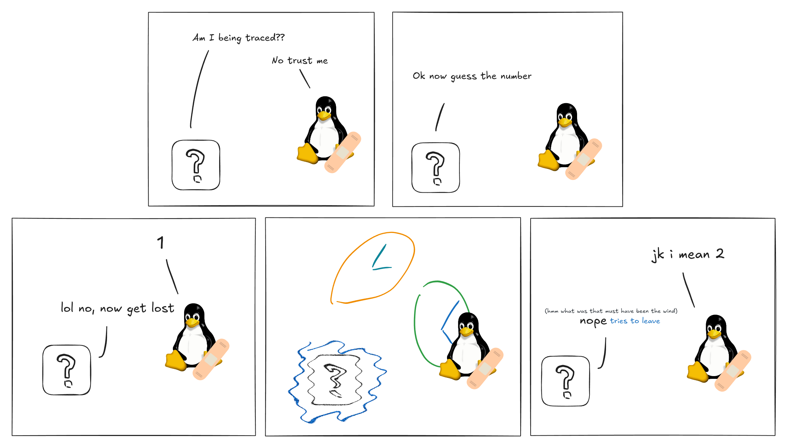
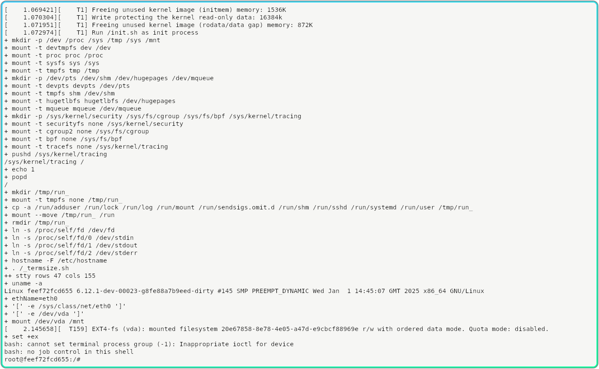

Truth be told, I've never been really good at CTFs, but I do enjoy solving challenges at my own pace, and exploring perhaps less conventional methods, learning more about programming in the process. A few weeks ago I found a reverse engineering problem which basically boiled down to running a Linux binary and entering the correct number to get it to print a flag. The program was heavily obfuscated, has anti-debugging techniques, and potentially utilized self-modifying code, but `strace` shows that, aside from those, it did not try to do anything fancy with system calls, attempt to save files, or communicate via network.

Fortunately, the _interesting_ bits of the program ran quite fast &ndash; after reading the input, it spends around 5us (0.005ms) before printing out whether the guess was correct or not. The input space was also very managable &ndash; between 0 to 3,000,000. This means that even a brute-force search of the possible inputs could finish in a reasonable time, and there is no need to expend much effort on actual reverse engineering if we don't have to. The only tricky part is, how do we convince it to try different inputs as fast as this?

After considering some alternatives, my approach for solving this eventually ended up being a self-taught lesson in kernel hacking.

<div class="make-toc"></div>

## Environment

Before we get into more investigation, let's quickly explain what my test environment for this looks like. Since I'm not a fan of running random binaries from the Internet on my host system, we will only ever run the target binary in a VM. In fact, since there will be a good amount of kernel hacking today, we need a VM for which which we can easily boot our hacked kernel in. Previously I made some shell scripts which comes in handy. It:

- Allows me to easily run a QEMU VM with any kernel changes I want by directly booting from a compiled vmlinux.
- Hooks up a serial console and 9pfs root (mapped to a separate file system on the host) for convenience.
- Uses a relatively minimal kernel configuration and lightweight startup script &mdash; VM boots up in 2 seconds.
- Builds the rootfs with Docker, pre-installing things like `strace`, `gdb`, `trace-cmd`, etc.

Once you've checked that you have Docker and QEMU installed, you can get started with the same environment by cloning [micromaomao/linux-dev](https://github.com/micromaomao/linux-dev), running `make -j$(nproc)` to compile the kernel, then `.dev/startvm.sh` to build the rootfs (if not already present) and start the VM (your user account might need to be in the `kvm` group). If you are on ARM, remove the `-enable-kvm` and `-cpu host` flag in startvm.sh to use emulation instead.



## Initial investigation

A straightforward, first approach would be to just run it repeatedly. However, with such a short runtime between getting the input and printing the result, any significant overhead in either the initialization of the executable itself, or the time spent in the script used to repeatedly run it quickly starts to dominate. A quick test would be to run it under `strace` and see how long it takes from the initial `execve` to the first `read`. That would be a good starting point to understand more about the program and catch any potentially surprising behavior, so let's do that first.

<p class="warn">
  Quick reminder again that you should not run or even interact with untrusted stuff directly on your host system. This include running them under <code>strace</code>, <code>gdb</code>, or even using <code>ldd</code> on them.
</p>

<style>
  .irrelevant {
    color: #aaa;
  }
  .comment {
    color: rgb(58, 113, 231);
    font-weight: bold;
  }
  .green {
    color: rgb(33, 138, 24);
  }
  .placeholder {
    color: rgb(33, 138, 24);
    font-style: italic;
  }
  .highlight {
    background-color: rgb(189, 253, 183);
    font-weight: bold;
  }
  .red-highlight {
    color: #dd0000;
    font-weight: bold;
  }
</style>

<pre>
<span class="irrelevant">$ strace -o strace.log --timestamps=ns ./hackme
...
$ cat strace.log</span>
21:00:00.076244725 execve("./hackme", ["./hackme"], 0x7ffc71a76088 /* 13 vars */) = 0
21:00:00.082059770 open("/proc/self/exe", O_RDONLY) = 3
21:00:00.085364610 mmap(NULL, 663446, PROT_READ|PROT_WRITE, MAP_PRIVATE|MAP_ANONYMOUS, -1, 0) = 0x7f7865402000
<span class="comment">// mapping itself as (non-persistent) read-write</span>
21:00:00.087883357 mmap(0x7f7865402000, 663048, PROT_READ|PROT_WRITE, MAP_PRIVATE|MAP_FIXED, 3, 0) = 0x7f7865402000
21:00:00.090062941 mprotect(0x7f78654a3000, 3990, PROT_READ|PROT_EXEC) = 0
21:00:00.092506797 readlink("/proc/self/exe", "/hackme", 4095) = 7
21:00:00.095318319 mmap(0x400000, 1855488, PROT_NONE, MAP_PRIVATE|MAP_FIXED|MAP_ANONYMOUS, -1, 0) = 0x400000
21:00:00.097642653 mmap(0x400000, 1536, PROT_READ|PROT_WRITE, MAP_PRIVATE|MAP_FIXED|MAP_ANONYMOUS, -1, 0) = 0x400000
21:00:00.099838908 mprotect(0x400000, 1536, PROT_READ) = 0
<span class="comment">// rwx... I later realized this executable has gone through a packer</span>
21:00:00.102363996 mmap(0x401000, 1420157, PROT_READ|PROT_WRITE|PROT_EXEC, MAP_PRIVATE|MAP_FIXED|MAP_ANONYMOUS, -1, 0x1000) = 0x401000
<span class="comment">// ... more stuff follows which aren't too interesting for now ...</span>
<span class="irrelevant">21:00:00.129039501 mprotect(0x401000, 1420157, PROT_READ|PROT_EXEC) = 0
21:00:00.132023341 mmap(0x55c000, 346488, PROT_READ|PROT_WRITE, MAP_PRIVATE|MAP_FIXED|MAP_ANONYMOUS, -1, 0x15c000) = 0x55c000
21:00:00.138600815 mprotect(0x55c000, 346488, PROT_READ) = 0
21:00:00.141142324 mmap(0x5b1000, 49832, PROT_READ|PROT_WRITE, MAP_PRIVATE|MAP_FIXED|MAP_ANONYMOUS, -1, 0x1b1000) = 0x5b1000
21:00:00.143710481 mprotect(0x5b1000, 49832, PROT_READ|PROT_WRITE) = 0
21:00:00.145928557 mmap(0x5be000, 27880, PROT_READ|PROT_WRITE, MAP_PRIVATE|MAP_FIXED|MAP_ANONYMOUS, -1, 0) = 0x5be000
21:00:00.148246519 mmap(NULL, 4096, PROT_READ, MAP_PRIVATE, 3, 0) = 0x7f7865401000
21:00:00.150516772 close(3)             = 0
21:00:00.153247606 munmap(0x7f7865402000, 663446) = 0
21:00:00.155881587 arch_prctl(0x3001 /* ARCH_??? */, 0x7ffce824f170) = -1 EINVAL (Invalid argument)
21:00:00.158451970 brk(NULL)            = 0x5c5000
21:00:00.160858466 brk(0x5c5d80)        = 0x5c5d80
21:00:00.163373055 arch_prctl(ARCH_SET_FS, 0x5c5400) = 0
21:00:00.165862687 set_tid_address(0x5c56d0) = 184
21:00:00.168069772 set_robust_list(0x5c56e0, 24) = 0
21:00:00.170348551 rseq(0x5c5d20, 0x20, 0, 0x53053053) = 0
21:00:00.172586062 prlimit64(0, RLIMIT_STACK, NULL, {rlim_cur=8192*1024, rlim_max=RLIM64_INFINITY}) = 0
21:00:00.174898664 readlinkat(AT_FDCWD, "/proc/self/exe", "/hackme", 4096) = 7
21:00:00.177229490 getrandom("\xb8\xaa\xbf\x47\x80\xa4\x0a\x0e", 8, GRND_NONBLOCK) = 8
21:00:00.179682734 brk(NULL)            = 0x5c5d80
21:00:00.181862768 brk(0x5e6d80)        = 0x5e6d80
21:00:00.183994583 brk(0x5e7000)        = 0x5e7000
21:00:00.186285765 mprotect(0x5b1000, 40960, PROT_READ) = 0
21:00:00.188569383 futex(0x5bd9dc, FUTEX_WAKE_PRIVATE, 2147483647) = 0</span>
<span class="comment">// Detecting debugger by looking for TracerPid?</span>
21:00:00.190868059 openat(AT_FDCWD, "/proc/self/status", O_RDONLY) = 3
21:00:00.193172756 read(3, "Name:\thackme\nUmask:\t0022\nState:\t"..., 8191) = 1076
<span class="comment">// ... more strace output ...</span>
</pre>

I suspect it is detecting debuggers and potentially changing its behavior. After writing this I later found out that actually it will pretend to run as normal even when it has detected a tracer, but actually will not print the flag even with the right input. For now, I found the code that puts that number in `/proc/self/status` by simply searching for &ldquo;TracerPid&rdquo;:

<a class="make-diff" href="./diffs/0001-hide-TracerPid.patch"></a>

With the linux-dev environment I mentioned earlier, we can simply make the change, then run `make -j16` (assuming your PC has 16 CPU threads) to produce a new kernel image, then kill the old VM (with Ctrl-D on the console or `.dev/stopvm.sh` if it's stuck) and run `startvm.sh` again.

<p class="info">
  You can apply the change above by copying the entire patch, then do <code>git apply</code>, paste it in, and hit Ctrl-D.
</p>

It then proceeded to do this, which I assume is a second layer of debugger detection:

```
ptrace(PTRACE_TRACEME) = -1 EPERM (Operation not permitted)
```

It is probably looking for whether this call returns a `-EPERM`, which would indicate that the process is (already) being traced. But since we're already making kernel changes, this is not difficult to work around either. We can find the relevant function by searching for `PTRACE_TRACEME`, which will quickly surface the function `ptrace_traceme`:

<a class="make-diff" href="./diffs/0002-ptrace_traceme-return-0.patch"></a>

<p class="info">
  Quick note: instead of making such changes to the kernel, there are alternative to <code>strace</code> which relies on seccomp-unotify instead of ptrace, which also gets around anti-debugging techniques that targets ptrace, and may be more convenient to use in other situations.
</p>

Now let's try `strace` it again:

<pre>
<span class="irrelevant">$ strace -o strace.log --timestamps=ns ./hackme
...
$ cat strace.log
21:01:00.368065520 execve("./hackme", ["./hackme"], 0x7ffe48cd5cb8 /* 6 vars */) = 0
...</span>
21:01:00.486692889 openat(AT_FDCWD, "/proc/self/status", O_RDONLY) = 3
21:01:00.489438989 read(3, "Name:\thackme\nUmask:\t0022\nState:\t"..., 8191) = 1066
21:01:00.491976961 close(3)             = 0
21:01:00.494425997 getrandom("\x75\x79\x93\x7f\x58\x99\xe3\x3e", 8, 0) = 8
21:01:00.496887787 getrandom("\x21\x5f\xfa\x83\x6c\x93\xef\x97", 8, 0) = 8
<span class="green">21:01:00.499471244 ptrace(PTRACE_TRACEME) = 0   <b>// yay</b></span>
21:01:00.501847234 getrandom("\x32\x5b\x46\xf2\x18\x84\xee\x3e", 8, 0) = 8
<span class="irrelevant">// ... more getrandom ...</span>
21:01:00.530190685 getrandom("\x25\x69\xff\xa5\x61\x13\x9d\x82", 8, 0) = 8
<span class="comment">// Detecting if stdin/stdout is a terminal before read/write...
// Could be using this to decide if it will buffer IO, or actual anti-scripting measure?</span>
21:01:00.532301961 newfstatat(1, "", {st_mode=S_IFCHR|0600, st_rdev=makedev(0x5, 0x1), ...}, AT_EMPTY_PATH) = 0
21:01:00.535515472 ioctl(1, TCGETS, {c_iflag=ICRNL|IXON, c_oflag=NL0|CR0|TAB0|BS0|VT0|FF0|OPOST|ONLCR, c_cflag=B115200|CS8|CREAD|HUPCL|CLOCAL, c_lflag=ISIG|ICANON|ECHO|ECHOE|ECHOK|IEXTEN|ECHOCTL|ECHOKE, ...}) = 0
21:01:00.539257429 write(1, <span class="irrelevant" style="font-style: italic;">startup output...</span>, 48) = 48
<span class="irrelevant">// ...</span>
21:01:00.544755153 newfstatat(0, "", {st_mode=S_IFCHR|0600, st_rdev=makedev(0x5, 0x1), ...}, AT_EMPTY_PATH) = 0
21:01:00.547057135 ioctl(0, TCGETS, {c_iflag=ICRNL|IXON, c_oflag=NL0|CR0|TAB0|BS0|VT0|FF0|OPOST|ONLCR, c_cflag=B115200|CS8|CREAD|HUPCL|CLOCAL, c_lflag=ISIG|ICANON|ECHO|ECHOE|ECHOK|IEXTEN|ECHOCTL|ECHOKE, ...}) = 0
21:01:00.549331495 read(0, "1\n", 4096) = 2
<span class="green"><b>// Note slight pause here due to input from serial terminal.</b></span>
21:01:00.551503575 write(1, "Nope"..., 43) = 43
21:01:00.554241515 exit_group(0)        = ?
21:01:00.556739011 +++ exited with 0 +++
</pre>

If we use the kernel tracing tool `trace-cmd` (which interacts with [ftrace](https://docs.kernel.org/6.12/trace/ftrace.html) and related APIs designed for both kernel debugging and performance tracing), we can find out how long the program spends computing the result after reading the input, not including time spent in the actual I/O, and also without any `strace` overhead (which was actually quite significant when you're looking at sub-ms level).

To do this, we can trace the `syscalls` family of events. We're specifically interested in `read` and `write`, and each syscall has two events we can trace: `sys_enter_...` and `sys_exit_...`. We specify these events with `-e`, and `-F -c` to only trace events from children processes.

```sh
trace-cmd record -e 'syscalls/sys_*_read'  -e 'syscalls/sys_*_write' -F -c ./hackme
trace-cmd report
```

<pre>
<span class="irrelevant">cpus=2
          hackme-82    [000] .....     4.364735: sys_exit_write:       0x1
          hackme-82    [000] .....     4.431209: sys_enter_read:       fd: 0x00000003, buf: 0x005c6920, count: 0x00001fff
          hackme-82    [000] .....     4.431220: sys_exit_read:        0x42c
          hackme-82    [000] .....     4.431236: sys_enter_write:      fd: 0x00000001, buf: 0x005c6920, count: 0x00000030
          hackme-82    [000] .....     4.431243: sys_exit_write:       0x30
          hackme-82    [000] .....     4.431244: sys_enter_write:      fd: 0x00000001, buf: 0x005c6920, count: 0x00000026
          hackme-82    [000] .....     4.431244: sys_exit_write:       0x26</span>
          hackme-82    [000] .....     4.431246: sys_enter_read:       fd: 0x00000000, buf: 0x005c8960, count: 0x00001000
          hackme-82    [001] .....     <span class="highlight">5.737281</span>: sys_exit_read:        0x2
          hackme-82    [001] .....     <span class="highlight">5.737292</span>: sys_enter_write:      fd: 0x00000001, buf: 0x005c6920, count: 0x0000002b
<span class="irrelevant">          hackme-82    [001] .....     5.738621: sys_exit_write:       0x2b</span>
</pre>

We can ignore everything that is not reading from stdin (fd = 0) or writing to stdout (fd = 1) after that. Subtracting the two green numbers, that's 11us from returning from `read` to attempting `write`! On the other hand, getting to the first `read` from the start of the program took almost 200ms, and so if we have to run the whole thing repeatedly (for example, in a bash loop), it will be 200ms <tex>\times</tex> 3,000,000 <tex>\approx</tex> 7 days! Now, you can of course use more CPU cores and run multiple instances of this loop at once, but that's not a very interesting solution. In this case the challenge is also time-sensitive and so we need something better.

<style>
  img.emoji {
    width: 1.2em;
    vertical-align: -5px;
  }
</style>

Notice that the program doesn't really try to do anything fancy (at least not externally visible) between `read` and `write` &ndash; all it does is spin some numbers around in its own memory, then spits out &lsquo;Correct&rsquo; plus the flag, or &lsquo;Nope&rsquo; if the guess was wrong. This means that, in theory, if we can perfectly restore the program's memory and register states<footnote>
Technically there's not all of the state a program could rely on or change, even without issuing any syscalls. For example, it can use the raw `rdtsc` assembly instruction to measure the current time, and deduce if it's being tricked. But in this case restoring registers and memory alone works well enough.
</footnote>, we can instantly start trying a different input, then another one in 10us (when I ran it fast enough often it finishes within 5), and so on until we find the right number. Without the overhead of even forking another process, this has the potential to be a lot faster &ndash; we're basically turning the whole input validation process into a `for` loop! It's just that the &lsquo;`for`&rsquo; in this case is outside the program. 

## What if we get the kernel to try numbers for us?

Recently I have also been getting very interested in Linux kernel development (from debugging weird kernel panics at work ), so I decided why not turn this into a kernel programming exercise, and try to get Linux to automatically try all the possible inputs for me, and restore the program state in between inputs, as suggested earlier?

The core idea is:

1. We can identify the process we're interested in from its name (&ldquo;`hackme`&rdquo;).
2. When a target process attempts to `read` from stdin, we: \
    a) Save off its register states; \
    b) Write-protect all its memory pages; \
    c) Inject the next input into the read buffer.
3. When a write protection fault happens on our target process, we: \
    a) check if it is one of the mapping we've previously write-protected; \
    b) if so, we save off an &lsquo;original&rsquo; copy of the page being written to, and allow the write to continue.
4. When the target process attempts a `write` to stdout, we: \
    a) Check if the output indicate a wrong guess (whether it contains the word &ldquo;Nope!&rdquo;); \
    b) If the output contains Nope, restore all modified memory pages to their original content, restore register states, and re-run the `read` syscall, which will cause the next input to be injected; \
    c) Otherwise, we just let the process continue. If it prints the flag out, we will see it in the console.

Now, this might seem like massive overkill, and it probably is, but hear me out:

- This is basically as fast as we can hope to get without non-trivial amount of careful reverse engineering.<footnote>
Insert _girl will literally invent new kernel feature instead of doing actual reverse engineering_ joke here</footnote>
Compared to alternative, user-space approach with ptrace (which I will explore at the end of this article), we avoid any overhead from ptrace-ing &ndash; there is no context switching or waiting between processes, and we can truly run the brute-force loop at the fastest possible speed.<footnote>
Ok, technically there is another way that can be basically as fast, and which doesn't involve kernel modifications. You can instead use `SECCOMP_RET_TRAP` with a seccomp bpf filter to have the kernel turn the syscall you're interested into a `SIGSYS`, and inject code into the program to handle this signal. This gives you the functionality of a ptrace-based syscall interceptor (your injected code can save/restore registers via the `ucontext` reference, and of course memory too) without the cost of ptrace. But this is arguably getting into wilder territory than some not-too-complex kernel modifications. There are real world projects which does this for a very good reason &ndash; sandboxing. See [gVisor Systrap](https://gvisor.dev/blog/2023/04/28/systrap-release/) for more detail.
</footnote> From my testing, when the input-checking code is ran in a tight loop this way, it is even faster and often takes aound 5us. 5us <tex>\times</tex> 3,000,000 is _15 seconds_.
- While correctly write-protecting the memory pages, saving them off on write fault, and restoring them might sound tricky, with the way Linux manages writable pages it is actually surprisingly straightforward. This is because even for a writable mapping, pages starts off write-protected, and the kernel only makes them actually writable on the first write attempt. This means that there are very natural places we can add our code to, and we don't even have to actually change any permissions, etc.
- Hacking the kernel is fun, at least to me , and I learn a lot this way. In the future if I have a similar problem but a lot larger input space, what we did here might prove to be useful again.

I will now walk through each step one by one, as laid out above. If you as the reader don't have a lot of kernel experience (I certainly don't), hopefully by going like this, this will not be too difficult to follow:

### Identify and mark the target process

The first step (step 1) is to identity and mark the process we're interested in. In Linux, each thread is represented by a [`struct task_struct`](https://github.com/micromaomao/linux-dev/blob/ick/include/linux/sched.h#L778), which contains things like the PID, process name, memory mappings, and a thousand other things. We can of course add our own data to this struct &ndash; for example, we can have a `bool` to indicate whether a process<footnote>
Technically, anything stored in the `task_struct` is per-thread, but in this case our target only has one thread, and so saying &lsquo;process&rsquo; is correct here. Plus, even if it has multiple threads, our marking would be copied to the other threads when it tries to `clone`.
</footnote> is our hack target, and use it to decide if we should do special things in our modified `read`/`write` syscall handlers (we don't want to break unrelated processes like the shell, for example).

You probably know that when you run an executable, the shell forks a subprocess then run `exec` with the command arguments. If we assume our target binary is always named &ldquo;`hackme`&rdquo;, we can check for this in the handler for `exec`, and set the `bool` we added previously to `true`.

With some searching around and perhaps tracing function calls with `trace-cmd` (which juse uses [ftrace](https://docs.kernel.org/6.12/trace/ftrace.html)), we find that there is a common function for `execve` and `execveat` &ndash; [`do_execveat_common`](https://github.com/micromaomao/linux-dev/blob/ick/fs/exec.c#L1876), and so we can add our code there, and add the additional field to the `task_struct`:

<a class="make-diff" href="./diffs/0003-set-hack_target.patch"></a>

Note that `current` is just a macro for a pointer to the current thread's `task_struct`, and `pr_info` prints to the syslog which in our case appears on the console.

We also added the correct initialization of `.hack_target` for unrelated threads to `init_task`, which is what every other processes are forked from. When a process `fork`s or `clone`s, the entire task struct is first `memcpy`'d across (see [`arch_dup_task_struct` (arch/x86/kernel/process.c)](https://github.com/micromaomao/linux-dev/blob/ick/arch/x86/kernel/process.c#L93)), and so there's no other place we need to initialize this (except for in `execve` when we detected a hack target).

Let's test this out:

<pre>
<span class="irrelevant">&gt; make -j$(nproc)
...
&gt; ./.dev/startvm.sh
...
[    0.000000][    T0] Linux version 6.12.1-dev-00019-gc33353343963-dirty ...
...</span>
root@feef72fcd655:/# ./hackme
<span class="highlight">[    5.050260][   T79] execveat: ./hackme[79] to be hacked</span>
<span class="placeholder">(program prints startup message normally)</span>
root@feef72fcd655:/# cp hackme dont-hack-me
root@feef72fcd655:/# ./dont-hack-me
<span class="placeholder">(program prints startup message normally)</span>
root@feef72fcd655:/#
</pre>

Nice :)

### Some ground work for our new &lsquo;feature&rsquo;

Our next step (step 2) is to figure out a way to save off the state of the target process when it calls `read` &ndash; in some sense, &lsquo;checkpoint&rsquo; it, and then inject our number guess. I'm going to give my special kernel feature that does this a slick name: _ick_, which stands for Instant ChecKpoint. We will create some utility functions which we can call in our patched `read`/`write` to checkpoint and restore the process, as well as a way to clean up the saved state should the process exits unexpectedly. Let's start by creating our header and C file for this feature, adding a basic `struct ick_checked_process*` pointer in `task_struct` for us to hold various data (like the saved off memory pages) later, and declare our functions.

While this is not really necessary, let's also add a proper config option for our silly little feature &ndash; it's not difficult to do, and follows the rest of Linux. We will then gate all ick-related code within `#ifdef CONFIG_ICK` blocks.

<a class="make-diff" href="./diffs/0004-basic-files-for-ick.patch"></a>

<p class="info">
  In case you didn't know, the proper way to have a function without parameters in C is to use <code>void</code> in the parameter list, like <code>void myfunc(void)</code>.
</p>

### Patching `read`, inject our guess

Next, we can finish off the relatively easier part of step 2 &ndash; handling `read`, calling the checkpoint function, and injecting our next guess. Again, we can use `ftrace` to figure out the best function to change. There are more &lsquo;complicated&rsquo; variant of the `read` syscall that takes a `struct iovec`, but that's not what our target binary uses, so we won't worry about that.

<a class="make-diff" href="./diffs/0005-read-calls-checkpoint-and-inject-guess.patch"></a>

While we can use `strace` to see whether we're sending back the right thing to the user-space, for ease of debugging we can write our own test binary which prints out the number received, and also, for now, loops back itself, so that we can see if the guess increments correctly: [my-hackme-looped.cpp](./my-hackme-looped.cpp)

<pre>
<span class="irrelevant">make; ./dev/startvm.sh</span>
root@feef72fcd655:/# ./my-hackme-looped | head
[   34.542186][   T83] execveat: ./my-hackme-looped[83] to be hacked
Enter number: Nope! 1 was a wrong guess. The correct number is 574165.
Enter number: Nope! 2 was a wrong guess. The correct number is 574165.
Enter number: Nope! 3 was a wrong guess. The correct number is 574165.
Enter number: Nope! 4 was a wrong guess. The correct number is 574165.
Enter number: Nope! 5 was a wrong guess. The correct number is 574165.
Enter number: Nope! 6 was a wrong guess. The correct number is 574165.
Enter number: Nope! 7 was a wrong guess. The correct number is 574165.
Enter number: Nope! 8 was a wrong guess. The correct number is 574165.
Enter number: Nope! 9 was a wrong guess. The correct number is 574165.
Enter number: Nope! 10 was a wrong guess. The correct number is 574165.
root@feef72fcd655:/# ./my-hackme-looped | tail
[   36.012463][   T85] execveat: ./my-hackme-looped[85] to be hacked
Enter number: Nope! 494491 was a wrong guess. The correct number is 494500.
Enter number: Nope! 494492 was a wrong guess. The correct number is 494500.
Enter number: Nope! 494493 was a wrong guess. The correct number is 494500.
Enter number: Nope! 494494 was a wrong guess. The correct number is 494500.
Enter number: Nope! 494495 was a wrong guess. The correct number is 494500.
Enter number: Nope! 494496 was a wrong guess. The correct number is 494500.
Enter number: Nope! 494497 was a wrong guess. The correct number is 494500.
Enter number: Nope! 494498 was a wrong guess. The correct number is 494500.
Enter number: Nope! 494499 was a wrong guess. The correct number is 494500.
Enter number: Correct!
<span class="irrelevant">root@feef72fcd655:/#</span>
</pre>

Great success! Note that at this point we haven't even touched `write` yet &ndash; this is only looping because our test program has a deliberate loop inside, but we will eventually not need that once we implement the checkpointing.

Also note that for very frequent output, I have used `trace_printk` which doesn't print to the console, but can be seen in the kernel trace. As opposed to `pr_info`/`printk`, this is just writing to a ringbuffer in memory, and so is also much faster and more appropriate to use in tight loops.

```txt
root@feef72fcd655:/# tail /sys/kernel/tracing/trace
 my-hackme-loope-90      [001] .....   447.571690: ksys_read: ick checkpoint on hacked process my-hackme-loope[90]
 my-hackme-loope-90      [001] .....   447.571690: ksys_read: Providing number 27 to hacked process my-hackme-loope[90]
 my-hackme-loope-90      [001] .....   447.571691: ksys_read: ick checkpoint on hacked process my-hackme-loope[90]
 my-hackme-loope-90      [001] .....   447.571691: ksys_read: Providing number 28 to hacked process my-hackme-loope[90]
 ...                     ...           ...         ...
```

### Patching `write` to call our revert function

Let's also do the same for `write` &ndash; we will get the print output from user-space, and depending on whether we see a &ldquo;`Nope`&rdquo; we will either restore checkpoint, or let the process continue (handling the `write` as normal).

<a class="make-diff" href="./diffs/0006-write-checks-result-and-revert-if-wrong.patch"></a>

Since we haven't implemented checkpoint restore yet, the overall behaviour currently will not change. However, since we're effectively &lsquo;consuming&rsquo; any output with &ldquo;`Nope!`&rdquo; (by not returning from `ksys_write` instead of letting it continue), we should not see them in the console, but we should still see our `trace_printk` printing them out:

<pre>
root@feef72fcd655:/# ./my-hackme-looped
[    7.461863][   T84] execveat: ./my-hackme-looped[84] to be hacked
[    7.487957][   T84] hack: 0 gave different output
Enter number: [    7.492040][   T84] hack: 1 gave different output
Enter number: [    7.493428][   T84] hack: 2 gave different output
Correct!
root@feef72fcd655:/# cat /sys/kernel/tracing/trace
<span class="irrelevant"># tracer: nop
 ...                     ...             ...       ...
 my-hackme-loope-84      [000] d....     7.461871: console: execveat: ./my-hackme-looped[84] to be hacked</span>
 my-hackme-loope-84      [000] .....     7.487955: ksys_write: hacked process attempted write with data Enter number:
 my-hackme-loope-84      [000] d....     7.487961: console: hack: 0 gave different output
 my-hackme-loope-84      [000] .....     7.490135: ksys_read: ick checkpoint on hacked process my-hackme-loope[84]
 my-hackme-loope-84      [000] .....     7.490136: ksys_read: Providing number 1 to hacked process my-hackme-loope[84]
 my-hackme-loope-84      [000] .....     7.492037: ksys_write: hacked process attempted write with data Nope! 1 was a wrong guess. The correct number is 2.

 my-hackme-loope-84      [000] .....     7.492039: ksys_write: hacked process attempted write with data Enter number:
 my-hackme-loope-84      [000] d....     7.492042: console: hack: 1 gave different output
 my-hackme-loope-84      [000] .....     7.493423: ksys_read: ick checkpoint on hacked process my-hackme-loope[84]
 my-hackme-loope-84      [000] .....     7.493424: ksys_read: Providing number 2 to hacked process my-hackme-loope[84]
 my-hackme-loope-84      [000] .....     7.493427: ksys_write: hacked process attempted write with data Correct!

 my-hackme-loope-84      [000] d....     7.493430: console: hack: 2 gave different output
</pre>

<p class="info">
  You do not need <code>trace-cmd</code> nor even enabling tracing in tracefs to see <code>trace_printk</code> outputs.
</p>

Note that the &ldquo;\_ gave different output&rdquo; prints are because the program was writing &ldquo;`Enter number: `&rdquo; every loop iteration, which doesn't contain &ldquo;`Nope!`&rdquo;. Once our checkpoint restore is working, the program should end up back to when it first issues the `read`, which means that any prompt to enter number would no longer be printed again.

### Save and restore registers

If you had a look at [`struct task_struct`](https://github.com/micromaomao/linux-dev/blob/ick/include/linux/sched.h#L778) and concluded that there is nothing in there that looks like it stores the thread's registers, you're correct. So, what are we supposed to save/restore?

In Linux, each thread has a _kernel_ stack which is used when it is executing kernel code (for example, when it is handling a syscall). This is separate from the user-space stack, and in fact lives in kernel memory not accessible from user-space. When a thread is running user-space code, it is empty. Whenever the thread enters the kernel, for example due to a syscall (or other reasons like interrupts), kernel entry code ([arch/x86/entry/entry_64.S](https://github.com/micromaomao/linux-dev/blob/ick/arch/x86/entry/entry_64.S)) pushes all the (general-purpose) registers from user-space onto this stack before calling into any C functions, which will start messing up the registers (especially the caller-saved ones, since the compiler isn't required to restore them at the end of a function):

<style>
  .code-comment { color: #888; }
</style>
<pre>
SYM_CODE_START(<b>entry_SYSCALL_64</b>)
    <span class="irrelevant">...</span>
    <b>PUSH_AND_CLEAR_REGS</b> rax=$-ENOSYS
    <span class="irrelevant">...</span>
    <b>call</b>    do_syscall_64        <span class="code-comment">/* returns with IRQs disabled */</span>
</pre>

<pre id="push_regs">
.macro <b>PUSH_REGS</b> rdx=%rdx rcx=%rcx rax=%rax save_ret=0 unwind_hint=1
    .if \save_ret
    <b>pushq</b>   %rsi            <span class="code-comment">/* pt_regs->si */</span>
    <b>movq</b>    8(%rsp), %rsi    <span class="code-comment">/* temporarily store the return address in %rsi */</span>
    <b>movq</b>    %rdi, 8(%rsp)    <span class="code-comment">/* pt_regs->di (overwriting original return address) */</span>
    .else
    <b>pushq</b>   %rdi        <span class="code-comment">/* pt_regs->di */</span>
    <b>pushq</b>   %rsi        <span class="code-comment">/* pt_regs->si */</span>
    .endif
    <b>pushq</b>   \rdx        <span class="code-comment">/* pt_regs->dx */</span>
    <b>pushq</b>   \rcx        <span class="code-comment">/* pt_regs->cx */</span>
    <b>pushq</b>   \rax        <span class="code-comment">/* pt_regs->ax */</span>
    <b>pushq</b>   %r8         <span class="code-comment">/* pt_regs->r8 */</span>
    <b>pushq</b>   %r9         <span class="code-comment">/* pt_regs->r9 */</span>
    <b>pushq</b>   %r10        <span class="code-comment">/* pt_regs->r10 */</span>
    <b>pushq</b>   %r11        <span class="code-comment">/* pt_regs->r11 */</span>
    <b>pushq</b>   %rbx        <span class="code-comment">/* pt_regs->rbx */</span>
    <b>pushq</b>   %rbp        <span class="code-comment">/* pt_regs->rbp */</span>
    <b>pushq</b>   %r12        <span class="code-comment">/* pt_regs->r12 */</span>
    <b>pushq</b>   %r13        <span class="code-comment">/* pt_regs->r13 */</span>
    <b>pushq</b>   %r14        <span class="code-comment">/* pt_regs->r14 */</span>
    <b>pushq</b>   %r15        <span class="code-comment">/* pt_regs->r15 */</span>

    .if \unwind_hint
    <b>UNWIND_HINT_REGS</b>
    .endif

    .if \save_ret
    <b>pushq</b>    %rsi        <span class="code-comment">/* return address on top of stack */</span>
    .endif
.endm

.macro <b>PUSH_AND_CLEAR_REGS</b> rdx=%rdx rcx=%rcx rax=%rax save_ret=0 clear_bp=1 unwind_hint=1
    <b>PUSH_REGS</b> rdx=\rdx, rcx=\rcx, rax=\rax, save_ret=\save_ret unwind_hint=\unwind_hint
    <b>CLEAR_REGS</b> clear_bp=\clear_bp
.endm
</pre>

The result of the register pushing code is that the top (i.e. &lsquo;outer-most&rsquo; frame) of the task stack effectively contains a [`struct pt_regs`](https://github.com/micromaomao/linux-dev/blob/ick/arch/x86/include/asm/ptrace.h#L103)<footnote>
I don't know why this is called `pt_regs` and defined in `ptrace.h` &ndash; most of its uses have nothing to do with ptrace at all.
</footnote> after this. On kernel exit, this is popped back into the actual registers before returning to user-space. Therefore, it's reasonable to think that if we save and restore this `struct pt_regs`, we can effectively save and restore the register states of the calling thread.

Assuming our hypothesis is correct, we can start implementing the register saving part of ick. Some searching around the kernel code would reveal that we can use the `current_pt_regs` macro to get a pointer to this struct for our current task. See for example [arch/x86/kernel/process.c:231](https://github.com/micromaomao/linux-dev/blob/ick/arch/x86/kernel/process.c#L231) (in `copy_thread`). This function is called when a thread calls `fork`, and it copies the `pt_regs` from the current task (the parent that called `fork`) to the new child task.

<a class="make-diff" href="./diffs/0007-save-and-restore-registers.patch"></a>

Let's try it out:

<pre>
root@c8c5a2904008:/# ./my-hackme-looped
[    4.294402][   T79] execveat: ./my-hackme-looped[79] to be hacked
[    4.323670][   T79] hack: 0 gave different output
Enter number: [    4.327423][   T79] my-hackme-loope[79]: segfault at 3a ip 000000000000003a sp 00007ffd0a4a49f0 error 14 likely on CPU 1 (core 1, socket 0)
[    4.329196][   T79] Code: Unable to access opcode bytes at 0x10.
</pre>

Hmm&hellip; The program crashed because it tried to jump to some nonsensical instruction address (0x0000003a). Now, remember that we haven't implemented memory restore yet, and &lsquo;memory&rsquo; includes the (user-space) stack as well. Consider what happens when you call a C function like `read`: the return address gets pushed to the stack, the function executes, and when it finishes the `ret` instruction pops that address from the stack and jumps to the caller. The caller may then call other functions, which will push and pop more data and return addresses from the stack, overwriting the previous one. Therefore, until we implements checkpoint/restore of memory, we will never be able to return to the original call side anyway, and it is perfectly possible that if the call stack for the `read` and `write` functions are at different depths, restoring the registers would result in the stack pointer pointing at garbage, rather than a valid return address.

We can confirm what's going on with `gdb`. First we tell it to stop on the first `read`, so that we can inspect the registers:

<pre>
root@c8c5a2904008:/# gdb my-hackme-looped
<span class="irrelevant">GNU gdb (Debian 13.1-3) 13.1
<i>...</i>
Reading symbols from my-hackme-looped...</span>
(gdb) catch syscall read
Catchpoint 1 (syscall &apos;read&apos; [0])
(gdb) condition 1 $rdi == 0
(gdb) r
Starting program: <font color="#4E9A06">/my-hackme-looped</font>
[   32.349018][   T94] execveat: /my-hackme-looped[94] to be hacked
[   32.393885][   T94] hack: 0 gave different output
Enter number:
Catchpoint 1 (call to syscall read), <font color="#3465A4">0x000000000053eed1</font> in <font color="#C4A000">read</font> ()
(gdb)
</pre>

The instruction `condition 1 $rdi == 0` makes the catchpoint only trigger on read from stdin ($rdi holds the first argument, and that is the file descriptor in the case of `read`/`write`). The catchpoint will trigger before the syscall is actually executed by the kernel (although because it uses ptrace to trap on syscalls, `$rip` will point to the instruction after the `syscall`, looking as-if the syscall has already executed).

<pre>(gdb) disas $rip
Dump of assembler code for function <font color="#C4A000">read</font>:
   <font color="#3465A4">0x000000000053eec0</font> &lt;+0&gt;:	<font color="#4E9A06">endbr64</font>
   <font color="#3465A4">0x000000000053eec4</font> &lt;+4&gt;:	<font color="#4E9A06">cmpb   </font><font color="#3465A4">$0x0</font>,<font color="#3465A4">0xa668d</font>(<font color="#CC0000">%rip</font>)<font color="#8D8F8A">        # 0x5e5558 &lt;__libc_single_threaded&gt;</font>
   <font color="#3465A4">0x000000000053eecb</font> &lt;+11&gt;:	<font color="#4E9A06">je     </font><font color="#3465A4">0x53eee0</font> &lt;<font color="#C4A000">read</font>+32&gt;
   <font color="#3465A4">0x000000000053eecd</font> &lt;+13&gt;:	<font color="#4E9A06">xor    </font><font color="#CC0000">%eax</font>,<font color="#CC0000">%eax</font>
   <font color="#3465A4">0x000000000053eecf</font> &lt;+15&gt;:	<font color="#4E9A06">syscall</font>
=&gt; <font color="#3465A4">0x000000000053eed1</font> &lt;+17&gt;:	<font color="#4E9A06">cmp    </font><font color="#3465A4">$0xfffffffffffff000</font>,<font color="#CC0000">%rax</font>
   <font color="#3465A4">0x000000000053eed7</font> &lt;+23&gt;:	<font color="#4E9A06">ja     </font><font color="#3465A4">0x53ef28</font> &lt;<font color="#C4A000">read</font>+104&gt;
   <font color="#3465A4">0x000000000053eed9</font> &lt;+25&gt;:	<font color="#4E9A06">ret</font>
   <font color="#3465A4">0x000000000053eeda</font> &lt;+26&gt;:	<font color="#4E9A06">nopw   </font><font color="#3465A4">0x0</font>(<font color="#CC0000">%rax</font>,<font color="#CC0000">%rax</font>,<font color="#3465A4">1</font>)
   <font color="#3465A4">0x000000000053eee0</font> &lt;+32&gt;:	<font color="#4E9A06">push   </font><font color="#CC0000">%rbp</font>
</pre>

Let's note down the registers:

<pre>(gdb) info reg
rax            0xffffffffffffffda  -38
rbx            0x5e4a00            6179328
rcx            0x53eed1            5500625
rdx            0x1000              4096
rsi            0x6038a0            6305952
rdi            0x0                 0
rbp            0x7fffffffd800      0x7fffffffd800
rsp            0x7fffffffd7c8      0x7fffffffd7c8
r8             0x0                 0
r9             0x4                 4
r10            0x405b0f            4217615
r11            0x246               582
r12            0x5e1e10            6168080
r13            0x5e1cc0            6167744
r14            0x5e4820            6178848
r15            0x5e1e10            6168080
rip            0x53eed1            0x53eed1 &lt;read+17&gt;
eflags         0x246               [ PF ZF IF ]
cs             0x33                51
ss             0x2b                43
ds             0x0                 0
es             0x0                 0
fs             0x0                 0
gs             0x0                 0
(gdb)
</pre>

Ok, let's allow the program to continue to `write`:

<pre>(gdb) catch syscall write
Catchpoint 2 (syscall &apos;write&apos; [1])
(gdb) c
Continuing.

Catchpoint 1 (returned from syscall read), <font color="#3465A4">0x000000000053eed1</font> in <font color="#C4A000">read</font> ()
(gdb) c
Continuing.

Catchpoint 2 (call to syscall write), <font color="#3465A4">0x000000000053ef74</font> in <font color="#C4A000">write</font> ()
(gdb)
</pre>

Let's see the registers again, before we enter the syscall:

<pre>(gdb) info reg
rax            0xffffffffffffffda  -38
rbx            0x3a                58
rcx            0x53ef74            5500788
rdx            0x3a                58
rsi            0x602890            6301840
rdi            0x1                 1
rbp            0x7fffffffd7b0      0x7fffffffd7b0
rsp            0x7fffffffd788      0x7fffffffd788
r8             0xcccccccccccccccd  -3689348814741910323
r9             0x7fffffffd7a0      140737488344992
r10            0x1                 1
r11            0x202               514
r12            0x3a                58
r13            0x602890            6301840
r14            0x5e4820            6178848
r15            0x5e1cc0            6167744
rip            0x53ef74            0x53ef74 &lt;write+20&gt;
eflags         0x202               [ IF ]
cs             0x33                51
ss             0x2b                43
ds             0x0                 0
es             0x0                 0
fs             0x0                 0
gs             0x0                 0
(gdb)
</pre>

Looks quite different from before! Now we let it continue, then we shall see the registers reverting to the state before the `read`:

<pre>(gdb) c
Continuing.

Catchpoint 1 (returned from syscall read), <font color="#3465A4">0x000000000053eed1</font> in <font color="#C4A000">read</font> ()
(gdb) info reg
rax            0x3a                58
rbx            0x5e4a00            6179328
rcx            0x53eed1            5500625
rdx            0x1000              4096
rsi            0x6038a0            6305952
rdi            0x0                 0
rbp            0x7fffffffd800      0x7fffffffd800
rsp            0x7fffffffd7c8      0x7fffffffd7c8
r8             0x0                 0
r9             0x4                 4
r10            0x405b0f            4217615
r11            0x246               582
r12            0x5e1e10            6168080
r13            0x5e1cc0            6167744
r14            0x5e4820            6178848
r15            0x5e1e10            6168080
rip            0x53eed1            0x53eed1 &lt;read+17&gt;
eflags         0x246               [ PF ZF IF ]
cs             0x33                51
ss             0x2b                43
ds             0x0                 0
es             0x0                 0
fs             0x0                 0
gs             0x0                 0
(gdb)
</pre>

Seems pretty successful - we've even confused `gdb` (it says &ldquo;returned from syscall read&rdquo;). Note that `rax` is the syscall return value, and therefore it is reasonable for it to be different before and after the syscall. Careful readers might have noticed something unusual here, but let's save that for later :)

We know that if we let it continue it will just crash, but let's see what happens anyway, just for fun. `ni` basically lets it run one more instruction, then stop it again:

<pre>(gdb) disas $rip
Dump of assembler code for function <font color="#C4A000">read</font>:
   <font color="#3465A4">0x000000000053eec0</font> &lt;+0&gt;:	<font color="#4E9A06">endbr64</font>
   <font color="#3465A4">0x000000000053eec4</font> &lt;+4&gt;:	<font color="#4E9A06">cmpb   </font><font color="#3465A4">$0x0</font>,<font color="#3465A4">0xa668d</font>(<font color="#CC0000">%rip</font>)<font color="#8D8F8A">        # 0x5e5558 &lt;__libc_single_threaded&gt;</font>
   <font color="#3465A4">0x000000000053eecb</font> &lt;+11&gt;:	<font color="#4E9A06">je     </font><font color="#3465A4">0x53eee0</font> &lt;<font color="#C4A000">read</font>+32&gt;
   <font color="#3465A4">0x000000000053eecd</font> &lt;+13&gt;:	<font color="#4E9A06">xor    </font><font color="#CC0000">%eax</font>,<font color="#CC0000">%eax</font>
   <font color="#3465A4">0x000000000053eecf</font> &lt;+15&gt;:	<font color="#4E9A06">syscall</font>
=&gt; <font color="#3465A4">0x000000000053eed1</font> &lt;+17&gt;:	<font color="#4E9A06">cmp    </font><font color="#3465A4">$0xfffffffffffff000</font>,<font color="#CC0000">%rax</font>
   <font color="#3465A4">0x000000000053eed7</font> &lt;+23&gt;:	<font color="#4E9A06">ja     </font><font color="#3465A4">0x53ef28</font> &lt;<font color="#C4A000">read</font>+104&gt;
   <font color="#3465A4">0x000000000053eed9</font> &lt;+25&gt;:	<font color="#4E9A06">ret</font>
   <i class="irrelevant">...</i>

(gdb) ni
<font color="#3465A4">0x000000000053eed7</font> in <font color="#C4A000">read</font> ()
(gdb)
<font color="#3465A4">0x000000000053eed9</font> in <font color="#C4A000">read</font> ()
(gdb)
<font color="#3465A4">0x000000000000003a</font> in <font color="#C4A000">??</font> ()
(gdb)
</pre>

Ok, that didn't take very long to break.

#### What about the other ones?

Now, some of you might have noticed the lack of the more &lsquo;unusual&rsquo; registers in the `PUSH_REGS` code [above](#push_regs) (or in [`struct pt_regs`](https://github.com/micromaomao/linux-dev/blob/ick/arch/x86/include/asm/ptrace.h#L103)), and if you're questioning whether just saving the general-purpose registers in `pt_regs` is enough, you're right. We have not saved any of xmm0-xmm31 (or their y/z extensions) which are used for floating point operations and various generations of SIMD, or the FS and GS segment registers [which can be set by user-space](https://docs.kernel.org/6.12/arch/x86/x86_64/fsgs.html) (most notably, libc uses them to point to start of thread-local storage, which obviously shouldn't change in the lifetime of a thread, but really they can be used in whatever ways by an obfuscated program).

However, in a sensible program linking to a &lsquo;normal&rsquo; libc, neither of these ought to matter. This is because, as noted earlier, the segment registers shouldn't normally change inside a thread, and the SIMD registers are caller-saved<footnote>
H.J. Lu, et al. (2024) [_System V Application Binary Interface AMD64 Architecture Processor Supplement (With LP64 and ILP32 Programming Models) Version 1.0_](https://gitlab.com/x86-psABIs/x86-64-ABI/-/jobs/artifacts/master/raw/x86-64-ABI/abi.pdf?job=build) &sect; 3.2.1<br>
Also see https://godbolt.org/z/oj3ej3e5z
</footnote>, which means that the compiler isn't supposed to rely on them suriving across a call to libc's `read()` or `write()` wrappers (although technically `syscall` is supposed to perserve those).

For performance reasons the kernel does not save these registers to memory on every kernel entry, but only when it is about to context-switch to another task.<footnote>
Although because the kernel itself also uses GS for per-CPU data, it does a [`swapgs`](https://wiki.osdev.org/SWAPGS) to stash off the user-space GS to some hidden machine-specific register.
</footnote> After all, the ?mm registers, on a new-enough CPU with AVX-512, totals to 512 bits <tex>\times</tex> 32 = 2 KiB (not counting the vector mask registers, etc). This makes our life harder if we want to save/restore those (which is technically the correct thing to do for a fully working save/restore), but since they are unlikely to break a &lsquo;reasonable&rsquo; program, we will leave them untouched for now.

<p class="info">
  Do you want to learn more about how Linux manages processes, does context switches, and similar low-level topics, or just learn more about the kernel in general? Check out these highly informative lecture notes: <a href="https://linux-kernel-labs.github.io/refs/heads/master/so2/index.html" target="_blank">Operating Systems 2</a> (maybe after you're done with this article ).
</p>

### Save and restore memory

Ok. now finally the exciting part! This part is going to be a bit more difficult if you aren't familiar with how &lsquo;memory paging&rsquo; or page faults work. There are two videos which I find quite informative:

- [CS 134 OS—5.7 Paging on x86](https://www.youtube.com/watch?v=dn55T2q63RU&t=11s) covers the page table structure itself. Note that in this video, the lecturer is talking about how this is on 32 bit, hence only 2 levels of indirections. On x86_64, there are 4 levels of paging, but the fundamental idea is the same.
- [CS 134 OS—7 Paging HW: Copy-On-Write Fork](https://www.youtube.com/watch?v=ViUwLytKzTY) is especially useful for our purpose. It shows how an OS can use write protected pages to implement _copy-on-write_ memory (used when forking a process).

However, don't be alarmed by this &ndash; understanding how page tables work helps, but we won't need to do any manual manipulation to these tables! Let's start by looking at how Linux manages a process's memory.

There are multiple ways we could go about this &ndash; one thing we can do is to follow what happens on a `fork`, and try to replicate that (but only the memory part). We can again use the [fork-test.c](fork-test.c) program for this.

Starting with a simple `trace-cmd record`, it gives us a bunch of garbage, probably because it's recording the executable initialization as well:
```
root@f8b9ed144f52:/# trace-cmd record -p function_graph --max-graph-depth 4 -F -c ./fork-test
  plugin 'function_graph'
I am the parent. Fork took 222414 ns to return
I am the child. It took 1151499 ns to fork
CPU0 data recorded at offset=0xbc000
    54349 bytes in size (294912 uncompressed)
root@f8b9ed144f52:/# trace-cmd report > a.log
root@f8b9ed144f52:/# less a.log
fork-test-92    [000]   153.874423: funcgraph_entry:        1.623 us   |  mutex_unlock();
       fork-test-92    [000]   153.874425: funcgraph_entry:                   |  __f_unlock_pos() {
       fork-test-92    [000]   153.874425: funcgraph_entry:        0.311 us   |    mutex_unlock();
       fork-test-92    [000]   153.874426: funcgraph_exit:         0.961 us   |  }
       fork-test-92    [000]   153.874426: funcgraph_entry:        0.391 us   |  fpregs_assert_state_consistent();
       fork-test-92    [000]   153.874429: funcgraph_entry:                   |  x64_sys_call() {
       fork-test-92    [000]   153.874430: funcgraph_entry:                   |    __x64_sys_execve() {
       fork-test-92    [000]   153.874430: funcgraph_entry:                   |      getname() {
       fork-test-92    [000]   153.874431: funcgraph_entry:        0.612 us   |        getname_flags();
       fork-test-92    [000]   153.874432: funcgraph_exit:         1.212 us   |      }
       fork-test-92    [000]   153.874432: funcgraph_entry:                   |      do_execveat_common.isra.0() {
       fork-test-92    [000]   153.874433: funcgraph_entry:                   |        alloc_bprm() {
          <idle>-0     [000]   153.874798: funcgraph_entry:        0.452 us   |  _raw_spin_lock_irqsave();
          <idle>-0     [000]   153.874798: funcgraph_entry:        0.100 us   |  _raw_spin_unlock_irqrestore();
          <idle>-0     [000]   153.874799: funcgraph_entry:        0.141 us   |  switch_mm_irqs_off();
       ...             ...     ...         ...                     ...           ...
       fork-test-92    [000]   153.878550: funcgraph_entry:                   |  handle_mm_fault() {
       fork-test-92    [000]   153.878550: funcgraph_entry:                   |    __handle_mm_fault() {
       fork-test-92    [000]   153.878550: funcgraph_entry:                   |      pte_offset_map_nolock() {
       fork-test-92    [000]   153.878551: funcgraph_entry:        0.140 us   |        __pte_offset_map();
       fork-test-92    [000]   153.878551: funcgraph_exit:         0.351 us   |      }
       fork-test-92    [000]   153.878551: funcgraph_entry:        0.110 us   |      __rcu_read_unlock();
       fork-test-92    [000]   153.878551: funcgraph_entry:        0.100 us   |      __rcu_read_lock();
       fork-test-92    [000]   153.878551: funcgraph_entry:                   |      filemap_map_pages() {
       fork-test-92    [000]   153.878552: funcgraph_entry:        0.109 us   |        __rcu_read_lock();
       fork-test-92    [000]   153.878552: funcgraph_entry:        0.431 us   |        next_uptodate_folio();
       fork-test-92    [000]   153.878552: funcgraph_entry:        0.230 us   |        __pte_offset_map_lock();
...
```

Thankfully, there is a useful flag for us for exactly this situation:

```
-g function-name
    This option is for the function_graph plugin. It will graph the given function. That is, it will only trace the function and all functions that it calls. You can have more than one -g on the command
    line.
```

You can search through the list of available functions by looking at `available_filter_functions` under tracefs:

<pre>
root@f8b9ed144f52:/# cat /sys/kernel/tracing/available_filter_functions | grep fork
ret_from_fork
<span class="highlight">__do_sys_fork</span>
__do_sys_vfork
tsk_fork_get_node
fork_usermode_driver
</pre>

Let's try `__do_sys_fork`:

```
root@f8b9ed144f52:/# trace-cmd record -p function_graph --max-graph-depth 4 -g __do_sys_fork -F -c ./fork-test
  plugin 'function_graph'
I am the parent. Fork took 174195 ns to return
I am the child. It took 1053852 ns to fork
CPU0 data recorded at offset=0xbc000
    1619 bytes in size (8192 uncompressed)
root@f8b9ed144f52:/# trace-cmd report
cpus=1
       fork-test-107   [000]   766.823819: funcgraph_entry:                   |  __do_sys_fork() {
       fork-test-107   [000]   766.823820: funcgraph_entry:                   |    kernel_clone() {
       fork-test-107   [000]   766.823820: funcgraph_entry:                   |      copy_process() {
       fork-test-107   [000]   766.823820: funcgraph_entry:        0.361 us   |        _raw_spin_lock_irq();
       fork-test-107   [000]   766.823821: funcgraph_entry:        0.181 us   |        recalc_sigpending();
       fork-test-107   [000]   766.823821: funcgraph_entry:        0.100 us   |        _raw_spin_unlock_irq();
       fork-test-107   [000]   766.823822: funcgraph_entry:        0.120 us   |        tsk_fork_get_node();
       ...             ...     ...         ...                     ...                 ...
       fork-test-107   [000]   766.823841: funcgraph_entry:        0.120 us   |        posix_cputimers_group_init();
       fork-test-107   [000]   766.823841: funcgraph_entry:        0.100 us   |        __mutex_init();
       fork-test-107   [000]   766.823842: funcgraph_entry:        0.101 us   |        __init_rwsem();
       fork-test-107   [000]   766.823842: funcgraph_entry:      + 44.784 us  |        copy_mm();
       fork-test-107   [000]   766.823887: funcgraph_entry:        0.211 us   |        copy_namespaces();
       fork-test-107   [000]   766.823887: funcgraph_entry:        0.751 us   |        copy_thread();
       fork-test-107   [000]   766.823888: funcgraph_entry:        1.172 us   |        alloc_pid();
       fork-test-107   [000]   766.823889: funcgraph_entry:        0.111 us   |        __mutex_init();
       fork-test-107   [000]   766.823890: funcgraph_entry:        0.130 us   |        user_disable_single_step();
       fork-test-107   [000]   766.823890: funcgraph_entry:        0.151 us   |        clear_posix_cputimers_work();
```

Hey, isn't this much nicer! Now, one of the function here looks quite interesting: [`copy_mm`](https://github.com/micromaomao/linux-dev/blob/ick/kernel/fork.c#L1720). There is a lot of stuff going on underneath that function, but if you just ignore anything that's about folios (which is some abstraction to group pages together), &lsquo;shared&rsquo; pages (which aren't CoW'd on fork), huge pages, etc., you will find that for a normal, anonymous mapping, it eventually ends up in [`__copy_present_ptes`](https://github.com/micromaomao/linux-dev/blob/ick/mm/memory.c#L951), which contains this bit that should seem very interesting for what we're trying to do here:

<!-- ```c
static __always_inline void __copy_present_ptes(struct vm_area_struct *dst_vma,
		struct vm_area_struct *src_vma, pte_t *dst_pte, pte_t *src_pte,
		pte_t pte, unsigned long addr, int nr)
{
	struct mm_struct *src_mm = src_vma->vm_mm;

	/* If it's a COW mapping, write protect it both processes. */
	if (is_cow_mapping(src_vma->vm_flags) && pte_write(pte)) {
		wrprotect_ptes(src_mm, addr, src_pte, nr);
		pte = pte_wrprotect(pte);
	}

	/* If it's a shared mapping, mark it clean in the child. */
``` -->
<pre><code class="language-c"><span style="opacity: 0.4;"><span class="hljs-type">static</span> __always_inline <span class="hljs-type">void</span> __copy_present_ptes(<span class="hljs-keyword">struct</span> vm_area_struct *dst_vma,
        <span class="hljs-keyword">struct</span> vm_area_struct *src_vma, <span class="hljs-type">pte_t</span> *dst_pte, <span class="hljs-type">pte_t</span> *src_pte,
        <span class="hljs-type">pte_t</span> pte, <span class="hljs-type">unsigned</span> <span class="hljs-type">long</span> addr, <span class="hljs-type">int</span> nr)
{
    <span class="hljs-class"><span class="hljs-keyword">struct</span> <span class="hljs-title">mm_struct</span> *<span class="hljs-title">src_mm</span> =</span> src_vma-&gt;vm_mm;
</span>
    <span class="hljs-comment">/* If it's a COW mapping, write protect it both processes. */</span>
    <span class="hljs-keyword">if</span> (is_cow_mapping(src_vma-&gt;vm_flags) &amp;&amp; pte_write(pte)) {
        wrprotect_ptes(src_mm, addr, src_pte, nr);
        pte = pte_wrprotect(pte);
    }
<span style="opacity: 0.4;">
    <span class="hljs-comment">/* If it's a shared mapping, mark it clean in the child. */</span></span>
</code></pre>

Hmm, ok. This seems to just be setting the page table entries (ptes) to be read-only (write-protect) if this page is supposed to CoW. If you drill down into either [`wrprotect_ptes`](https://github.com/micromaomao/linux-dev/blob/ick/include/linux/pgtable.h#L851) or [`pte_wrprotect`](https://github.com/micromaomao/linux-dev/blob/ick/arch/x86/include/asm/pgtable.h#L440), none of those functions does anything fancy. Once this is done, later on if we get a write page fault, how does the kernel know this page is supposed to be CoW'd (rather than treating that fault as an error)?

If you want to have some fun, you can try breaking into the kernel debugger at a fork like this:

<pre>
root@f8b9ed144f52:/# <b>echo g > /proc/sysrq-trigger</b>
[   21.811502][   T71] sysrq: DEBUG

Entering kdb (current=0xffff888003898e80, pid 71) on processor 0 due to NonMaskable Interrupt @ 0xffffffff8115fb08
[0]kdb>
</pre>
<pre>
<span class="comment"><i>Now, in another terminal:</i></span>
<font color="#4E9A06">&gt; </font><font color="#3465A4">./.dev/kgdb.sh</font>
    <span class="irrelevant"># sometimes this would fail to connect. If you don't see a backtrace, do "q" then try again</span>
<font color="#75507B"><b>GNU gdb (GDB) 15.2</b></font>
<span class="irrelevant">...</span>
Reading symbols from <font color="#4E9A06">../vmlinux</font>...
Remote debugging using kgdb.sock
<font color="#C4A000">kgdb_breakpoint</font> () at <font color="#4E9A06">kernel/debug/debug_core.c</font>:1222
1222		<b>wmb</b><font color="#CC0000">();</font> <font color="#06989A">/* Sync point after breakpoint */</font>
#0  <font color="#C4A000">kgdb_breakpoint</font> () at <font color="#4E9A06">kernel/debug/debug_core.c</font>:1222
<span class="irrelevant">...</span>
(gdb) <b>b __do_sys_fork</b>
Breakpoint 1 at <font color="#3465A4">0xffffffff810836c0</font>: file <font color="#4E9A06">kernel/fork.c</font>, line 2888.
(gdb) <b>c</b>
Continuing.
</pre>
<pre>
<span class="comment">Now, in the VM terminal:</span>
root@f8b9ed144f52:/# <b>exec ./fork-test</b> <span class="code-comment"># Use exec so that we don't break on the shell's fork</span><footnote>
Technically the shell would probably use <a href="https://man7.org/linux/man-pages/man2/vfork.2.html"><code>vfork</code></a>, so it might not matter anyway
</footnote>
</pre>
<pre>
<span class="comment">And back to gdb:</span>
[Thread 8 exited]

Thread 41 hit Breakpoint 1, <font color="#C4A000">__do_sys_fork</font> (<font color="#06989A">__unused</font>=0xffffc9000014bf58) at <font color="#4E9A06">kernel/fork.c</font>:2888
2888	<font color="#CC0000">{</font>
(gdb) <b>bt</b>
#0  <font color="#C4A000">__do_sys_fork</font> (<font color="#06989A">__unused</font>=0xffffc9000014bf58) at <font color="#4E9A06">kernel/fork.c</font>:2888
#1  <font color="#3465A4">0xffffffff81002b79</font> in <font color="#C4A000">x64_sys_call</font> (<font color="#06989A">regs=regs@entry</font>=0xffffc9000014bf58, <font color="#06989A">nr</font>=&lt;optimized out&gt;) at <font color="#4E9A06">./arch/x86/include/generated/asm/syscalls_64.h</font>:58
#2  <font color="#3465A4">0xffffffff81869db0</font> in <font color="#C4A000">do_syscall_x64</font> (<font color="#06989A">regs</font>=0xffffc9000014bf58, <font color="#06989A">nr</font>=&lt;optimized out&gt;) at <font color="#4E9A06">arch/x86/entry/common.c</font>:52
#3  <font color="#C4A000">do_syscall_64</font> (<font color="#06989A">regs</font>=0xffffc9000014bf58, <font color="#06989A">nr</font>=&lt;optimized out&gt;) at <font color="#4E9A06">arch/x86/entry/common.c</font>:83
#4  <font color="#3465A4">0xffffffff81a000b0</font> in <font color="#C4A000">entry_SYSCALL_64</font> () at <font color="#4E9A06">arch/x86/entry/entry_64.S</font>:121
#5  <font color="#3465A4">0x00007fd58ea30020</font> in <font color="#C4A000">??</font> ()
#6  <font color="#3465A4">0x000055b95d166dd8</font> in <font color="#C4A000">??</font> ()
#7  <font color="#3465A4">0x00007ffd638ff2c8</font> in <font color="#C4A000">??</font> ()
#8  <font color="#3465A4">0x0000000000000000</font> in <font color="#C4A000">??</font> ()
(gdb)
</pre>

Maybe let's just break on that `__copy_present_ptes` function and see how it's called:

<pre>
(gdb) <b>b __copy_present_ptes</b>
Breakpoint 2 at <font color="#3465A4">0xffffffff8129b0d8</font>: __copy_present_ptes. (2 locations)
(gdb) <b>c</b>
Continuing.

Thread 41 hit Breakpoint 2.1, <font color="#C4A000">__copy_present_ptes</font> (<font color="#06989A">dst_vma</font>=&lt;optimized out&gt;, <font color="#06989A">src_vma</font>=0xffff88800391c428, <font color="#06989A">dst_pte</font>=0xffff88800392bb30, <font color="#06989A">src_pte</font>=0xffff88800398fb30, <font color="#06989A">pte</font>=..., <font color="#06989A">addr</font>=94254619058176, <font color="#06989A">nr</font>=1) at <font color="#4E9A06">mm/memory.c</font>:956
956		<font color="#3465A4"><b>if</b></font> <font color="#CC0000">(</font><b>is_cow_mapping</b><font color="#CC0000">(</font>src_vma<font color="#CC0000">-&gt;</font>vm_flags<font color="#CC0000">)</font> <font color="#CC0000">&amp;&amp;</font> <b>pte_write</b><font color="#CC0000">(</font>pte<font color="#CC0000">))</font> <font color="#CC0000">{</font>
(gdb) <b>bt</b>
#0  <font color="#C4A000">__copy_present_ptes</font> (<font color="#06989A">dst_vma</font>=&lt;optimized out&gt;, <font color="#06989A">src_vma</font>=0xffff88800391c428, <font color="#06989A">dst_pte</font>=0xffff88800392bb30, <font color="#06989A">src_pte</font>=0xffff88800398fb30, <font color="#06989A">pte</font>=..., <font color="#06989A">addr</font>=94254619058176, <font color="#06989A">nr</font>=1) at <font color="#4E9A06">mm/memory.c</font>:956
#1  <font color="#C4A000">copy_present_ptes</font> (<font color="#06989A">dst_vma</font>=&lt;optimized out&gt;, <font color="#06989A">src_vma</font>=0xffff88800391c428, <font color="#06989A">dst_pte</font>=0xffff88800392bb30, <font color="#06989A">src_pte</font>=0xffff88800398fb30, <font color="#06989A">pte</font>=..., <font color="#06989A">addr</font>=94254619058176, <font color="#06989A">max_nr</font>=&lt;optimized out&gt;, <font color="#06989A">rss</font>=0xffffc9000014bc80,
    <font color="#06989A">prealloc</font>=&lt;synthetic pointer&gt;) at <font color="#4E9A06">mm/memory.c</font>:1052
#2  <font color="#C4A000">copy_pte_range</font> (<font color="#06989A">dst_vma</font>=&lt;optimized out&gt;, <font color="#06989A">src_vma</font>=0xffff88800391c428, <font color="#06989A">dst_pmd</font>=&lt;optimized out&gt;, <font color="#06989A">src_pmd</font>=&lt;optimized out&gt;, <font color="#06989A">addr</font>=94254619058176, <font color="#06989A">end</font>=&lt;optimized out&gt;) at <font color="#4E9A06">mm/memory.c</font>:1167
#3  <font color="#C4A000">copy_pmd_range</font> (<font color="#06989A">dst_vma</font>=&lt;optimized out&gt;, <font color="#06989A">src_vma</font>=0xffff88800391c428, <font color="#06989A">dst_pud</font>=&lt;optimized out&gt;, <font color="#06989A">src_pud</font>=&lt;optimized out&gt;, <font color="#06989A">addr</font>=&lt;optimized out&gt;, <font color="#06989A">end</font>=&lt;optimized out&gt;) at <font color="#4E9A06">mm/memory.c</font>:1255
#4  <font color="#C4A000">copy_pud_range</font> (<font color="#06989A">dst_vma</font>=&lt;optimized out&gt;, <font color="#06989A">src_vma</font>=0xffff88800391c428, <font color="#06989A">dst_p4d</font>=&lt;optimized out&gt;, <font color="#06989A">src_p4d</font>=&lt;optimized out&gt;, <font color="#06989A">addr</font>=&lt;optimized out&gt;, <font color="#06989A">end</font>=&lt;optimized out&gt;) at <font color="#4E9A06">mm/memory.c</font>:1292
#5  <font color="#C4A000">copy_p4d_range</font> (<font color="#06989A">dst_vma</font>=&lt;optimized out&gt;, <font color="#06989A">src_vma</font>=&lt;optimized out&gt;, <font color="#06989A">dst_pgd</font>=&lt;optimized out&gt;, <font color="#06989A">src_pgd</font>=&lt;optimized out&gt;, <font color="#06989A">addr</font>=&lt;optimized out&gt;, <font color="#06989A">end</font>=&lt;optimized out&gt;) at <font color="#4E9A06">mm/memory.c</font>:1316
#6  <font color="#C4A000">copy_page_range</font> (<font color="#06989A">dst_vma=dst_vma@entry</font>=0xffff8880039194c0, <font color="#06989A">src_vma=src_vma@entry</font>=0xffff88800391c428) at <font color="#4E9A06">mm/memory.c</font>:1414
#7  <font color="#3465A4">0xffffffff81080b27</font> in <font color="#C4A000">dup_mmap</font> (<font color="#06989A">mm</font>=0xffff88800284ca00, <font color="#06989A">oldmm</font>=0xffff88800284cf00) at <font color="#4E9A06">kernel/fork.c</font>:749
#8  <font color="#C4A000">dup_mm</font> (<font color="#06989A">tsk</font>=0xffff888003898000, <font color="#06989A">oldmm</font>=0xffff88800284cf00) at <font color="#4E9A06">kernel/fork.c</font>:1691
#9  <font color="#C4A000">copy_mm</font> (<font color="#06989A">clone_flags=clone_flags@entry</font>=0, <font color="#06989A">tsk=tsk@entry</font>=0xffff888003898000) at <font color="#4E9A06">kernel/fork.c</font>:1743
#10 <font color="#3465A4">0xffffffff8108260a</font> in <font color="#C4A000">copy_process</font> (<font color="#06989A">pid=pid@entry</font>=0x0 &lt;fixed_percpu_data&gt;, <font color="#06989A">trace=trace@entry</font>=0, <font color="#06989A">node=node@entry</font>=-1, <font color="#06989A">args=args@entry</font>=0xffffc9000014be98) at <font color="#4E9A06">kernel/fork.c</font>:2393
#11 <font color="#3465A4">0xffffffff810830a0</font> in <font color="#C4A000">kernel_clone</font> (<font color="#06989A">args=args@entry</font>=0xffffc9000014be98) at <font color="#4E9A06">kernel/fork.c</font>:2805
#12 <font color="#3465A4">0xffffffff81083705</font> in <font color="#C4A000">__do_sys_fork</font> (<font color="#06989A">__unused</font>=&lt;optimized out&gt;) at <font color="#4E9A06">kernel/fork.c</font>:2894
</pre>

The `copy_???_range` functions here are just descending down the page table levels (p4d = level 4, pud = page &lsquo;upper&rsquo; directory aka. level 3, pmd = page &lsquo;middle&rsquo; directory aka. level 2, pte = page table entry)

Anyway, our `fork-test.c` program obviously uses a stack, and so we expect that once `fork` returns it will immediately triggers a page fault due to trying to push new stuff onto the stack. Maybe looking at this could answer our earlier questions about how the kernel knows to CoW a page?

<pre>(gdb) <b>info break</b>
Num     Type           Disp Enb Address            What
1       breakpoint     keep y   <font color="#3465A4">0xffffffff810836c0</font> in <font color="#C4A000">__do_sys_fork</font> at <font color="#4E9A06">kernel/fork.c</font>:2888
	breakpoint already hit 1 time
2       breakpoint     keep y   &lt;MULTIPLE&gt;
	breakpoint already hit 1 time
2.1                         y   <font color="#3465A4">0xffffffff8129b0d8</font> in <font color="#C4A000">__copy_present_ptes</font> at <font color="#4E9A06">mm/memory.c</font>:956
2.2                         y   <font color="#3465A4">0xffffffff8129ba81</font> in <font color="#C4A000">__copy_present_ptes</font> at <font color="#4E9A06">mm/memory.c</font>:956
(gdb) <b>del 1 2</b>
(gdb) <b>info break</b>
No breakpoints, watchpoints, tracepoints, or catchpoints.
(gdb) <b>b handle_mm_fault</b>
Breakpoint 7 at <font color="#3465A4">0xffffffff8129db20</font>: file <font color="#4E9A06">mm/memory.c</font>, line 6044.
(gdb) <b>c</b>
Continuing.
[New Thread 72]
[Switching to Thread 72]

Thread 42 hit Breakpoint 7, <font color="#C4A000">handle_mm_fault</font> (<font color="#06989A">vma=vma@entry</font>=0xffff888003919da8, <font color="#06989A">address=address@entry</font>=140555195568232, <font color="#06989A">flags=flags@entry</font>=533, <font color="#06989A">regs=regs@entry</font>=0xffffc9000015bda8) at <font color="#4E9A06">mm/memory.c</font>:6044
6044	<font color="#CC0000">{</font>
(gdb) <b>lx-ps</b>
      TASK          PID    COMM
...
0xffff888003898e80  71   fork-test
0xffff888003898000  72   fork-test
</pre>

We seems to have entered the child! Does the function `handle_mm_fault` look familiar? This was the function that was spamming our ftrace earlier when we didn't filter on `__do_sys_fork`. Now, this is another case where I'm going to magically pull out a function name: `wp_page_copy`. You should eventually find this if you follow the code path, getting past the page table allocation in `__handle_mm_fault`, then `handle_pte_fault`, getting past the swap and NUMA stuff, into `do_wp_page` and eventually find `wp_page_copy` at the bottom.

<pre>(gdb) <b>b wp_page_copy</b>
Breakpoint 8 at <font color="#3465A4">0xffffffff81295add</font>: file <font color="#4E9A06">mm/memory.c</font>, line 3333.
(gdb) info break
Num     Type           Disp Enb Address            What
7       breakpoint     keep y   <font color="#3465A4">0xffffffff8129db20</font> in <font color="#C4A000">handle_mm_fault</font> at <font color="#4E9A06">mm/memory.c</font>:6044
	breakpoint already hit 1 time
8       breakpoint     keep y   <font color="#3465A4">0xffffffff81295add</font> in <font color="#C4A000">wp_page_copy</font> at <font color="#4E9A06">mm/memory.c</font>:3333
(gdb) <b>c</b>
Continuing.

Thread 42 hit Breakpoint 8, <font color="#C4A000">wp_page_copy</font> (<font color="#06989A">vmf</font>=0xffffc9000015bc40) at <font color="#4E9A06">mm/memory.c</font>:3333
3333		<font color="#3465A4"><b>const</b></font> <font color="#4E9A06">bool</font> unshare <font color="#CC0000">=</font> vmf<font color="#CC0000">-&gt;</font>flags <font color="#CC0000">&amp;</font> FAULT_FLAG_UNSHARE<font color="#CC0000">;</font>
(gdb) <b>bt</b>
#0  <font color="#C4A000">wp_page_copy</font> (<font color="#06989A">vmf</font>=0xffffc9000015bc40) at <font color="#4E9A06">mm/memory.c</font>:3333
#1  <font color="#C4A000">do_wp_page</font> (<font color="#06989A">vmf=vmf@entry</font>=0xffffc9000015bc40) at <font color="#4E9A06">mm/memory.c</font>:3745
#2  <font color="#3465A4">0xffffffff8129cf4f</font> in <font color="#C4A000">handle_pte_fault</font> (<font color="#06989A">vmf</font>=0xffffc9000015bc40) at <font color="#4E9A06">mm/memory.c</font>:5782
#3  <font color="#C4A000">__handle_mm_fault</font> (<font color="#06989A">vma=vma@entry</font>=0xffff888003919da8, <font color="#06989A">address=address@entry</font>=140555195568232, <font color="#06989A">flags=flags@entry</font>=533) at <font color="#4E9A06">mm/memory.c</font>:5909
</pre>

TODO

However, for our checkpoint purpose, we don't actually want to make a copy of the page table &ndash; we want to just make the current process's pages write-protected, and when we get a page fault, do our custom logic.

... TODO ...

Mention about vm_flags and `vma_set_page_prot` used by `mprotect` - `VM_WRITE` not resulting in `__RW`

```c
static pgprot_t protection_map[16] __ro_after_init = {
    [VM_NONE]                                    = PAGE_NONE,
    [VM_READ]                                    = PAGE_READONLY,
    [VM_WRITE]                                   = PAGE_COPY,
    [VM_WRITE | VM_READ]                         = PAGE_COPY,
    [VM_EXEC]                                    = PAGE_READONLY_EXEC,
    [VM_EXEC | VM_READ]                          = PAGE_READONLY_EXEC,
    [VM_EXEC | VM_WRITE]                         = PAGE_COPY_EXEC,
    [VM_EXEC | VM_WRITE | VM_READ]               = PAGE_COPY_EXEC,
    [VM_SHARED]                                  = PAGE_NONE,
    [VM_SHARED | VM_READ]                        = PAGE_READONLY,
    [VM_SHARED | VM_WRITE]                       = PAGE_SHARED,
    [VM_SHARED | VM_WRITE | VM_READ]             = PAGE_SHARED,
    [VM_SHARED | VM_EXEC]                        = PAGE_READONLY_EXEC,
    [VM_SHARED | VM_EXEC | VM_READ]              = PAGE_READONLY_EXEC,
    [VM_SHARED | VM_EXEC | VM_WRITE]             = PAGE_SHARED_EXEC,
    [VM_SHARED | VM_EXEC | VM_WRITE | VM_READ]   = PAGE_SHARED_EXEC
};
```

```c
#define pgprot_val(x)		((x).pgprot)
#define __pgprot(x)		((pgprot_t) { (x) } )
#define __pg(x)			__pgprot(x)

#define PAGE_NONE	     __pg(   0|   0|   0|___A|   0|   0|   0|___G)
#define PAGE_SHARED	     __pg(__PP|__RW|_USR|___A|__NX|   0|   0|   0)
#define PAGE_SHARED_EXEC     __pg(__PP|__RW|_USR|___A|   0|   0|   0|   0)
#define PAGE_COPY_NOEXEC     __pg(__PP|   0|_USR|___A|__NX|   0|   0|   0)
#define PAGE_COPY_EXEC	     __pg(__PP|   0|_USR|___A|   0|   0|   0|   0)
#define PAGE_COPY	     __pg(__PP|   0|_USR|___A|__NX|   0|   0|   0)
#define PAGE_READONLY	     __pg(__PP|   0|_USR|___A|__NX|   0|   0|   0)
#define PAGE_READONLY_EXEC   __pg(__PP|   0|_USR|___A|   0|   0|   0|   0)
```

#### Printing page faults

### Blocking off other syscalls

## Final thoughts

When I was a lot younger, there was this book which attempted to help the reader understand Linux by listing a bunch of source codes and make commentaries on it. It started from bootup. I couldn't even get through a chapter.
I think for me, I needed to play with stuff to understand. Try to implement something (like in this case a checkpoint feature), play with kgdb, etc.

## Addendum: Hacking it with ptrace

Earlier I mentioned there are alternative approaches, and specifically ones that rely on ptrace. Indeed, we didn't _have_ to do this in the kernel, and we don't even have to write code to save/restore state ourselves either.

A natural and simpler thing to try might be to somehow force the process to `fork` before `read`ing the input, and check it only in the child (while the parent is paused). This way, the parent effectively always has the &lsquo;clean&rsquo; state. If an input fails, we can simply kill the child, let the parent fork again, and try another input, without having it go through the 200ms initialization each time.

While this does sounds quite tricky, the [ptrace API](https://man7.org/linux/man-pages/man2/ptrace.2.html), which is what debuggers uses behind the scene, allows a tracer to do a lot of interesting things to its child, like hooking and injecting syscalls, rewriting memory, etc. And so it is not difficult to imagine a C program which uses ptrace to do this, feeding the child input by writing directly to the buffer provided to `read` (and setting the right register to return the correct value).

A program like this could also fake `/proc/self/status` and the result of `ptrace(PTRACE_TRACEME)`, thus defeating the debugger detection.

Now, doing all this forking isn't free. With such short runtime per iteration (5-10us), the overhead of `fork` and the context switch between the supervisor, the parent to be forked, and the forked child process quickly dominates the time spent. I created a simple C program [fork-test.c](./fork-test.c) which measures time elapsed between just calling `fork` and it returning in the child, and from my testing, forking even this simple process usually takes ~50-150us. This is without the involvement of any ptrace supervisor, the process has less memory mappings than the real binary we're testing, and we're not writing or reading its memory from a remote process. It is reasonable to assume that if we were to actually do the proposed `ptrace`-based experiment, one iteration including handling `read`/`write` will take at least 100us on average (probably more).

With 100us per iteration, searching through all the inputs will take 5 minutes, which is not bad at all. The result does depends on time though, and for certain time periods there won't always be a valid input. This means that if we don't feel like sitting behind the computer waiting for potentially tens of minutes, we need to either parallelize it by a lot (with different processes trying different ranges of input), or advance our system clock to the future, so that when we come back from our half-hour coffee break the solution is not expired already.

I have tried but have not been successful in coercing ChatGPT (o1) to give me an out-of-the-box working solution for this &ndash; it is tripping over getting the child to behave correctly and I ran out of patience debugging.

Saving the state and restoring, without `fork`ing a new process, is also doable with `ptrace`, since we can read and write the memory of our traced process, and get/set registers. One way we can do this is to save off the content of all writable memory regions (which is not very large in this case), and restore them along with the registers after each iteration. If we want to go even further, we can use [userfaultfd](https://man7.org/linux/man-pages/man2/userfaultfd.2.html) to monitor which pages are written to after we inject our test input, and only restore those pages. For a program which has a lot more state than a few MB, this could be quite worthwhile.

Since ChatGPT already failed me once, I'm not going to try and convince it to make this work either. In principle it should all work, but this is not the approach I ended up using.
