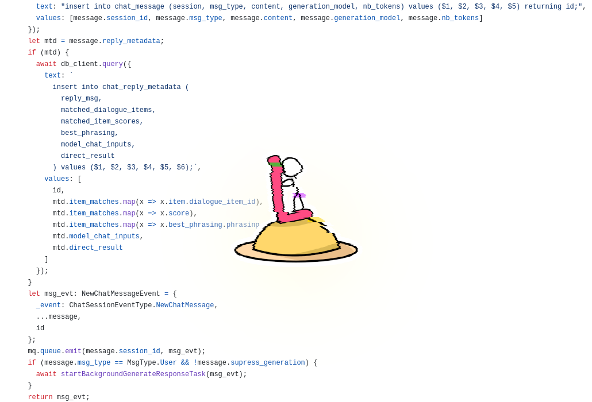

This is a follow-on article from the previous one on Maochat: [I made an AI impression of myself](../maochat-ai/en.html). In this article, I want to go over some of the thinking behind the non-AI bits of the project, including architectural decisions, some implementation details, etc. I encourage you to read [the previous article](../maochat-ai/en.html) first if you're interested in learning about how this project make uses of GPT. If you haven't tried it, I also encourage you to try out <a href="https://chat.maowtm.org/" target="_blank">Maochat</a>.

  <a href="https://chat.maowtm.org" target="_blank" class="trynow">Try it now</a> 
  <a href="https://github.com/micromaomao/chat.maowtm.org" target="_blank" style="vertical-align: 8px;">View source on GitHub</a>
  <a class="github-button" href="https://github.com/micromaomao/chat.maowtm.org" data-size="large" data-show-count="true" aria-label="Star micromaomao/chat.maowtm.org on GitHub">Star</a>

