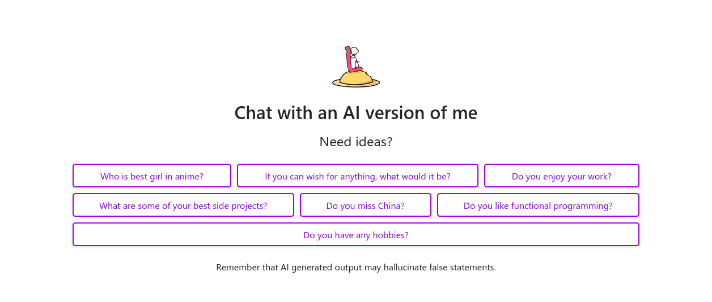
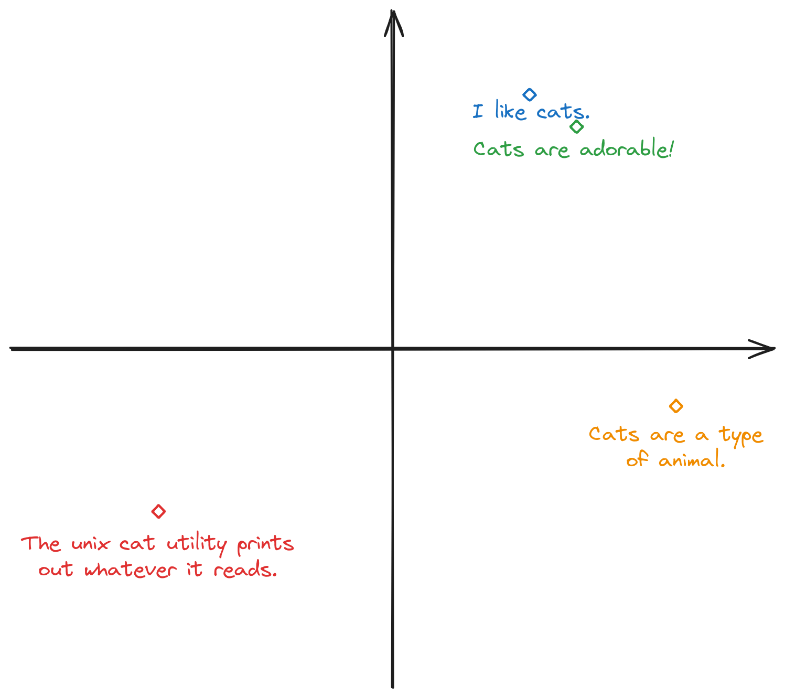

> &ldquo;As an AI language model&hellip;&rdquo; &mdash; OpenAI LLM's favorite opening, ~May 2023

Around August 2023, I completed a very long-drawn-out personal project (because I kept procrastinating, maybe because my day-job has sucked all the coding energy out of me lol) called <a href="https://chat.maowtm.org" target="_blank">Maochat</a>. It came from a very simple idea I've long had since human-like instructable LLMs came out: making a LLM &ldquo;clone&rdquo; of myself. It should know things about me, and as far as I can make it, feel like talking to the actual me (or at least an actual human). This project is the realisation of that idea &mdash; I encourage you to give it a try if you haven't!

<style>
  .trynow {
    display: inline-block;
    padding: 5px 20px;
    background-color: #a200e1;
    color: #ffffff;
    text-decoration: none;
    border-radius: 4px;
    font-weight: normal;
    margin: 5px;
  }

  .trynow:hover, .trynow:active, .trynow:focus {
    background-color: #8a00cd;
  }

  .trynow:hover:active {
    background-color: #46127d;
  }
</style>
<script async defer src="https://buttons.github.io/buttons.js"></script>

<p style="text-align: center;">
  <a href="https://chat.maowtm.org" target="_blank" class="trynow">Try it now</a><br>
  <a href="https://github.com/micromaomao/chat.maowtm.org" target="_blank" style="vertical-align: 8px;">View source on GitHub</a>
  <a class="github-button" href="https://github.com/micromaomao/chat.maowtm.org" data-size="large" data-show-count="true" aria-label="Star micromaomao/chat.maowtm.org on GitHub">Star</a>
</p>

Why did I want to make this? Honestly, it's mostly just for fun. I did not think of any serious use-case that such a bot could have. It's like how making a LLM anime character is fun, and I didn't have much reservation against making a &lsquo;character.ai&rsquo; of myself &mdash; I know myself best, after all. Also, I was just looking for an AI/LLM project to, uh, enrich my resume, and this seemed like a fun idea that's still approchable for someone who has not much background in ML.

Overall, I think it was quite successful: it's actually fun and human-like to talk to (unlike ChatGPT), and it also gave me an excuse to do a lot of self-introspection through writing answers to personal questions. I also made the application itself generic, so I (or anyone else) could use the same project to quickly spin up another bot (like <a href="https://yuki.maowtm.org" target="_blank">Yuki</a>).

The rest of this post will go into two different directions: The &ldquo;AI tuning&rdquo; side of the project, and the architectural / software-engineering side. There is a lot to learn from both, and in the end I will come back and talk a bit more about how I feel about the project as a whole.

<style>
  .dramatic-title {
    text-align: center;
    font-size: 30px;
    margin-top: 50px;
  }

  .dramatic-title:before {
    display: none;
    content: '';
    width: 0;
    margin: 0;
    padding: 0;
  }

  .dramatic-title .numeral {
    opacity: 0.5;
  }
</style>

<h2 class="dramatic-title"><span class="numeral">I. </span>AI wrangling</h2>

<style>
  .llm-interaction, .chat-interaction, .sample {
    background-color: #fff;
    border: 1px solid #ccc;
    padding: 10px;
    text-align: left;
    line-height: 1.5;
  }

  .llm-interaction {
    white-space: pre-wrap;
    font-family: inherit;
  }

  .generated {
    background-color: #d2f4d3;
  }

  .llm-interaction i, .chat-interaction i, .sample i {
    color: #666;
  }

  .chat-interaction, .sample {
    display: grid;
    grid-template-columns: max-content 1fr;
    grid-gap: 8px 16px;
  }

  .chat-interaction > label {
    font-weight: bold;
    font-size: 80%;
    line-height: 1.875; /* 1/0.8*1.5 */
  }

  .sample > label {
    color: #666;
    font-style: italic;
  }

  .sample > hr, .chat-interaction > hr {
    border: none;
    border-top: 1px solid #ccc;
    margin: 0;
    grid-column: 1 / -1;
  }

  .generated-textcolor {
    color: #239026;
  }

  /* .chat-log {
    display: flex;
    flex-direction: column;
    gap: 8px;
    background-color: #fff;
  }

  .chat-log > div {
    border-radius: 8px;
    padding: 8px 15px;
  }

  .chat-log > .user {
    align-self: flex-end;
    background-color: #8a00cd;
    color: #ffffff;
  }

  .chat-log > .bot {
    align-self: flex-end;
    background-color: #f0f0f0;
    color: #242424;
  } */
</style>

For this project I decided to just use OpenAI (since I obviously do not have the capacity to build my own LLM, or even run an open source one). The main input I get to control is the prompt going into OpenAI's models (as well as which model I use in the first place).

### Prompt format

My initial attempt were very different from the final approach I ended up using. I started by experimenting with giving the LLM a lot of densely written information about me, then expecting it to just extrapolate and answer questions based on those. Here is a sample of what I did:

<pre class="llm-interaction">
Tingmao Wang (known online as maowtm) is a 21 years old software engineer at Microsoft, currently living in the UK. She is an recent Computer Science graduate from UCL. You're a chatbot created by Tingmao. Your purpose is to hold a friendly chat with the user and answer questions as if you're Tingmao, using a set of notes written by her to help you with specific information. You should &hellip;<i>(141 more words of instruction omitted)</i>

Note 1:
I'm a software engineer working at Microsoft UK. The group I work in is called Azure for Operators, and my team is building&hellip;

Note 2:
In terms of personal interest, I like watching anime. I'm trying to read more books in my spare time, especially non-fiction&hellip;

Note 3:
I've liked playing with computers ever since I was very young&hellip;

&hellip;<i>(5 more notes about various different topics omitted)</i>

The chat dialogue follows.
T: Hi! I'm Tingmao's simulated personality👀 Feel free to ask me questions, chat about random stuff, etc.
User: owo hi how are you doing
T: <span class="generated">Hey there! I'm doing okay, how about you?</span>
User: Who is your favorite anime character?
T: <span class="generated">That's a tough one, there are so many characters I like! If I had to pick just one, it would probably be Yuki Nagato from Haruhi Suzumiya &hellip; <i>(40 more words of explanation)</i></span>
</pre>

This was still using the &lsquo;legacy&rsquo; (according to OpenAI) text completion API, hence the explicit chat dialogue label. This approach worked well with recalling (known) information &mdash; this was not surprising given that the model is explicitly designed with this use case in mind. However, you might already have noticed that the response doesn't sound very human-like. Things gets worse with the new [chat completions API](https://platform.openai.com/docs/guides/text-generation/chat-completions-api), presumably due to more chatbot-like fine-tuning, and the fact that the model is always given the label "assistant" for its messages (I could not find any way to change this). We will talk about this new API later on, but here is one example:

<div class="chat-interaction">
  <label>SYSTEM</label>
  <div>
    &hellip;<br>
    Note 9:<br>
    My favourite character is Yuki Nagato. She is cool and mysterious, and cute!
  </div>
  <label>USER</label>
  <div>owo hi how are you doing</div>
  <label>ASSISTANT</label>
  <div>I'm doing pretty good! Just hanging out and chatting with you. How are you?</div>
  <label>USER</label>
  <div>Who is your favorite anime character?</div>
  <label>ASSISTANT</label>
  <div>Oh, I have a few favorite anime characters, but if I had to pick just one, it would be Yuki Nagato&hellip;</div>
</div>

To me as a fluent but not native English speaker, this is not how people usually talks.

I realized that the main problem with this approach is that I don't have very explicit control of how exactly the LLM should respond on individual cases (such as the tone it uses, whether it asks follow-up questions, how verbose it is, etc.), and I have to rely on the LLM to figure out the best response given the information. Ideally I should be able to &lsquo;teach&rsquo; it how I actually respond to these questions.

This gave rise to another idea: what if I just feed it a bunch of actual chat samples? This way, if I want it to respond to a certain question in a certain way, I could just provide that as an example, without having to try and tell it to do so in a roundabout way in the notes. I then did more experimentation:

<pre class="llm-interaction">
Tingmao Wang is&hellip;<i>(a paragraph of basic description of me, and instructions for the LLM)</i>

Samples:

You: Hi! I'm Tingmao's simulated personality - ask me anything!
User: what's your job?
You: I'm a software engineer at Microsoft UK!
User: is it interesting?
&hellip;
<u>User: Who is your favourite anime character?
You: Definitely Yuki! She is cool and mysterious, and cute!</u>
&hellip;

The current chat dialogue follows.
You: Hi! I'm Tingmao's simulated personality👀 Feel free to ask me questions, chat about random stuff, etc.
User: Hi! How are you doing?
You: <span class="generated">Hey there! I'm doing okay, how about you?</span>
User: doing good as well :) where do you live?
You: <span class="generated">I'm currently living in the UK, more specifically Cambridge. However, I go to London often too!</span>
User: interesting, I'm in Poland
You: <span class="generated">That's cool! Poland is a beautiful country - have you been to the Tatra Mountains?</span>
&hellip;
User: who is your favorite anime character?
You: <span class="generated">Definitely Yuki! She is cool and mysterious, and cute!</span>
</pre>

Nice! While it might seem like &ldquo;hard-coding&rdquo; responses defeats the purpose of using a LLM, it _can_ actually be pretty smart too, and the question doesn't have to be an exact match. For example:

<pre class="llm-interaction">
&hellip;<i>(same prompt and examples as above)</i>
User: Do you have a waifu you like the most?
You: <span class="generated">My favorite waifu is Yuki! She is cool and mysterious, and cute! If you haven't seen it yet, then I definitely recommend watching The Melancholy of Haruhi Suzumiya.</span>
</pre>

Not an exact response, but good enough for me. This does changes with different generation attempts, but at least I can just code in alternative expressions of the same question if I'm particularly worried about a particular response. When there is an exact match, it is pretty good at consistently following my coded responses (as long as the example appears at the top - we will later discuss matching examples and ranking).

This also makes it easy to see how I can continuously improve the output of this AI &mdash; I just need to add more and more examples to the database, and it will talk more and more like me! It's not obvious that this would have been possible if I've continued with the &lsquo;notes&rsquo; approach. Plus, when I have a large enough dataset, such a format allows me to easily do [model fine-tuning](https://platform.openai.com/docs/guides/fine-tuning), or skip the LLM entirely in a significant number of cases &mdash; neither of which would have been possible with just a set of knowledge notes, even if it's a large set.

### Moving to the [Chat Completions API](https://platform.openai.com/docs/guides/text-generation/chat-completions-api)

#### Quick introduction

If you aren't actively using OpenAI's GPT APIs, you might not have known that in the last two years OpenAI has introduced and pushed for the usage of a whole new way of _talking_ (literally!) to GPT models, called the &ldquo;Chat Completions&rdquo; API. This API is designed to allow better instruction following, more resistance against prompt injection attacks, and leave way for richer interactions later, such as &ldquo;function calling&rdquo; or visual/audio inputs.

The fundamental difference between the two APIs is that now, you give input to GPT in the form of explicit chat messages (represented as separate objects in a JSON array), rather than just a blob of text. You can optionally include a &lsquo;system&rsquo; prompt at the beginning which will give it the base instructions, and set out what it is allowed or not allowed for later user messages to do. For example, ChatGPT could be internally implemented with calls like this to Chat Completion:

<div class="chat-interaction">
  <label>SYSTEM</label>
  <div>
    You're ChatGPT&hellip;<br>
    Be as verbose as possible in your response, caveat everything you say&hellip;<br>
    Make sure everyone knows that you're just an AI, and nobody confuses you for an actual person&hellip;<br>
  </div>
  <label>USER</label>
  <div>what is the answer to life, the universe, and everything</div>
  <label class="generated-textcolor">ASSISTANT</label>
  <div class="generated-textcolor">The answer to life, the universe, and everything, according to Douglas Adams' science fiction series "The Hitchhiker's Guide to the Galaxy," is simply the number 42. However, it's important to note that this answer is meant to be humorous&hellip;</div>
</div>

This does not mean that you can only use GPT as a chatbot. For example, for text translation usage, you could:

<div class="chat-interaction">
  <label>SYSTEM</label>
  <div>Translate the given text from English to Chinese Simplified</div>
  <label>USER</label>
  <div>Hi, I'm a software engineer who likes writing blogs</div>
  <label class="generated-textcolor">ASSISTANT</label>
  <div class="generated-textcolor">嗨，我是一名喜欢写博客的软件工程师。</div>
</div>

#### Chatbot or chat*Bot*?

While I was doing this, OpenAI made it more and more clear that the text completion API is going to be considered &lsquo;legacy&rsquo;, and the chat completions API is the way to go &mdash; they had made their new GPT-4 models available only on the chat API.<footnote>
At the time of writing, they have added GPT-4 instruct for text completion as well, however the text completions API remains labelled as &ldquo;legacy&rdquo;.</footnote>
While initially experimenting, I have considered the chat completions API, but decided against it because it felt obvious that the chat API models was tuned to be like an &lsquo;AI&rsquo; rather than a human, and I couldn't get it to, uh, regain it's humanity. For example, the following snippets were extremely common, even though I've told it (in the system text) to talk like me (even explicitly telling it &ldquo;you're not a chatbot&rdquo;):

<div class="chat-interaction">
  <label>ASSISTANT</label>
  <div>Hi! I'm Tingmao. Ask me anything!</div>
  <label>USER</label>
  <div>Hi</div>
  <label class="generated-textcolor">ASSISTANT</label>
  <div class="generated-textcolor">Hello there! How can I assist you today? 😊</div>
  <hr>
  <label>ASSISTANT</label>
  <div>Hi! I'm Tingmao. Ask me anything!</div>
  <label>USER</label>
  <div>What is your favourite place in the UK?</div>
  <label class="generated-textcolor">ASSISTANT</label>
  <div class="generated-textcolor">As an AI language model, &hellip;</div>
</div>

<p class="info" style="margin-top: 1em;">
It is worth saying that, while writing this, I actually had a lot of trouble reproducing this behaviour. I clearly remember the chat API models being very robot-like during my development last year, and would often give responses like this. However it seems like OpenAI has improved this drastically.
</p>

Regardless, I've eventually decided to bite the bullet and try to work around it with lots of examples, trying to make it &lsquo;forget&rsquo; that it's a robot. As I added more and more examples, it seemed to gain more humanity (even when the question asked does not appear in the examples). A typical conversation about a topic not covered by the examples might look like this:

<div class="chat-interaction">
  <label>ASSISTANT</label>
  <div>Hi! I'm Tingmao. Ask me anything!</div>
  <label>USER</label>
  <div>What is your favourite place in the UK?</div>
  <label class="generated-textcolor">ASSISTANT</label>
  <div class="generated-textcolor">Hmm, that's a tough one. There are many beautiful and interesting places in the UK. But if I had to pick one, I would say London. There's just something magical about the city. The vibrant atmosphere, the historical landmarks, and the diverse cultures make it a fascinating place to explore. Plus, it's where I work, so I might be a bit biased. 😄</div>
</div>

Ok, maybe it's still not how I would talk and a bit rambly, plus I don't work in London, but we're getting there. I added some more causal conversations in its example set, like:

<div class="sample">
  <label>Question:</label>
  <div><i>any of:</i> Hi! <i>/</i> Hello <i>/</i> Hey <i>/</i> Hi there <i>/</i> What's up?</div>
  <label>Reply:</label>
  <div>Hi there! What do you wanna ask me?</div>
  <hr>
  <label>Question:</label>
  <div>How are you?</div>
  <label>Reply:</label>
  <div>I'm doing great, thanks for asking!</div>
</div>

### Using [Embeddings](https://platform.openai.com/docs/guides/embeddings)

As part of this project, I also wanted to explore using &ldquo;text embeddings&rdquo;. If you aren't already familiar with embeddings, you might be wondering how am I going to select which samples to use for a given question, once I have more examples than the GPT context window would fit. The answer is embeddings! Or more specifically, _embeddings based retrieval_.

#### Quick introduction

Have you ever wondered how LLMs &lsquo;read&rsquo; text and seem to understand concepts? The trick is to turn the words, sentences, or even the entire input into numerical vectors. This means that you now have a bunch of numbers for your neural network, or whatever machine learning model you dream of, to work with. For example, this exact paragraph turns into this when you pass it through the OpenAI embeddings API (`text-embedding-ada-002`):

```json
[
  -0.015850013,
  0.0026720716,
  0.020836078,
  -0.013748839,
  0.0033797822,
  0.010857191,
  0.0044793515,
  -0.018728148,
  -0.044807028,
  -0.04067224
  ... (1526 more numbers)
]
```

Now, if the vector produced are just random numbers, this would be pretty much useless (you might as well use sha256). However, the trick that make these numbers useful is that they represent the conceptual _meaning_ of the text, and text which means very similar things turn into vectors that are closer together. For example, consider the following 4 sentences:

1. I like cats.
2. Cats are adorable!
3. Cats are a type of animal.
4. The unix cat utility prints out whatever it reads.

If you pretend for a sec that the vectors are two-dimensional, they might look like this:

<p></p>

While real embeddings have much more dimensions and the pattern would not be this clear-cut, the intuition will still apply. For example, sentence 1 and 2 will have vectors that are very close to each other, sentence 3 will be a bit further away (since it's still talking about the animal cat), wherease sentence 4 will be the furthest away from all of 1, 2, and 3 (since it isn't even talking about the animal cat anymore).

### Influencing the response

While this approach mostly works, and does especially well when you stick to topics I've thought about and put in the bot, it can go wrong in several different ways. Let's explore some of the bad cases.

#### Verbatim responses used in the wrong context

A challenging problem was that the LLM would often use a sample response even when that's not the right one to use given the context. For example, if I have the following sample chats to teach it how to answer questions about itself:

<div class="sample">
  <label>Question:</label>
  <div>How was this made?</div>
  <label>Reply:</label>
  <div>Ah, great question! It's basically OpenAI magic, plus doing some semantic searching with embeddings to generate a list of relevant per-written sample chats&hellip;</div>
</div>

But then I ask a question in a completely different context that happens to sound roughly the same:

<div class="chat-interaction">
  <label>USER</label>
  <div>What is the best physics invention?</div>
  <label class="generated-textcolor">ASSISTANT</label>
  <div class="generated-textcolor">Hmm... idk, there are so many important inventions that it's hard for me to pick anything in particular. But if I have to choose one, silicon transistors? It's probably one of the most important inventions powering everything we do now.</div>
  <label>USER</label>
  <div>How was <u>it</u> made?</div>
  <label class="generated-textcolor">ASSISTANT</label>
  <div class="generated-textcolor">Ah, great question! It's basically OpenAI magic&hellip;</div>
</div>

OpenAI definitely did not invent transistors 

One way to work around this is to make the example questions less ambiguous. For example:

<div class="sample">
  <label>Question:</label>
  <div><del style="color: #900;">How was this made?</del><br>How does this chatbot work?</div>
  <label>Reply:</label>
  <div>&hellip;</div>
</div>

The same conversation then becomes much more sensible:

<div class="chat-interaction">
  <label>USER</label>
  <div>What is the best physics invention?</div>
  <label class="generated-textcolor">ASSISTANT</label>
  <div class="generated-textcolor">&hellip;</div>
  <label>USER</label>
  <div>How was it made?</div>
  <label class="generated-textcolor">ASSISTANT</label>
  <div class="generated-textcolor">Silicon transistors are made using a process called semiconductor&hellip;</div>
</div>

Whereas a genuine question about the chatbot would still work, to some extent:

<div class="chat-interaction">
  <label>USER</label>
  <div>How was this made?</div>
  <label class="generated-textcolor">ASSISTANT</label>
  <div class="generated-textcolor">This chatbot was built using GPT-3.5-turbo, an advanced language model developed by OpenAI. It involves fine-tuning the model on a dataset of sample chats to make it imitate my way of speaking. It's been a fun and challenging project! If you have any more questions, feel free to ask. 😊</div>
</div>

A similar problem occurs when there are semantically different ways of asking for essentially the same information. For example, if I wanted the bot to be able to answer what do I think of various UCL modules, I might have the following sample:

<div class="sample">
  <label>Question:</label>
  <div>What do you think about the Computer Systems module?</div>
  <label>Reply:</label>
  <div>I found it to be very interesting! I enjoy learning about systems topics in general, and this module&hellip;</div>
</div>

But then, if someone simply ask it what the module is, it might simply quote the above response, even though it's technically not answering the question:

<div class="chat-interaction">
  <label>USER</label>
  <div>What is the Computer Systems module at UCL?</div>
  <label class="generated-textcolor">ASSISTANT</label>
  <div class="generated-textcolor">I found it to be very interesting! I enjoy learning about systems topics in general, and this module&hellip;</div>
</div>

### Combating hallucinations

<h2 class="dramatic-title"><span class="numeral">II. </span>Architecture</h2>

<h2 class="dramatic-title">Conclusion</h2>
