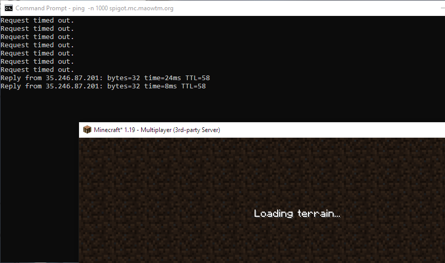
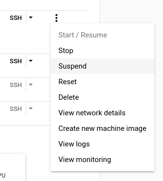

Cloud platforms hate this! You won't believe how much money you can save via this one weird trick &mdash; turning things off when you don't use them!

----

Recently I have been running a Minecraft server to play with a few of my friends. While everything else about the server is fine, getting a £40 cloud bill at the end of the month for a server that barely hosts 5 players is not ideal. I could make it cheaper by using a shared-core VM with a smaller configuration, but the CPU usage when we are playing is already 100% 100% of the time. I can't have it cost me this much money though, so like any normal person, I went ahead and bought a Realms subscription for $8 per month and played on Microsoft's server instead. The end&hellip;

Except of course that's not what happened. That would be no fun, plus I still want the ability to install my own plugins and stuff. The idea for this project came when I realized that most of the time, nobody is in the server, which means that keeping it running 24/7 is a huge waste of resources.

A very easy solution to this problem is just to shut the server down and only boot it up when we want to play. While this means that we will have to wait for it to start up (which typically takes around a minute), this can be made quite effortless by making some sort of web page or Discord bot that powers on the server using the Google Cloud API, and shuts it down automatically when nobody is in the server, which can be detected with a special server plugin.

While planning to implement this, I noticed one little interesting feature in Compute Engine:



Suspend&hellip; Sounds like a perfect feature for this project! According to Google, when a VM is suspended, its memory is moved to persistent storage and the compute resource is released. Such a machine is like a powered-off machine and only incurs storage costs.

After some testing, I discovered that suspending and resuming a VM is actually quite fast&mdash;it usually takes 10 seconds to suspend or resume my Minecraft VM, and the VM is ready to be connected to afterward. This is very exciting, as it means basically no wait time for the server to start back up at all. In fact&mdash;it's fast enough that, in theory, we don't even need an external interface. If we can make it so that as soon as someone tries to connect to the server within Minecraft, an API call is sent to Google Cloud to resume the VM, this could make the server look like it's always running!

You might be wondering&mdash;this sounds impossible! If the server is sleeping, how could it listen to and accept new connections? And you would be right. We will need something external that will handle the connection for us and make the Google Cloud API calls. Luckily, I happen to know another interesting piece of Minecraft software &mdash; [BungeeCord](https://www.spigotmc.org/wiki/about-bungeecord/).

BungeeCord is a lightweight Minecraft server proxy with plugin support that is commonly used by multi-server networks to enable seamless switching. While this is not exactly what I'm trying to do here, the fact that it is an extendable Minecraft proxy makes it very useful for this project. We can simply use it as a (very lightweight) frontend to our server that detects connection attempts and resumes/suspends our backing server automatically.

While this does introduce the need for another server, BungeeCord actually does not have much resource footprint, so the smallest VM that Google provides is enough (which costs a bit over $10/mo). In my case, I'm also able to use this VM to run a couple of my other projects, further reducing the effective cost of this setup. Alternative cloud platforms may support autoscaled TCP services, which would make this even cheaper, but for this project, unfortunately, we do need something running 24/7.<footnote>
If you are wondering why not just run the main Minecraft service on some sort of TCP serverless functions if that is available&hellip; The long startup time makes the experience not great, and the long shutdown time usually does not go well with such platforms, potentially resulting in losing world data. BungeeCord is basically stateless so does not have this problem.</footnote>

The following image summarizes this architecture:


Note that there are a couple of intricacies regarding running BungeeCord, such as the need to run the backend server in offline mode and open to trusted connections only.

<p class="warn">
In this setup, authentication is handled by BungeeCord instead of the backend server, and the backend server runs in offline mode. Therefore, you <b>must</b> ensure that the backend server is not inadvertently exposed to the internet (such as by listening on your private vnet only).
</p>

Before we continue, I would also like to point out that suspend is not available for E2 VMs. This means that you will not be able to use the shared-core instances, which are significantly cheaper than standard instances (although with limited performance).

---

With the architecture decided, the main thing left to implement is the actual BungeeCord plugin. The resulting code is available [on GitHub](https://github.com/micromaomao/minecraft-autosuspend/tree/main/autosuspend-plugin). The main idea is that players trying to join are pushed into a queue, then a long-running thread is notified, which will resume the server if necessary, and connect the player to the actual server. It also periodically checks if it has been a while since the last player left, and if that's the case, suspends the server if it is running.

The two main problems I came across while implementing this are:

1. BungeeCord's documentation on thread-related matters is lacking. [Its doc](https://www.spigotmc.org/wiki/common-development-pitfalls-bungeecord/#creating-new-threads) says that "creating new threads" will be "disabled" in the future and should not be done, and suggests using its async scheduler instead. Yet it does not explain what the difference is between using `runAsync` and creating a thread, or whether my async task is allowed to not return indefinitely. I also relied on a [forum post](https://www.spigotmc.org/threads/scheduling-runnable-in-main-thread.254168/#post-2527499) to tell me that BungeeCord is thread-safe. I could not find any mention of this in its official documentation.

2. There is no _supported_ way to make a joining player wait before they are connected. When a player joins, BungeeCord automatically connects them to a backend server, and canceling this `ServerConnectEvent` results in the following being printed to the console after the event finishes:

    ```
    java.lang.IllegalStateException: Cancelled ServerConnectEvent with no server or disconnect.
    ```

    Parts of the documentation mention some sort of "embedded" server, which sounds exactly like what we need here&mdash;ideally, we can make the player simply wait in some sort of dummy void world. However, I can't find any more info about this, nor any API which allows me to make such a connection.

    As it turns out, if we just ignore the printed error message, canceling the `ServerConnectEvent` does work. The player will keep seeing the "Joining world" message until we perform further action (such as a connect or kick).

There is also the slight issue that a plugin-initiated `connect` still fires a `ServerConnectEvent` (which is quite reasonable), causing our event handling code to be executed again and thus canceling the event again or causing other bugs if we aren't careful. Fortunately there is a `getReason` method on the event which allows us to tell if the event is caused by a plugin or by BungeeCord. We can ignore the event if it is caused by a plugin.

---

So, after all of this, how much money does it save? Honestly, not much, especially if you play Minecraft pretty much every day. This is also partly because of the need for an extra small VM which costs $12 per month. However, I do not consider this project a waste for the following reasons:

1. I can move some other services I'm running in small VMs (code sandboxes, Discord bots, etc.) over to this server to better utilize it, saving me money elsewhere.
2. This allows me to effortlessly keep the server running on a long-term basis, even if I take a break from Minecraft for a while, without too much cost. This means that my friends can always pop in randomly from time to time.
3. While my cloud bill has not been reduced by much, previously I was using a shared-core E2 instance which sometimes produces significant lags. For this project (as explained earlier), I had to upgrade to an N2 instance with dedicated CPU cores. This means that, if nothing else, I get to enjoy smoother gameplay without spending more.
