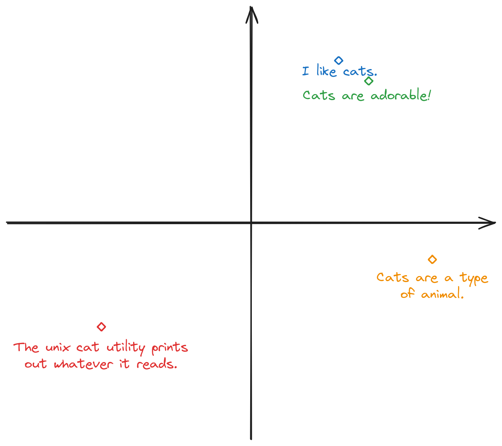

Have you ever wondered how LLMs &lsquo;read&rsquo; text and seem to understand concepts? Internally these models turn their input into numerical vectors. This means that with a LLM and some text input, you can get bunch of numbers for your neural network, or whatever machine learning model you dream of, to work with. For example, this exact paragraph turns into this when you pass it through the OpenAI embeddings API (`text-embedding-ada-002`):

```json
[
  -0.015850013,
  0.0026720716,
  0.020836078,
  -0.013748839,
  0.0033797822,
  0.010857191,
  0.0044793515,
  -0.018728148,
  -0.044807028,
  -0.04067224
  ... (1526 more numbers)
]
```

Now, if the vector produced are just random numbers, this would be pretty much useless (you might as well use sha256). However, the trick that make these numbers useful is that they represent the conceptual _meaning_ of the text, and text which means very similar things turn into vectors that are closer together. For example, consider the following 4 sentences:

1. I like cats.
2. Cats are adorable!
3. Cats are a type of animal.
4. The unix cat utility prints out whatever it reads.

If you pretend for a sec that the vectors are two-dimensional, they might look like this:

<p></p>

While real embeddings have much more dimensions and the pattern would not be this clear-cut, the intuition will still apply. For example, sentence 1 and 2 will have vectors that are very close to each other, sentence 3 will be a bit further away (but will still be pretty close since it's still talking about cats), wherease sentence 4 will be the furthest away from all of 1, 2, and 3 (since it isn't even talking about the animal cat anymore).

You can play around with embeddings a bit more in the below interactive tool. Try putting in several similar or dissimilar sentences and see how the similarity score changes. The tool will highlight the input that's most similar with the first input. In practice, abstract concepts like &lsquo;happy&rsquo; or &lsquo;sad&rsquo; also meaningfully correlates with sentences that have those properties, so you can also try putting in a generic sentence, then the words &lsquo;happy&rsquo; and &lsquo;sad&rsquo; and see which word is most &ldquo;similar&rdquo; to your first input.<footnote>
It's worth saying that while useful as a demo, comparing the similarity of sentences with abstract concepts like this is probably not the best way to do classification. If you have a reasonably-sized dataset, you can probably train a regression or neural network to do the classification based on the embeddings.
</footnote>

<style>
  .tool-block {
    background-color: white;
    border: 1px solid #999;
    padding: 10px;
    min-height: 700px;
  }

  @media (max-width: 600px) {
    .tool-block {
      margin-left: -20px;
      margin-right: -20px;
    }
  }
</style>

<div class="tool-block">
  <noscript id="embedding_tool">
    Javascript is required to use this tool.
  </noscript>

  <div style="color: #777; font-size: 14px;">Requests are logged to prevent abuse.</div>
</div>
